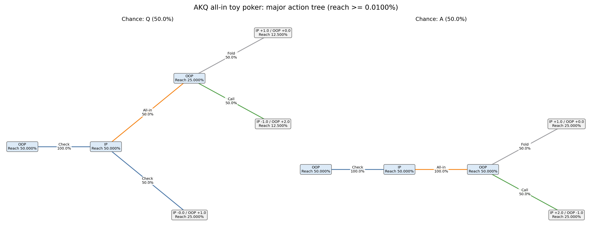
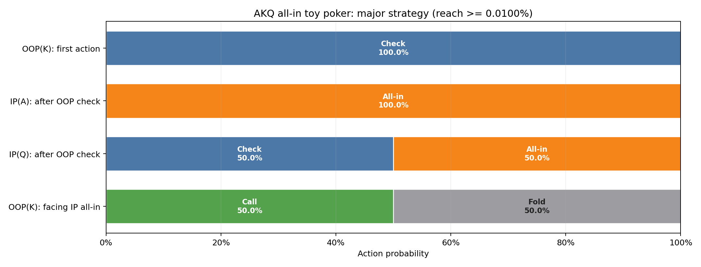
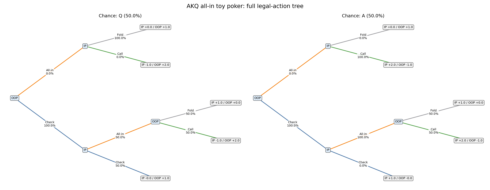
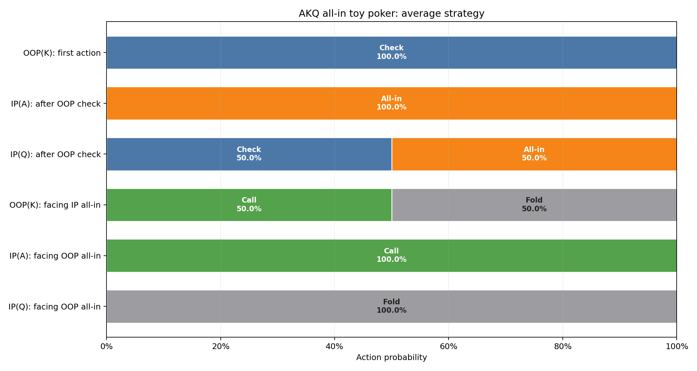
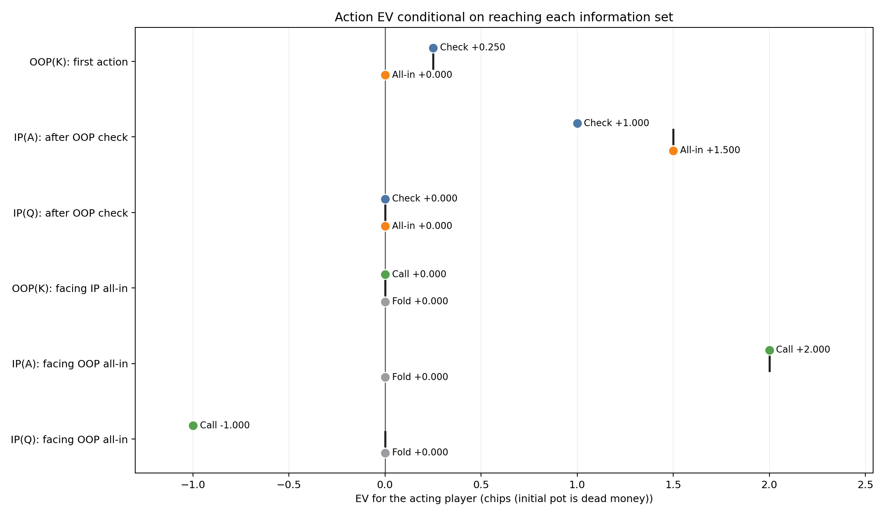
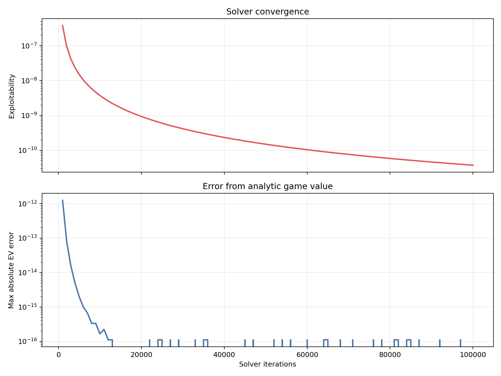

# AKQ all-in toy poker

EV is chips (initial pot is dead money) for the acting player, conditional on reaching the information set. Initial pot is dead money; terminal utilities sum to it. This game has terminal utility sum 1.

## Solver summary

| Metric | Value |
|---|---:|
| Iterations | 100,000 / 100,000 |
| Exploitability | 3.749967e-11 |
| IP EV | +0.750000 |
| OOP EV | +0.250000 |

- Backend: `native_efg`
- Algorithm: `cfr_plus`
- Checkpoint evaluation: `native_efg`
- Stop reason: `max_iterations`
- Target exploitability: —
- Best checkpoint: `3.749967e-11` at iteration 100,000

## Major strategy

Information sets and tree nodes with reach probability below 0.0100% are omitted here. Showing 4 of 6 information sets. All actions at a retained information set remain visible.

### Major action tree

### Major action probabilities

### Major information sets

| Decision | Reach | Strategy | Policy EV | Action EV |
|---|---:|---|---:|---|
| OOP(K): first action | 100.000000% | Check: **100.00%** All-in: **0.00%** | +0.250000 | Check: +0.250000 All-in: +0.000000 |
| IP(A): after OOP check | 50.000000% | Check: **0.00%** All-in: **100.00%** | +1.500000 | Check: +1.000000 All-in: +1.500000 |
| IP(Q): after OOP check | 50.000000% | Check: **50.00%** All-in: **50.00%** | +0.000000 | Check: +0.000000 All-in: +0.000000 |
| OOP(K): facing IP all-in | 75.000000% | Call: **50.00%** Fold: **50.00%** | +0.000000 | Call: +0.000000 Fold: +0.000000 |

## Full analysis

### Full legal-action tree

### Full action probabilities

### Full information sets

| Decision | Reach | Strategy | Policy EV | Action EV |
|---|---:|---|---:|---|
| OOP(K): first action | 100.000000% | Check: **100.00%** All-in: **0.00%** | +0.250000 | Check: +0.250000 All-in: +0.000000 |
| IP(A): after OOP check | 50.000000% | Check: **0.00%** All-in: **100.00%** | +1.500000 | Check: +1.000000 All-in: +1.500000 |
| IP(Q): after OOP check | 50.000000% | Check: **50.00%** All-in: **50.00%** | +0.000000 | Check: +0.000000 All-in: +0.000000 |
| OOP(K): facing IP all-in | 75.000000% | Call: **50.00%** Fold: **50.00%** | +0.000000 | Call: +0.000000 Fold: +0.000000 |
| IP(A): facing OOP all-in · `off path` | 0.000000% | Call: **100.00%** Fold: **0.00%** | +2.000000 | Call: +2.000000 Fold: +0.000000 |
| IP(Q): facing OOP all-in · `off path` | 0.000000% | Call: **0.00%** Fold: **100.00%** | -0.000000 | Call: -1.000000 Fold: +0.000000 |

### Full action EV

## Convergence

## Reproducibility

- [Summary](summary.json)
- [Resolved configuration](resolved_config.json)
- [Source manifest](manifest.json)
- [Standalone HTML report](report.html)
