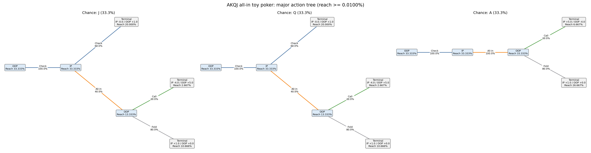
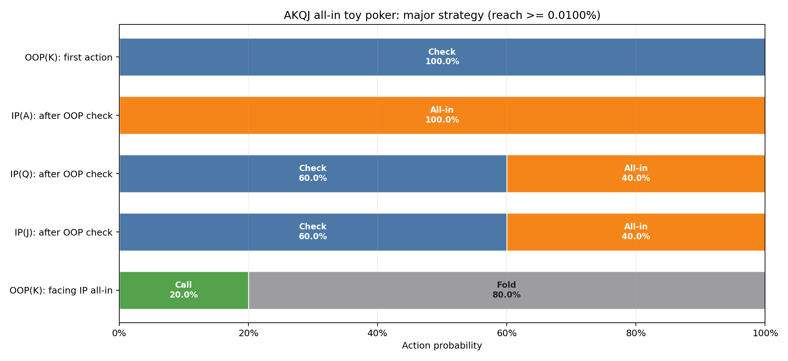
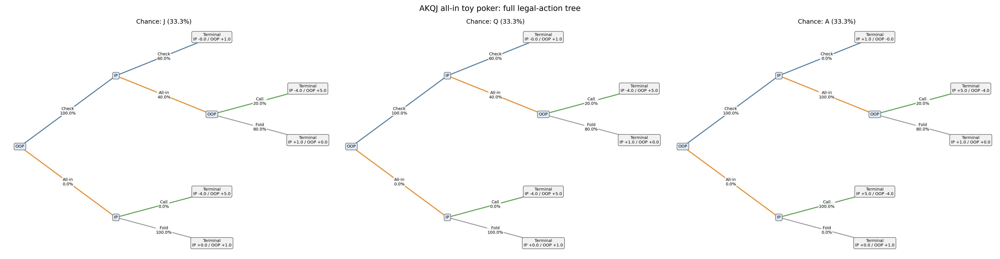
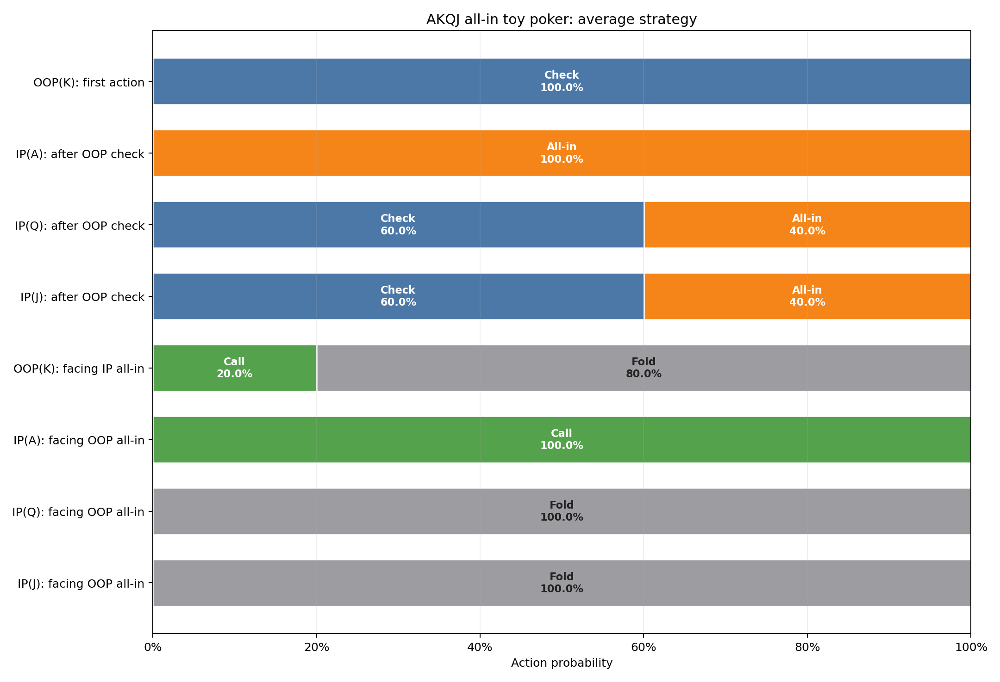
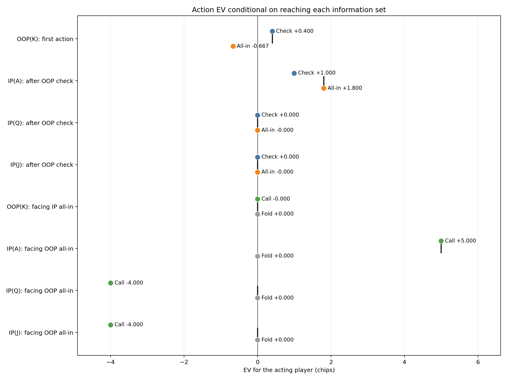
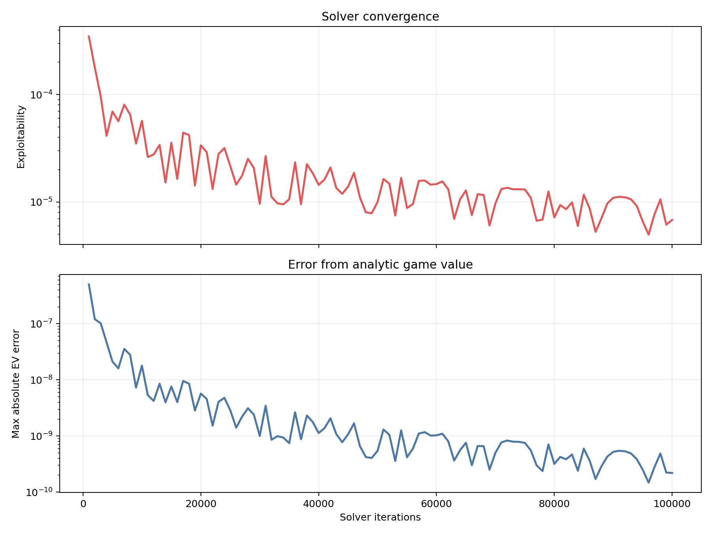

# AKQJ all-in toy poker

EV is chips (initial pot is dead money) for the acting player, conditional on reaching the information set. Initial pot is dead money; terminal utilities sum to it. This game has terminal utility sum 1.

## Solver summary

| Metric | Value |
|---|---:|
| Iterations | 100,000 / 100,000 |
| Exploitability | 6.8038675e-06 |
| IP EV | +0.600000 |
| OOP EV | +0.400000 |

- Backend: `native_efg`
- Algorithm: `cfr_plus`
- Checkpoint evaluation: `native_efg`
- Stop reason: `max_iterations`
- Target exploitability: —
- Best checkpoint: `6.8038675e-06` at iteration 100,000

## Major strategy

Information sets and tree nodes with reach probability below 0.0100% are omitted here. Showing 5 of 8 information sets. All actions at a retained information set remain visible.

### Major action tree

### Major action probabilities

### Major information sets

| Decision | Reach | Strategy | Policy EV | Action EV |
|---|---:|---|---:|---|
| OOP(K): first action | 100.000000% | Check: **100.00%** All-in: **0.00%** | +0.400000 | Check: +0.400000 All-in: -0.666667 |
| IP(A): after OOP check | 33.333333% | Check: **0.00%** All-in: **100.00%** | +1.800011 | Check: +1.000000 All-in: +1.800011 |
| IP(Q): after OOP check | 33.333333% | Check: **60.00%** All-in: **40.00%** | -0.000006 | Check: +0.000000 All-in: -0.000014 |
| IP(J): after OOP check | 33.333333% | Check: **60.00%** All-in: **40.00%** | -0.000006 | Check: +0.000000 All-in: -0.000014 |
| OOP(K): facing IP all-in | 59.999019% | Call: **20.00%** Fold: **80.00%** | -0.000016 | Call: -0.000082 Fold: +0.000000 |

## Full analysis

### Full legal-action tree

### Full action probabilities

### Full information sets

| Decision | Reach | Strategy | Policy EV | Action EV |
|---|---:|---|---:|---|
| OOP(K): first action | 100.000000% | Check: **100.00%** All-in: **0.00%** | +0.400000 | Check: +0.400000 All-in: -0.666667 |
| IP(A): after OOP check | 33.333333% | Check: **0.00%** All-in: **100.00%** | +1.800011 | Check: +1.000000 All-in: +1.800011 |
| IP(Q): after OOP check | 33.333333% | Check: **60.00%** All-in: **40.00%** | -0.000006 | Check: +0.000000 All-in: -0.000014 |
| IP(J): after OOP check | 33.333333% | Check: **60.00%** All-in: **40.00%** | -0.000006 | Check: +0.000000 All-in: -0.000014 |
| OOP(K): facing IP all-in | 59.999019% | Call: **20.00%** Fold: **80.00%** | -0.000016 | Call: -0.000082 Fold: +0.000000 |
| IP(A): facing OOP all-in · `off path` | 0.000000% | Call: **100.00%** Fold: **0.00%** | +5.000000 | Call: +5.000000 Fold: +0.000000 |
| IP(Q): facing OOP all-in · `off path` | 0.000000% | Call: **0.00%** Fold: **100.00%** | -0.000000 | Call: -4.000000 Fold: +0.000000 |
| IP(J): facing OOP all-in · `off path` | 0.000000% | Call: **0.00%** Fold: **100.00%** | -0.000000 | Call: -4.000000 Fold: +0.000000 |

### Full action EV

## Convergence

## Reproducibility

- [Summary](summary.json)
- [Resolved configuration](resolved_config.json)
- [Source manifest](manifest.json)
- [Standalone HTML report](report.html)
