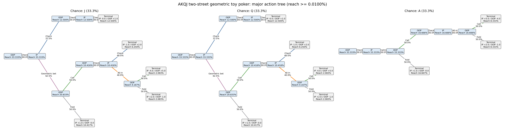
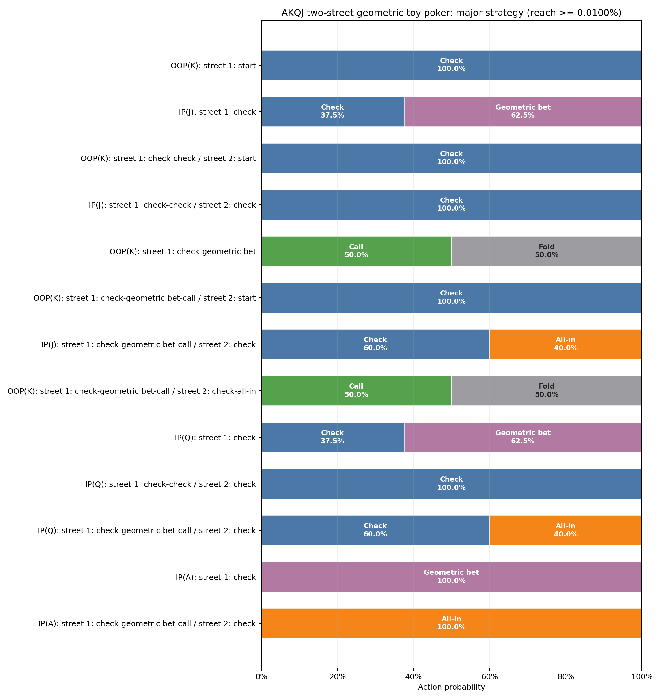
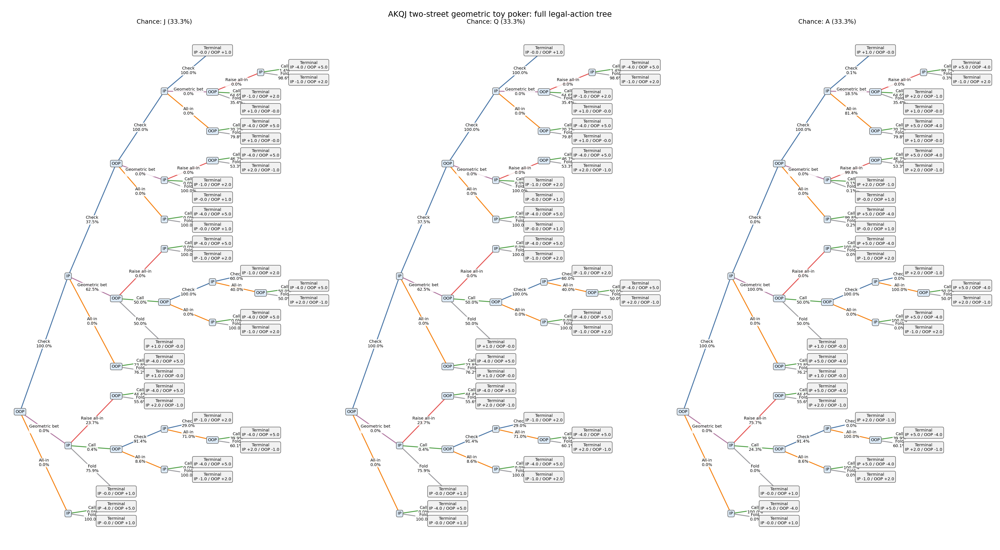
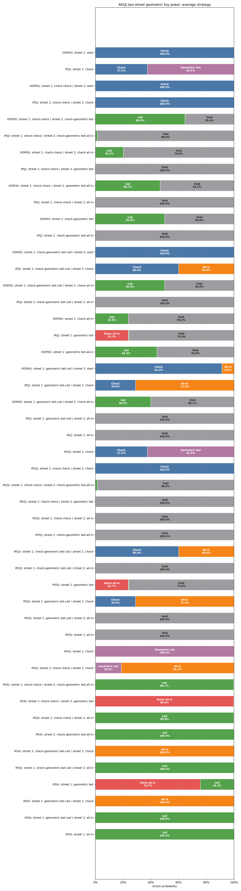
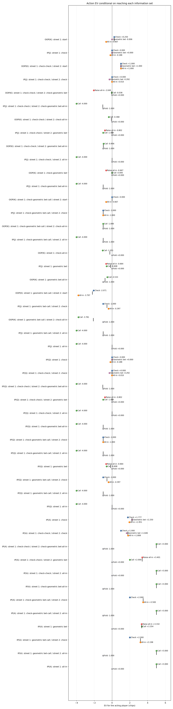
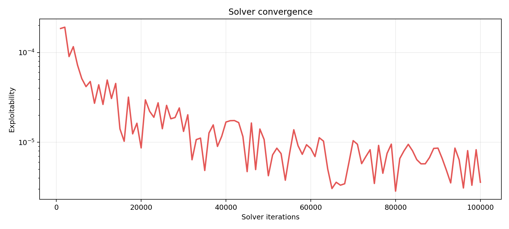

# AKQJ two-street geometric toy poker

EV is chips (initial pot is dead money) for the acting player, conditional on reaching the information set. Initial pot is dead money; terminal utilities sum to it. This game has terminal utility sum 1.

## Solver summary

| Metric | Value |
|---|---:|
| Iterations | 100,000 / 100,000 |
| Exploitability | 3.5914e-06 |
| IP EV | +0.750000 |
| OOP EV | +0.250000 |

- Backend: `native_efg`
- Algorithm: `cfr_plus`
- Checkpoint evaluation: `native_efg`
- Stop reason: `max_iterations`
- Target exploitability: —
- Best checkpoint: `3.5914e-06` at iteration 100,000

## Major strategy

Information sets and tree nodes with reach probability below 0.0100% are omitted here. Showing 13 of 48 information sets. All actions at a retained information set remain visible.

### Major action tree

### Major action probabilities

### Major information sets

| Decision | Reach | Strategy | Policy EV | Action EV |
|---|---:|---|---:|---|
| OOP(K): street 1: start street=1, pot=1, ip_committed=0, oop_committed=0 | 100.000000% | Check: **100.00%** Geometric bet: **0.00%** All-in: **0.00%** | +0.250000 | Check: +0.250000 Geometric bet: -0.005780 All-in: -0.666667 |
| IP(J): street 1: check street=1, pot=1, ip_committed=0, oop_committed=0 | 33.333333% | Check: **37.50%** Geometric bet: **62.50%** All-in: **0.00%** | +0.000012 | Check: -0.000000 Geometric bet: +0.000019 All-in: -0.188330 |
| OOP(K): street 1: check-check / street 2: start street=2, pot=1, ip_committed=0, oop_committed=0 | 25.000199% | Check: **100.00%** Geometric bet: **0.00%** All-in: **0.00%** | +1.000000 | Check: +1.000000 Geometric bet: +1.000000 All-in: +1.000000 |
| IP(J): street 1: check-check / street 2: check street=2, pot=1, ip_committed=0, oop_committed=0 | 12.500099% | Check: **100.00%** Geometric bet: **0.00%** All-in: **0.00%** | -0.000000 | Check: +0.000000 Geometric bet: -0.292479 All-in: -0.009904 |
| OOP(K): street 1: check-geometric bet street=1, pot=2, ip_committed=1, oop_committed=0 | 74.999800% | Raise all-in: **0.00%** Call: **50.00%** Fold: **50.00%** | -0.000003 | Raise all-in: -0.666674 Call: -0.000005 Fold: +0.000000 |
| OOP(K): street 1: check-geometric bet-call / street 2: start street=2, pot=3, ip_committed=1, oop_committed=1 | 37.499162% | Check: **100.00%** All-in: **0.00%** | -0.000005 | Check: -0.000005 All-in: -0.666674 |
| IP(J): street 1: check-geometric bet-call / street 2: check street=2, pot=3, ip_committed=1, oop_committed=1 | 10.416412% | Check: **60.00%** All-in: **40.00%** | -1.000001 | Check: -1.000000 All-in: -1.000003 |
| OOP(K): street 1: check-geometric bet-call / street 2: check-all-in street=2, pot=6, ip_committed=4, oop_committed=1 | 24.999513% | Call: **50.00%** Fold: **50.00%** | -0.999999 | Call: -0.999999 Fold: -1.000000 |
| IP(Q): street 1: check street=1, pot=1, ip_committed=0, oop_committed=0 | 33.333333% | Check: **37.50%** Geometric bet: **62.50%** All-in: **0.00%** | +0.000012 | Check: -0.000000 Geometric bet: +0.000019 All-in: -0.188330 |
| IP(Q): street 1: check-check / street 2: check street=2, pot=1, ip_committed=0, oop_committed=0 | 12.500099% | Check: **100.00%** Geometric bet: **0.00%** All-in: **0.00%** | -0.000000 | Check: +0.000000 Geometric bet: -0.292479 All-in: -0.009904 |
| IP(Q): street 1: check-geometric bet-call / street 2: check street=2, pot=3, ip_committed=1, oop_committed=1 | 10.416412% | Check: **60.00%** All-in: **40.00%** | -1.000001 | Check: -1.000000 All-in: -1.000003 |
| IP(A): street 1: check street=1, pot=1, ip_committed=0, oop_committed=0 | 33.333333% | Check: **0.00%** Geometric bet: **100.00%** All-in: **0.00%** | +2.249976 | Check: +1.776998 Geometric bet: +2.249976 All-in: +1.950664 |
| IP(A): street 1: check-geometric bet-call / street 2: check street=2, pot=3, ip_committed=1, oop_committed=1 | 16.666338% | Check: **0.00%** All-in: **100.00%** | +3.500002 | Check: +2.000000 All-in: +3.500002 |

## Full analysis

### Full legal-action tree

### Full action probabilities

### Full information sets

| Decision | Reach | Strategy | Policy EV | Action EV |
|---|---:|---|---:|---|
| OOP(K): street 1: start street=1, pot=1, ip_committed=0, oop_committed=0 | 100.000000% | Check: **100.00%** Geometric bet: **0.00%** All-in: **0.00%** | +0.250000 | Check: +0.250000 Geometric bet: -0.005780 All-in: -0.666667 |
| IP(J): street 1: check street=1, pot=1, ip_committed=0, oop_committed=0 | 33.333333% | Check: **37.50%** Geometric bet: **62.50%** All-in: **0.00%** | +0.000012 | Check: -0.000000 Geometric bet: +0.000019 All-in: -0.188330 |
| OOP(K): street 1: check-check / street 2: start street=2, pot=1, ip_committed=0, oop_committed=0 | 25.000199% | Check: **100.00%** Geometric bet: **0.00%** All-in: **0.00%** | +1.000000 | Check: +1.000000 Geometric bet: +1.000000 All-in: +1.000000 |
| IP(J): street 1: check-check / street 2: check street=2, pot=1, ip_committed=0, oop_committed=0 | 12.500099% | Check: **100.00%** Geometric bet: **0.00%** All-in: **0.00%** | -0.000000 | Check: +0.000000 Geometric bet: -0.292479 All-in: -0.009904 |
| OOP(K): street 1: check-check / street 2: check-geometric bet · `off path` street=2, pot=2, ip_committed=1, oop_committed=0 | 0.000000% | Raise all-in: **0.00%** Call: **64.62%** Fold: **35.38%** | -0.024408 | Raise all-in: -2.049245 Call: -0.037769 Fold: +0.000000 |
| IP(J): street 1: check-check / street 2: check-geometric bet-all-in · `off path` street=2, pot=6, ip_committed=1, oop_committed=4 | 0.000000% | Call: **1.37%** Fold: **98.63%** | -1.040986 | Call: -4.000000 Fold: -1.000000 |
| OOP(K): street 1: check-check / street 2: check-all-in · `off path` street=2, pot=5, ip_committed=4, oop_committed=0 | 0.000001% | Call: **20.20%** Fold: **79.80%** | -0.074313 | Call: -0.367920 Fold: +0.000000 |
| IP(J): street 1: check-check / street 2: geometric bet · `off path` street=2, pot=2, ip_committed=0, oop_committed=1 | 0.000000% | Raise all-in: **0.00%** Call: **0.00%** Fold: **100.00%** | -0.000000 | Raise all-in: -0.802124 Call: -1.000000 Fold: +0.000000 |
| OOP(K): street 1: check-check / street 2: geometric bet-all-in · `off path` street=2, pot=6, ip_committed=4, oop_committed=1 | 0.000000% | Call: **46.70%** Fold: **53.30%** | -0.979500 | Call: -0.956105 Fold: -1.000000 |
| IP(J): street 1: check-check / street 2: all-in · `off path` street=2, pot=5, ip_committed=0, oop_committed=4 | 0.000000% | Call: **0.00%** Fold: **100.00%** | -0.000000 | Call: -4.000000 Fold: +0.000000 |
| OOP(K): street 1: check-geometric bet street=1, pot=2, ip_committed=1, oop_committed=0 | 74.999800% | Raise all-in: **0.00%** Call: **50.00%** Fold: **50.00%** | -0.000003 | Raise all-in: -0.666674 Call: -0.000005 Fold: +0.000000 |
| IP(J): street 1: check-geometric bet-all-in · `off path` street=1, pot=6, ip_committed=1, oop_committed=4 | 0.000000% | Call: **0.00%** Fold: **100.00%** | -1.000000 | Call: -4.000000 Fold: -1.000000 |
| OOP(K): street 1: check-geometric bet-call / street 2: start street=2, pot=3, ip_committed=1, oop_committed=1 | 37.499162% | Check: **100.00%** All-in: **0.00%** | -0.000005 | Check: -0.000005 All-in: -0.666674 |
| IP(J): street 1: check-geometric bet-call / street 2: check street=2, pot=3, ip_committed=1, oop_committed=1 | 10.416412% | Check: **60.00%** All-in: **40.00%** | -1.000001 | Check: -1.000000 All-in: -1.000003 |
| OOP(K): street 1: check-geometric bet-call / street 2: check-all-in street=2, pot=6, ip_committed=4, oop_committed=1 | 24.999513% | Call: **50.00%** Fold: **50.00%** | -0.999999 | Call: -0.999999 Fold: -1.000000 |
| IP(J): street 1: check-geometric bet-call / street 2: all-in · `off path` street=2, pot=6, ip_committed=1, oop_committed=4 | 0.000000% | Call: **0.00%** Fold: **100.00%** | -1.000000 | Call: -4.000000 Fold: -1.000000 |
| OOP(K): street 1: check-all-in · `off path` street=1, pot=5, ip_committed=4, oop_committed=0 | 0.000001% | Call: **23.77%** Fold: **76.23%** | -0.249880 | Call: -1.051392 Fold: +0.000000 |
| IP(J): street 1: geometric bet · `off path` street=1, pot=2, ip_committed=0, oop_committed=1 | 0.000000% | Raise all-in: **23.70%** Call: **0.43%** Fold: **75.87%** | -0.159872 | Raise all-in: -0.663545 Call: -0.608279 Fold: +0.000000 |
| OOP(K): street 1: geometric bet-all-in · `off path` street=1, pot=6, ip_committed=4, oop_committed=1 | 0.000000% | Call: **44.39%** Fold: **55.61%** | -0.792864 | Call: -0.533399 Fold: -1.000000 |
| OOP(K): street 1: geometric bet-call / street 2: start · `off path` street=2, pot=3, ip_committed=1, oop_committed=1 | 0.000000% | Check: **91.38%** All-in: **8.62%** | -2.219517 | Check: -2.070718 All-in: -3.796930 |
| IP(J): street 1: geometric bet-call / street 2: check · `off path` street=2, pot=3, ip_committed=1, oop_committed=1 | 0.000000% | Check: **28.96%** All-in: **71.04%** | -0.571327 | Check: -1.000000 All-in: -0.396602 |
| OOP(K): street 1: geometric bet-call / street 2: check-all-in · `off path` street=2, pot=6, ip_committed=4, oop_committed=1 | 0.000000% | Call: **39.94%** Fold: **60.06%** | -2.111008 | Call: -3.781458 Fold: -1.000000 |
| IP(J): street 1: geometric bet-call / street 2: all-in · `off path` street=2, pot=6, ip_committed=1, oop_committed=4 | 0.000000% | Call: **0.00%** Fold: **100.00%** | -1.000000 | Call: -4.000000 Fold: -1.000000 |
| IP(J): street 1: all-in · `off path` street=1, pot=5, ip_committed=0, oop_committed=4 | 0.000000% | Call: **0.00%** Fold: **100.00%** | -0.000000 | Call: -4.000000 Fold: +0.000000 |
| IP(Q): street 1: check street=1, pot=1, ip_committed=0, oop_committed=0 | 33.333333% | Check: **37.50%** Geometric bet: **62.50%** All-in: **0.00%** | +0.000012 | Check: -0.000000 Geometric bet: +0.000019 All-in: -0.188330 |
| IP(Q): street 1: check-check / street 2: check street=2, pot=1, ip_committed=0, oop_committed=0 | 12.500099% | Check: **100.00%** Geometric bet: **0.00%** All-in: **0.00%** | -0.000000 | Check: +0.000000 Geometric bet: -0.292479 All-in: -0.009904 |
| IP(Q): street 1: check-check / street 2: check-geometric bet-all-in · `off path` street=2, pot=6, ip_committed=1, oop_committed=4 | 0.000000% | Call: **1.37%** Fold: **98.63%** | -1.040986 | Call: -4.000000 Fold: -1.000000 |
| IP(Q): street 1: check-check / street 2: geometric bet · `off path` street=2, pot=2, ip_committed=0, oop_committed=1 | 0.000000% | Raise all-in: **0.00%** Call: **0.00%** Fold: **100.00%** | -0.000000 | Raise all-in: -0.802124 Call: -1.000000 Fold: +0.000000 |
| IP(Q): street 1: check-check / street 2: all-in · `off path` street=2, pot=5, ip_committed=0, oop_committed=4 | 0.000000% | Call: **0.00%** Fold: **100.00%** | -0.000000 | Call: -4.000000 Fold: +0.000000 |
| IP(Q): street 1: check-geometric bet-all-in · `off path` street=1, pot=6, ip_committed=1, oop_committed=4 | 0.000000% | Call: **0.00%** Fold: **100.00%** | -1.000000 | Call: -4.000000 Fold: -1.000000 |
| IP(Q): street 1: check-geometric bet-call / street 2: check street=2, pot=3, ip_committed=1, oop_committed=1 | 10.416412% | Check: **60.00%** All-in: **40.00%** | -1.000001 | Check: -1.000000 All-in: -1.000003 |
| IP(Q): street 1: check-geometric bet-call / street 2: all-in · `off path` street=2, pot=6, ip_committed=1, oop_committed=4 | 0.000000% | Call: **0.00%** Fold: **100.00%** | -1.000000 | Call: -4.000000 Fold: -1.000000 |
| IP(Q): street 1: geometric bet · `off path` street=1, pot=2, ip_committed=0, oop_committed=1 | 0.000000% | Raise all-in: **23.70%** Call: **0.43%** Fold: **75.87%** | -0.159872 | Raise all-in: -0.663545 Call: -0.608279 Fold: +0.000000 |
| IP(Q): street 1: geometric bet-call / street 2: check · `off path` street=2, pot=3, ip_committed=1, oop_committed=1 | 0.000000% | Check: **28.96%** All-in: **71.04%** | -0.571327 | Check: -1.000000 All-in: -0.396602 |
| IP(Q): street 1: geometric bet-call / street 2: all-in · `off path` street=2, pot=6, ip_committed=1, oop_committed=4 | 0.000000% | Call: **0.00%** Fold: **100.00%** | -1.000000 | Call: -4.000000 Fold: -1.000000 |
| IP(Q): street 1: all-in · `off path` street=1, pot=5, ip_committed=0, oop_committed=4 | 0.000000% | Call: **0.00%** Fold: **100.00%** | -0.000000 | Call: -4.000000 Fold: +0.000000 |
| IP(A): street 1: check street=1, pot=1, ip_committed=0, oop_committed=0 | 33.333333% | Check: **0.00%** Geometric bet: **100.00%** All-in: **0.00%** | +2.249976 | Check: +1.776998 Geometric bet: +2.249976 All-in: +1.950664 |
| IP(A): street 1: check-check / street 2: check · `off path` street=2, pot=1, ip_committed=0, oop_committed=0 | 0.000001% | Check: **0.12%** Geometric bet: **18.53%** All-in: **81.35%** | +1.776998 | Check: +1.000000 Geometric bet: +1.646239 All-in: +1.807923 |
| IP(A): street 1: check-check / street 2: check-geometric bet-all-in · `off path` street=2, pot=6, ip_committed=1, oop_committed=4 | 0.000000% | Call: **99.68%** Fold: **0.32%** | +4.980646 | Call: +5.000000 Fold: -1.000000 |
| IP(A): street 1: check-check / street 2: geometric bet · `off path` street=2, pot=2, ip_committed=0, oop_committed=1 | 0.000000% | Raise all-in: **99.76%** Call: **0.12%** Fold: **0.12%** | +3.395322 | Raise all-in: +3.401062 Call: +2.000000 Fold: +0.000000 |
| IP(A): street 1: check-check / street 2: all-in · `off path` street=2, pot=5, ip_committed=0, oop_committed=4 | 0.000000% | Call: **99.82%** Fold: **0.18%** | +4.991035 | Call: +5.000000 Fold: +0.000000 |
| IP(A): street 1: check-geometric bet-all-in · `off path` street=1, pot=6, ip_committed=1, oop_committed=4 | 0.000000% | Call: **100.00%** Fold: **0.00%** | +5.000000 | Call: +5.000000 Fold: -1.000000 |
| IP(A): street 1: check-geometric bet-call / street 2: check street=2, pot=3, ip_committed=1, oop_committed=1 | 16.666338% | Check: **0.00%** All-in: **100.00%** | +3.500002 | Check: +2.000000 All-in: +3.500002 |
| IP(A): street 1: check-geometric bet-call / street 2: all-in · `off path` street=2, pot=6, ip_committed=1, oop_committed=4 | 0.000000% | Call: **100.00%** Fold: **0.00%** | +5.000000 | Call: +5.000000 Fold: -1.000000 |
| IP(A): street 1: geometric bet · `off path` street=1, pot=2, ip_committed=0, oop_committed=1 | 0.000000% | Raise all-in: **75.67%** Call: **24.33%** Fold: **0.00%** | +3.337085 | Raise all-in: +3.331773 Call: +3.353606 Fold: +0.000000 |
| IP(A): street 1: geometric bet-call / street 2: check · `off path` street=2, pot=3, ip_committed=1, oop_committed=1 | 0.000000% | Check: **0.00%** All-in: **100.00%** | +3.198301 | Check: +2.000000 All-in: +3.198301 |
| IP(A): street 1: geometric bet-call / street 2: all-in · `off path` street=2, pot=6, ip_committed=1, oop_committed=4 | 0.000000% | Call: **100.00%** Fold: **0.00%** | +5.000000 | Call: +5.000000 Fold: -1.000000 |
| IP(A): street 1: all-in · `off path` street=1, pot=5, ip_committed=0, oop_committed=4 | 0.000000% | Call: **100.00%** Fold: **0.00%** | +5.000000 | Call: +5.000000 Fold: +0.000000 |

### Full action EV

## Convergence

## Reproducibility

- [Summary](summary.json)
- [Resolved configuration](resolved_config.json)
- [Source manifest](manifest.json)
- [Standalone HTML report](report.html)
