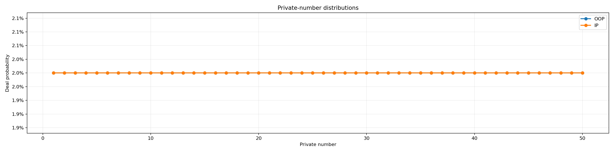
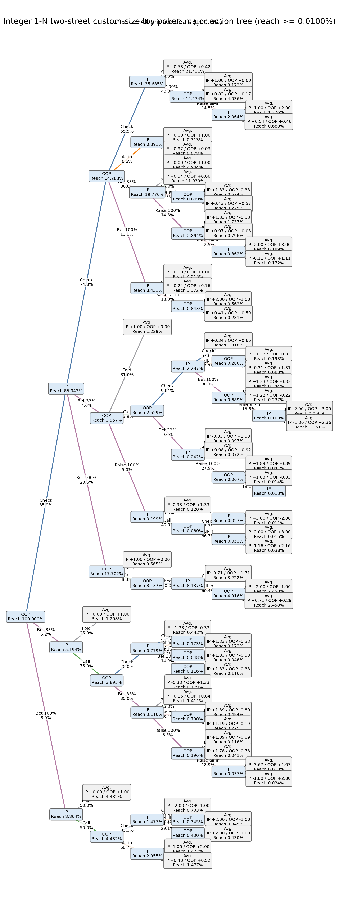
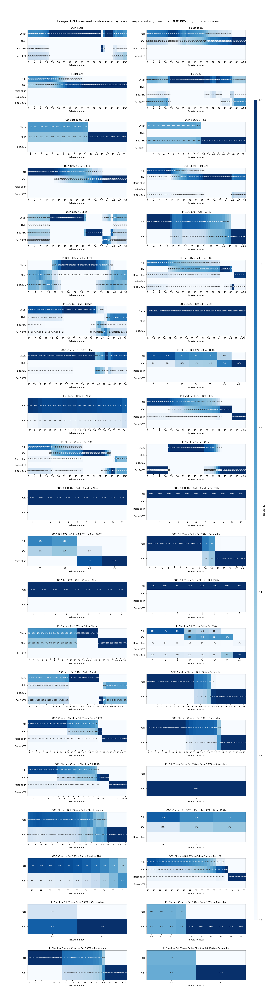
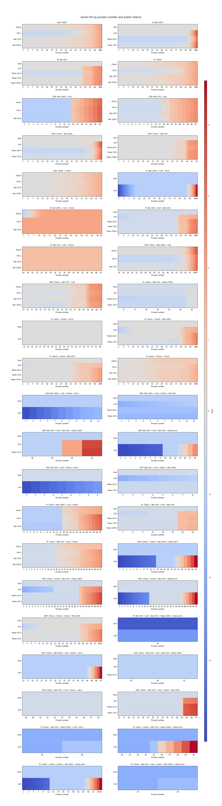
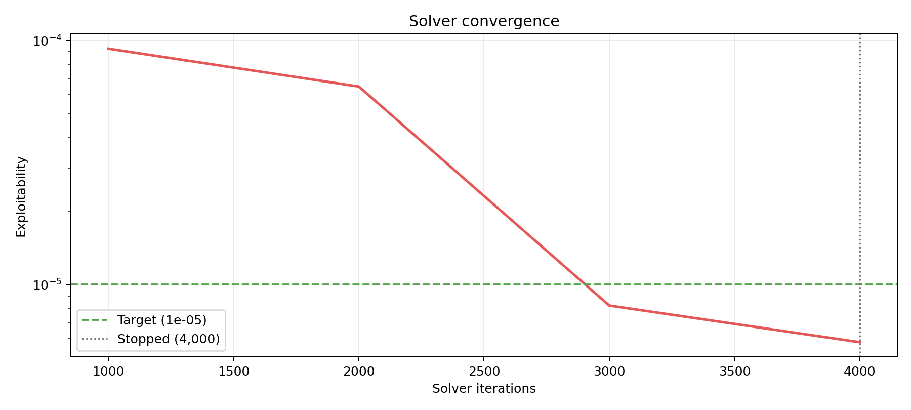

# Integer 1-N two-street custom-size toy poker

各情報集合へ到達した条件下で、手番プレイヤーの利得EVをchips単位で表示します。初期potはデッドマネーとして扱います。このゲームの終端利得合計は1です。

## Solver summary

| Metric | Value |
|---|---:|
| Iterations | 4,000 / 10,000 |
| Exploitability | 5.8126218e-06 |
| IP EV | +0.535103 |
| OOP EV | +0.464897 |

- Backend: `cpp_range`
- Algorithm: `dcfr`
- Checkpoint evaluation: `cpp_range`
- Stop reason: `target_exploitability`
- Target exploitability: `1.0e-05`
- Best checkpoint: `5.8126218e-06` at iteration 4,000

> [Interactive strategy viewer](strategy_viewer.html) — 履歴を選び、各private numberの混合戦略とAction EVを確認できます。

## Private-number distributions

## Major strategy

Information sets and tree nodes with reach probability below 0.0100% are omitted here. Showing 1180 of 14000 information sets. All actions at a retained information set remain visible.

### Major action tree

### Major action probabilities

### Major information sets

| Decision | Reach | Strategy | Policy EV | Action EV |
|---|---:|---|---:|---|
| OOP(1): start street=1, pot=1, ip_committed=0, oop_committed=0, ip_remaining_stack=4, oop_remaining_stack=4, amount_to_call=0, minimum_raise_increment=0 | 2.000000% | Check: **66.77%** All-in: **0.00%** Bet 33%: **9.49%** Bet 100%: **23.74%** | -0.000000 | Check: -0.000001 All-in: -0.515448 Bet 33%: -0.000003 Bet 100%: +0.000002 |
| OOP(2): start street=1, pot=1, ip_committed=0, oop_committed=0, ip_remaining_stack=4, oop_remaining_stack=4, amount_to_call=0, minimum_raise_increment=0 | 2.000000% | Check: **66.91%** All-in: **0.00%** Bet 33%: **9.57%** Bet 100%: **23.52%** | -0.000000 | Check: -0.000001 All-in: -0.515448 Bet 33%: -0.000003 Bet 100%: +0.000002 |
| OOP(3): start street=1, pot=1, ip_committed=0, oop_committed=0, ip_remaining_stack=4, oop_remaining_stack=4, amount_to_call=0, minimum_raise_increment=0 | 2.000000% | Check: **66.20%** All-in: **0.00%** Bet 33%: **10.24%** Bet 100%: **23.56%** | -0.000000 | Check: -0.000001 All-in: -0.515448 Bet 33%: -0.000003 Bet 100%: +0.000002 |
| OOP(4): start street=1, pot=1, ip_committed=0, oop_committed=0, ip_remaining_stack=4, oop_remaining_stack=4, amount_to_call=0, minimum_raise_increment=0 | 2.000000% | Check: **65.65%** All-in: **0.00%** Bet 33%: **10.78%** Bet 100%: **23.57%** | -0.000000 | Check: -0.000001 All-in: -0.515448 Bet 33%: -0.000003 Bet 100%: +0.000002 |
| OOP(5): start street=1, pot=1, ip_committed=0, oop_committed=0, ip_remaining_stack=4, oop_remaining_stack=4, amount_to_call=0, minimum_raise_increment=0 | 2.000000% | Check: **66.25%** All-in: **0.00%** Bet 33%: **10.26%** Bet 100%: **23.49%** | -0.000000 | Check: -0.000001 All-in: -0.515448 Bet 33%: -0.000003 Bet 100%: +0.000002 |
| OOP(6): start street=1, pot=1, ip_committed=0, oop_committed=0, ip_remaining_stack=4, oop_remaining_stack=4, amount_to_call=0, minimum_raise_increment=0 | 2.000000% | Check: **66.83%** All-in: **0.00%** Bet 33%: **9.78%** Bet 100%: **23.40%** | -0.000000 | Check: -0.000001 All-in: -0.515448 Bet 33%: -0.000003 Bet 100%: +0.000002 |
| OOP(7): start street=1, pot=1, ip_committed=0, oop_committed=0, ip_remaining_stack=4, oop_remaining_stack=4, amount_to_call=0, minimum_raise_increment=0 | 2.000000% | Check: **67.47%** All-in: **0.00%** Bet 33%: **9.29%** Bet 100%: **23.23%** | -0.000000 | Check: -0.000001 All-in: -0.515448 Bet 33%: -0.000003 Bet 100%: +0.000002 |
| OOP(8): start street=1, pot=1, ip_committed=0, oop_committed=0, ip_remaining_stack=4, oop_remaining_stack=4, amount_to_call=0, minimum_raise_increment=0 | 2.000000% | Check: **68.85%** All-in: **0.00%** Bet 33%: **8.54%** Bet 100%: **22.61%** | -0.000000 | Check: -0.000001 All-in: -0.515448 Bet 33%: -0.000003 Bet 100%: +0.000002 |
| OOP(9): start street=1, pot=1, ip_committed=0, oop_committed=0, ip_remaining_stack=4, oop_remaining_stack=4, amount_to_call=0, minimum_raise_increment=0 | 2.000000% | Check: **71.11%** All-in: **0.00%** Bet 33%: **7.08%** Bet 100%: **21.81%** | -0.000000 | Check: -0.000001 All-in: -0.515448 Bet 33%: -0.000003 Bet 100%: +0.000002 |
| OOP(10): start street=1, pot=1, ip_committed=0, oop_committed=0, ip_remaining_stack=4, oop_remaining_stack=4, amount_to_call=0, minimum_raise_increment=0 | 2.000000% | Check: **75.01%** All-in: **0.00%** Bet 33%: **4.58%** Bet 100%: **20.41%** | -0.000000 | Check: -0.000001 All-in: -0.515448 Bet 33%: -0.000003 Bet 100%: +0.000002 |
| OOP(11): start street=1, pot=1, ip_committed=0, oop_committed=0, ip_remaining_stack=4, oop_remaining_stack=4, amount_to_call=0, minimum_raise_increment=0 | 2.000000% | Check: **79.25%** All-in: **0.00%** Bet 33%: **3.87%** Bet 100%: **16.88%** | -0.000000 | Check: -0.000000 All-in: -0.515448 Bet 33%: -0.000003 Bet 100%: +0.000002 |
| OOP(12): start street=1, pot=1, ip_committed=0, oop_committed=0, ip_remaining_stack=4, oop_remaining_stack=4, amount_to_call=0, minimum_raise_increment=0 | 2.000000% | Check: **100.00%** All-in: **0.00%** Bet 33%: **0.00%** Bet 100%: **0.00%** | +0.007003 | Check: +0.007003 All-in: -0.515448 Bet 33%: -0.001507 Bet 100%: +0.000285 |
| OOP(13): start street=1, pot=1, ip_committed=0, oop_committed=0, ip_remaining_stack=4, oop_remaining_stack=4, amount_to_call=0, minimum_raise_increment=0 | 2.000000% | Check: **100.00%** All-in: **0.00%** Bet 33%: **0.00%** Bet 100%: **0.00%** | +0.024005 | Check: +0.024005 All-in: -0.515448 Bet 33%: -0.006157 Bet 100%: +0.001690 |
| OOP(14): start street=1, pot=1, ip_committed=0, oop_committed=0, ip_remaining_stack=4, oop_remaining_stack=4, amount_to_call=0, minimum_raise_increment=0 | 2.000000% | Check: **100.00%** All-in: **0.00%** Bet 33%: **0.00%** Bet 100%: **0.00%** | +0.044005 | Check: +0.044005 All-in: -0.515448 Bet 33%: -0.003147 Bet 100%: +0.002747 |
| OOP(15): start street=1, pot=1, ip_committed=0, oop_committed=0, ip_remaining_stack=4, oop_remaining_stack=4, amount_to_call=0, minimum_raise_increment=0 | 2.000000% | Check: **100.00%** All-in: **0.00%** Bet 33%: **0.00%** Bet 100%: **0.00%** | +0.064005 | Check: +0.064005 All-in: -0.515448 Bet 33%: +0.003656 Bet 100%: +0.002723 |
| OOP(16): start street=1, pot=1, ip_committed=0, oop_committed=0, ip_remaining_stack=4, oop_remaining_stack=4, amount_to_call=0, minimum_raise_increment=0 | 2.000000% | Check: **100.00%** All-in: **0.00%** Bet 33%: **0.00%** Bet 100%: **0.00%** | +0.084005 | Check: +0.084005 All-in: -0.515448 Bet 33%: +0.012842 Bet 100%: +0.003254 |
| OOP(17): start street=1, pot=1, ip_committed=0, oop_committed=0, ip_remaining_stack=4, oop_remaining_stack=4, amount_to_call=0, minimum_raise_increment=0 | 2.000000% | Check: **100.00%** All-in: **0.00%** Bet 33%: **0.00%** Bet 100%: **0.00%** | +0.104005 | Check: +0.104005 All-in: -0.515448 Bet 33%: +0.025381 Bet 100%: +0.006469 |
| OOP(18): start street=1, pot=1, ip_committed=0, oop_committed=0, ip_remaining_stack=4, oop_remaining_stack=4, amount_to_call=0, minimum_raise_increment=0 | 2.000000% | Check: **100.00%** All-in: **0.00%** Bet 33%: **0.00%** Bet 100%: **0.00%** | +0.124005 | Check: +0.124005 All-in: -0.515448 Bet 33%: +0.039955 Bet 100%: +0.013817 |
| OOP(19): start street=1, pot=1, ip_committed=0, oop_committed=0, ip_remaining_stack=4, oop_remaining_stack=4, amount_to_call=0, minimum_raise_increment=0 | 2.000000% | Check: **100.00%** All-in: **0.00%** Bet 33%: **0.00%** Bet 100%: **0.00%** | +0.144005 | Check: +0.144005 All-in: -0.515448 Bet 33%: +0.057471 Bet 100%: +0.024583 |
| OOP(20): start street=1, pot=1, ip_committed=0, oop_committed=0, ip_remaining_stack=4, oop_remaining_stack=4, amount_to_call=0, minimum_raise_increment=0 | 2.000000% | Check: **100.00%** All-in: **0.00%** Bet 33%: **0.00%** Bet 100%: **0.00%** | +0.164005 | Check: +0.164005 All-in: -0.515448 Bet 33%: +0.073630 Bet 100%: +0.040770 |
| OOP(21): start street=1, pot=1, ip_committed=0, oop_committed=0, ip_remaining_stack=4, oop_remaining_stack=4, amount_to_call=0, minimum_raise_increment=0 | 2.000000% | Check: **100.00%** All-in: **0.00%** Bet 33%: **0.00%** Bet 100%: **0.00%** | +0.184005 | Check: +0.184005 All-in: -0.515448 Bet 33%: +0.097463 Bet 100%: +0.058920 |
| OOP(22): start street=1, pot=1, ip_committed=0, oop_committed=0, ip_remaining_stack=4, oop_remaining_stack=4, amount_to_call=0, minimum_raise_increment=0 | 2.000000% | Check: **100.00%** All-in: **0.00%** Bet 33%: **0.00%** Bet 100%: **0.00%** | +0.204005 | Check: +0.204005 All-in: -0.515448 Bet 33%: +0.123437 Bet 100%: +0.079467 |
| OOP(23): start street=1, pot=1, ip_committed=0, oop_committed=0, ip_remaining_stack=4, oop_remaining_stack=4, amount_to_call=0, minimum_raise_increment=0 | 2.000000% | Check: **100.00%** All-in: **0.00%** Bet 33%: **0.00%** Bet 100%: **0.00%** | +0.224005 | Check: +0.224005 All-in: -0.515448 Bet 33%: +0.152346 Bet 100%: +0.098873 |
| OOP(24): start street=1, pot=1, ip_committed=0, oop_committed=0, ip_remaining_stack=4, oop_remaining_stack=4, amount_to_call=0, minimum_raise_increment=0 | 2.000000% | Check: **100.00%** All-in: **0.00%** Bet 33%: **0.00%** Bet 100%: **0.00%** | +0.244005 | Check: +0.244005 All-in: -0.515448 Bet 33%: +0.191205 Bet 100%: +0.119481 |
| OOP(25): start street=1, pot=1, ip_committed=0, oop_committed=0, ip_remaining_stack=4, oop_remaining_stack=4, amount_to_call=0, minimum_raise_increment=0 | 2.000000% | Check: **100.00%** All-in: **0.00%** Bet 33%: **0.00%** Bet 100%: **0.00%** | +0.264005 | Check: +0.264005 All-in: -0.515448 Bet 33%: +0.222501 Bet 100%: +0.132112 |
| OOP(26): start street=1, pot=1, ip_committed=0, oop_committed=0, ip_remaining_stack=4, oop_remaining_stack=4, amount_to_call=0, minimum_raise_increment=0 | 2.000000% | Check: **100.00%** All-in: **0.00%** Bet 33%: **0.00%** Bet 100%: **0.00%** | +0.284005 | Check: +0.284005 All-in: -0.515448 Bet 33%: +0.252571 Bet 100%: +0.150506 |
| OOP(27): start street=1, pot=1, ip_committed=0, oop_committed=0, ip_remaining_stack=4, oop_remaining_stack=4, amount_to_call=0, minimum_raise_increment=0 | 2.000000% | Check: **100.00%** All-in: **0.00%** Bet 33%: **0.00%** Bet 100%: **0.00%** | +0.304005 | Check: +0.304005 All-in: -0.507174 Bet 33%: +0.281600 Bet 100%: +0.167751 |
| OOP(28): start street=1, pot=1, ip_committed=0, oop_committed=0, ip_remaining_stack=4, oop_remaining_stack=4, amount_to_call=0, minimum_raise_increment=0 | 2.000000% | Check: **100.00%** All-in: **0.00%** Bet 33%: **0.00%** Bet 100%: **0.00%** | +0.324005 | Check: +0.324005 All-in: -0.484404 Bet 33%: +0.311178 Bet 100%: +0.182415 |
| OOP(29): start street=1, pot=1, ip_committed=0, oop_committed=0, ip_remaining_stack=4, oop_remaining_stack=4, amount_to_call=0, minimum_raise_increment=0 | 2.000000% | Check: **100.00%** All-in: **0.00%** Bet 33%: **0.00%** Bet 100%: **0.00%** | +0.344003 | Check: +0.344003 All-in: -0.451024 Bet 33%: +0.343250 Bet 100%: +0.206799 |
| OOP(30): start street=1, pot=1, ip_committed=0, oop_committed=0, ip_remaining_stack=4, oop_remaining_stack=4, amount_to_call=0, minimum_raise_increment=0 | 2.000000% | Check: **100.00%** All-in: **0.00%** Bet 33%: **0.00%** Bet 100%: **0.00%** | +0.377331 | Check: +0.377331 All-in: -0.409874 Bet 33%: +0.376434 Bet 100%: +0.228358 |
| OOP(31): start street=1, pot=1, ip_committed=0, oop_committed=0, ip_remaining_stack=4, oop_remaining_stack=4, amount_to_call=0, minimum_raise_increment=0 | 2.000000% | Check: **100.00%** All-in: **0.00%** Bet 33%: **0.00%** Bet 100%: **0.00%** | +0.410664 | Check: +0.410664 All-in: -0.362163 Bet 33%: +0.409522 Bet 100%: +0.253422 |
| OOP(32): start street=1, pot=1, ip_committed=0, oop_committed=0, ip_remaining_stack=4, oop_remaining_stack=4, amount_to_call=0, minimum_raise_increment=0 | 2.000000% | Check: **100.00%** All-in: **0.00%** Bet 33%: **0.00%** Bet 100%: **0.00%** | +0.443997 | Check: +0.443997 All-in: -0.307679 Bet 33%: +0.442760 Bet 100%: +0.286923 |
| OOP(33): start street=1, pot=1, ip_committed=0, oop_committed=0, ip_remaining_stack=4, oop_remaining_stack=4, amount_to_call=0, minimum_raise_increment=0 | 2.000000% | Check: **100.00%** All-in: **0.00%** Bet 33%: **0.00%** Bet 100%: **0.00%** | +0.477330 | Check: +0.477331 All-in: -0.245160 Bet 33%: +0.476011 Bet 100%: +0.298767 |
| OOP(34): start street=1, pot=1, ip_committed=0, oop_committed=0, ip_remaining_stack=4, oop_remaining_stack=4, amount_to_call=0, minimum_raise_increment=0 | 2.000000% | Check: **100.00%** All-in: **0.00%** Bet 33%: **0.00%** Bet 100%: **0.00%** | +0.510664 | Check: +0.510664 All-in: -0.172771 Bet 33%: +0.509024 Bet 100%: +0.360003 |
| OOP(35): start street=1, pot=1, ip_committed=0, oop_committed=0, ip_remaining_stack=4, oop_remaining_stack=4, amount_to_call=0, minimum_raise_increment=0 | 2.000000% | Check: **100.00%** All-in: **0.00%** Bet 33%: **0.00%** Bet 100%: **0.00%** | +0.543997 | Check: +0.543997 All-in: -0.088589 Bet 33%: +0.541682 Bet 100%: +0.435015 |
| OOP(36): start street=1, pot=1, ip_committed=0, oop_committed=0, ip_remaining_stack=4, oop_remaining_stack=4, amount_to_call=0, minimum_raise_increment=0 | 2.000000% | Check: **100.00%** All-in: **0.00%** Bet 33%: **0.00%** Bet 100%: **0.00%** | +0.577330 | Check: +0.577330 All-in: +0.008469 Bet 33%: +0.573931 Bet 100%: +0.478775 |
| OOP(37): start street=1, pot=1, ip_committed=0, oop_committed=0, ip_remaining_stack=4, oop_remaining_stack=4, amount_to_call=0, minimum_raise_increment=0 | 2.000000% | Check: **100.00%** All-in: **0.00%** Bet 33%: **0.00%** Bet 100%: **0.00%** | +0.610664 | Check: +0.610664 All-in: +0.118148 Bet 33%: +0.608131 Bet 100%: +0.526986 |
| OOP(38): start street=1, pot=1, ip_committed=0, oop_committed=0, ip_remaining_stack=4, oop_remaining_stack=4, amount_to_call=0, minimum_raise_increment=0 | 2.000000% | Check: **0.01%** All-in: **0.00%** Bet 33%: **99.99%** Bet 100%: **0.00%** | +0.655744 | Check: +0.649506 All-in: +0.238734 Bet 33%: +0.655744 Bet 100%: +0.580813 |
| OOP(39): start street=1, pot=1, ip_committed=0, oop_committed=0, ip_remaining_stack=4, oop_remaining_stack=4, amount_to_call=0, minimum_raise_increment=0 | 2.000000% | Check: **73.17%** All-in: **0.00%** Bet 33%: **26.83%** Bet 100%: **0.00%** | +0.711329 | Check: +0.711340 All-in: +0.367768 Bet 33%: +0.711300 Bet 100%: +0.648810 |
| OOP(40): start street=1, pot=1, ip_committed=0, oop_committed=0, ip_remaining_stack=4, oop_remaining_stack=4, amount_to_call=0, minimum_raise_increment=0 | 2.000000% | Check: **100.00%** All-in: **0.00%** Bet 33%: **0.00%** Bet 100%: **0.00%** | +0.771340 | Check: +0.771341 All-in: +0.503432 Bet 33%: +0.766362 Bet 100%: +0.722390 |
| OOP(41): start street=1, pot=1, ip_committed=0, oop_committed=0, ip_remaining_stack=4, oop_remaining_stack=4, amount_to_call=0, minimum_raise_increment=0 | 2.000000% | Check: **100.00%** All-in: **0.00%** Bet 33%: **0.00%** Bet 100%: **0.00%** | +0.831340 | Check: +0.831340 All-in: +0.644056 Bet 33%: +0.788216 Bet 100%: +0.787133 |
| OOP(42): start street=1, pot=1, ip_committed=0, oop_committed=0, ip_remaining_stack=4, oop_remaining_stack=4, amount_to_call=0, minimum_raise_increment=0 | 2.000000% | Check: **100.00%** All-in: **0.00%** Bet 33%: **0.00%** Bet 100%: **0.00%** | +0.891340 | Check: +0.891340 All-in: +0.783182 Bet 33%: +0.861038 Bet 100%: +0.860005 |
| OOP(43): start street=1, pot=1, ip_committed=0, oop_committed=0, ip_remaining_stack=4, oop_remaining_stack=4, amount_to_call=0, minimum_raise_increment=0 | 2.000000% | Check: **100.00%** All-in: **0.00%** Bet 33%: **0.00%** Bet 100%: **0.00%** | +0.956744 | Check: +0.956744 All-in: +0.920958 Bet 33%: +0.945789 Bet 100%: +0.948381 |
| OOP(44): start street=1, pot=1, ip_committed=0, oop_committed=0, ip_remaining_stack=4, oop_remaining_stack=4, amount_to_call=0, minimum_raise_increment=0 | 2.000000% | Check: **72.43%** All-in: **0.00%** Bet 33%: **11.77%** Bet 100%: **15.80%** | +1.079992 | Check: +1.079991 All-in: +1.066739 Bet 33%: +1.079991 Bet 100%: +1.079998 |
| OOP(45): start street=1, pot=1, ip_committed=0, oop_committed=0, ip_remaining_stack=4, oop_remaining_stack=4, amount_to_call=0, minimum_raise_increment=0 | 2.000000% | Check: **61.97%** All-in: **0.00%** Bet 33%: **12.91%** Bet 100%: **25.12%** | +1.259995 | Check: +1.259994 All-in: +1.227464 Bet 33%: +1.259992 Bet 100%: +1.259998 |
| OOP(46): start street=1, pot=1, ip_committed=0, oop_committed=0, ip_remaining_stack=4, oop_remaining_stack=4, amount_to_call=0, minimum_raise_increment=0 | 2.000000% | Check: **68.64%** All-in: **0.00%** Bet 33%: **3.28%** Bet 100%: **28.08%** | +1.439995 | Check: +1.439993 All-in: +1.402358 Bet 33%: +1.439992 Bet 100%: +1.439998 |
| OOP(47): start street=1, pot=1, ip_committed=0, oop_committed=0, ip_remaining_stack=4, oop_remaining_stack=4, amount_to_call=0, minimum_raise_increment=0 | 2.000000% | Check: **68.93%** All-in: **0.00%** Bet 33%: **3.22%** Bet 100%: **27.85%** | +1.619995 | Check: +1.619993 All-in: +1.582358 Bet 33%: +1.619992 Bet 100%: +1.619998 |
| OOP(48): start street=1, pot=1, ip_committed=0, oop_committed=0, ip_remaining_stack=4, oop_remaining_stack=4, amount_to_call=0, minimum_raise_increment=0 | 2.000000% | Check: **68.14%** All-in: **0.00%** Bet 33%: **3.08%** Bet 100%: **28.77%** | +1.799995 | Check: +1.799993 All-in: +1.762358 Bet 33%: +1.799992 Bet 100%: +1.799998 |
| OOP(49): start street=1, pot=1, ip_committed=0, oop_committed=0, ip_remaining_stack=4, oop_remaining_stack=4, amount_to_call=0, minimum_raise_increment=0 | 2.000000% | Check: **61.84%** All-in: **0.00%** Bet 33%: **2.57%** Bet 100%: **35.58%** | +1.979995 | Check: +1.979993 All-in: +1.942358 Bet 33%: +1.979992 Bet 100%: +1.979998 |
| OOP(50): start street=1, pot=1, ip_committed=0, oop_committed=0, ip_remaining_stack=4, oop_remaining_stack=4, amount_to_call=0, minimum_raise_increment=0 | 2.000000% | Check: **61.70%** All-in: **0.00%** Bet 33%: **2.54%** Bet 100%: **35.76%** | +2.159995 | Check: +2.159993 All-in: +2.122358 Bet 33%: +2.159992 Bet 100%: +2.159998 |
| IP(1): check street=1, pot=1, ip_committed=0, oop_committed=0, ip_remaining_stack=4, oop_remaining_stack=4, amount_to_call=0, minimum_raise_increment=0 | 1.718851% | Check: **49.40%** All-in: **0.00%** Bet 33%: **3.03%** Bet 100%: **47.57%** | +0.080621 | Check: +0.080620 All-in: -0.355055 Bet 33%: +0.080617 Bet 100%: +0.080622 |
| IP(2): check street=1, pot=1, ip_committed=0, oop_committed=0, ip_remaining_stack=4, oop_remaining_stack=4, amount_to_call=0, minimum_raise_increment=0 | 1.718851% | Check: **49.50%** All-in: **0.00%** Bet 33%: **3.04%** Bet 100%: **47.47%** | +0.080621 | Check: +0.080620 All-in: -0.355055 Bet 33%: +0.080617 Bet 100%: +0.080622 |
| IP(3): check street=1, pot=1, ip_committed=0, oop_committed=0, ip_remaining_stack=4, oop_remaining_stack=4, amount_to_call=0, minimum_raise_increment=0 | 1.718851% | Check: **49.71%** All-in: **0.00%** Bet 33%: **3.13%** Bet 100%: **47.16%** | +0.080621 | Check: +0.080620 All-in: -0.355055 Bet 33%: +0.080617 Bet 100%: +0.080622 |
| IP(4): check street=1, pot=1, ip_committed=0, oop_committed=0, ip_remaining_stack=4, oop_remaining_stack=4, amount_to_call=0, minimum_raise_increment=0 | 1.718851% | Check: **49.11%** All-in: **0.00%** Bet 33%: **4.59%** Bet 100%: **46.29%** | +0.080621 | Check: +0.080620 All-in: -0.355055 Bet 33%: +0.080617 Bet 100%: +0.080622 |
| IP(5): check street=1, pot=1, ip_committed=0, oop_committed=0, ip_remaining_stack=4, oop_remaining_stack=4, amount_to_call=0, minimum_raise_increment=0 | 1.718851% | Check: **48.84%** All-in: **0.00%** Bet 33%: **5.39%** Bet 100%: **45.77%** | +0.080621 | Check: +0.080620 All-in: -0.355055 Bet 33%: +0.080617 Bet 100%: +0.080622 |
| IP(6): check street=1, pot=1, ip_committed=0, oop_committed=0, ip_remaining_stack=4, oop_remaining_stack=4, amount_to_call=0, minimum_raise_increment=0 | 1.718851% | Check: **46.30%** All-in: **0.00%** Bet 33%: **9.25%** Bet 100%: **44.45%** | +0.080621 | Check: +0.080620 All-in: -0.355055 Bet 33%: +0.080617 Bet 100%: +0.080622 |
| IP(7): check street=1, pot=1, ip_committed=0, oop_committed=0, ip_remaining_stack=4, oop_remaining_stack=4, amount_to_call=0, minimum_raise_increment=0 | 1.718851% | Check: **43.15%** All-in: **0.00%** Bet 33%: **11.22%** Bet 100%: **45.62%** | +0.080621 | Check: +0.080620 All-in: -0.355055 Bet 33%: +0.080617 Bet 100%: +0.080622 |
| IP(8): check street=1, pot=1, ip_committed=0, oop_committed=0, ip_remaining_stack=4, oop_remaining_stack=4, amount_to_call=0, minimum_raise_increment=0 | 1.718851% | Check: **40.95%** All-in: **0.00%** Bet 33%: **12.12%** Bet 100%: **46.94%** | +0.080621 | Check: +0.080620 All-in: -0.355055 Bet 33%: +0.080617 Bet 100%: +0.080622 |
| IP(9): check street=1, pot=1, ip_committed=0, oop_committed=0, ip_remaining_stack=4, oop_remaining_stack=4, amount_to_call=0, minimum_raise_increment=0 | 1.718851% | Check: **39.53%** All-in: **0.00%** Bet 33%: **12.39%** Bet 100%: **48.08%** | +0.080621 | Check: +0.080620 All-in: -0.355055 Bet 33%: +0.080617 Bet 100%: +0.080622 |
| IP(10): check street=1, pot=1, ip_committed=0, oop_committed=0, ip_remaining_stack=4, oop_remaining_stack=4, amount_to_call=0, minimum_raise_increment=0 | 1.718851% | Check: **39.07%** All-in: **0.00%** Bet 33%: **9.52%** Bet 100%: **51.41%** | +0.080621 | Check: +0.080620 All-in: -0.355055 Bet 33%: +0.080617 Bet 100%: +0.080622 |
| IP(11): check street=1, pot=1, ip_committed=0, oop_committed=0, ip_remaining_stack=4, oop_remaining_stack=4, amount_to_call=0, minimum_raise_increment=0 | 1.718851% | Check: **39.03%** All-in: **0.00%** Bet 33%: **3.29%** Bet 100%: **57.68%** | +0.080621 | Check: +0.080620 All-in: -0.355055 Bet 33%: +0.080617 Bet 100%: +0.080622 |
| IP(12): check street=1, pot=1, ip_committed=0, oop_committed=0, ip_remaining_stack=4, oop_remaining_stack=4, amount_to_call=0, minimum_raise_increment=0 | 1.718851% | Check: **74.09%** All-in: **0.00%** Bet 33%: **3.68%** Bet 100%: **22.23%** | +0.080621 | Check: +0.080621 All-in: -0.355055 Bet 33%: +0.080617 Bet 100%: +0.080622 |
| IP(13): check street=1, pot=1, ip_committed=0, oop_committed=0, ip_remaining_stack=4, oop_remaining_stack=4, amount_to_call=0, minimum_raise_increment=0 | 1.718851% | Check: **100.00%** All-in: **0.00%** Bet 33%: **0.00%** Bet 100%: **0.00%** | +0.103892 | Check: +0.103892 All-in: -0.355055 Bet 33%: +0.082335 Bet 100%: +0.080490 |
| IP(14): check street=1, pot=1, ip_committed=0, oop_committed=0, ip_remaining_stack=4, oop_remaining_stack=4, amount_to_call=0, minimum_raise_increment=0 | 1.718851% | Check: **100.00%** All-in: **0.00%** Bet 33%: **0.00%** Bet 100%: **0.00%** | +0.127163 | Check: +0.127163 All-in: -0.355055 Bet 33%: +0.091241 Bet 100%: +0.080832 |
| IP(15): check street=1, pot=1, ip_committed=0, oop_committed=0, ip_remaining_stack=4, oop_remaining_stack=4, amount_to_call=0, minimum_raise_increment=0 | 1.718851% | Check: **100.00%** All-in: **0.00%** Bet 33%: **0.00%** Bet 100%: **0.00%** | +0.150435 | Check: +0.150435 All-in: -0.354986 Bet 33%: +0.106653 Bet 100%: +0.082319 |
| IP(16): check street=1, pot=1, ip_committed=0, oop_committed=0, ip_remaining_stack=4, oop_remaining_stack=4, amount_to_call=0, minimum_raise_increment=0 | 1.718851% | Check: **100.00%** All-in: **0.00%** Bet 33%: **0.00%** Bet 100%: **0.00%** | +0.173706 | Check: +0.173706 All-in: -0.353765 Bet 33%: +0.118215 Bet 100%: +0.085092 |
| IP(17): check street=1, pot=1, ip_committed=0, oop_committed=0, ip_remaining_stack=4, oop_remaining_stack=4, amount_to_call=0, minimum_raise_increment=0 | 1.718851% | Check: **100.00%** All-in: **0.00%** Bet 33%: **0.00%** Bet 100%: **0.00%** | +0.196977 | Check: +0.196977 All-in: -0.350062 Bet 33%: +0.131664 Bet 100%: +0.089986 |
| IP(18): check street=1, pot=1, ip_committed=0, oop_committed=0, ip_remaining_stack=4, oop_remaining_stack=4, amount_to_call=0, minimum_raise_increment=0 | 1.718851% | Check: **100.00%** All-in: **0.00%** Bet 33%: **0.00%** Bet 100%: **0.00%** | +0.220249 | Check: +0.220249 All-in: -0.343170 Bet 33%: +0.149993 Bet 100%: +0.098869 |
| IP(19): check street=1, pot=1, ip_committed=0, oop_committed=0, ip_remaining_stack=4, oop_remaining_stack=4, amount_to_call=0, minimum_raise_increment=0 | 1.718851% | Check: **100.00%** All-in: **0.00%** Bet 33%: **0.00%** Bet 100%: **0.00%** | +0.243520 | Check: +0.243520 All-in: -0.332679 Bet 33%: +0.170232 Bet 100%: +0.108237 |
| IP(20): check street=1, pot=1, ip_committed=0, oop_committed=0, ip_remaining_stack=4, oop_remaining_stack=4, amount_to_call=0, minimum_raise_increment=0 | 1.718851% | Check: **100.00%** All-in: **0.00%** Bet 33%: **0.00%** Bet 100%: **0.00%** | +0.266791 | Check: +0.266791 All-in: -0.319437 Bet 33%: +0.193512 Bet 100%: +0.114270 |
| IP(21): check street=1, pot=1, ip_committed=0, oop_committed=0, ip_remaining_stack=4, oop_remaining_stack=4, amount_to_call=0, minimum_raise_increment=0 | 1.718851% | Check: **100.00%** All-in: **0.00%** Bet 33%: **0.00%** Bet 100%: **0.00%** | +0.290063 | Check: +0.290063 All-in: -0.305025 Bet 33%: +0.219069 Bet 100%: +0.159397 |
| IP(22): check street=1, pot=1, ip_committed=0, oop_committed=0, ip_remaining_stack=4, oop_remaining_stack=4, amount_to_call=0, minimum_raise_increment=0 | 1.718851% | Check: **100.00%** All-in: **0.00%** Bet 33%: **0.00%** Bet 100%: **0.00%** | +0.313334 | Check: +0.313334 All-in: -0.290139 Bet 33%: +0.248238 Bet 100%: +0.180088 |
| IP(23): check street=1, pot=1, ip_committed=0, oop_committed=0, ip_remaining_stack=4, oop_remaining_stack=4, amount_to_call=0, minimum_raise_increment=0 | 1.718851% | Check: **100.00%** All-in: **0.00%** Bet 33%: **0.00%** Bet 100%: **0.00%** | +0.336605 | Check: +0.336605 All-in: -0.274870 Bet 33%: +0.277317 Bet 100%: +0.185957 |
| IP(24): check street=1, pot=1, ip_committed=0, oop_committed=0, ip_remaining_stack=4, oop_remaining_stack=4, amount_to_call=0, minimum_raise_increment=0 | 1.718851% | Check: **100.00%** All-in: **0.00%** Bet 33%: **0.00%** Bet 100%: **0.00%** | +0.359877 | Check: +0.359877 All-in: -0.259329 Bet 33%: +0.305560 Bet 100%: +0.155617 |
| IP(25): check street=1, pot=1, ip_committed=0, oop_committed=0, ip_remaining_stack=4, oop_remaining_stack=4, amount_to_call=0, minimum_raise_increment=0 | 1.718851% | Check: **100.00%** All-in: **0.00%** Bet 33%: **0.00%** Bet 100%: **0.00%** | +0.383148 | Check: +0.383148 All-in: -0.243507 Bet 33%: +0.335784 Bet 100%: +0.203209 |
| IP(26): check street=1, pot=1, ip_committed=0, oop_committed=0, ip_remaining_stack=4, oop_remaining_stack=4, amount_to_call=0, minimum_raise_increment=0 | 1.718851% | Check: **100.00%** All-in: **0.00%** Bet 33%: **0.00%** Bet 100%: **0.00%** | +0.406419 | Check: +0.406419 All-in: -0.227400 Bet 33%: +0.368057 Bet 100%: +0.245214 |
| IP(27): check street=1, pot=1, ip_committed=0, oop_committed=0, ip_remaining_stack=4, oop_remaining_stack=4, amount_to_call=0, minimum_raise_increment=0 | 1.718851% | Check: **100.00%** All-in: **0.00%** Bet 33%: **0.00%** Bet 100%: **0.00%** | +0.429691 | Check: +0.429691 All-in: -0.211022 Bet 33%: +0.402089 Bet 100%: +0.281730 |
| IP(28): check street=1, pot=1, ip_committed=0, oop_committed=0, ip_remaining_stack=4, oop_remaining_stack=4, amount_to_call=0, minimum_raise_increment=0 | 1.718851% | Check: **100.00%** All-in: **0.00%** Bet 33%: **0.00%** Bet 100%: **0.00%** | +0.452962 | Check: +0.452962 All-in: -0.194340 Bet 33%: +0.438866 Bet 100%: +0.309782 |
| IP(29): check street=1, pot=1, ip_committed=0, oop_committed=0, ip_remaining_stack=4, oop_remaining_stack=4, amount_to_call=0, minimum_raise_increment=0 | 1.718851% | Check: **100.00%** All-in: **0.00%** Bet 33%: **0.00%** Bet 100%: **0.00%** | +0.479977 | Check: +0.479977 All-in: -0.177171 Bet 33%: +0.476298 Bet 100%: +0.332872 |
| IP(30): check street=1, pot=1, ip_committed=0, oop_committed=0, ip_remaining_stack=4, oop_remaining_stack=4, amount_to_call=0, minimum_raise_increment=0 | 1.718851% | Check: **95.14%** All-in: **0.00%** Bet 33%: **4.86%** Bet 100%: **0.00%** | +0.514752 | Check: +0.514752 All-in: -0.158306 Bet 33%: +0.514746 Bet 100%: +0.375243 |
| IP(31): check street=1, pot=1, ip_committed=0, oop_committed=0, ip_remaining_stack=4, oop_remaining_stack=4, amount_to_call=0, minimum_raise_increment=0 | 1.718851% | Check: **96.02%** All-in: **0.00%** Bet 33%: **3.98%** Bet 100%: **0.00%** | +0.553537 | Check: +0.553537 All-in: -0.130214 Bet 33%: +0.553530 Bet 100%: +0.425525 |
| IP(32): check street=1, pot=1, ip_committed=0, oop_committed=0, ip_remaining_stack=4, oop_remaining_stack=4, amount_to_call=0, minimum_raise_increment=0 | 1.718851% | Check: **96.23%** All-in: **0.00%** Bet 33%: **3.77%** Bet 100%: **0.00%** | +0.592322 | Check: +0.592323 All-in: -0.083961 Bet 33%: +0.592315 Bet 100%: +0.468143 |
| IP(33): check street=1, pot=1, ip_committed=0, oop_committed=0, ip_remaining_stack=4, oop_remaining_stack=4, amount_to_call=0, minimum_raise_increment=0 | 1.718851% | Check: **85.59%** All-in: **0.00%** Bet 33%: **14.41%** Bet 100%: **0.00%** | +0.631107 | Check: +0.631108 All-in: -0.029222 Bet 33%: +0.631100 Bet 100%: +0.508329 |
| IP(34): check street=1, pot=1, ip_committed=0, oop_committed=0, ip_remaining_stack=4, oop_remaining_stack=4, amount_to_call=0, minimum_raise_increment=0 | 1.718851% | Check: **76.10%** All-in: **0.00%** Bet 33%: **23.90%** Bet 100%: **0.00%** | +0.669892 | Check: +0.669894 All-in: +0.018890 Bet 33%: +0.669886 Bet 100%: +0.570471 |
| IP(35): check street=1, pot=1, ip_committed=0, oop_committed=0, ip_remaining_stack=4, oop_remaining_stack=4, amount_to_call=0, minimum_raise_increment=0 | 1.718851% | Check: **79.18%** All-in: **0.00%** Bet 33%: **20.82%** Bet 100%: **0.00%** | +0.708678 | Check: +0.708679 All-in: +0.065685 Bet 33%: +0.708671 Bet 100%: +0.635962 |
| IP(36): check street=1, pot=1, ip_committed=0, oop_committed=0, ip_remaining_stack=4, oop_remaining_stack=4, amount_to_call=0, minimum_raise_increment=0 | 1.718851% | Check: **96.46%** All-in: **0.00%** Bet 33%: **3.54%** Bet 100%: **0.00%** | +0.747465 | Check: +0.747465 All-in: +0.118169 Bet 33%: +0.747456 Bet 100%: +0.695089 |
| IP(37): check street=1, pot=1, ip_committed=0, oop_committed=0, ip_remaining_stack=4, oop_remaining_stack=4, amount_to_call=0, minimum_raise_increment=0 | 1.718851% | Check: **94.98%** All-in: **0.00%** Bet 33%: **5.02%** Bet 100%: **0.00%** | +0.786250 | Check: +0.786251 All-in: +0.195196 Bet 33%: +0.786243 Bet 100%: +0.758075 |
| IP(38): check street=1, pot=1, ip_committed=0, oop_committed=0, ip_remaining_stack=4, oop_remaining_stack=4, amount_to_call=0, minimum_raise_increment=0 | 1.718851% | Check: **86.81%** All-in: **0.00%** Bet 33%: **6.33%** Bet 100%: **6.86%** | +0.805646 | Check: +0.805647 All-in: +0.244881 Bet 33%: +0.805638 Bet 100%: +0.805651 |
| IP(39): check street=1, pot=1, ip_committed=0, oop_committed=0, ip_remaining_stack=4, oop_remaining_stack=4, amount_to_call=0, minimum_raise_increment=0 | 1.718851% | Check: **85.75%** All-in: **0.00%** Bet 33%: **0.00%** Bet 100%: **14.25%** | +0.831193 | Check: +0.831192 All-in: +0.310858 Bet 33%: +0.811854 Bet 100%: +0.831197 |
| IP(40): check street=1, pot=1, ip_committed=0, oop_committed=0, ip_remaining_stack=4, oop_remaining_stack=4, amount_to_call=0, minimum_raise_increment=0 | 1.718851% | Check: **85.93%** All-in: **0.00%** Bet 33%: **0.00%** Bet 100%: **14.07%** | +0.891641 | Check: +0.891640 All-in: +0.468098 Bet 33%: +0.838585 Bet 100%: +0.891645 |
| IP(41): check street=1, pot=1, ip_committed=0, oop_committed=0, ip_remaining_stack=4, oop_remaining_stack=4, amount_to_call=0, minimum_raise_increment=0 | 1.718851% | Check: **85.34%** All-in: **0.00%** Bet 33%: **0.00%** Bet 100%: **14.66%** | +0.961454 | Check: +0.961453 All-in: +0.651991 Bet 33%: +0.914045 Bet 100%: +0.961457 |
| IP(42): check street=1, pot=1, ip_committed=0, oop_committed=0, ip_remaining_stack=4, oop_remaining_stack=4, amount_to_call=0, minimum_raise_increment=0 | 1.718851% | Check: **85.37%** All-in: **0.00%** Bet 33%: **0.00%** Bet 100%: **14.63%** | +1.031268 | Check: +1.031267 All-in: +0.838340 Bet 33%: +1.009022 Bet 100%: +1.031271 |
| IP(43): check street=1, pot=1, ip_committed=0, oop_committed=0, ip_remaining_stack=4, oop_remaining_stack=4, amount_to_call=0, minimum_raise_increment=0 | 1.718851% | Check: **73.00%** All-in: **0.00%** Bet 33%: **27.00%** Bet 100%: **0.00%** | +1.119872 | Check: +1.119876 All-in: +1.027852 Bet 33%: +1.119863 Bet 100%: +1.110000 |
| IP(44): check street=1, pot=1, ip_committed=0, oop_committed=0, ip_remaining_stack=4, oop_remaining_stack=4, amount_to_call=0, minimum_raise_increment=0 | 1.718851% | Check: **40.08%** All-in: **0.00%** Bet 33%: **27.06%** Bet 100%: **32.86%** | +1.254004 | Check: +1.253989 All-in: +1.195480 Bet 33%: +1.254050 Bet 100%: +1.253984 |
| IP(45): check street=1, pot=1, ip_committed=0, oop_committed=0, ip_remaining_stack=4, oop_remaining_stack=4, amount_to_call=0, minimum_raise_increment=0 | 1.718851% | Check: **34.08%** All-in: **0.00%** Bet 33%: **1.66%** Bet 100%: **64.26%** | +1.394726 | Check: +1.394725 All-in: +1.330881 Bet 33%: +1.394705 Bet 100%: +1.394727 |
| IP(46): check street=1, pot=1, ip_committed=0, oop_committed=0, ip_remaining_stack=4, oop_remaining_stack=4, amount_to_call=0, minimum_raise_increment=0 | 1.718851% | Check: **35.09%** All-in: **0.00%** Bet 33%: **1.47%** Bet 100%: **63.43%** | +1.531503 | Check: +1.531502 All-in: +1.466325 Bet 33%: +1.531483 Bet 100%: +1.531504 |
| IP(47): check street=1, pot=1, ip_committed=0, oop_committed=0, ip_remaining_stack=4, oop_remaining_stack=4, amount_to_call=0, minimum_raise_increment=0 | 1.718851% | Check: **34.94%** All-in: **0.00%** Bet 33%: **1.43%** Bet 100%: **63.63%** | +1.675572 | Check: +1.675571 All-in: +1.610394 Bet 33%: +1.675552 Bet 100%: +1.675573 |
| IP(48): check street=1, pot=1, ip_committed=0, oop_committed=0, ip_remaining_stack=4, oop_remaining_stack=4, amount_to_call=0, minimum_raise_increment=0 | 1.718851% | Check: **35.00%** All-in: **0.00%** Bet 33%: **1.44%** Bet 100%: **63.57%** | +1.819117 | Check: +1.819116 All-in: +1.753939 Bet 33%: +1.819097 Bet 100%: +1.819118 |
| IP(49): check street=1, pot=1, ip_committed=0, oop_committed=0, ip_remaining_stack=4, oop_remaining_stack=4, amount_to_call=0, minimum_raise_increment=0 | 1.718851% | Check: **35.04%** All-in: **0.00%** Bet 33%: **1.44%** Bet 100%: **63.52%** | +1.955240 | Check: +1.955239 All-in: +1.890062 Bet 33%: +1.955221 Bet 100%: +1.955241 |
| IP(50): check street=1, pot=1, ip_committed=0, oop_committed=0, ip_remaining_stack=4, oop_remaining_stack=4, amount_to_call=0, minimum_raise_increment=0 | 1.718851% | Check: **35.08%** All-in: **0.00%** Bet 33%: **1.44%** Bet 100%: **63.47%** | +2.084612 | Check: +2.084611 All-in: +2.019434 Bet 33%: +2.084593 Bet 100%: +2.084613 |
| OOP(1): check → check → street 2 street=2, pot=1, ip_committed=0, oop_committed=0, ip_remaining_stack=4, oop_remaining_stack=4, amount_to_call=0, minimum_raise_increment=0 | 0.998853% | Check: **35.31%** All-in: **1.49%** Bet 33%: **37.38%** Bet 100%: **25.81%** | -0.000001 | Check: -0.000000 All-in: -0.000002 Bet 33%: -0.000003 Bet 100%: +0.000001 |
| OOP(2): check → check → street 2 street=2, pot=1, ip_committed=0, oop_committed=0, ip_remaining_stack=4, oop_remaining_stack=4, amount_to_call=0, minimum_raise_increment=0 | 1.000955% | Check: **36.03%** All-in: **1.48%** Bet 33%: **37.02%** Bet 100%: **25.46%** | -0.000001 | Check: -0.000000 All-in: -0.000002 Bet 33%: -0.000003 Bet 100%: +0.000001 |
| OOP(3): check → check → street 2 street=2, pot=1, ip_committed=0, oop_committed=0, ip_remaining_stack=4, oop_remaining_stack=4, amount_to_call=0, minimum_raise_increment=0 | 0.990281% | Check: **36.80%** All-in: **1.46%** Bet 33%: **36.63%** Bet 100%: **25.11%** | -0.000001 | Check: -0.000000 All-in: -0.000002 Bet 33%: -0.000003 Bet 100%: +0.000001 |
| OOP(4): check → check → street 2 street=2, pot=1, ip_committed=0, oop_committed=0, ip_remaining_stack=4, oop_remaining_stack=4, amount_to_call=0, minimum_raise_increment=0 | 0.982038% | Check: **37.65%** All-in: **1.45%** Bet 33%: **36.21%** Bet 100%: **24.70%** | -0.000001 | Check: -0.000000 All-in: -0.000002 Bet 33%: -0.000003 Bet 100%: +0.000001 |
| OOP(5): check → check → street 2 street=2, pot=1, ip_committed=0, oop_committed=0, ip_remaining_stack=4, oop_remaining_stack=4, amount_to_call=0, minimum_raise_increment=0 | 0.991046% | Check: **38.74%** All-in: **1.50%** Bet 33%: **35.69%** Bet 100%: **24.07%** | -0.000001 | Check: -0.000000 All-in: -0.000002 Bet 33%: -0.000003 Bet 100%: +0.000001 |
| OOP(6): check → check → street 2 street=2, pot=1, ip_committed=0, oop_committed=0, ip_remaining_stack=4, oop_remaining_stack=4, amount_to_call=0, minimum_raise_increment=0 | 0.999693% | Check: **39.53%** All-in: **1.53%** Bet 33%: **35.07%** Bet 100%: **23.87%** | -0.000001 | Check: -0.000000 All-in: -0.000002 Bet 33%: -0.000003 Bet 100%: +0.000001 |
| OOP(7): check → check → street 2 street=2, pot=1, ip_committed=0, oop_committed=0, ip_remaining_stack=4, oop_remaining_stack=4, amount_to_call=0, minimum_raise_increment=0 | 1.009396% | Check: **40.01%** All-in: **1.55%** Bet 33%: **34.17%** Bet 100%: **24.27%** | -0.000001 | Check: -0.000000 All-in: -0.000002 Bet 33%: -0.000003 Bet 100%: +0.000001 |
| OOP(8): check → check → street 2 street=2, pot=1, ip_committed=0, oop_committed=0, ip_remaining_stack=4, oop_remaining_stack=4, amount_to_call=0, minimum_raise_increment=0 | 1.030038% | Check: **40.45%** All-in: **1.54%** Bet 33%: **33.10%** Bet 100%: **24.91%** | -0.000001 | Check: -0.000000 All-in: -0.000002 Bet 33%: -0.000003 Bet 100%: +0.000001 |
| OOP(9): check → check → street 2 street=2, pot=1, ip_committed=0, oop_committed=0, ip_remaining_stack=4, oop_remaining_stack=4, amount_to_call=0, minimum_raise_increment=0 | 1.063774% | Check: **40.52%** All-in: **1.56%** Bet 33%: **32.94%** Bet 100%: **24.98%** | -0.000001 | Check: -0.000000 All-in: -0.000002 Bet 33%: -0.000003 Bet 100%: +0.000001 |
| OOP(10): check → check → street 2 street=2, pot=1, ip_committed=0, oop_committed=0, ip_remaining_stack=4, oop_remaining_stack=4, amount_to_call=0, minimum_raise_increment=0 | 1.122153% | Check: **39.59%** All-in: **1.48%** Bet 33%: **33.46%** Bet 100%: **25.47%** | -0.000001 | Check: -0.000000 All-in: -0.000002 Bet 33%: -0.000003 Bet 100%: +0.000001 |
| OOP(11): check → check → street 2 street=2, pot=1, ip_committed=0, oop_committed=0, ip_remaining_stack=4, oop_remaining_stack=4, amount_to_call=0, minimum_raise_increment=0 | 1.185521% | Check: **43.21%** All-in: **1.71%** Bet 33%: **31.79%** Bet 100%: **23.29%** | -0.000001 | Check: -0.000000 All-in: -0.000002 Bet 33%: -0.000003 Bet 100%: +0.000001 |
| OOP(12): check → check → street 2 street=2, pot=1, ip_committed=0, oop_committed=0, ip_remaining_stack=4, oop_remaining_stack=4, amount_to_call=0, minimum_raise_increment=0 | 1.495954% | Check: **100.00%** All-in: **0.00%** Bet 33%: **0.00%** Bet 100%: **0.00%** | +0.009362 | Check: +0.009362 All-in: +0.000923 Bet 33%: +0.000188 Bet 100%: +0.000677 |
| OOP(13): check → check → street 2 street=2, pot=1, ip_committed=0, oop_committed=0, ip_remaining_stack=4, oop_remaining_stack=4, amount_to_call=0, minimum_raise_increment=0 | 1.495958% | Check: **100.00%** All-in: **0.00%** Bet 33%: **0.00%** Bet 100%: **0.00%** | +0.032094 | Check: +0.032094 All-in: +0.005313 Bet 33%: +0.007803 Bet 100%: +0.005665 |
| OOP(14): check → check → street 2 street=2, pot=1, ip_committed=0, oop_committed=0, ip_remaining_stack=4, oop_remaining_stack=4, amount_to_call=0, minimum_raise_increment=0 | 1.495958% | Check: **100.00%** All-in: **0.00%** Bet 33%: **0.00%** Bet 100%: **0.00%** | +0.058833 | Check: +0.058833 All-in: +0.013923 Bet 33%: +0.024874 Bet 100%: +0.016288 |
| OOP(15): check → check → street 2 street=2, pot=1, ip_committed=0, oop_committed=0, ip_remaining_stack=4, oop_remaining_stack=4, amount_to_call=0, minimum_raise_increment=0 | 1.495958% | Check: **100.00%** All-in: **0.00%** Bet 33%: **0.00%** Bet 100%: **0.00%** | +0.085571 | Check: +0.085571 All-in: +0.027730 Bet 33%: +0.045163 Bet 100%: +0.030398 |
| OOP(16): check → check → street 2 street=2, pot=1, ip_committed=0, oop_committed=0, ip_remaining_stack=4, oop_remaining_stack=4, amount_to_call=0, minimum_raise_increment=0 | 1.495958% | Check: **100.00%** All-in: **0.00%** Bet 33%: **0.00%** Bet 100%: **0.00%** | +0.112310 | Check: +0.112310 All-in: +0.047815 Bet 33%: +0.067242 Bet 100%: +0.046551 |
| OOP(17): check → check → street 2 street=2, pot=1, ip_committed=0, oop_committed=0, ip_remaining_stack=4, oop_remaining_stack=4, amount_to_call=0, minimum_raise_increment=0 | 1.495958% | Check: **100.00%** All-in: **0.00%** Bet 33%: **0.00%** Bet 100%: **0.00%** | +0.139049 | Check: +0.139049 All-in: +0.070633 Bet 33%: +0.091062 Bet 100%: +0.063851 |
| OOP(18): check → check → street 2 street=2, pot=1, ip_committed=0, oop_committed=0, ip_remaining_stack=4, oop_remaining_stack=4, amount_to_call=0, minimum_raise_increment=0 | 1.495958% | Check: **100.00%** All-in: **0.00%** Bet 33%: **0.00%** Bet 100%: **0.00%** | +0.165787 | Check: +0.165787 All-in: +0.092930 Bet 33%: +0.116095 Bet 100%: +0.082749 |
| OOP(19): check → check → street 2 street=2, pot=1, ip_committed=0, oop_committed=0, ip_remaining_stack=4, oop_remaining_stack=4, amount_to_call=0, minimum_raise_increment=0 | 1.495959% | Check: **100.00%** All-in: **0.00%** Bet 33%: **0.00%** Bet 100%: **0.00%** | +0.192526 | Check: +0.192526 All-in: +0.114260 Bet 33%: +0.142124 Bet 100%: +0.103724 |
| OOP(20): check → check → street 2 street=2, pot=1, ip_committed=0, oop_committed=0, ip_remaining_stack=4, oop_remaining_stack=4, amount_to_call=0, minimum_raise_increment=0 | 1.495959% | Check: **100.00%** All-in: **0.00%** Bet 33%: **0.00%** Bet 100%: **0.00%** | +0.219265 | Check: +0.219265 All-in: +0.134068 Bet 33%: +0.169791 Bet 100%: +0.128513 |
| OOP(21): check → check → street 2 street=2, pot=1, ip_committed=0, oop_committed=0, ip_remaining_stack=4, oop_remaining_stack=4, amount_to_call=0, minimum_raise_increment=0 | 1.495959% | Check: **100.00%** All-in: **0.00%** Bet 33%: **0.00%** Bet 100%: **0.00%** | +0.246003 | Check: +0.246003 All-in: +0.152142 Bet 33%: +0.198159 Bet 100%: +0.155706 |
| OOP(22): check → check → street 2 street=2, pot=1, ip_committed=0, oop_committed=0, ip_remaining_stack=4, oop_remaining_stack=4, amount_to_call=0, minimum_raise_increment=0 | 1.495959% | Check: **100.00%** All-in: **0.00%** Bet 33%: **0.00%** Bet 100%: **0.00%** | +0.272742 | Check: +0.272742 All-in: +0.169127 Bet 33%: +0.226417 Bet 100%: +0.185103 |
| OOP(23): check → check → street 2 street=2, pot=1, ip_committed=0, oop_committed=0, ip_remaining_stack=4, oop_remaining_stack=4, amount_to_call=0, minimum_raise_increment=0 | 1.495959% | Check: **100.00%** All-in: **0.00%** Bet 33%: **0.00%** Bet 100%: **0.00%** | +0.299481 | Check: +0.299481 All-in: +0.187588 Bet 33%: +0.254557 Bet 100%: +0.216200 |
| OOP(24): check → check → street 2 street=2, pot=1, ip_committed=0, oop_committed=0, ip_remaining_stack=4, oop_remaining_stack=4, amount_to_call=0, minimum_raise_increment=0 | 1.495959% | Check: **100.00%** All-in: **0.00%** Bet 33%: **0.00%** Bet 100%: **0.00%** | +0.326219 | Check: +0.326219 All-in: +0.207956 Bet 33%: +0.285365 Bet 100%: +0.248942 |
| OOP(25): check → check → street 2 street=2, pot=1, ip_committed=0, oop_committed=0, ip_remaining_stack=4, oop_remaining_stack=4, amount_to_call=0, minimum_raise_increment=0 | 1.495959% | Check: **100.00%** All-in: **0.00%** Bet 33%: **0.00%** Bet 100%: **0.00%** | +0.352958 | Check: +0.352958 All-in: +0.228328 Bet 33%: +0.317880 Bet 100%: +0.283047 |
| OOP(26): check → check → street 2 street=2, pot=1, ip_committed=0, oop_committed=0, ip_remaining_stack=4, oop_remaining_stack=4, amount_to_call=0, minimum_raise_increment=0 | 1.495959% | Check: **100.00%** All-in: **0.00%** Bet 33%: **0.00%** Bet 100%: **0.00%** | +0.379697 | Check: +0.379697 All-in: +0.249568 Bet 33%: +0.350713 Bet 100%: +0.317865 |
| OOP(27): check → check → street 2 street=2, pot=1, ip_committed=0, oop_committed=0, ip_remaining_stack=4, oop_remaining_stack=4, amount_to_call=0, minimum_raise_increment=0 | 1.495958% | Check: **100.00%** All-in: **0.00%** Bet 33%: **0.00%** Bet 100%: **0.00%** | +0.406435 | Check: +0.406435 All-in: +0.274122 Bet 33%: +0.383233 Bet 100%: +0.352377 |
| OOP(28): check → check → street 2 street=2, pot=1, ip_committed=0, oop_committed=0, ip_remaining_stack=4, oop_remaining_stack=4, amount_to_call=0, minimum_raise_increment=0 | 1.495957% | Check: **100.00%** All-in: **0.00%** Bet 33%: **0.00%** Bet 100%: **0.00%** | +0.433174 | Check: +0.433174 All-in: +0.302022 Bet 33%: +0.418569 Bet 100%: +0.385887 |
| OOP(29): check → check → street 2 street=2, pot=1, ip_committed=0, oop_committed=0, ip_remaining_stack=4, oop_remaining_stack=4, amount_to_call=0, minimum_raise_increment=0 | 1.495950% | Check: **51.72%** All-in: **0.00%** Bet 33%: **48.28%** Bet 100%: **0.00%** | +0.459909 | Check: +0.459915 All-in: +0.331096 Bet 33%: +0.459902 Bet 100%: +0.426565 |
| OOP(30): check → check → street 2 street=2, pot=1, ip_committed=0, oop_committed=0, ip_remaining_stack=4, oop_remaining_stack=4, amount_to_call=0, minimum_raise_increment=0 | 1.495944% | Check: **0.00%** All-in: **0.00%** Bet 33%: **100.00%** Bet 100%: **0.00%** | +0.503382 | Check: +0.489019 All-in: +0.359884 Bet 33%: +0.503382 Bet 100%: +0.472485 |
| OOP(31): check → check → street 2 street=2, pot=1, ip_committed=0, oop_committed=0, ip_remaining_stack=4, oop_remaining_stack=4, amount_to_call=0, minimum_raise_increment=0 | 1.495952% | Check: **0.00%** All-in: **0.00%** Bet 33%: **100.00%** Bet 100%: **0.00%** | +0.545976 | Check: +0.520803 All-in: +0.388410 Bet 33%: +0.545976 Bet 100%: +0.511827 |
| OOP(32): check → check → street 2 street=2, pot=1, ip_committed=0, oop_committed=0, ip_remaining_stack=4, oop_remaining_stack=4, amount_to_call=0, minimum_raise_increment=0 | 1.495949% | Check: **0.00%** All-in: **0.00%** Bet 33%: **100.00%** Bet 100%: **0.00%** | +0.588814 | Check: +0.554834 All-in: +0.417434 Bet 33%: +0.588814 Bet 100%: +0.550948 |
| OOP(33): check → check → street 2 street=2, pot=1, ip_committed=0, oop_committed=0, ip_remaining_stack=4, oop_remaining_stack=4, amount_to_call=0, minimum_raise_increment=0 | 1.495955% | Check: **0.00%** All-in: **0.00%** Bet 33%: **100.00%** Bet 100%: **0.00%** | +0.629327 | Check: +0.588871 All-in: +0.446000 Bet 33%: +0.629328 Bet 100%: +0.585739 |
| OOP(34): check → check → street 2 street=2, pot=1, ip_committed=0, oop_committed=0, ip_remaining_stack=4, oop_remaining_stack=4, amount_to_call=0, minimum_raise_increment=0 | 1.495955% | Check: **0.00%** All-in: **0.00%** Bet 33%: **100.00%** Bet 100%: **0.00%** | +0.665356 | Check: +0.621249 All-in: +0.474254 Bet 33%: +0.665356 Bet 100%: +0.622127 |
| OOP(35): check → check → street 2 street=2, pot=1, ip_committed=0, oop_committed=0, ip_remaining_stack=4, oop_remaining_stack=4, amount_to_call=0, minimum_raise_increment=0 | 1.495956% | Check: **0.00%** All-in: **0.00%** Bet 33%: **100.00%** Bet 100%: **0.00%** | +0.699954 | Check: +0.654987 All-in: +0.504828 Bet 33%: +0.699954 Bet 100%: +0.666096 |
| OOP(36): check → check → street 2 street=2, pot=1, ip_committed=0, oop_committed=0, ip_remaining_stack=4, oop_remaining_stack=4, amount_to_call=0, minimum_raise_increment=0 | 1.495956% | Check: **0.00%** All-in: **0.00%** Bet 33%: **100.00%** Bet 100%: **0.00%** | +0.739090 | Check: +0.701508 All-in: +0.543046 Bet 33%: +0.739090 Bet 100%: +0.713222 |
| OOP(37): check → check → street 2 street=2, pot=1, ip_committed=0, oop_committed=0, ip_remaining_stack=4, oop_remaining_stack=4, amount_to_call=0, minimum_raise_increment=0 | 1.495949% | Check: **0.00%** All-in: **0.00%** Bet 33%: **100.00%** Bet 100%: **0.00%** | +0.781747 | Check: +0.763427 All-in: +0.590737 Bet 33%: +0.781747 Bet 100%: +0.769205 |
| OOP(39): check → check → street 2 street=2, pot=1, ip_committed=0, oop_committed=0, ip_remaining_stack=4, oop_remaining_stack=4, amount_to_call=0, minimum_raise_increment=0 | 1.094644% | Check: **17.31%** All-in: **0.00%** Bet 33%: **0.00%** Bet 100%: **82.69%** | +0.901189 | Check: +0.901190 All-in: +0.719609 Bet 33%: +0.863127 Bet 100%: +0.901189 |
| OOP(40): check → check → street 2 street=2, pot=1, ip_committed=0, oop_committed=0, ip_remaining_stack=4, oop_remaining_stack=4, amount_to_call=0, minimum_raise_increment=0 | 1.495897% | Check: **22.59%** All-in: **0.00%** Bet 33%: **0.00%** Bet 100%: **77.41%** | +0.970048 | Check: +0.970049 All-in: +0.810121 Bet 33%: +0.913090 Bet 100%: +0.970048 |
| OOP(41): check → check → street 2 street=2, pot=1, ip_committed=0, oop_committed=0, ip_remaining_stack=4, oop_remaining_stack=4, amount_to_call=0, minimum_raise_increment=0 | 1.495957% | Check: **29.79%** All-in: **0.00%** Bet 33%: **0.00%** Bet 100%: **70.21%** | +1.038742 | Check: +1.038743 All-in: +0.918223 Bet 33%: +0.982997 Bet 100%: +1.038742 |
| OOP(42): check → check → street 2 street=2, pot=1, ip_committed=0, oop_committed=0, ip_remaining_stack=4, oop_remaining_stack=4, amount_to_call=0, minimum_raise_increment=0 | 1.495954% | Check: **41.38%** All-in: **0.00%** Bet 33%: **0.00%** Bet 100%: **58.62%** | +1.107213 | Check: +1.107214 All-in: +1.028702 Bet 33%: +1.073030 Bet 100%: +1.107213 |
| OOP(43): check → check → street 2 street=2, pot=1, ip_committed=0, oop_committed=0, ip_remaining_stack=4, oop_remaining_stack=4, amount_to_call=0, minimum_raise_increment=0 | 1.495946% | Check: **0.92%** All-in: **0.00%** Bet 33%: **80.77%** Bet 100%: **18.30%** | +1.170744 | Check: +1.170724 All-in: +1.140713 Bet 33%: +1.170743 Bet 100%: +1.170748 |
| OOP(44): check → check → street 2 street=2, pot=1, ip_committed=0, oop_committed=0, ip_remaining_stack=4, oop_remaining_stack=4, amount_to_call=0, minimum_raise_increment=0 | 1.083555% | Check: **51.25%** All-in: **3.92%** Bet 33%: **31.58%** Bet 100%: **13.25%** | +1.248268 | Check: +1.248269 All-in: +1.248266 Bet 33%: +1.248265 Bet 100%: +1.248266 |
| OOP(45): check → check → street 2 street=2, pot=1, ip_committed=0, oop_committed=0, ip_remaining_stack=4, oop_remaining_stack=4, amount_to_call=0, minimum_raise_increment=0 | 0.926986% | Check: **56.45%** All-in: **6.48%** Bet 33%: **25.49%** Bet 100%: **11.59%** | +1.337500 | Check: +1.337502 All-in: +1.337498 Bet 33%: +1.337498 Bet 100%: +1.337498 |
| OOP(46): check → check → street 2 street=2, pot=1, ip_committed=0, oop_committed=0, ip_remaining_stack=4, oop_remaining_stack=4, amount_to_call=0, minimum_raise_increment=0 | 1.026894% | Check: **48.12%** All-in: **2.37%** Bet 33%: **27.46%** Bet 100%: **22.05%** | +1.420732 | Check: +1.420734 All-in: +1.420730 Bet 33%: +1.420730 Bet 100%: +1.420730 |
| OOP(47): check → check → street 2 street=2, pot=1, ip_committed=0, oop_committed=0, ip_remaining_stack=4, oop_remaining_stack=4, amount_to_call=0, minimum_raise_increment=0 | 1.031157% | Check: **47.98%** All-in: **2.35%** Bet 33%: **27.32%** Bet 100%: **22.35%** | +1.504993 | Check: +1.504995 All-in: +1.504991 Bet 33%: +1.504991 Bet 100%: +1.504991 |
| OOP(48): check → check → street 2 street=2, pot=1, ip_committed=0, oop_committed=0, ip_remaining_stack=4, oop_remaining_stack=4, amount_to_call=0, minimum_raise_increment=0 | 1.019404% | Check: **47.92%** All-in: **2.32%** Bet 33%: **27.27%** Bet 100%: **22.48%** | +1.589137 | Check: +1.589139 All-in: +1.589135 Bet 33%: +1.589135 Bet 100%: +1.589135 |
| OOP(49): check → check → street 2 street=2, pot=1, ip_committed=0, oop_committed=0, ip_remaining_stack=4, oop_remaining_stack=4, amount_to_call=0, minimum_raise_increment=0 | 0.925144% | Check: **47.86%** All-in: **2.29%** Bet 33%: **27.23%** Bet 100%: **22.61%** | +1.673411 | Check: +1.673413 All-in: +1.673409 Bet 33%: +1.673409 Bet 100%: +1.673409 |
| OOP(50): check → check → street 2 street=2, pot=1, ip_committed=0, oop_committed=0, ip_remaining_stack=4, oop_remaining_stack=4, amount_to_call=0, minimum_raise_increment=0 | 0.922956% | Check: **47.79%** All-in: **2.28%** Bet 33%: **27.19%** Bet 100%: **22.75%** | +1.757790 | Check: +1.757792 All-in: +1.757788 Bet 33%: +1.757788 Bet 100%: +1.757788 |
| IP(1): check → check → street 2 → check street=2, pot=1, ip_committed=0, oop_committed=0, ip_remaining_stack=4, oop_remaining_stack=4, amount_to_call=0, minimum_raise_increment=0 | 0.471391% | Check: **0.00%** All-in: **0.00%** Bet 33%: **0.00%** Bet 100%: **100.00%** | +0.145229 | Check: +0.004942 All-in: +0.071855 Bet 33%: +0.142984 Bet 100%: +0.145229 |
| IP(2): check → check → street 2 → check street=2, pot=1, ip_committed=0, oop_committed=0, ip_remaining_stack=4, oop_remaining_stack=4, amount_to_call=0, minimum_raise_increment=0 | 0.472274% | Check: **0.00%** All-in: **0.00%** Bet 33%: **0.00%** Bet 100%: **100.00%** | +0.145229 | Check: +0.014936 All-in: +0.071855 Bet 33%: +0.142982 Bet 100%: +0.145229 |
| IP(3): check → check → street 2 → check street=2, pot=1, ip_committed=0, oop_committed=0, ip_remaining_stack=4, oop_remaining_stack=4, amount_to_call=0, minimum_raise_increment=0 | 0.474365% | Check: **0.00%** All-in: **0.00%** Bet 33%: **0.00%** Bet 100%: **100.00%** | +0.145229 | Check: +0.025095 All-in: +0.071855 Bet 33%: +0.142981 Bet 100%: +0.145229 |
| IP(4): check → check → street 2 → check street=2, pot=1, ip_committed=0, oop_committed=0, ip_remaining_stack=4, oop_remaining_stack=4, amount_to_call=0, minimum_raise_increment=0 | 0.468631% | Check: **0.00%** All-in: **0.00%** Bet 33%: **0.00%** Bet 100%: **100.00%** | +0.145229 | Check: +0.035380 All-in: +0.071855 Bet 33%: +0.142979 Bet 100%: +0.145229 |
| IP(5): check → check → street 2 → check street=2, pot=1, ip_committed=0, oop_committed=0, ip_remaining_stack=4, oop_remaining_stack=4, amount_to_call=0, minimum_raise_increment=0 | 0.466069% | Check: **0.00%** All-in: **0.00%** Bet 33%: **0.00%** Bet 100%: **100.00%** | +0.145229 | Check: +0.045940 All-in: +0.071855 Bet 33%: +0.142975 Bet 100%: +0.145229 |
| IP(6): check → check → street 2 → check street=2, pot=1, ip_committed=0, oop_committed=0, ip_remaining_stack=4, oop_remaining_stack=4, amount_to_call=0, minimum_raise_increment=0 | 0.441767% | Check: **0.00%** All-in: **0.00%** Bet 33%: **0.00%** Bet 100%: **100.00%** | +0.145229 | Check: +0.056856 All-in: +0.071855 Bet 33%: +0.142968 Bet 100%: +0.145229 |
| IP(7): check → check → street 2 → check street=2, pot=1, ip_committed=0, oop_committed=0, ip_remaining_stack=4, oop_remaining_stack=4, amount_to_call=0, minimum_raise_increment=0 | 0.411757% | Check: **0.00%** All-in: **0.00%** Bet 33%: **0.00%** Bet 100%: **100.00%** | +0.145229 | Check: +0.068052 All-in: +0.071855 Bet 33%: +0.142961 Bet 100%: +0.145229 |
| IP(8): check → check → street 2 → check street=2, pot=1, ip_committed=0, oop_committed=0, ip_remaining_stack=4, oop_remaining_stack=4, amount_to_call=0, minimum_raise_increment=0 | 0.390697% | Check: **0.00%** All-in: **0.00%** Bet 33%: **0.00%** Bet 100%: **100.00%** | +0.145228 | Check: +0.079549 All-in: +0.072258 Bet 33%: +0.142958 Bet 100%: +0.145229 |
| IP(9): check → check → street 2 → check street=2, pot=1, ip_committed=0, oop_committed=0, ip_remaining_stack=4, oop_remaining_stack=4, amount_to_call=0, minimum_raise_increment=0 | 0.377161% | Check: **0.00%** All-in: **0.00%** Bet 33%: **0.01%** Bet 100%: **99.99%** | +0.145228 | Check: +0.091427 All-in: +0.073461 Bet 33%: +0.142967 Bet 100%: +0.145229 |
| IP(10): check → check → street 2 → check street=2, pot=1, ip_committed=0, oop_committed=0, ip_remaining_stack=4, oop_remaining_stack=4, amount_to_call=0, minimum_raise_increment=0 | 0.372788% | Check: **0.00%** All-in: **0.00%** Bet 33%: **0.01%** Bet 100%: **99.99%** | +0.145228 | Check: +0.103691 All-in: +0.075510 Bet 33%: +0.142979 Bet 100%: +0.145229 |
| IP(11): check → check → street 2 → check street=2, pot=1, ip_committed=0, oop_committed=0, ip_remaining_stack=4, oop_remaining_stack=4, amount_to_call=0, minimum_raise_increment=0 | 0.372391% | Check: **0.00%** All-in: **0.00%** Bet 33%: **0.02%** Bet 100%: **99.98%** | +0.145228 | Check: +0.117093 All-in: +0.079710 Bet 33%: +0.143005 Bet 100%: +0.145229 |
| IP(12): check → check → street 2 → check street=2, pot=1, ip_committed=0, oop_committed=0, ip_remaining_stack=4, oop_remaining_stack=4, amount_to_call=0, minimum_raise_increment=0 | 0.706963% | Check: **94.52%** All-in: **0.00%** Bet 33%: **0.00%** Bet 100%: **5.48%** | +0.145231 | Check: +0.145231 All-in: +0.094953 Bet 33%: +0.143036 Bet 100%: +0.145229 |
| IP(13): check → check → street 2 → check street=2, pot=1, ip_committed=0, oop_committed=0, ip_remaining_stack=4, oop_remaining_stack=4, amount_to_call=0, minimum_raise_increment=0 | 0.954179% | Check: **100.00%** All-in: **0.00%** Bet 33%: **0.00%** Bet 100%: **0.00%** | +0.187151 | Check: +0.187151 All-in: +0.122569 Bet 33%: +0.152444 Bet 100%: +0.157120 |
| IP(14): check → check → street 2 → check street=2, pot=1, ip_committed=0, oop_committed=0, ip_remaining_stack=4, oop_remaining_stack=4, amount_to_call=0, minimum_raise_increment=0 | 0.954180% | Check: **100.00%** All-in: **0.00%** Bet 33%: **0.00%** Bet 100%: **0.00%** | +0.229072 | Check: +0.229072 All-in: +0.153955 Bet 33%: +0.172274 Bet 100%: +0.183686 |
| IP(15): check → check → street 2 → check street=2, pot=1, ip_committed=0, oop_committed=0, ip_remaining_stack=4, oop_remaining_stack=4, amount_to_call=0, minimum_raise_increment=0 | 0.954180% | Check: **100.00%** All-in: **0.00%** Bet 33%: **0.00%** Bet 100%: **0.00%** | +0.270992 | Check: +0.270992 All-in: +0.191945 Bet 33%: +0.196390 Bet 100%: +0.213366 |
| IP(16): check → check → street 2 → check street=2, pot=1, ip_committed=0, oop_committed=0, ip_remaining_stack=4, oop_remaining_stack=4, amount_to_call=0, minimum_raise_increment=0 | 0.954180% | Check: **100.00%** All-in: **0.00%** Bet 33%: **0.00%** Bet 100%: **0.00%** | +0.312913 | Check: +0.312913 All-in: +0.239993 Bet 33%: +0.223959 Bet 100%: +0.244051 |
| IP(17): check → check → street 2 → check street=2, pot=1, ip_committed=0, oop_committed=0, ip_remaining_stack=4, oop_remaining_stack=4, amount_to_call=0, minimum_raise_increment=0 | 0.954180% | Check: **100.00%** All-in: **0.00%** Bet 33%: **0.00%** Bet 100%: **0.00%** | +0.354834 | Check: +0.354834 All-in: +0.290218 Bet 33%: +0.254804 Bet 100%: +0.269381 |
| IP(18): check → check → street 2 → check street=2, pot=1, ip_committed=0, oop_committed=0, ip_remaining_stack=4, oop_remaining_stack=4, amount_to_call=0, minimum_raise_increment=0 | 0.954180% | Check: **100.00%** All-in: **0.00%** Bet 33%: **0.00%** Bet 100%: **0.00%** | +0.396755 | Check: +0.396755 All-in: +0.337472 Bet 33%: +0.291637 Bet 100%: +0.285689 |
| IP(19): check → check → street 2 → check street=2, pot=1, ip_committed=0, oop_committed=0, ip_remaining_stack=4, oop_remaining_stack=4, amount_to_call=0, minimum_raise_increment=0 | 0.954180% | Check: **100.00%** All-in: **0.00%** Bet 33%: **0.00%** Bet 100%: **0.00%** | +0.438675 | Check: +0.438675 All-in: +0.383147 Bet 33%: +0.328465 Bet 100%: +0.304529 |
| IP(20): check → check → street 2 → check street=2, pot=1, ip_committed=0, oop_committed=0, ip_remaining_stack=4, oop_remaining_stack=4, amount_to_call=0, minimum_raise_increment=0 | 0.954180% | Check: **100.00%** All-in: **0.00%** Bet 33%: **0.00%** Bet 100%: **0.00%** | +0.480596 | Check: +0.480596 All-in: +0.423498 Bet 33%: +0.375591 Bet 100%: +0.325561 |
| IP(21): check → check → street 2 → check street=2, pot=1, ip_committed=0, oop_committed=0, ip_remaining_stack=4, oop_remaining_stack=4, amount_to_call=0, minimum_raise_increment=0 | 0.954180% | Check: **100.00%** All-in: **0.00%** Bet 33%: **0.00%** Bet 100%: **0.00%** | +0.522517 | Check: +0.522517 All-in: +0.456408 Bet 33%: +0.403616 Bet 100%: +0.367940 |
| IP(22): check → check → street 2 → check street=2, pot=1, ip_committed=0, oop_committed=0, ip_remaining_stack=4, oop_remaining_stack=4, amount_to_call=0, minimum_raise_increment=0 | 0.954180% | Check: **100.00%** All-in: **0.00%** Bet 33%: **0.00%** Bet 100%: **0.00%** | +0.564438 | Check: +0.564438 All-in: +0.484055 Bet 33%: +0.449554 Bet 100%: +0.433870 |
| IP(23): check → check → street 2 → check street=2, pot=1, ip_committed=0, oop_committed=0, ip_remaining_stack=4, oop_remaining_stack=4, amount_to_call=0, minimum_raise_increment=0 | 0.954180% | Check: **100.00%** All-in: **0.00%** Bet 33%: **0.00%** Bet 100%: **0.00%** | +0.606359 | Check: +0.606359 All-in: +0.507587 Bet 33%: +0.516604 Bet 100%: +0.499248 |
| IP(24): check → check → street 2 → check street=2, pot=1, ip_committed=0, oop_committed=0, ip_remaining_stack=4, oop_remaining_stack=4, amount_to_call=0, minimum_raise_increment=0 | 0.954180% | Check: **100.00%** All-in: **0.00%** Bet 33%: **0.00%** Bet 100%: **0.00%** | +0.648279 | Check: +0.648279 All-in: +0.529694 Bet 33%: +0.572106 Bet 100%: +0.556085 |
| IP(25): check → check → street 2 → check street=2, pot=1, ip_committed=0, oop_committed=0, ip_remaining_stack=4, oop_remaining_stack=4, amount_to_call=0, minimum_raise_increment=0 | 0.954180% | Check: **100.00%** All-in: **0.00%** Bet 33%: **0.00%** Bet 100%: **0.00%** | +0.690200 | Check: +0.690200 All-in: +0.552507 Bet 33%: +0.627769 Bet 100%: +0.604376 |
| IP(26): check → check → street 2 → check street=2, pot=1, ip_committed=0, oop_committed=0, ip_remaining_stack=4, oop_remaining_stack=4, amount_to_call=0, minimum_raise_increment=0 | 0.954180% | Check: **100.00%** All-in: **0.00%** Bet 33%: **0.00%** Bet 100%: **0.00%** | +0.732121 | Check: +0.732121 All-in: +0.575764 Bet 33%: +0.681114 Bet 100%: +0.653473 |
| IP(27): check → check → street 2 → check street=2, pot=1, ip_committed=0, oop_committed=0, ip_remaining_stack=4, oop_remaining_stack=4, amount_to_call=0, minimum_raise_increment=0 | 0.954180% | Check: **100.00%** All-in: **0.00%** Bet 33%: **0.00%** Bet 100%: **0.00%** | +0.774042 | Check: +0.774042 All-in: +0.598786 Bet 33%: +0.735754 Bet 100%: +0.706254 |
| IP(28): check → check → street 2 → check street=2, pot=1, ip_committed=0, oop_committed=0, ip_remaining_stack=4, oop_remaining_stack=4, amount_to_call=0, minimum_raise_increment=0 | 0.954178% | Check: **100.00%** All-in: **0.00%** Bet 33%: **0.00%** Bet 100%: **0.00%** | +0.815962 | Check: +0.815962 All-in: +0.621413 Bet 33%: +0.794448 Bet 100%: +0.766074 |
| IP(29): check → check → street 2 → check street=2, pot=1, ip_committed=0, oop_committed=0, ip_remaining_stack=4, oop_remaining_stack=4, amount_to_call=0, minimum_raise_increment=0 | 0.954152% | Check: **99.99%** All-in: **0.00%** Bet 33%: **0.00%** Bet 100%: **0.01%** | +0.847760 | Check: +0.847763 All-in: +0.638656 Bet 33%: +0.840787 Bet 100%: +0.828029 |
| IP(30): check → check → street 2 → check street=2, pot=1, ip_committed=0, oop_committed=0, ip_remaining_stack=4, oop_remaining_stack=4, amount_to_call=0, minimum_raise_increment=0 | 0.907786% | Check: **85.33%** All-in: **0.00%** Bet 33%: **0.00%** Bet 100%: **14.66%** | +0.858604 | Check: +0.858603 All-in: +0.644712 Bet 33%: +0.857966 Bet 100%: +0.858605 |
| IP(31): check → check → street 2 → check street=2, pot=1, ip_committed=0, oop_committed=0, ip_remaining_stack=4, oop_remaining_stack=4, amount_to_call=0, minimum_raise_increment=0 | 0.916212% | Check: **84.72%** All-in: **0.00%** Bet 33%: **0.00%** Bet 100%: **15.28%** | +0.858604 | Check: +0.858603 All-in: +0.644712 Bet 33%: +0.857942 Bet 100%: +0.858605 |
| IP(32): check → check → street 2 → check street=2, pot=1, ip_committed=0, oop_committed=0, ip_remaining_stack=4, oop_remaining_stack=4, amount_to_call=0, minimum_raise_increment=0 | 0.918186% | Check: **82.65%** All-in: **0.00%** Bet 33%: **0.00%** Bet 100%: **17.34%** | +0.858604 | Check: +0.858603 All-in: +0.644712 Bet 33%: +0.857934 Bet 100%: +0.858605 |
| IP(33): check → check → street 2 → check street=2, pot=1, ip_committed=0, oop_committed=0, ip_remaining_stack=4, oop_remaining_stack=4, amount_to_call=0, minimum_raise_increment=0 | 0.816711% | Check: **79.41%** All-in: **0.00%** Bet 33%: **0.01%** Bet 100%: **20.59%** | +0.858604 | Check: +0.858603 All-in: +0.644712 Bet 33%: +0.857936 Bet 100%: +0.858605 |
| IP(34): check → check → street 2 → check street=2, pot=1, ip_committed=0, oop_committed=0, ip_remaining_stack=4, oop_remaining_stack=4, amount_to_call=0, minimum_raise_increment=0 | 0.726107% | Check: **75.46%** All-in: **0.00%** Bet 33%: **0.02%** Bet 100%: **24.52%** | +0.858604 | Check: +0.858603 All-in: +0.644712 Bet 33%: +0.857940 Bet 100%: +0.858605 |
| IP(35): check → check → street 2 → check street=2, pot=1, ip_committed=0, oop_committed=0, ip_remaining_stack=4, oop_remaining_stack=4, amount_to_call=0, minimum_raise_increment=0 | 0.755480% | Check: **63.25%** All-in: **0.00%** Bet 33%: **0.02%** Bet 100%: **36.72%** | +0.858604 | Check: +0.858604 All-in: +0.644712 Bet 33%: +0.857936 Bet 100%: +0.858605 |
| IP(36): check → check → street 2 → check street=2, pot=1, ip_committed=0, oop_committed=0, ip_remaining_stack=4, oop_remaining_stack=4, amount_to_call=0, minimum_raise_increment=0 | 0.920400% | Check: **40.41%** All-in: **0.00%** Bet 33%: **0.02%** Bet 100%: **59.58%** | +0.858604 | Check: +0.858604 All-in: +0.644712 Bet 33%: +0.857940 Bet 100%: +0.858605 |
| IP(37): check → check → street 2 → check street=2, pot=1, ip_committed=0, oop_committed=0, ip_remaining_stack=4, oop_remaining_stack=4, amount_to_call=0, minimum_raise_increment=0 | 0.906312% | Check: **17.16%** All-in: **0.00%** Bet 33%: **0.00%** Bet 100%: **82.83%** | +0.858605 | Check: +0.858604 All-in: +0.644712 Bet 33%: +0.857946 Bet 100%: +0.858605 |
| IP(38): check → check → street 2 → check street=2, pot=1, ip_committed=0, oop_committed=0, ip_remaining_stack=4, oop_remaining_stack=4, amount_to_call=0, minimum_raise_increment=0 | 0.828363% | Check: **1.22%** All-in: **0.00%** Bet 33%: **0.00%** Bet 100%: **98.78%** | +0.858606 | Check: +0.858604 All-in: +0.644714 Bet 33%: +0.858016 Bet 100%: +0.858606 |
| IP(39): check → check → street 2 → check street=2, pot=1, ip_committed=0, oop_committed=0, ip_remaining_stack=4, oop_remaining_stack=4, amount_to_call=0, minimum_raise_increment=0 | 0.818225% | Check: **0.00%** All-in: **0.00%** Bet 33%: **0.00%** Bet 100%: **100.00%** | +0.866570 | Check: +0.861259 All-in: +0.659727 Bet 33%: +0.862914 Bet 100%: +0.866570 |
| IP(40): check → check → street 2 → check street=2, pot=1, ip_committed=0, oop_committed=0, ip_remaining_stack=4, oop_remaining_stack=4, amount_to_call=0, minimum_raise_increment=0 | 0.819934% | Check: **0.00%** All-in: **0.00%** Bet 33%: **0.00%** Bet 100%: **100.00%** | +0.888738 | Check: +0.868648 All-in: +0.701059 Bet 33%: +0.876693 Bet 100%: +0.888738 |
| IP(41): check → check → street 2 → check street=2, pot=1, ip_committed=0, oop_committed=0, ip_remaining_stack=4, oop_remaining_stack=4, amount_to_call=0, minimum_raise_increment=0 | 0.814314% | Check: **0.00%** All-in: **0.00%** Bet 33%: **0.00%** Bet 100%: **100.00%** | +0.921675 | Check: +0.879627 All-in: +0.758488 Bet 33%: +0.902294 Bet 100%: +0.921675 |
| IP(42): check → check → street 2 → check street=2, pot=1, ip_committed=0, oop_committed=0, ip_remaining_stack=4, oop_remaining_stack=4, amount_to_call=0, minimum_raise_increment=0 | 0.814628% | Check: **0.00%** All-in: **0.00%** Bet 33%: **0.00%** Bet 100%: **100.00%** | +0.966428 | Check: +0.894545 All-in: +0.834170 Bet 33%: +0.954702 Bet 100%: +0.966428 |
| IP(43): check → check → street 2 → check street=2, pot=1, ip_committed=0, oop_committed=0, ip_remaining_stack=4, oop_remaining_stack=4, amount_to_call=0, minimum_raise_increment=0 | 0.696543% | Check: **0.00%** All-in: **0.00%** Bet 33%: **0.01%** Bet 100%: **99.99%** | +0.993029 | Check: +0.903412 All-in: +0.880005 Bet 33%: +0.989443 Bet 100%: +0.993029 |
| IP(44): check → check → street 2 → check street=2, pot=1, ip_committed=0, oop_committed=0, ip_remaining_stack=4, oop_remaining_stack=4, amount_to_call=0, minimum_raise_increment=0 | 0.382431% | Check: **0.00%** All-in: **0.00%** Bet 33%: **0.02%** Bet 100%: **99.98%** | +1.063630 | Check: +0.911386 All-in: +0.949374 Bet 33%: +1.051572 Bet 100%: +1.063632 |
| IP(45): check → check → street 2 → check street=2, pot=1, ip_committed=0, oop_committed=0, ip_remaining_stack=4, oop_remaining_stack=4, amount_to_call=0, minimum_raise_increment=0 | 0.325189% | Check: **0.00%** All-in: **0.00%** Bet 33%: **0.00%** Bet 100%: **100.00%** | +1.199636 | Check: +0.926497 All-in: +1.082649 Bet 33%: +1.187085 Bet 100%: +1.199637 |
| IP(46): check → check → street 2 → check street=2, pot=1, ip_committed=0, oop_committed=0, ip_remaining_stack=4, oop_remaining_stack=4, amount_to_call=0, minimum_raise_increment=0 | 0.334845% | Check: **0.00%** All-in: **0.00%** Bet 33%: **0.00%** Bet 100%: **100.00%** | +1.327936 | Check: +0.940753 All-in: +1.209758 Bet 33%: +1.315817 Bet 100%: +1.327936 |
| IP(47): check → check → street 2 → check street=2, pot=1, ip_committed=0, oop_committed=0, ip_remaining_stack=4, oop_remaining_stack=4, amount_to_call=0, minimum_raise_increment=0 | 0.333351% | Check: **0.00%** All-in: **0.00%** Bet 33%: **0.00%** Bet 100%: **100.00%** | +1.452647 | Check: +0.954610 All-in: +1.334047 Bet 33%: +1.440556 Bet 100%: +1.452647 |
| IP(48): check → check → street 2 → check street=2, pot=1, ip_committed=0, oop_committed=0, ip_remaining_stack=4, oop_remaining_stack=4, amount_to_call=0, minimum_raise_increment=0 | 0.333921% | Check: **0.00%** All-in: **0.00%** Bet 33%: **0.00%** Bet 100%: **100.00%** | +1.576645 | Check: +0.968387 All-in: +1.458001 Bet 33%: +1.564559 Bet 100%: +1.576645 |
| IP(49): check → check → street 2 → check street=2, pot=1, ip_committed=0, oop_committed=0, ip_remaining_stack=4, oop_remaining_stack=4, amount_to_call=0, minimum_raise_increment=0 | 0.334376% | Check: **0.00%** All-in: **0.00%** Bet 33%: **0.00%** Bet 100%: **100.00%** | +1.694083 | Check: +0.981436 All-in: +1.575439 Bet 33%: +1.681997 Bet 100%: +1.694084 |
| IP(50): check → check → street 2 → check street=2, pot=1, ip_committed=0, oop_committed=0, ip_remaining_stack=4, oop_remaining_stack=4, amount_to_call=0, minimum_raise_increment=0 | 0.334756% | Check: **0.00%** All-in: **0.00%** Bet 33%: **0.00%** Bet 100%: **100.00%** | +1.805539 | Check: +0.993820 All-in: +1.686895 Bet 33%: +1.793454 Bet 100%: +1.805539 |
| OOP(1): check → check → street 2 → check → bet 100% street=2, pot=2, ip_committed=1, oop_committed=0, ip_remaining_stack=3, oop_remaining_stack=4, amount_to_call=1, minimum_raise_increment=1 | 0.141071% | Fold: **91.52%** Call: **0.00%** Raise all-in: **8.48%** Raise 33%: **0.00%** | -0.000000 | Fold: -0.000000 Call: -0.950462 Raise all-in: -0.000002 Raise 33%: -0.080011 |
| OOP(2): check → check → street 2 → check → bet 100% street=2, pot=2, ip_committed=1, oop_committed=0, ip_remaining_stack=3, oop_remaining_stack=4, amount_to_call=1, minimum_raise_increment=1 | 0.144244% | Fold: **91.52%** Call: **0.00%** Raise all-in: **8.48%** Raise 33%: **0.00%** | -0.000000 | Fold: -0.000000 Call: -0.851295 Raise all-in: -0.000002 Raise 33%: -0.080227 |
| OOP(3): check → check → street 2 → check → bet 100% street=2, pot=2, ip_committed=1, oop_committed=0, ip_remaining_stack=3, oop_remaining_stack=4, amount_to_call=1, minimum_raise_increment=1 | 0.145752% | Fold: **91.54%** Call: **0.00%** Raise all-in: **8.46%** Raise 33%: **0.00%** | -0.000000 | Fold: -0.000000 Call: -0.751814 Raise all-in: -0.000002 Raise 33%: -0.081025 |
| OOP(4): check → check → street 2 → check → bet 100% street=2, pot=2, ip_committed=1, oop_committed=0, ip_remaining_stack=3, oop_remaining_stack=4, amount_to_call=1, minimum_raise_increment=1 | 0.147876% | Fold: **91.55%** Call: **0.00%** Raise all-in: **8.45%** Raise 33%: **0.00%** | -0.000000 | Fold: -0.000000 Call: -0.652717 Raise all-in: -0.000002 Raise 33%: -0.081847 |
| OOP(5): check → check → street 2 → check → bet 100% street=2, pot=2, ip_committed=1, oop_committed=0, ip_remaining_stack=3, oop_remaining_stack=4, amount_to_call=1, minimum_raise_increment=1 | 0.153573% | Fold: **91.57%** Call: **0.00%** Raise all-in: **8.43%** Raise 33%: **0.00%** | -0.000000 | Fold: -0.000000 Call: -0.554491 Raise all-in: -0.000002 Raise 33%: -0.082971 |
| OOP(6): check → check → street 2 → check → bet 100% street=2, pot=2, ip_committed=1, oop_committed=0, ip_remaining_stack=3, oop_remaining_stack=4, amount_to_call=1, minimum_raise_increment=1 | 0.158063% | Fold: **91.58%** Call: **0.00%** Raise all-in: **8.42%** Raise 33%: **0.00%** | -0.000000 | Fold: -0.000000 Call: -0.459089 Raise all-in: -0.000002 Raise 33%: -0.084116 |
| OOP(7): check → check → street 2 → check → bet 100% street=2, pot=2, ip_committed=1, oop_committed=0, ip_remaining_stack=3, oop_remaining_stack=4, amount_to_call=1, minimum_raise_increment=1 | 0.161530% | Fold: **91.60%** Call: **0.00%** Raise all-in: **8.40%** Raise 33%: **0.00%** | -0.000000 | Fold: -0.000000 Call: -0.369394 Raise all-in: -0.000002 Raise 33%: -0.085193 |
| OOP(8): check → check → street 2 → check → bet 100% street=2, pot=2, ip_committed=1, oop_committed=0, ip_remaining_stack=3, oop_remaining_stack=4, amount_to_call=1, minimum_raise_increment=1 | 0.166674% | Fold: **91.62%** Call: **0.00%** Raise all-in: **8.38%** Raise 33%: **0.00%** | -0.000000 | Fold: -0.000000 Call: -0.285067 Raise all-in: -0.000002 Raise 33%: -0.086307 |
| OOP(9): check → check → street 2 → check → bet 100% street=2, pot=2, ip_committed=1, oop_committed=0, ip_remaining_stack=3, oop_remaining_stack=4, amount_to_call=1, minimum_raise_increment=1 | 0.172410% | Fold: **91.64%** Call: **0.00%** Raise all-in: **8.36%** Raise 33%: **0.00%** | -0.000000 | Fold: -0.000000 Call: -0.204378 Raise all-in: -0.000002 Raise 33%: -0.087789 |
| OOP(10): check → check → street 2 → check → bet 100% street=2, pot=2, ip_committed=1, oop_committed=0, ip_remaining_stack=3, oop_remaining_stack=4, amount_to_call=1, minimum_raise_increment=1 | 0.177691% | Fold: **91.65%** Call: **0.00%** Raise all-in: **8.35%** Raise 33%: **0.00%** | -0.000000 | Fold: -0.000000 Call: -0.125573 Raise all-in: -0.000002 Raise 33%: -0.092157 |
| OOP(11): check → check → street 2 → check → bet 100% street=2, pot=2, ip_committed=1, oop_committed=0, ip_remaining_stack=3, oop_remaining_stack=4, amount_to_call=1, minimum_raise_increment=1 | 0.204919% | Fold: **91.66%** Call: **0.00%** Raise all-in: **8.34%** Raise 33%: **0.00%** | -0.000000 | Fold: -0.000000 Call: -0.047272 Raise all-in: -0.000002 Raise 33%: -0.095748 |
| OOP(12): check → check → street 2 → check → bet 100% street=2, pot=2, ip_committed=1, oop_committed=0, ip_remaining_stack=3, oop_remaining_stack=4, amount_to_call=1, minimum_raise_increment=1 | 0.598334% | Fold: **91.72%** Call: **0.00%** Raise all-in: **8.28%** Raise 33%: **0.00%** | -0.000000 | Fold: -0.000000 Call: -0.004074 Raise all-in: -0.000002 Raise 33%: -0.100011 |
| OOP(13): check → check → street 2 → check → bet 100% street=2, pot=2, ip_committed=1, oop_committed=0, ip_remaining_stack=3, oop_remaining_stack=4, amount_to_call=1, minimum_raise_increment=1 | 0.598358% | Fold: **75.30%** Call: **18.91%** Raise all-in: **5.79%** Raise 33%: **0.00%** | -0.000001 | Fold: -0.000000 Call: -0.000003 Raise all-in: -0.000002 Raise 33%: -0.102391 |
| OOP(14): check → check → street 2 → check → bet 100% street=2, pot=2, ip_committed=1, oop_committed=0, ip_remaining_stack=3, oop_remaining_stack=4, amount_to_call=1, minimum_raise_increment=1 | 0.598360% | Fold: **71.37%** Call: **23.34%** Raise all-in: **5.29%** Raise 33%: **0.00%** | -0.000001 | Fold: -0.000000 Call: -0.000003 Raise all-in: -0.000002 Raise 33%: -0.103669 |
| OOP(15): check → check → street 2 → check → bet 100% street=2, pot=2, ip_committed=1, oop_committed=0, ip_remaining_stack=3, oop_remaining_stack=4, amount_to_call=1, minimum_raise_increment=1 | 0.598360% | Fold: **70.94%** Call: **23.86%** Raise all-in: **5.20%** Raise 33%: **0.00%** | -0.000001 | Fold: -0.000000 Call: -0.000003 Raise all-in: -0.000002 Raise 33%: -0.109217 |
| OOP(16): check → check → street 2 → check → bet 100% street=2, pot=2, ip_committed=1, oop_committed=0, ip_remaining_stack=3, oop_remaining_stack=4, amount_to_call=1, minimum_raise_increment=1 | 0.598361% | Fold: **69.92%** Call: **24.94%** Raise all-in: **5.14%** Raise 33%: **0.00%** | -0.000001 | Fold: -0.000000 Call: -0.000003 Raise all-in: -0.000002 Raise 33%: -0.134352 |
| OOP(17): check → check → street 2 → check → bet 100% street=2, pot=2, ip_committed=1, oop_committed=0, ip_remaining_stack=3, oop_remaining_stack=4, amount_to_call=1, minimum_raise_increment=1 | 0.598361% | Fold: **69.24%** Call: **25.66%** Raise all-in: **5.09%** Raise 33%: **0.00%** | -0.000001 | Fold: -0.000000 Call: -0.000003 Raise all-in: -0.000002 Raise 33%: -0.139905 |
| OOP(18): check → check → street 2 → check → bet 100% street=2, pot=2, ip_committed=1, oop_committed=0, ip_remaining_stack=3, oop_remaining_stack=4, amount_to_call=1, minimum_raise_increment=1 | 0.598361% | Fold: **68.74%** Call: **26.20%** Raise all-in: **5.06%** Raise 33%: **0.00%** | -0.000001 | Fold: -0.000000 Call: -0.000003 Raise all-in: -0.000002 Raise 33%: -0.140654 |
| OOP(19): check → check → street 2 → check → bet 100% street=2, pot=2, ip_committed=1, oop_committed=0, ip_remaining_stack=3, oop_remaining_stack=4, amount_to_call=1, minimum_raise_increment=1 | 0.598361% | Fold: **67.06%** Call: **27.95%** Raise all-in: **5.00%** Raise 33%: **0.00%** | -0.000001 | Fold: -0.000000 Call: -0.000003 Raise all-in: -0.000002 Raise 33%: -0.144384 |
| OOP(20): check → check → street 2 → check → bet 100% street=2, pot=2, ip_committed=1, oop_committed=0, ip_remaining_stack=3, oop_remaining_stack=4, amount_to_call=1, minimum_raise_increment=1 | 0.598361% | Fold: **63.82%** Call: **31.27%** Raise all-in: **4.90%** Raise 33%: **0.00%** | -0.000001 | Fold: -0.000000 Call: -0.000003 Raise all-in: -0.000002 Raise 33%: -0.143197 |
| OOP(21): check → check → street 2 → check → bet 100% street=2, pot=2, ip_committed=1, oop_committed=0, ip_remaining_stack=3, oop_remaining_stack=4, amount_to_call=1, minimum_raise_increment=1 | 0.598361% | Fold: **60.98%** Call: **34.18%** Raise all-in: **4.84%** Raise 33%: **0.00%** | -0.000001 | Fold: -0.000000 Call: -0.000003 Raise all-in: -0.000002 Raise 33%: -0.139739 |
| OOP(22): check → check → street 2 → check → bet 100% street=2, pot=2, ip_committed=1, oop_committed=0, ip_remaining_stack=3, oop_remaining_stack=4, amount_to_call=1, minimum_raise_increment=1 | 0.598361% | Fold: **59.43%** Call: **35.76%** Raise all-in: **4.82%** Raise 33%: **0.00%** | -0.000001 | Fold: -0.000000 Call: -0.000003 Raise all-in: -0.000002 Raise 33%: -0.137064 |
| OOP(23): check → check → street 2 → check → bet 100% street=2, pot=2, ip_committed=1, oop_committed=0, ip_remaining_stack=3, oop_remaining_stack=4, amount_to_call=1, minimum_raise_increment=1 | 0.598361% | Fold: **58.56%** Call: **36.63%** Raise all-in: **4.81%** Raise 33%: **0.00%** | -0.000001 | Fold: -0.000000 Call: -0.000003 Raise all-in: -0.000002 Raise 33%: -0.133170 |
| OOP(24): check → check → street 2 → check → bet 100% street=2, pot=2, ip_committed=1, oop_committed=0, ip_remaining_stack=3, oop_remaining_stack=4, amount_to_call=1, minimum_raise_increment=1 | 0.598361% | Fold: **57.77%** Call: **37.42%** Raise all-in: **4.81%** Raise 33%: **0.00%** | -0.000001 | Fold: -0.000000 Call: -0.000003 Raise all-in: -0.000002 Raise 33%: -0.129627 |
| OOP(25): check → check → street 2 → check → bet 100% street=2, pot=2, ip_committed=1, oop_committed=0, ip_remaining_stack=3, oop_remaining_stack=4, amount_to_call=1, minimum_raise_increment=1 | 0.598361% | Fold: **56.79%** Call: **38.38%** Raise all-in: **4.83%** Raise 33%: **0.00%** | -0.000001 | Fold: -0.000000 Call: -0.000003 Raise all-in: -0.000002 Raise 33%: -0.144237 |
| OOP(26): check → check → street 2 → check → bet 100% street=2, pot=2, ip_committed=1, oop_committed=0, ip_remaining_stack=3, oop_remaining_stack=4, amount_to_call=1, minimum_raise_increment=1 | 0.598361% | Fold: **54.91%** Call: **40.27%** Raise all-in: **4.82%** Raise 33%: **0.00%** | -0.000001 | Fold: -0.000000 Call: -0.000003 Raise all-in: -0.000002 Raise 33%: -0.158761 |
| OOP(27): check → check → street 2 → check → bet 100% street=2, pot=2, ip_committed=1, oop_committed=0, ip_remaining_stack=3, oop_remaining_stack=4, amount_to_call=1, minimum_raise_increment=1 | 0.598360% | Fold: **51.83%** Call: **43.26%** Raise all-in: **4.91%** Raise 33%: **0.00%** | -0.000001 | Fold: -0.000000 Call: -0.000003 Raise all-in: -0.000002 Raise 33%: -0.155095 |
| OOP(28): check → check → street 2 → check → bet 100% street=2, pot=2, ip_committed=1, oop_committed=0, ip_remaining_stack=3, oop_remaining_stack=4, amount_to_call=1, minimum_raise_increment=1 | 0.598346% | Fold: **43.65%** Call: **51.74%** Raise all-in: **4.61%** Raise 33%: **0.00%** | -0.000002 | Fold: -0.000000 Call: -0.000003 Raise all-in: -0.000002 Raise 33%: -0.159679 |
| OOP(29): check → check → street 2 → check → bet 100% street=2, pot=2, ip_committed=1, oop_committed=0, ip_remaining_stack=3, oop_remaining_stack=4, amount_to_call=1, minimum_raise_increment=1 | 0.309474% | Fold: **4.64%** Call: **91.79%** Raise all-in: **3.57%** Raise 33%: **0.00%** | +0.000011 | Fold: -0.000000 Call: +0.000012 Raise all-in: +0.000006 Raise 33%: -0.156792 |
| OOP(39): check → check → street 2 → check → bet 100% street=2, pot=2, ip_committed=1, oop_committed=0, ip_remaining_stack=3, oop_remaining_stack=4, amount_to_call=1, minimum_raise_increment=1 | 0.075780% | Fold: **0.00%** Call: **100.00%** Raise all-in: **0.00%** Raise 33%: **0.00%** | +0.752962 | Fold: -0.000000 Call: +0.752962 Raise all-in: +0.619787 Raise 33%: +0.501775 |
| OOP(40): check → check → street 2 → check → bet 100% street=2, pot=2, ip_committed=1, oop_committed=0, ip_remaining_stack=3, oop_remaining_stack=4, amount_to_call=1, minimum_raise_increment=1 | 0.135161% | Fold: **0.00%** Call: **100.00%** Raise all-in: **0.00%** Raise 33%: **0.00%** | +0.925115 | Fold: -0.000000 Call: +0.925115 Raise all-in: +0.777466 Raise 33%: +0.680995 |
| OOP(41): check → check → street 2 → check → bet 100% street=2, pot=2, ip_committed=1, oop_committed=0, ip_remaining_stack=3, oop_remaining_stack=4, amount_to_call=1, minimum_raise_increment=1 | 0.178264% | Fold: **0.00%** Call: **100.00%** Raise all-in: **0.00%** Raise 33%: **0.00%** | +1.096856 | Fold: -0.000000 Call: +1.096856 Raise all-in: +0.942659 Raise 33%: +0.906549 |
| OOP(42): check → check → street 2 → check → bet 100% street=2, pot=2, ip_committed=1, oop_committed=0, ip_remaining_stack=3, oop_remaining_stack=4, amount_to_call=1, minimum_raise_increment=1 | 0.247595% | Fold: **0.00%** Call: **100.00%** Raise all-in: **0.00%** Raise 33%: **0.00%** | +1.268040 | Fold: -0.000000 Call: +1.268040 Raise all-in: +1.120937 Raise 33%: +1.149663 |
| OOP(44): check → check → street 2 → check → bet 100% street=2, pot=2, ip_committed=1, oop_committed=0, ip_remaining_stack=3, oop_remaining_stack=4, amount_to_call=1, minimum_raise_increment=1 | 0.222102% | Fold: **0.00%** Call: **0.00%** Raise all-in: **100.00%** Raise 33%: **0.00%** | +1.620649 | Fold: -0.000000 Call: +1.540216 Raise all-in: +1.620649 Raise 33%: +1.559018 |
| OOP(45): check → check → street 2 → check → bet 100% street=2, pot=2, ip_committed=1, oop_committed=0, ip_remaining_stack=3, oop_remaining_stack=4, amount_to_call=1, minimum_raise_increment=1 | 0.209292% | Fold: **0.00%** Call: **0.00%** Raise all-in: **100.00%** Raise 33%: **0.00%** | +1.843717 | Fold: -0.000000 Call: +1.614572 Raise all-in: +1.843717 Raise 33%: +1.754273 |
| OOP(46): check → check → street 2 → check → bet 100% street=2, pot=2, ip_committed=1, oop_committed=0, ip_remaining_stack=3, oop_remaining_stack=4, amount_to_call=1, minimum_raise_increment=1 | 0.197663% | Fold: **0.00%** Call: **0.00%** Raise all-in: **100.00%** Raise 33%: **0.00%** | +2.051801 | Fold: -0.000000 Call: +1.683933 Raise all-in: +2.051801 Raise 33%: +1.948542 |
| OOP(47): check → check → street 2 → check → bet 100% street=2, pot=2, ip_committed=1, oop_committed=0, ip_remaining_stack=3, oop_remaining_stack=4, amount_to_call=1, minimum_raise_increment=1 | 0.197910% | Fold: **0.00%** Call: **0.00%** Raise all-in: **100.00%** Raise 33%: **0.00%** | +2.262458 | Fold: -0.000000 Call: +1.754152 Raise all-in: +2.262458 Raise 33%: +2.155182 |
| OOP(48): check → check → street 2 → check → bet 100% street=2, pot=2, ip_committed=1, oop_committed=0, ip_remaining_stack=3, oop_remaining_stack=4, amount_to_call=1, minimum_raise_increment=1 | 0.195401% | Fold: **0.00%** Call: **0.00%** Raise all-in: **100.00%** Raise 33%: **0.00%** | +2.472824 | Fold: -0.000000 Call: +1.824274 Raise all-in: +2.472824 Raise 33%: +2.365527 |
| OOP(49): check → check → street 2 → check → bet 100% street=2, pot=2, ip_committed=1, oop_committed=0, ip_remaining_stack=3, oop_remaining_stack=4, amount_to_call=1, minimum_raise_increment=1 | 0.177104% | Fold: **0.00%** Call: **0.00%** Raise all-in: **100.00%** Raise 33%: **0.00%** | +2.683513 | Fold: -0.000000 Call: +1.894504 Raise all-in: +2.683513 Raise 33%: +2.576161 |
| OOP(50): check → check → street 2 → check → bet 100% street=2, pot=2, ip_committed=1, oop_committed=0, ip_remaining_stack=3, oop_remaining_stack=4, amount_to_call=1, minimum_raise_increment=1 | 0.176424% | Fold: **0.00%** Call: **0.00%** Raise all-in: **100.00%** Raise 33%: **0.00%** | +2.894465 | Fold: -0.000000 Call: +1.964821 Raise all-in: +2.894465 Raise 33%: +2.787066 |
| IP(1): check → check → street 2 → check → bet 100% → raise all → in street=2, pot=6, ip_committed=1, oop_committed=4, ip_remaining_stack=3, oop_remaining_stack=0, amount_to_call=3, minimum_raise_increment=3 | 0.068158% | Fold: **100.00%** Call: **0.00%** | -1.000000 | Fold: -1.000000 Call: -3.973909 |
| IP(2): check → check → street 2 → check → bet 100% → raise all → in street=2, pot=6, ip_committed=1, oop_committed=4, ip_remaining_stack=3, oop_remaining_stack=0, amount_to_call=3, minimum_raise_increment=3 | 0.068286% | Fold: **100.00%** Call: **0.00%** | -1.000000 | Fold: -1.000000 Call: -3.921154 |
| IP(3): check → check → street 2 → check → bet 100% → raise all → in street=2, pot=6, ip_committed=1, oop_committed=4, ip_remaining_stack=3, oop_remaining_stack=0, amount_to_call=3, minimum_raise_increment=3 | 0.068588% | Fold: **100.00%** Call: **0.00%** | -1.000000 | Fold: -1.000000 Call: -3.867598 |
| IP(4): check → check → street 2 → check → bet 100% → raise all → in street=2, pot=6, ip_committed=1, oop_committed=4, ip_remaining_stack=3, oop_remaining_stack=0, amount_to_call=3, minimum_raise_increment=3 | 0.067759% | Fold: **100.00%** Call: **0.00%** | -1.000000 | Fold: -1.000000 Call: -3.813472 |
| IP(5): check → check → street 2 → check → bet 100% → raise all → in street=2, pot=6, ip_committed=1, oop_committed=4, ip_remaining_stack=3, oop_remaining_stack=0, amount_to_call=3, minimum_raise_increment=3 | 0.067389% | Fold: **100.00%** Call: **0.00%** | -1.000000 | Fold: -1.000000 Call: -3.758009 |
| IP(6): check → check → street 2 → check → bet 100% → raise all → in street=2, pot=6, ip_committed=1, oop_committed=4, ip_remaining_stack=3, oop_remaining_stack=0, amount_to_call=3, minimum_raise_increment=3 | 0.063875% | Fold: **100.00%** Call: **0.00%** | -1.000000 | Fold: -1.000000 Call: -3.700779 |
| IP(7): check → check → street 2 → check → bet 100% → raise all → in street=2, pot=6, ip_committed=1, oop_committed=4, ip_remaining_stack=3, oop_remaining_stack=0, amount_to_call=3, minimum_raise_increment=3 | 0.059535% | Fold: **100.00%** Call: **0.00%** | -1.000000 | Fold: -1.000000 Call: -3.642205 |
| IP(8): check → check → street 2 → check → bet 100% → raise all → in street=2, pot=6, ip_committed=1, oop_committed=4, ip_remaining_stack=3, oop_remaining_stack=0, amount_to_call=3, minimum_raise_increment=3 | 0.056489% | Fold: **100.00%** Call: **0.00%** | -1.000000 | Fold: -1.000000 Call: -3.582185 |
| IP(9): check → check → street 2 → check → bet 100% → raise all → in street=2, pot=6, ip_committed=1, oop_committed=4, ip_remaining_stack=3, oop_remaining_stack=0, amount_to_call=3, minimum_raise_increment=3 | 0.054531% | Fold: **100.00%** Call: **0.00%** | -1.000000 | Fold: -1.000000 Call: -3.520290 |
| IP(10): check → check → street 2 → check → bet 100% → raise all → in street=2, pot=6, ip_committed=1, oop_committed=4, ip_remaining_stack=3, oop_remaining_stack=0, amount_to_call=3, minimum_raise_increment=3 | 0.053897% | Fold: **100.00%** Call: **0.00%** | -1.000000 | Fold: -1.000000 Call: -3.456477 |
| IP(11): check → check → street 2 → check → bet 100% → raise all → in street=2, pot=6, ip_committed=1, oop_committed=4, ip_remaining_stack=3, oop_remaining_stack=0, amount_to_call=3, minimum_raise_increment=3 | 0.053836% | Fold: **100.00%** Call: **0.00%** | -1.000000 | Fold: -1.000000 Call: -3.386858 |
| IP(30): check → check → street 2 → check → bet 100% → raise all → in street=2, pot=6, ip_committed=1, oop_committed=4, ip_remaining_stack=3, oop_remaining_stack=0, amount_to_call=3, minimum_raise_increment=3 | 0.019249% | Fold: **76.76%** Call: **23.24%** | -1.000003 | Fold: -1.000000 Call: -1.000013 |
| IP(31): check → check → street 2 → check → bet 100% → raise all → in street=2, pot=6, ip_committed=1, oop_committed=4, ip_remaining_stack=3, oop_remaining_stack=0, amount_to_call=3, minimum_raise_increment=3 | 0.020241% | Fold: **75.51%** Call: **24.49%** | -1.000003 | Fold: -1.000000 Call: -1.000013 |
| IP(32): check → check → street 2 → check → bet 100% → raise all → in street=2, pot=6, ip_committed=1, oop_committed=4, ip_remaining_stack=3, oop_remaining_stack=0, amount_to_call=3, minimum_raise_increment=3 | 0.023026% | Fold: **74.98%** Call: **25.02%** | -1.000003 | Fold: -1.000000 Call: -1.000013 |
| IP(33): check → check → street 2 → check → bet 100% → raise all → in street=2, pot=6, ip_committed=1, oop_committed=4, ip_remaining_stack=3, oop_remaining_stack=0, amount_to_call=3, minimum_raise_increment=3 | 0.024309% | Fold: **74.58%** Call: **25.42%** | -1.000003 | Fold: -1.000000 Call: -1.000013 |
| IP(34): check → check → street 2 → check → bet 100% → raise all → in street=2, pot=6, ip_committed=1, oop_committed=4, ip_remaining_stack=3, oop_remaining_stack=0, amount_to_call=3, minimum_raise_increment=3 | 0.025747% | Fold: **74.16%** Call: **25.84%** | -1.000003 | Fold: -1.000000 Call: -1.000013 |
| IP(35): check → check → street 2 → check → bet 100% → raise all → in street=2, pot=6, ip_committed=1, oop_committed=4, ip_remaining_stack=3, oop_remaining_stack=0, amount_to_call=3, minimum_raise_increment=3 | 0.040116% | Fold: **73.64%** Call: **26.36%** | -1.000003 | Fold: -1.000000 Call: -1.000013 |
| IP(36): check → check → street 2 → check → bet 100% → raise all → in street=2, pot=6, ip_committed=1, oop_committed=4, ip_remaining_stack=3, oop_remaining_stack=0, amount_to_call=3, minimum_raise_increment=3 | 0.079285% | Fold: **72.78%** Call: **27.22%** | -1.000003 | Fold: -1.000000 Call: -1.000013 |
| IP(37): check → check → street 2 → check → bet 100% → raise all → in street=2, pot=6, ip_committed=1, oop_committed=4, ip_remaining_stack=3, oop_remaining_stack=0, amount_to_call=3, minimum_raise_increment=3 | 0.108546% | Fold: **71.92%** Call: **28.08%** | -1.000004 | Fold: -1.000000 Call: -1.000012 |
| IP(38): check → check → street 2 → check → bet 100% → raise all → in street=2, pot=6, ip_committed=1, oop_committed=4, ip_remaining_stack=3, oop_remaining_stack=0, amount_to_call=3, minimum_raise_increment=3 | 0.118308% | Fold: **71.28%** Call: **28.72%** | -1.000004 | Fold: -1.000000 Call: -1.000012 |
| IP(39): check → check → street 2 → check → bet 100% → raise all → in street=2, pot=6, ip_committed=1, oop_committed=4, ip_remaining_stack=3, oop_remaining_stack=0, amount_to_call=3, minimum_raise_increment=3 | 0.118308% | Fold: **70.43%** Call: **29.57%** | -1.000004 | Fold: -1.000000 Call: -1.000012 |
| IP(40): check → check → street 2 → check → bet 100% → raise all → in street=2, pot=6, ip_committed=1, oop_committed=4, ip_remaining_stack=3, oop_remaining_stack=0, amount_to_call=3, minimum_raise_increment=3 | 0.118555% | Fold: **68.51%** Call: **31.49%** | -1.000004 | Fold: -1.000000 Call: -1.000012 |
| IP(41): check → check → street 2 → check → bet 100% → raise all → in street=2, pot=6, ip_committed=1, oop_committed=4, ip_remaining_stack=3, oop_remaining_stack=0, amount_to_call=3, minimum_raise_increment=3 | 0.117743% | Fold: **67.37%** Call: **32.63%** | -1.000004 | Fold: -1.000000 Call: -1.000012 |
| IP(42): check → check → street 2 → check → bet 100% → raise all → in street=2, pot=6, ip_committed=1, oop_committed=4, ip_remaining_stack=3, oop_remaining_stack=0, amount_to_call=3, minimum_raise_increment=3 | 0.117788% | Fold: **63.21%** Call: **36.79%** | -1.000004 | Fold: -1.000000 Call: -1.000012 |
| IP(43): check → check → street 2 → check → bet 100% → raise all → in street=2, pot=6, ip_committed=1, oop_committed=4, ip_remaining_stack=3, oop_remaining_stack=0, amount_to_call=3, minimum_raise_increment=3 | 0.100705% | Fold: **35.18%** Call: **64.82%** | -1.000004 | Fold: -1.000000 Call: -1.000007 |
| IP(44): check → check → street 2 → check → bet 100% → raise all → in street=2, pot=6, ip_committed=1, oop_committed=4, ip_remaining_stack=3, oop_remaining_stack=0, amount_to_call=3, minimum_raise_increment=3 | 0.055287% | Fold: **0.00%** Call: **100.00%** | -0.515732 | Fold: -1.000000 Call: -0.515731 |
| IP(45): check → check → street 2 → check → bet 100% → raise all → in street=2, pot=6, ip_committed=1, oop_committed=4, ip_remaining_stack=3, oop_remaining_stack=0, amount_to_call=3, minimum_raise_increment=3 | 0.047019% | Fold: **0.00%** Call: **100.00%** | +0.424879 | Fold: -1.000000 Call: +0.424879 |
| IP(46): check → check → street 2 → check → bet 100% → raise all → in street=2, pot=6, ip_committed=1, oop_committed=4, ip_remaining_stack=3, oop_remaining_stack=0, amount_to_call=3, minimum_raise_increment=3 | 0.048415% | Fold: **0.00%** Call: **100.00%** | +1.312203 | Fold: -1.000000 Call: +1.312203 |
| IP(47): check → check → street 2 → check → bet 100% → raise all → in street=2, pot=6, ip_committed=1, oop_committed=4, ip_remaining_stack=3, oop_remaining_stack=0, amount_to_call=3, minimum_raise_increment=3 | 0.048199% | Fold: **0.00%** Call: **100.00%** | +2.174709 | Fold: -1.000000 Call: +2.174709 |
| IP(48): check → check → street 2 → check → bet 100% → raise all → in street=2, pot=6, ip_committed=1, oop_committed=4, ip_remaining_stack=3, oop_remaining_stack=0, amount_to_call=3, minimum_raise_increment=3 | 0.048281% | Fold: **0.00%** Call: **100.00%** | +3.032283 | Fold: -1.000000 Call: +3.032283 |
| IP(49): check → check → street 2 → check → bet 100% → raise all → in street=2, pot=6, ip_committed=1, oop_committed=4, ip_remaining_stack=3, oop_remaining_stack=0, amount_to_call=3, minimum_raise_increment=3 | 0.048347% | Fold: **0.00%** Call: **100.00%** | +3.844492 | Fold: -1.000000 Call: +3.844492 |
| IP(50): check → check → street 2 → check → bet 100% → raise all → in street=2, pot=6, ip_committed=1, oop_committed=4, ip_remaining_stack=3, oop_remaining_stack=0, amount_to_call=3, minimum_raise_increment=3 | 0.048402% | Fold: **0.00%** Call: **100.00%** | +4.615324 | Fold: -1.000000 Call: +4.615324 |
| IP(13): check → check → street 2 → all → in street=2, pot=5, ip_committed=0, oop_committed=4, ip_remaining_stack=4, oop_remaining_stack=0, amount_to_call=4, minimum_raise_increment=4 | 0.010447% | Fold: **97.12%** Call: **2.88%** | -0.000002 | Fold: -0.000000 Call: -0.000060 |
| IP(14): check → check → street 2 → all → in street=2, pot=5, ip_committed=0, oop_committed=4, ip_remaining_stack=4, oop_remaining_stack=0, amount_to_call=4, minimum_raise_increment=4 | 0.010447% | Fold: **95.72%** Call: **4.28%** | -0.000001 | Fold: -0.000000 Call: -0.000012 |
| IP(15): check → check → street 2 → all → in street=2, pot=5, ip_committed=0, oop_committed=4, ip_remaining_stack=4, oop_remaining_stack=0, amount_to_call=4, minimum_raise_increment=4 | 0.010447% | Fold: **92.80%** Call: **7.20%** | +0.000000 | Fold: -0.000000 Call: +0.000005 |
| IP(16): check → check → street 2 → all → in street=2, pot=5, ip_committed=0, oop_committed=4, ip_remaining_stack=4, oop_remaining_stack=0, amount_to_call=4, minimum_raise_increment=4 | 0.010447% | Fold: **90.50%** Call: **9.50%** | +0.000001 | Fold: -0.000000 Call: +0.000012 |
| IP(17): check → check → street 2 → all → in street=2, pot=5, ip_committed=0, oop_committed=4, ip_remaining_stack=4, oop_remaining_stack=0, amount_to_call=4, minimum_raise_increment=4 | 0.010447% | Fold: **90.53%** Call: **9.47%** | +0.000001 | Fold: -0.000000 Call: +0.000013 |
| IP(18): check → check → street 2 → all → in street=2, pot=5, ip_committed=0, oop_committed=4, ip_remaining_stack=4, oop_remaining_stack=0, amount_to_call=4, minimum_raise_increment=4 | 0.010447% | Fold: **90.94%** Call: **9.06%** | +0.000001 | Fold: -0.000000 Call: +0.000014 |
| IP(19): check → check → street 2 → all → in street=2, pot=5, ip_committed=0, oop_committed=4, ip_remaining_stack=4, oop_remaining_stack=0, amount_to_call=4, minimum_raise_increment=4 | 0.010447% | Fold: **91.34%** Call: **8.66%** | +0.000001 | Fold: -0.000000 Call: +0.000014 |
| IP(20): check → check → street 2 → all → in street=2, pot=5, ip_committed=0, oop_committed=4, ip_remaining_stack=4, oop_remaining_stack=0, amount_to_call=4, minimum_raise_increment=4 | 0.010447% | Fold: **92.20%** Call: **7.80%** | +0.000001 | Fold: -0.000000 Call: +0.000014 |
| IP(21): check → check → street 2 → all → in street=2, pot=5, ip_committed=0, oop_committed=4, ip_remaining_stack=4, oop_remaining_stack=0, amount_to_call=4, minimum_raise_increment=4 | 0.010447% | Fold: **92.78%** Call: **7.22%** | +0.000001 | Fold: -0.000000 Call: +0.000014 |
| IP(22): check → check → street 2 → all → in street=2, pot=5, ip_committed=0, oop_committed=4, ip_remaining_stack=4, oop_remaining_stack=0, amount_to_call=4, minimum_raise_increment=4 | 0.010447% | Fold: **93.11%** Call: **6.89%** | +0.000001 | Fold: -0.000000 Call: +0.000015 |
| IP(23): check → check → street 2 → all → in street=2, pot=5, ip_committed=0, oop_committed=4, ip_remaining_stack=4, oop_remaining_stack=0, amount_to_call=4, minimum_raise_increment=4 | 0.010447% | Fold: **91.55%** Call: **8.45%** | +0.000001 | Fold: -0.000000 Call: +0.000015 |
| IP(24): check → check → street 2 → all → in street=2, pot=5, ip_committed=0, oop_committed=4, ip_remaining_stack=4, oop_remaining_stack=0, amount_to_call=4, minimum_raise_increment=4 | 0.010447% | Fold: **91.52%** Call: **8.48%** | +0.000001 | Fold: -0.000000 Call: +0.000015 |
| IP(25): check → check → street 2 → all → in street=2, pot=5, ip_committed=0, oop_committed=4, ip_remaining_stack=4, oop_remaining_stack=0, amount_to_call=4, minimum_raise_increment=4 | 0.010447% | Fold: **91.54%** Call: **8.46%** | +0.000001 | Fold: -0.000000 Call: +0.000015 |
| IP(26): check → check → street 2 → all → in street=2, pot=5, ip_committed=0, oop_committed=4, ip_remaining_stack=4, oop_remaining_stack=0, amount_to_call=4, minimum_raise_increment=4 | 0.010447% | Fold: **90.80%** Call: **9.20%** | +0.000001 | Fold: -0.000000 Call: +0.000016 |
| IP(27): check → check → street 2 → all → in street=2, pot=5, ip_committed=0, oop_committed=4, ip_remaining_stack=4, oop_remaining_stack=0, amount_to_call=4, minimum_raise_increment=4 | 0.010447% | Fold: **88.79%** Call: **11.21%** | +0.000002 | Fold: -0.000000 Call: +0.000016 |
| IP(28): check → check → street 2 → all → in street=2, pot=5, ip_committed=0, oop_committed=4, ip_remaining_stack=4, oop_remaining_stack=0, amount_to_call=4, minimum_raise_increment=4 | 0.010447% | Fold: **88.02%** Call: **11.98%** | +0.000002 | Fold: -0.000000 Call: +0.000016 |
| IP(29): check → check → street 2 → all → in street=2, pot=5, ip_committed=0, oop_committed=4, ip_remaining_stack=4, oop_remaining_stack=0, amount_to_call=4, minimum_raise_increment=4 | 0.010447% | Fold: **87.81%** Call: **12.19%** | +0.000002 | Fold: -0.000000 Call: +0.000016 |
| IP(31): check → check → street 2 → all → in street=2, pot=5, ip_committed=0, oop_committed=4, ip_remaining_stack=4, oop_remaining_stack=0, amount_to_call=4, minimum_raise_increment=4 | 0.010032% | Fold: **87.54%** Call: **12.46%** | +0.000002 | Fold: -0.000000 Call: +0.000016 |
| IP(32): check → check → street 2 → all → in street=2, pot=5, ip_committed=0, oop_committed=4, ip_remaining_stack=4, oop_remaining_stack=0, amount_to_call=4, minimum_raise_increment=4 | 0.010053% | Fold: **87.37%** Call: **12.63%** | +0.000002 | Fold: -0.000000 Call: +0.000016 |
| IP(36): check → check → street 2 → all → in street=2, pot=5, ip_committed=0, oop_committed=4, ip_remaining_stack=4, oop_remaining_stack=0, amount_to_call=4, minimum_raise_increment=4 | 0.010077% | Fold: **81.08%** Call: **18.92%** | +0.000003 | Fold: -0.000000 Call: +0.000016 |
| IP(1): check → check → street 2 → bet 33% street=2, pot=1.33333, ip_committed=0, oop_committed=0.333333, ip_remaining_stack=4, oop_remaining_stack=3.66667, amount_to_call=0.333333, minimum_raise_increment=0.333333 | 0.261240% | Fold: **75.65%** Call: **0.00%** Raise all-in: **4.95%** Raise 33%: **0.00%** Raise 100%: **19.40%** | -0.000001 | Fold: -0.000000 Call: -0.317599 Raise all-in: -0.000003 Raise 33%: -0.015160 Raise 100%: -0.000003 |
| IP(2): check → check → street 2 → bet 33% street=2, pot=1.33333, ip_committed=0, oop_committed=0.333333, ip_remaining_stack=4, oop_remaining_stack=3.66667, amount_to_call=0.333333, minimum_raise_increment=0.333333 | 0.261730% | Fold: **75.71%** Call: **0.00%** Raise all-in: **4.95%** Raise 33%: **0.00%** Raise 100%: **19.34%** | -0.000001 | Fold: -0.000000 Call: -0.286248 Raise all-in: -0.000003 Raise 33%: -0.015167 Raise 100%: -0.000003 |
| IP(3): check → check → street 2 → bet 33% street=2, pot=1.33333, ip_committed=0, oop_committed=0.333333, ip_remaining_stack=4, oop_remaining_stack=3.66667, amount_to_call=0.333333, minimum_raise_increment=0.333333 | 0.262888% | Fold: **75.85%** Call: **0.00%** Raise all-in: **4.94%** Raise 33%: **0.00%** Raise 100%: **19.21%** | -0.000001 | Fold: -0.000000 Call: -0.255347 Raise all-in: -0.000003 Raise 33%: -0.015176 Raise 100%: -0.000003 |
| IP(4): check → check → street 2 → bet 33% street=2, pot=1.33333, ip_committed=0, oop_committed=0.333333, ip_remaining_stack=4, oop_remaining_stack=3.66667, amount_to_call=0.333333, minimum_raise_increment=0.333333 | 0.259711% | Fold: **75.94%** Call: **0.00%** Raise all-in: **4.94%** Raise 33%: **0.00%** Raise 100%: **19.12%** | -0.000001 | Fold: -0.000000 Call: -0.225078 Raise all-in: -0.000003 Raise 33%: -0.015184 Raise 100%: -0.000003 |
| IP(5): check → check → street 2 → bet 33% street=2, pot=1.33333, ip_committed=0, oop_committed=0.333333, ip_remaining_stack=4, oop_remaining_stack=3.66667, amount_to_call=0.333333, minimum_raise_increment=0.333333 | 0.258291% | Fold: **76.08%** Call: **0.00%** Raise all-in: **4.93%** Raise 33%: **0.00%** Raise 100%: **18.98%** | -0.000001 | Fold: -0.000000 Call: -0.195190 Raise all-in: -0.000003 Raise 33%: -0.015199 Raise 100%: -0.000003 |
| IP(6): check → check → street 2 → bet 33% street=2, pot=1.33333, ip_committed=0, oop_committed=0.333333, ip_remaining_stack=4, oop_remaining_stack=3.66667, amount_to_call=0.333333, minimum_raise_increment=0.333333 | 0.244823% | Fold: **76.20%** Call: **0.00%** Raise all-in: **4.93%** Raise 33%: **0.00%** Raise 100%: **18.88%** | -0.000001 | Fold: -0.000000 Call: -0.165511 Raise all-in: -0.000003 Raise 33%: -0.015183 Raise 100%: -0.000003 |
| IP(7): check → check → street 2 → bet 33% street=2, pot=1.33333, ip_committed=0, oop_committed=0.333333, ip_remaining_stack=4, oop_remaining_stack=3.66667, amount_to_call=0.333333, minimum_raise_increment=0.333333 | 0.228192% | Fold: **76.28%** Call: **0.00%** Raise all-in: **4.92%** Raise 33%: **0.00%** Raise 100%: **18.79%** | -0.000001 | Fold: -0.000000 Call: -0.136202 Raise all-in: -0.000003 Raise 33%: -0.015159 Raise 100%: -0.000003 |
| IP(8): check → check → street 2 → bet 33% street=2, pot=1.33333, ip_committed=0, oop_committed=0.333333, ip_remaining_stack=4, oop_remaining_stack=3.66667, amount_to_call=0.333333, minimum_raise_increment=0.333333 | 0.216521% | Fold: **76.22%** Call: **0.00%** Raise all-in: **4.93%** Raise 33%: **0.00%** Raise 100%: **18.85%** | -0.000001 | Fold: -0.000000 Call: -0.107304 Raise all-in: -0.000003 Raise 33%: -0.015129 Raise 100%: -0.000003 |
| IP(9): check → check → street 2 → bet 33% street=2, pot=1.33333, ip_committed=0, oop_committed=0.333333, ip_remaining_stack=4, oop_remaining_stack=3.66667, amount_to_call=0.333333, minimum_raise_increment=0.333333 | 0.209019% | Fold: **76.31%** Call: **0.00%** Raise all-in: **4.93%** Raise 33%: **0.00%** Raise 100%: **18.76%** | -0.000001 | Fold: -0.000000 Call: -0.078175 Raise all-in: -0.000003 Raise 33%: -0.015090 Raise 100%: -0.000003 |
| IP(10): check → check → street 2 → bet 33% street=2, pot=1.33333, ip_committed=0, oop_committed=0.333333, ip_remaining_stack=4, oop_remaining_stack=3.66667, amount_to_call=0.333333, minimum_raise_increment=0.333333 | 0.206596% | Fold: **76.62%** Call: **0.00%** Raise all-in: **4.91%** Raise 33%: **0.00%** Raise 100%: **18.47%** | -0.000001 | Fold: -0.000000 Call: -0.047589 Raise all-in: -0.000003 Raise 33%: -0.015062 Raise 100%: -0.000003 |
| IP(11): check → check → street 2 → bet 33% street=2, pot=1.33333, ip_committed=0, oop_committed=0.333333, ip_remaining_stack=4, oop_remaining_stack=3.66667, amount_to_call=0.333333, minimum_raise_increment=0.333333 | 0.206375% | Fold: **76.90%** Call: **0.00%** Raise all-in: **4.90%** Raise 33%: **0.00%** Raise 100%: **18.21%** | -0.000001 | Fold: -0.000000 Call: -0.015887 Raise all-in: -0.000003 Raise 33%: -0.015023 Raise 100%: -0.000003 |
| IP(12): check → check → street 2 → bet 33% street=2, pot=1.33333, ip_committed=0, oop_committed=0.333333, ip_remaining_stack=4, oop_remaining_stack=3.66667, amount_to_call=0.333333, minimum_raise_increment=0.333333 | 0.391792% | Fold: **75.84%** Call: **1.65%** Raise all-in: **4.81%** Raise 33%: **0.00%** Raise 100%: **17.70%** | -0.000001 | Fold: -0.000000 Call: -0.000005 Raise all-in: -0.000003 Raise 33%: -0.014941 Raise 100%: -0.000003 |
| IP(13): check → check → street 2 → bet 33% street=2, pot=1.33333, ip_committed=0, oop_committed=0.333333, ip_remaining_stack=4, oop_remaining_stack=3.66667, amount_to_call=0.333333, minimum_raise_increment=0.333333 | 0.528797% | Fold: **56.20%** Call: **33.95%** Raise all-in: **2.13%** Raise 33%: **0.00%** Raise 100%: **7.73%** | -0.000001 | Fold: -0.000000 Call: -0.000003 Raise all-in: -0.000003 Raise 33%: -0.015328 Raise 100%: -0.000003 |
| IP(14): check → check → street 2 → bet 33% street=2, pot=1.33333, ip_committed=0, oop_committed=0.333333, ip_remaining_stack=4, oop_remaining_stack=3.66667, amount_to_call=0.333333, minimum_raise_increment=0.333333 | 0.528797% | Fold: **50.73%** Call: **43.22%** Raise all-in: **2.18%** Raise 33%: **0.00%** Raise 100%: **3.87%** | -0.000001 | Fold: -0.000000 Call: -0.000003 Raise all-in: -0.000003 Raise 33%: -0.015394 Raise 100%: -0.000003 |
| IP(15): check → check → street 2 → bet 33% street=2, pot=1.33333, ip_committed=0, oop_committed=0.333333, ip_remaining_stack=4, oop_remaining_stack=3.66667, amount_to_call=0.333333, minimum_raise_increment=0.333333 | 0.528797% | Fold: **46.37%** Call: **47.88%** Raise all-in: **2.17%** Raise 33%: **0.00%** Raise 100%: **3.58%** | -0.000001 | Fold: -0.000000 Call: -0.000003 Raise all-in: -0.000003 Raise 33%: -0.015488 Raise 100%: -0.000003 |
| IP(16): check → check → street 2 → bet 33% street=2, pot=1.33333, ip_committed=0, oop_committed=0.333333, ip_remaining_stack=4, oop_remaining_stack=3.66667, amount_to_call=0.333333, minimum_raise_increment=0.333333 | 0.528797% | Fold: **42.40%** Call: **51.84%** Raise all-in: **2.20%** Raise 33%: **0.00%** Raise 100%: **3.56%** | -0.000002 | Fold: -0.000000 Call: -0.000003 Raise all-in: -0.000003 Raise 33%: -0.015544 Raise 100%: -0.000003 |
| IP(17): check → check → street 2 → bet 33% street=2, pot=1.33333, ip_committed=0, oop_committed=0.333333, ip_remaining_stack=4, oop_remaining_stack=3.66667, amount_to_call=0.333333, minimum_raise_increment=0.333333 | 0.528797% | Fold: **38.56%** Call: **55.55%** Raise all-in: **2.25%** Raise 33%: **0.00%** Raise 100%: **3.64%** | -0.000002 | Fold: -0.000000 Call: -0.000003 Raise all-in: -0.000003 Raise 33%: -0.015582 Raise 100%: -0.000003 |
| IP(18): check → check → street 2 → bet 33% street=2, pot=1.33333, ip_committed=0, oop_committed=0.333333, ip_remaining_stack=4, oop_remaining_stack=3.66667, amount_to_call=0.333333, minimum_raise_increment=0.333333 | 0.528797% | Fold: **34.98%** Call: **58.89%** Raise all-in: **2.32%** Raise 33%: **0.00%** Raise 100%: **3.80%** | -0.000002 | Fold: -0.000000 Call: -0.000003 Raise all-in: -0.000003 Raise 33%: -0.015448 Raise 100%: -0.000003 |
| IP(19): check → check → street 2 → bet 33% street=2, pot=1.33333, ip_committed=0, oop_committed=0.333333, ip_remaining_stack=4, oop_remaining_stack=3.66667, amount_to_call=0.333333, minimum_raise_increment=0.333333 | 0.528797% | Fold: **31.74%** Call: **61.91%** Raise all-in: **2.40%** Raise 33%: **0.00%** Raise 100%: **3.95%** | -0.000002 | Fold: -0.000000 Call: -0.000003 Raise all-in: -0.000003 Raise 33%: -0.015409 Raise 100%: -0.000003 |
| IP(20): check → check → street 2 → bet 33% street=2, pot=1.33333, ip_committed=0, oop_committed=0.333333, ip_remaining_stack=4, oop_remaining_stack=3.66667, amount_to_call=0.333333, minimum_raise_increment=0.333333 | 0.528797% | Fold: **29.23%** Call: **64.11%** Raise all-in: **2.49%** Raise 33%: **0.00%** Raise 100%: **4.17%** | -0.000002 | Fold: -0.000000 Call: -0.000003 Raise all-in: -0.000003 Raise 33%: -0.015250 Raise 100%: -0.000003 |
| IP(21): check → check → street 2 → bet 33% street=2, pot=1.33333, ip_committed=0, oop_committed=0.333333, ip_remaining_stack=4, oop_remaining_stack=3.66667, amount_to_call=0.333333, minimum_raise_increment=0.333333 | 0.528797% | Fold: **27.38%** Call: **65.69%** Raise all-in: **2.57%** Raise 33%: **0.00%** Raise 100%: **4.35%** | -0.000002 | Fold: -0.000000 Call: -0.000003 Raise all-in: -0.000003 Raise 33%: -0.014758 Raise 100%: -0.000003 |
| IP(22): check → check → street 2 → bet 33% street=2, pot=1.33333, ip_committed=0, oop_committed=0.333333, ip_remaining_stack=4, oop_remaining_stack=3.66667, amount_to_call=0.333333, minimum_raise_increment=0.333333 | 0.528797% | Fold: **26.02%** Call: **66.82%** Raise all-in: **2.63%** Raise 33%: **0.00%** Raise 100%: **4.53%** | -0.000002 | Fold: -0.000000 Call: -0.000003 Raise all-in: -0.000003 Raise 33%: -0.014897 Raise 100%: -0.000003 |
| IP(23): check → check → street 2 → bet 33% street=2, pot=1.33333, ip_committed=0, oop_committed=0.333333, ip_remaining_stack=4, oop_remaining_stack=3.66667, amount_to_call=0.333333, minimum_raise_increment=0.333333 | 0.528797% | Fold: **24.91%** Call: **67.70%** Raise all-in: **2.69%** Raise 33%: **0.00%** Raise 100%: **4.70%** | -0.000002 | Fold: -0.000000 Call: -0.000003 Raise all-in: -0.000003 Raise 33%: -0.015460 Raise 100%: -0.000003 |
| IP(24): check → check → street 2 → bet 33% street=2, pot=1.33333, ip_committed=0, oop_committed=0.333333, ip_remaining_stack=4, oop_remaining_stack=3.66667, amount_to_call=0.333333, minimum_raise_increment=0.333333 | 0.528797% | Fold: **23.35%** Call: **68.97%** Raise all-in: **2.78%** Raise 33%: **0.00%** Raise 100%: **4.90%** | -0.000002 | Fold: -0.000000 Call: -0.000003 Raise all-in: -0.000003 Raise 33%: -0.015522 Raise 100%: -0.000003 |
| IP(25): check → check → street 2 → bet 33% street=2, pot=1.33333, ip_committed=0, oop_committed=0.333333, ip_remaining_stack=4, oop_remaining_stack=3.66667, amount_to_call=0.333333, minimum_raise_increment=0.333333 | 0.528797% | Fold: **21.49%** Call: **70.33%** Raise all-in: **2.91%** Raise 33%: **0.00%** Raise 100%: **5.27%** | -0.000002 | Fold: -0.000000 Call: -0.000003 Raise all-in: -0.000003 Raise 33%: -0.015604 Raise 100%: -0.000003 |
| IP(26): check → check → street 2 → bet 33% street=2, pot=1.33333, ip_committed=0, oop_committed=0.333333, ip_remaining_stack=4, oop_remaining_stack=3.66667, amount_to_call=0.333333, minimum_raise_increment=0.333333 | 0.528797% | Fold: **20.89%** Call: **70.46%** Raise all-in: **3.01%** Raise 33%: **0.00%** Raise 100%: **5.63%** | -0.000002 | Fold: -0.000000 Call: -0.000003 Raise all-in: -0.000003 Raise 33%: -0.015761 Raise 100%: -0.000003 |
| IP(27): check → check → street 2 → bet 33% street=2, pot=1.33333, ip_committed=0, oop_committed=0.333333, ip_remaining_stack=4, oop_remaining_stack=3.66667, amount_to_call=0.333333, minimum_raise_increment=0.333333 | 0.528797% | Fold: **19.95%** Call: **70.74%** Raise all-in: **3.12%** Raise 33%: **0.00%** Raise 100%: **6.19%** | -0.000002 | Fold: -0.000000 Call: -0.000003 Raise all-in: -0.000002 Raise 33%: -0.015895 Raise 100%: -0.000003 |
| IP(28): check → check → street 2 → bet 33% street=2, pot=1.33333, ip_committed=0, oop_committed=0.333333, ip_remaining_stack=4, oop_remaining_stack=3.66667, amount_to_call=0.333333, minimum_raise_increment=0.333333 | 0.528796% | Fold: **8.06%** Call: **82.71%** Raise all-in: **3.46%** Raise 33%: **0.00%** Raise 100%: **5.77%** | -0.000001 | Fold: -0.000000 Call: -0.000001 Raise all-in: -0.000002 Raise 33%: -0.015907 Raise 100%: -0.000002 |
| IP(29): check → check → street 2 → bet 33% street=2, pot=1.33333, ip_committed=0, oop_committed=0.333333, ip_remaining_stack=4, oop_remaining_stack=3.66667, amount_to_call=0.333333, minimum_raise_increment=0.333333 | 0.528782% | Fold: **0.00%** Call: **100.00%** Raise all-in: **0.00%** Raise 33%: **0.00%** Raise 100%: **0.00%** | +0.030434 | Fold: -0.000000 Call: +0.030434 Raise all-in: +0.015532 Raise 33%: +0.005956 Raise 100%: +0.020628 |
| IP(30): check → check → street 2 → bet 33% street=2, pot=1.33333, ip_committed=0, oop_committed=0.333333, ip_remaining_stack=4, oop_remaining_stack=3.66667, amount_to_call=0.333333, minimum_raise_increment=0.333333 | 0.503086% | Fold: **0.00%** Call: **100.00%** Raise all-in: **0.00%** Raise 33%: **0.00%** Raise 100%: **0.00%** | +0.123902 | Fold: -0.000000 Call: +0.123902 Raise all-in: +0.080459 Raise 33%: +0.086873 Raise 100%: +0.097427 |
| IP(31): check → check → street 2 → bet 33% street=2, pot=1.33333, ip_committed=0, oop_committed=0.333333, ip_remaining_stack=4, oop_remaining_stack=3.66667, amount_to_call=0.333333, minimum_raise_increment=0.333333 | 0.507756% | Fold: **0.00%** Call: **100.00%** Raise all-in: **0.00%** Raise 33%: **0.00%** Raise 100%: **0.00%** | +0.249974 | Fold: -0.000000 Call: +0.249974 Raise all-in: +0.187476 Raise 33%: +0.200802 Raise 100%: +0.212980 |
| IP(32): check → check → street 2 → bet 33% street=2, pot=1.33333, ip_committed=0, oop_committed=0.333333, ip_remaining_stack=4, oop_remaining_stack=3.66667, amount_to_call=0.333333, minimum_raise_increment=0.333333 | 0.508850% | Fold: **0.00%** Call: **100.00%** Raise all-in: **0.00%** Raise 33%: **0.00%** Raise 100%: **0.00%** | +0.376045 | Fold: -0.000000 Call: +0.376045 Raise all-in: +0.306362 Raise 33%: +0.321079 Raise 100%: +0.332206 |
| IP(33): check → check → street 2 → bet 33% street=2, pot=1.33333, ip_committed=0, oop_committed=0.333333, ip_remaining_stack=4, oop_remaining_stack=3.66667, amount_to_call=0.333333, minimum_raise_increment=0.333333 | 0.452613% | Fold: **0.00%** Call: **100.00%** Raise all-in: **0.00%** Raise 33%: **0.00%** Raise 100%: **0.00%** | +0.502117 | Fold: -0.000000 Call: +0.502117 Raise all-in: +0.429440 Raise 33%: +0.442991 Raise 100%: +0.453174 |
| IP(34): check → check → street 2 → bet 33% street=2, pot=1.33333, ip_committed=0, oop_committed=0.333333, ip_remaining_stack=4, oop_remaining_stack=3.66667, amount_to_call=0.333333, minimum_raise_increment=0.333333 | 0.402401% | Fold: **0.00%** Call: **100.00%** Raise all-in: **0.00%** Raise 33%: **0.00%** Raise 100%: **0.00%** | +0.628189 | Fold: -0.000000 Call: +0.628189 Raise all-in: +0.553856 Raise 33%: +0.565499 Raise 100%: +0.559394 |
| IP(35): check → check → street 2 → bet 33% street=2, pot=1.33333, ip_committed=0, oop_committed=0.333333, ip_remaining_stack=4, oop_remaining_stack=3.66667, amount_to_call=0.333333, minimum_raise_increment=0.333333 | 0.418680% | Fold: **0.00%** Call: **100.00%** Raise all-in: **0.00%** Raise 33%: **0.00%** Raise 100%: **0.00%** | +0.754261 | Fold: -0.000000 Call: +0.754261 Raise all-in: +0.680642 Raise 33%: +0.695906 Raise 100%: +0.681033 |
| IP(36): check → check → street 2 → bet 33% street=2, pot=1.33333, ip_committed=0, oop_committed=0.333333, ip_remaining_stack=4, oop_remaining_stack=3.66667, amount_to_call=0.333333, minimum_raise_increment=0.333333 | 0.510077% | Fold: **0.00%** Call: **100.00%** Raise all-in: **0.00%** Raise 33%: **0.00%** Raise 100%: **0.00%** | +0.880332 | Fold: -0.000000 Call: +0.880332 Raise all-in: +0.814128 Raise 33%: +0.834359 Raise 100%: +0.820315 |
| IP(37): check → check → street 2 → bet 33% street=2, pot=1.33333, ip_committed=0, oop_committed=0.333333, ip_remaining_stack=4, oop_remaining_stack=3.66667, amount_to_call=0.333333, minimum_raise_increment=0.333333 | 0.502269% | Fold: **0.00%** Call: **100.00%** Raise all-in: **0.00%** Raise 33%: **0.00%** Raise 100%: **0.00%** | +1.006404 | Fold: -0.000000 Call: +1.006404 Raise all-in: +0.962621 Raise 33%: +0.985042 Raise 100%: +0.984461 |
| IP(38): check → check → street 2 → bet 33% street=2, pot=1.33333, ip_committed=0, oop_committed=0.333333, ip_remaining_stack=4, oop_remaining_stack=3.66667, amount_to_call=0.333333, minimum_raise_increment=0.333333 | 0.459071% | Fold: **0.00%** Call: **98.22%** Raise all-in: **0.00%** Raise 33%: **0.00%** Raise 100%: **1.78%** | +1.069441 | Fold: -0.000000 Call: +1.069441 Raise all-in: +1.041816 Raise 33%: +1.063433 Raise 100%: +1.069440 |
| IP(39): check → check → street 2 → bet 33% street=2, pot=1.33333, ip_committed=0, oop_committed=0.333333, ip_remaining_stack=4, oop_remaining_stack=3.66667, amount_to_call=0.333333, minimum_raise_increment=0.333333 | 0.453453% | Fold: **0.00%** Call: **94.86%** Raise all-in: **0.00%** Raise 33%: **0.00%** Raise 100%: **5.14%** | +1.069443 | Fold: -0.000000 Call: +1.069443 Raise all-in: +1.041819 Raise 33%: +1.063211 Raise 100%: +1.069444 |
| IP(40): check → check → street 2 → bet 33% street=2, pot=1.33333, ip_committed=0, oop_committed=0.333333, ip_remaining_stack=4, oop_remaining_stack=3.66667, amount_to_call=0.333333, minimum_raise_increment=0.333333 | 0.454399% | Fold: **0.00%** Call: **71.82%** Raise all-in: **0.00%** Raise 33%: **0.00%** Raise 100%: **28.18%** | +1.069444 | Fold: -0.000000 Call: +1.069443 Raise all-in: +1.041819 Raise 33%: +1.063225 Raise 100%: +1.069444 |
| IP(41): check → check → street 2 → bet 33% street=2, pot=1.33333, ip_committed=0, oop_committed=0.333333, ip_remaining_stack=4, oop_remaining_stack=3.66667, amount_to_call=0.333333, minimum_raise_increment=0.333333 | 0.451285% | Fold: **0.00%** Call: **45.42%** Raise all-in: **0.00%** Raise 33%: **0.00%** Raise 100%: **54.58%** | +1.069444 | Fold: -0.000000 Call: +1.069443 Raise all-in: +1.041819 Raise 33%: +1.063112 Raise 100%: +1.069444 |
| IP(42): check → check → street 2 → bet 33% street=2, pot=1.33333, ip_committed=0, oop_committed=0.333333, ip_remaining_stack=4, oop_remaining_stack=3.66667, amount_to_call=0.333333, minimum_raise_increment=0.333333 | 0.451459% | Fold: **0.00%** Call: **22.00%** Raise all-in: **0.00%** Raise 33%: **0.00%** Raise 100%: **78.00%** | +1.069444 | Fold: -0.000000 Call: +1.069443 Raise all-in: +1.041819 Raise 33%: +1.063204 Raise 100%: +1.069445 |
| IP(43): check → check → street 2 → bet 33% street=2, pot=1.33333, ip_committed=0, oop_committed=0.333333, ip_remaining_stack=4, oop_remaining_stack=3.66667, amount_to_call=0.333333, minimum_raise_increment=0.333333 | 0.386018% | Fold: **0.00%** Call: **0.00%** Raise all-in: **0.00%** Raise 33%: **0.00%** Raise 100%: **100.00%** | +1.222190 | Fold: -0.000000 Call: +1.120359 Raise all-in: +1.208352 Raise 33%: +1.201638 Raise 100%: +1.222190 |
| IP(44): check → check → street 2 → bet 33% street=2, pot=1.33333, ip_committed=0, oop_committed=0.333333, ip_remaining_stack=4, oop_remaining_stack=3.66667, amount_to_call=0.333333, minimum_raise_increment=0.333333 | 0.211940% | Fold: **0.00%** Call: **0.00%** Raise all-in: **4.98%** Raise 33%: **0.00%** Raise 100%: **95.02%** | +1.452767 | Fold: -0.000000 Call: +1.185693 Raise all-in: +1.452746 Raise 33%: +1.426068 Raise 100%: +1.452769 |
| IP(45): check → check → street 2 → bet 33% street=2, pot=1.33333, ip_committed=0, oop_committed=0.333333, ip_remaining_stack=4, oop_remaining_stack=3.66667, amount_to_call=0.333333, minimum_raise_increment=0.333333 | 0.180217% | Fold: **0.00%** Call: **0.00%** Raise all-in: **59.96%** Raise 33%: **0.00%** Raise 100%: **40.04%** | +1.584364 | Fold: -0.000000 Call: +1.210067 Raise all-in: +1.584366 Raise 33%: +1.552464 Raise 100%: +1.584361 |
| IP(46): check → check → street 2 → bet 33% street=2, pot=1.33333, ip_committed=0, oop_committed=0.333333, ip_remaining_stack=4, oop_remaining_stack=3.66667, amount_to_call=0.333333, minimum_raise_increment=0.333333 | 0.185568% | Fold: **0.00%** Call: **0.00%** Raise all-in: **44.11%** Raise 33%: **0.00%** Raise 100%: **55.89%** | +1.702281 | Fold: -0.000000 Call: +1.231904 Raise all-in: +1.702284 Raise 33%: +1.671288 Raise 100%: +1.702280 |
| IP(47): check → check → street 2 → bet 33% street=2, pot=1.33333, ip_committed=0, oop_committed=0.333333, ip_remaining_stack=4, oop_remaining_stack=3.66667, amount_to_call=0.333333, minimum_raise_increment=0.333333 | 0.184740% | Fold: **0.00%** Call: **0.00%** Raise all-in: **44.84%** Raise 33%: **0.00%** Raise 100%: **55.16%** | +1.830532 | Fold: -0.000000 Call: +1.255654 Raise all-in: +1.830534 Raise 33%: +1.800476 Raise 100%: +1.830530 |
| IP(48): check → check → street 2 → bet 33% street=2, pot=1.33333, ip_committed=0, oop_committed=0.333333, ip_remaining_stack=4, oop_remaining_stack=3.66667, amount_to_call=0.333333, minimum_raise_increment=0.333333 | 0.185056% | Fold: **0.00%** Call: **0.00%** Raise all-in: **44.85%** Raise 33%: **0.00%** Raise 100%: **55.15%** | +1.957890 | Fold: -0.000000 Call: +1.279239 Raise all-in: +1.957892 Raise 33%: +1.927848 Raise 100%: +1.957888 |
| IP(49): check → check → street 2 → bet 33% street=2, pot=1.33333, ip_committed=0, oop_committed=0.333333, ip_remaining_stack=4, oop_remaining_stack=3.66667, amount_to_call=0.333333, minimum_raise_increment=0.333333 | 0.185308% | Fold: **0.00%** Call: **0.00%** Raise all-in: **44.89%** Raise 33%: **0.00%** Raise 100%: **55.11%** | +2.078483 | Fold: -0.000000 Call: +1.301571 Raise all-in: +2.078485 Raise 33%: +2.048447 Raise 100%: +2.078481 |
| IP(50): check → check → street 2 → bet 33% street=2, pot=1.33333, ip_committed=0, oop_committed=0.333333, ip_remaining_stack=4, oop_remaining_stack=3.66667, amount_to_call=0.333333, minimum_raise_increment=0.333333 | 0.185519% | Fold: **0.00%** Call: **0.00%** Raise all-in: **44.93%** Raise 33%: **0.00%** Raise 100%: **55.07%** | +2.192905 | Fold: -0.000000 Call: +1.322760 Raise all-in: +2.192907 Raise 33%: +2.162874 Raise 100%: +2.192903 |
| OOP(1): check → check → street 2 → bet 33% → raise all → in street=2, pot=5.33333, ip_committed=4, oop_committed=0.333333, ip_remaining_stack=0, oop_remaining_stack=3.66667, amount_to_call=3.66667, minimum_raise_increment=3.66667 | 0.016977% | Fold: **100.00%** Call: **0.00%** | -0.333333 | Fold: -0.333333 Call: -3.935277 |
| OOP(2): check → check → street 2 → bet 33% → raise all → in street=2, pot=5.33333, ip_committed=4, oop_committed=0.333333, ip_remaining_stack=0, oop_remaining_stack=3.66667, amount_to_call=3.66667, minimum_raise_increment=3.66667 | 0.016849% | Fold: **100.00%** Call: **0.00%** | -0.333333 | Fold: -0.333333 Call: -3.805740 |
| OOP(3): check → check → street 2 → bet 33% → raise all → in street=2, pot=5.33333, ip_committed=4, oop_committed=0.333333, ip_remaining_stack=0, oop_remaining_stack=3.66667, amount_to_call=3.66667, minimum_raise_increment=3.66667 | 0.016493% | Fold: **100.00%** Call: **0.00%** | -0.333333 | Fold: -0.333333 Call: -3.675885 |
| OOP(4): check → check → street 2 → bet 33% → raise all → in street=2, pot=5.33333, ip_committed=4, oop_committed=0.333333, ip_remaining_stack=0, oop_remaining_stack=3.66667, amount_to_call=3.66667, minimum_raise_increment=3.66667 | 0.016165% | Fold: **100.00%** Call: **0.00%** | -0.333333 | Fold: -0.333333 Call: -3.546635 |
| OOP(5): check → check → street 2 → bet 33% → raise all → in street=2, pot=5.33333, ip_committed=4, oop_committed=0.333333, ip_remaining_stack=0, oop_remaining_stack=3.66667, amount_to_call=3.66667, minimum_raise_increment=3.66667 | 0.016082% | Fold: **100.00%** Call: **0.00%** | -0.333333 | Fold: -0.333333 Call: -3.418637 |
| OOP(6): check → check → street 2 → bet 33% → raise all → in street=2, pot=5.33333, ip_committed=4, oop_committed=0.333333, ip_remaining_stack=0, oop_remaining_stack=3.66667, amount_to_call=3.66667, minimum_raise_increment=3.66667 | 0.015941% | Fold: **100.00%** Call: **0.00%** | -0.333333 | Fold: -0.333333 Call: -3.294450 |
| OOP(7): check → check → street 2 → bet 33% → raise all → in street=2, pot=5.33333, ip_committed=4, oop_committed=0.333333, ip_remaining_stack=0, oop_remaining_stack=3.66667, amount_to_call=3.66667, minimum_raise_increment=3.66667 | 0.015682% | Fold: **100.00%** Call: **0.00%** | -0.333333 | Fold: -0.333333 Call: -3.177816 |
| OOP(8): check → check → street 2 → bet 33% → raise all → in street=2, pot=5.33333, ip_committed=4, oop_committed=0.333333, ip_remaining_stack=0, oop_remaining_stack=3.66667, amount_to_call=3.66667, minimum_raise_increment=3.66667 | 0.015498% | Fold: **100.00%** Call: **0.00%** | -0.333333 | Fold: -0.333333 Call: -3.068179 |
| OOP(9): check → check → street 2 → bet 33% → raise all → in street=2, pot=5.33333, ip_committed=4, oop_committed=0.333333, ip_remaining_stack=0, oop_remaining_stack=3.66667, amount_to_call=3.66667, minimum_raise_increment=3.66667 | 0.015930% | Fold: **100.00%** Call: **0.00%** | -0.333333 | Fold: -0.333333 Call: -2.963206 |
| OOP(10): check → check → street 2 → bet 33% → raise all → in street=2, pot=5.33333, ip_committed=4, oop_committed=0.333333, ip_remaining_stack=0, oop_remaining_stack=3.66667, amount_to_call=3.66667, minimum_raise_increment=3.66667 | 0.017070% | Fold: **100.00%** Call: **0.00%** | -0.333333 | Fold: -0.333333 Call: -2.860818 |
| OOP(11): check → check → street 2 → bet 33% → raise all → in street=2, pot=5.33333, ip_committed=4, oop_committed=0.333333, ip_remaining_stack=0, oop_remaining_stack=3.66667, amount_to_call=3.66667, minimum_raise_increment=3.66667 | 0.017134% | Fold: **100.00%** Call: **0.00%** | -0.333333 | Fold: -0.333333 Call: -2.759435 |
| OOP(29): check → check → street 2 → bet 33% → raise all → in street=2, pot=5.33333, ip_committed=4, oop_committed=0.333333, ip_remaining_stack=0, oop_remaining_stack=3.66667, amount_to_call=3.66667, minimum_raise_increment=3.66667 | 0.032836% | Fold: **90.55%** Call: **9.45%** | -0.333335 | Fold: -0.333333 Call: -0.333356 |
| OOP(30): check → check → street 2 → bet 33% → raise all → in street=2, pot=5.33333, ip_committed=4, oop_committed=0.333333, ip_remaining_stack=0, oop_remaining_stack=3.66667, amount_to_call=3.66667, minimum_raise_increment=3.66667 | 0.068012% | Fold: **85.49%** Call: **14.51%** | -0.333336 | Fold: -0.333333 Call: -0.333353 |
| OOP(31): check → check → street 2 → bet 33% → raise all → in street=2, pot=5.33333, ip_committed=4, oop_committed=0.333333, ip_remaining_stack=0, oop_remaining_stack=3.66667, amount_to_call=3.66667, minimum_raise_increment=3.66667 | 0.068013% | Fold: **83.07%** Call: **16.93%** | -0.333337 | Fold: -0.333333 Call: -0.333353 |
| OOP(32): check → check → street 2 → bet 33% → raise all → in street=2, pot=5.33333, ip_committed=4, oop_committed=0.333333, ip_remaining_stack=0, oop_remaining_stack=3.66667, amount_to_call=3.66667, minimum_raise_increment=3.66667 | 0.068013% | Fold: **82.00%** Call: **18.00%** | -0.333337 | Fold: -0.333333 Call: -0.333353 |
| OOP(33): check → check → street 2 → bet 33% → raise all → in street=2, pot=5.33333, ip_committed=4, oop_committed=0.333333, ip_remaining_stack=0, oop_remaining_stack=3.66667, amount_to_call=3.66667, minimum_raise_increment=3.66667 | 0.068013% | Fold: **81.84%** Call: **18.16%** | -0.333337 | Fold: -0.333333 Call: -0.333353 |
| OOP(34): check → check → street 2 → bet 33% → raise all → in street=2, pot=5.33333, ip_committed=4, oop_committed=0.333333, ip_remaining_stack=0, oop_remaining_stack=3.66667, amount_to_call=3.66667, minimum_raise_increment=3.66667 | 0.068013% | Fold: **81.61%** Call: **18.39%** | -0.333337 | Fold: -0.333333 Call: -0.333353 |
| OOP(35): check → check → street 2 → bet 33% → raise all → in street=2, pot=5.33333, ip_committed=4, oop_committed=0.333333, ip_remaining_stack=0, oop_remaining_stack=3.66667, amount_to_call=3.66667, minimum_raise_increment=3.66667 | 0.068013% | Fold: **81.14%** Call: **18.86%** | -0.333337 | Fold: -0.333333 Call: -0.333353 |
| OOP(36): check → check → street 2 → bet 33% → raise all → in street=2, pot=5.33333, ip_committed=4, oop_committed=0.333333, ip_remaining_stack=0, oop_remaining_stack=3.66667, amount_to_call=3.66667, minimum_raise_increment=3.66667 | 0.068013% | Fold: **79.64%** Call: **20.36%** | -0.333337 | Fold: -0.333333 Call: -0.333353 |
| OOP(37): check → check → street 2 → bet 33% → raise all → in street=2, pot=5.33333, ip_committed=4, oop_committed=0.333333, ip_remaining_stack=0, oop_remaining_stack=3.66667, amount_to_call=3.66667, minimum_raise_increment=3.66667 | 0.068012% | Fold: **76.74%** Call: **23.26%** | -0.333338 | Fold: -0.333333 Call: -0.333353 |
| OOP(43): check → check → street 2 → bet 33% → raise all → in street=2, pot=5.33333, ip_committed=4, oop_committed=0.333333, ip_remaining_stack=0, oop_remaining_stack=3.66667, amount_to_call=3.66667, minimum_raise_increment=3.66667 | 0.054935% | Fold: **39.43%** Call: **60.57%** | -0.333343 | Fold: -0.333333 Call: -0.333350 |
| OOP(44): check → check → street 2 → bet 33% → raise all → in street=2, pot=5.33333, ip_committed=4, oop_committed=0.333333, ip_remaining_stack=0, oop_remaining_stack=3.66667, amount_to_call=3.66667, minimum_raise_increment=3.66667 | 0.015558% | Fold: **0.00%** Call: **100.00%** | -0.280561 | Fold: -0.333333 Call: -0.280559 |
| OOP(45): check → check → street 2 → bet 33% → raise all → in street=2, pot=5.33333, ip_committed=4, oop_committed=0.333333, ip_remaining_stack=0, oop_remaining_stack=3.66667, amount_to_call=3.66667, minimum_raise_increment=3.66667 | 0.010741% | Fold: **0.00%** Call: **100.00%** | +0.313043 | Fold: -0.333333 Call: +0.313044 |
| OOP(46): check → check → street 2 → bet 33% → raise all → in street=2, pot=5.33333, ip_committed=4, oop_committed=0.333333, ip_remaining_stack=0, oop_remaining_stack=3.66667, amount_to_call=3.66667, minimum_raise_increment=3.66667 | 0.012819% | Fold: **0.00%** Call: **100.00%** | +1.263499 | Fold: -0.333333 Call: +1.263499 |
| OOP(47): check → check → street 2 → bet 33% → raise all → in street=2, pot=5.33333, ip_committed=4, oop_committed=0.333333, ip_remaining_stack=0, oop_remaining_stack=3.66667, amount_to_call=3.66667, minimum_raise_increment=3.66667 | 0.012806% | Fold: **0.00%** Call: **100.00%** | +2.087700 | Fold: -0.333333 Call: +2.087700 |
| OOP(48): check → check → street 2 → bet 33% → raise all → in street=2, pot=5.33333, ip_committed=4, oop_committed=0.333333, ip_remaining_stack=0, oop_remaining_stack=3.66667, amount_to_call=3.66667, minimum_raise_increment=3.66667 | 0.012641% | Fold: **0.00%** Call: **100.00%** | +2.917673 | Fold: -0.333333 Call: +2.917673 |
| OOP(49): check → check → street 2 → bet 33% → raise all → in street=2, pot=5.33333, ip_committed=4, oop_committed=0.333333, ip_remaining_stack=0, oop_remaining_stack=3.66667, amount_to_call=3.66667, minimum_raise_increment=3.66667 | 0.011454% | Fold: **0.00%** Call: **100.00%** | +3.749407 | Fold: -0.333333 Call: +3.749407 |
| OOP(50): check → check → street 2 → bet 33% → raise all → in street=2, pot=5.33333, ip_committed=4, oop_committed=0.333333, ip_remaining_stack=0, oop_remaining_stack=3.66667, amount_to_call=3.66667, minimum_raise_increment=3.66667 | 0.011408% | Fold: **0.00%** Call: **100.00%** | +4.582864 | Fold: -0.333333 Call: +4.582864 |
| OOP(1): check → check → street 2 → bet 33% → raise 100% street=2, pot=3.33333, ip_committed=2, oop_committed=0.333333, ip_remaining_stack=2, oop_remaining_stack=3.66667, amount_to_call=1.66667, minimum_raise_increment=1.66667 | 0.054648% | Fold: **94.15%** Call: **0.00%** Raise all-in: **5.85%** Raise 33%: **0.00%** | -0.333334 | Fold: -0.333333 Call: -1.956215 Raise all-in: -0.333340 Raise 33%: -0.404097 |
| OOP(2): check → check → street 2 → bet 33% → raise 100% street=2, pot=3.33333, ip_committed=2, oop_committed=0.333333, ip_remaining_stack=2, oop_remaining_stack=3.66667, amount_to_call=1.66667, minimum_raise_increment=1.66667 | 0.054236% | Fold: **94.15%** Call: **0.00%** Raise all-in: **5.85%** Raise 33%: **0.00%** | -0.333334 | Fold: -0.333333 Call: -1.868709 Raise all-in: -0.333340 Raise 33%: -0.404097 |
| OOP(3): check → check → street 2 → bet 33% → raise 100% street=2, pot=3.33333, ip_committed=2, oop_committed=0.333333, ip_remaining_stack=2, oop_remaining_stack=3.66667, amount_to_call=1.66667, minimum_raise_increment=1.66667 | 0.053090% | Fold: **94.15%** Call: **0.00%** Raise all-in: **5.85%** Raise 33%: **0.00%** | -0.333334 | Fold: -0.333333 Call: -1.781367 Raise all-in: -0.333340 Raise 33%: -0.404097 |
| OOP(4): check → check → street 2 → bet 33% → raise 100% street=2, pot=3.33333, ip_committed=2, oop_committed=0.333333, ip_remaining_stack=2, oop_remaining_stack=3.66667, amount_to_call=1.66667, minimum_raise_increment=1.66667 | 0.052036% | Fold: **94.15%** Call: **0.00%** Raise all-in: **5.85%** Raise 33%: **0.00%** | -0.333334 | Fold: -0.333333 Call: -1.694849 Raise all-in: -0.333340 Raise 33%: -0.404097 |
| OOP(5): check → check → street 2 → bet 33% → raise 100% street=2, pot=3.33333, ip_committed=2, oop_committed=0.333333, ip_remaining_stack=2, oop_remaining_stack=3.66667, amount_to_call=1.66667, minimum_raise_increment=1.66667 | 0.051769% | Fold: **94.14%** Call: **0.00%** Raise all-in: **5.86%** Raise 33%: **0.00%** | -0.333334 | Fold: -0.333333 Call: -1.609604 Raise all-in: -0.333340 Raise 33%: -0.404097 |
| OOP(6): check → check → street 2 → bet 33% → raise 100% street=2, pot=3.33333, ip_committed=2, oop_committed=0.333333, ip_remaining_stack=2, oop_remaining_stack=3.66667, amount_to_call=1.66667, minimum_raise_increment=1.66667 | 0.051313% | Fold: **94.14%** Call: **0.00%** Raise all-in: **5.86%** Raise 33%: **0.00%** | -0.333334 | Fold: -0.333333 Call: -1.527340 Raise all-in: -0.333340 Raise 33%: -0.404097 |
| OOP(7): check → check → street 2 → bet 33% → raise 100% street=2, pot=3.33333, ip_committed=2, oop_committed=0.333333, ip_remaining_stack=2, oop_remaining_stack=3.66667, amount_to_call=1.66667, minimum_raise_increment=1.66667 | 0.050479% | Fold: **94.14%** Call: **0.00%** Raise all-in: **5.86%** Raise 33%: **0.00%** | -0.333334 | Fold: -0.333333 Call: -1.450382 Raise all-in: -0.333340 Raise 33%: -0.404107 |
| OOP(8): check → check → street 2 → bet 33% → raise 100% street=2, pot=3.33333, ip_committed=2, oop_committed=0.333333, ip_remaining_stack=2, oop_remaining_stack=3.66667, amount_to_call=1.66667, minimum_raise_increment=1.66667 | 0.049889% | Fold: **94.14%** Call: **0.00%** Raise all-in: **5.86%** Raise 33%: **0.00%** | -0.333334 | Fold: -0.333333 Call: -1.378080 Raise all-in: -0.333340 Raise 33%: -0.404177 |
| OOP(9): check → check → street 2 → bet 33% → raise 100% street=2, pot=3.33333, ip_committed=2, oop_committed=0.333333, ip_remaining_stack=2, oop_remaining_stack=3.66667, amount_to_call=1.66667, minimum_raise_increment=1.66667 | 0.051280% | Fold: **94.14%** Call: **0.00%** Raise all-in: **5.86%** Raise 33%: **0.00%** | -0.333334 | Fold: -0.333333 Call: -1.308958 Raise all-in: -0.333340 Raise 33%: -0.404199 |
| OOP(10): check → check → street 2 → bet 33% → raise 100% street=2, pot=3.33333, ip_committed=2, oop_committed=0.333333, ip_remaining_stack=2, oop_remaining_stack=3.66667, amount_to_call=1.66667, minimum_raise_increment=1.66667 | 0.054950% | Fold: **94.13%** Call: **0.00%** Raise all-in: **5.87%** Raise 33%: **0.00%** | -0.333334 | Fold: -0.333333 Call: -1.242141 Raise all-in: -0.333340 Raise 33%: -0.404204 |
| OOP(11): check → check → street 2 → bet 33% → raise 100% street=2, pot=3.33333, ip_committed=2, oop_committed=0.333333, ip_remaining_stack=2, oop_remaining_stack=3.66667, amount_to_call=1.66667, minimum_raise_increment=1.66667 | 0.055155% | Fold: **94.13%** Call: **0.00%** Raise all-in: **5.87%** Raise 33%: **0.00%** | -0.333334 | Fold: -0.333333 Call: -1.176728 Raise all-in: -0.333340 Raise 33%: -0.404245 |
| OOP(29): check → check → street 2 → bet 33% → raise 100% street=2, pot=3.33333, ip_committed=2, oop_committed=0.333333, ip_remaining_stack=2, oop_remaining_stack=3.66667, amount_to_call=1.66667, minimum_raise_increment=1.66667 | 0.105699% | Fold: **73.46%** Call: **22.61%** Raise all-in: **3.92%** Raise 33%: **0.00%** | -0.333335 | Fold: -0.333333 Call: -0.333341 Raise all-in: -0.333340 Raise 33%: -0.407766 |
| OOP(30): check → check → street 2 → bet 33% → raise 100% street=2, pot=3.33333, ip_committed=2, oop_committed=0.333333, ip_remaining_stack=2, oop_remaining_stack=3.66667, amount_to_call=1.66667, minimum_raise_increment=1.66667 | 0.218931% | Fold: **67.61%** Call: **29.71%** Raise all-in: **2.68%** Raise 33%: **0.00%** | -0.333336 | Fold: -0.333333 Call: -0.333340 Raise all-in: -0.333340 Raise 33%: -0.408061 |
| OOP(31): check → check → street 2 → bet 33% → raise 100% street=2, pot=3.33333, ip_committed=2, oop_committed=0.333333, ip_remaining_stack=2, oop_remaining_stack=3.66667, amount_to_call=1.66667, minimum_raise_increment=1.66667 | 0.218932% | Fold: **66.03%** Call: **31.51%** Raise all-in: **2.47%** Raise 33%: **0.00%** | -0.333336 | Fold: -0.333333 Call: -0.333340 Raise all-in: -0.333340 Raise 33%: -0.408246 |
| OOP(32): check → check → street 2 → bet 33% → raise 100% street=2, pot=3.33333, ip_committed=2, oop_committed=0.333333, ip_remaining_stack=2, oop_remaining_stack=3.66667, amount_to_call=1.66667, minimum_raise_increment=1.66667 | 0.218932% | Fold: **65.55%** Call: **32.03%** Raise all-in: **2.42%** Raise 33%: **0.00%** | -0.333336 | Fold: -0.333333 Call: -0.333340 Raise all-in: -0.333340 Raise 33%: -0.408361 |
| OOP(33): check → check → street 2 → bet 33% → raise 100% street=2, pot=3.33333, ip_committed=2, oop_committed=0.333333, ip_remaining_stack=2, oop_remaining_stack=3.66667, amount_to_call=1.66667, minimum_raise_increment=1.66667 | 0.218932% | Fold: **65.16%** Call: **32.42%** Raise all-in: **2.41%** Raise 33%: **0.00%** | -0.333336 | Fold: -0.333333 Call: -0.333340 Raise all-in: -0.333340 Raise 33%: -0.408676 |
| OOP(34): check → check → street 2 → bet 33% → raise 100% street=2, pot=3.33333, ip_committed=2, oop_committed=0.333333, ip_remaining_stack=2, oop_remaining_stack=3.66667, amount_to_call=1.66667, minimum_raise_increment=1.66667 | 0.218932% | Fold: **64.83%** Call: **32.76%** Raise all-in: **2.41%** Raise 33%: **0.00%** | -0.333336 | Fold: -0.333333 Call: -0.333340 Raise all-in: -0.333340 Raise 33%: -0.408858 |
| OOP(35): check → check → street 2 → bet 33% → raise 100% street=2, pot=3.33333, ip_committed=2, oop_committed=0.333333, ip_remaining_stack=2, oop_remaining_stack=3.66667, amount_to_call=1.66667, minimum_raise_increment=1.66667 | 0.218932% | Fold: **63.95%** Call: **33.64%** Raise all-in: **2.40%** Raise 33%: **0.00%** | -0.333336 | Fold: -0.333333 Call: -0.333340 Raise all-in: -0.333340 Raise 33%: -0.409042 |
| OOP(36): check → check → street 2 → bet 33% → raise 100% street=2, pot=3.33333, ip_committed=2, oop_committed=0.333333, ip_remaining_stack=2, oop_remaining_stack=3.66667, amount_to_call=1.66667, minimum_raise_increment=1.66667 | 0.218932% | Fold: **61.50%** Call: **36.14%** Raise all-in: **2.36%** Raise 33%: **0.00%** | -0.333336 | Fold: -0.333333 Call: -0.333340 Raise all-in: -0.333339 Raise 33%: -0.409143 |
| OOP(37): check → check → street 2 → bet 33% → raise 100% street=2, pot=3.33333, ip_committed=2, oop_committed=0.333333, ip_remaining_stack=2, oop_remaining_stack=3.66667, amount_to_call=1.66667, minimum_raise_increment=1.66667 | 0.218930% | Fold: **54.19%** Call: **43.63%** Raise all-in: **2.18%** Raise 33%: **0.00%** | -0.333336 | Fold: -0.333333 Call: -0.333339 Raise all-in: -0.333339 Raise 33%: -0.408773 |
| OOP(43): check → check → street 2 → bet 33% → raise 100% street=2, pot=3.33333, ip_committed=2, oop_committed=0.333333, ip_remaining_stack=2, oop_remaining_stack=3.66667, amount_to_call=1.66667, minimum_raise_increment=1.66667 | 0.176835% | Fold: **0.00%** Call: **100.00%** Raise all-in: **0.00%** Raise 33%: **0.00%** | +1.309537 | Fold: -0.333333 Call: +1.309537 Raise all-in: +1.189834 Raise 33%: +1.189821 |
| OOP(44): check → check → street 2 → bet 33% → raise 100% street=2, pot=3.33333, ip_committed=2, oop_committed=0.333333, ip_remaining_stack=2, oop_remaining_stack=3.66667, amount_to_call=1.66667, minimum_raise_increment=1.66667 | 0.050080% | Fold: **0.00%** Call: **0.09%** Raise all-in: **99.90%** Raise 33%: **0.02%** | +1.822843 | Fold: -0.333333 Call: +1.816924 Raise all-in: +1.822850 Raise 33%: +1.816771 |
| OOP(45): check → check → street 2 → bet 33% → raise 100% street=2, pot=3.33333, ip_committed=2, oop_committed=0.333333, ip_remaining_stack=2, oop_remaining_stack=3.66667, amount_to_call=1.66667, minimum_raise_increment=1.66667 | 0.034576% | Fold: **0.00%** Call: **0.00%** Raise all-in: **100.00%** Raise 33%: **0.00%** | +2.248159 | Fold: -0.333333 Call: +2.053209 Raise all-in: +2.248160 Raise 33%: +2.219382 |
| OOP(46): check → check → street 2 → bet 33% → raise 100% street=2, pot=3.33333, ip_committed=2, oop_committed=0.333333, ip_remaining_stack=2, oop_remaining_stack=3.66667, amount_to_call=1.66667, minimum_raise_increment=1.66667 | 0.041265% | Fold: **0.00%** Call: **0.00%** Raise all-in: **100.00%** Raise 33%: **0.00%** | +2.521611 | Fold: -0.333333 Call: +2.205127 Raise all-in: +2.521612 Raise 33%: +2.490031 |
| OOP(47): check → check → street 2 → bet 33% → raise 100% street=2, pot=3.33333, ip_committed=2, oop_committed=0.333333, ip_remaining_stack=2, oop_remaining_stack=3.66667, amount_to_call=1.66667, minimum_raise_increment=1.66667 | 0.041222% | Fold: **0.00%** Call: **0.00%** Raise all-in: **100.00%** Raise 33%: **0.00%** | +2.841318 | Fold: -0.333333 Call: +2.382742 Raise all-in: +2.841318 Raise 33%: +2.809737 |
| OOP(48): check → check → street 2 → bet 33% → raise 100% street=2, pot=3.33333, ip_committed=2, oop_committed=0.333333, ip_remaining_stack=2, oop_remaining_stack=3.66667, amount_to_call=1.66667, minimum_raise_increment=1.66667 | 0.040691% | Fold: **0.00%** Call: **0.00%** Raise all-in: **100.00%** Raise 33%: **0.00%** | +3.158435 | Fold: -0.333333 Call: +2.558918 Raise all-in: +3.158435 Raise 33%: +3.126854 |
| OOP(49): check → check → street 2 → bet 33% → raise 100% street=2, pot=3.33333, ip_committed=2, oop_committed=0.333333, ip_remaining_stack=2, oop_remaining_stack=3.66667, amount_to_call=1.66667, minimum_raise_increment=1.66667 | 0.036871% | Fold: **0.00%** Call: **0.00%** Raise all-in: **100.00%** Raise 33%: **0.00%** | +3.475888 | Fold: -0.333333 Call: +2.735281 Raise all-in: +3.475889 Raise 33%: +3.444308 |
| OOP(50): check → check → street 2 → bet 33% → raise 100% street=2, pot=3.33333, ip_committed=2, oop_committed=0.333333, ip_remaining_stack=2, oop_remaining_stack=3.66667, amount_to_call=1.66667, minimum_raise_increment=1.66667 | 0.036722% | Fold: **0.00%** Call: **0.00%** Raise all-in: **100.00%** Raise 33%: **0.00%** | +3.793527 | Fold: -0.333333 Call: +2.911747 Raise all-in: +3.793527 Raise 33%: +3.761946 |
| IP(40): check → check → street 2 → bet 33% → raise 100% → raise all → in street=2, pot=7, ip_committed=2, oop_committed=4, ip_remaining_stack=2, oop_remaining_stack=0, amount_to_call=2, minimum_raise_increment=2 | 0.016007% | Fold: **48.99%** Call: **51.01%** | -1.999996 | Fold: -2.000000 Call: -1.999991 |
| IP(41): check → check → street 2 → bet 33% → raise 100% → raise all → in street=2, pot=7, ip_committed=2, oop_committed=4, ip_remaining_stack=2, oop_remaining_stack=0, amount_to_call=2, minimum_raise_increment=2 | 0.030787% | Fold: **48.96%** Call: **51.04%** | -1.999996 | Fold: -2.000000 Call: -1.999991 |
| IP(42): check → check → street 2 → bet 33% → raise 100% → raise all → in street=2, pot=7, ip_committed=2, oop_committed=4, ip_remaining_stack=2, oop_remaining_stack=0, amount_to_call=2, minimum_raise_increment=2 | 0.044016% | Fold: **48.83%** Call: **51.17%** | -1.999996 | Fold: -2.000000 Call: -1.999991 |
| IP(43): check → check → street 2 → bet 33% → raise 100% → raise all → in street=2, pot=7, ip_committed=2, oop_committed=4, ip_remaining_stack=2, oop_remaining_stack=0, amount_to_call=2, minimum_raise_increment=2 | 0.048249% | Fold: **46.70%** Call: **53.30%** | -1.999995 | Fold: -2.000000 Call: -1.999991 |
| IP(44): check → check → street 2 → bet 33% → raise 100% → raise all → in street=2, pot=7, ip_committed=2, oop_committed=4, ip_remaining_stack=2, oop_remaining_stack=0, amount_to_call=2, minimum_raise_increment=2 | 0.025173% | Fold: **0.00%** Call: **100.00%** | -1.377696 | Fold: -2.000000 Call: -1.377690 |
| IP(46): check → check → street 2 → bet 33% → raise 100% → raise all → in street=2, pot=7, ip_committed=2, oop_committed=4, ip_remaining_stack=2, oop_remaining_stack=0, amount_to_call=2, minimum_raise_increment=2 | 0.012964% | Fold: **0.00%** Call: **100.00%** | +0.618059 | Fold: -2.000000 Call: +0.618059 |
| IP(47): check → check → street 2 → bet 33% → raise 100% → raise all → in street=2, pot=7, ip_committed=2, oop_committed=4, ip_remaining_stack=2, oop_remaining_stack=0, amount_to_call=2, minimum_raise_increment=2 | 0.012738% | Fold: **0.00%** Call: **100.00%** | +1.644106 | Fold: -2.000000 Call: +1.644106 |
| IP(48): check → check → street 2 → bet 33% → raise 100% → raise all → in street=2, pot=7, ip_committed=2, oop_committed=4, ip_remaining_stack=2, oop_remaining_stack=0, amount_to_call=2, minimum_raise_increment=2 | 0.012756% | Fold: **0.00%** Call: **100.00%** | +2.663016 | Fold: -2.000000 Call: +2.663016 |
| IP(49): check → check → street 2 → bet 33% → raise 100% → raise all → in street=2, pot=7, ip_committed=2, oop_committed=4, ip_remaining_stack=2, oop_remaining_stack=0, amount_to_call=2, minimum_raise_increment=2 | 0.012765% | Fold: **0.00%** Call: **100.00%** | +3.627802 | Fold: -2.000000 Call: +3.627802 |
| IP(50): check → check → street 2 → bet 33% → raise 100% → raise all → in street=2, pot=7, ip_committed=2, oop_committed=4, ip_remaining_stack=2, oop_remaining_stack=0, amount_to_call=2, minimum_raise_increment=2 | 0.012771% | Fold: **0.00%** Call: **100.00%** | +4.543219 | Fold: -2.000000 Call: +4.543219 |
| IP(1): check → check → street 2 → bet 100% street=2, pot=2, ip_committed=0, oop_committed=1, ip_remaining_stack=4, oop_remaining_stack=3, amount_to_call=1, minimum_raise_increment=1 | 0.111366% | Fold: **93.47%** Call: **0.00%** Raise all-in: **6.53%** Raise 33%: **0.00%** | -0.000000 | Fold: -0.000000 Call: -0.954124 Raise all-in: -0.000001 Raise 33%: -0.117876 |
| IP(2): check → check → street 2 → bet 100% street=2, pot=2, ip_committed=0, oop_committed=1, ip_remaining_stack=4, oop_remaining_stack=3, amount_to_call=1, minimum_raise_increment=1 | 0.111575% | Fold: **93.51%** Call: **0.00%** Raise all-in: **6.49%** Raise 33%: **0.00%** | -0.000000 | Fold: -0.000000 Call: -0.862901 Raise all-in: -0.000001 Raise 33%: -0.118144 |
| IP(3): check → check → street 2 → bet 100% street=2, pot=2, ip_committed=0, oop_committed=1, ip_remaining_stack=4, oop_remaining_stack=3, amount_to_call=1, minimum_raise_increment=1 | 0.112069% | Fold: **93.55%** Call: **0.00%** Raise all-in: **6.45%** Raise 33%: **0.00%** | -0.000000 | Fold: -0.000000 Call: -0.773318 Raise all-in: -0.000001 Raise 33%: -0.118298 |
| IP(4): check → check → street 2 → bet 100% street=2, pot=2, ip_committed=0, oop_committed=1, ip_remaining_stack=4, oop_remaining_stack=3, amount_to_call=1, minimum_raise_increment=1 | 0.110714% | Fold: **93.60%** Call: **0.00%** Raise all-in: **6.40%** Raise 33%: **0.00%** | -0.000000 | Fold: -0.000000 Call: -0.685933 Raise all-in: -0.000001 Raise 33%: -0.118220 |
| IP(5): check → check → street 2 → bet 100% street=2, pot=2, ip_committed=0, oop_committed=1, ip_remaining_stack=4, oop_remaining_stack=3, amount_to_call=1, minimum_raise_increment=1 | 0.110109% | Fold: **93.66%** Call: **0.00%** Raise all-in: **6.34%** Raise 33%: **0.00%** | -0.000000 | Fold: -0.000000 Call: -0.600341 Raise all-in: -0.000001 Raise 33%: -0.117635 |
| IP(6): check → check → street 2 → bet 100% street=2, pot=2, ip_committed=0, oop_committed=1, ip_remaining_stack=4, oop_remaining_stack=3, amount_to_call=1, minimum_raise_increment=1 | 0.104368% | Fold: **93.69%** Call: **0.00%** Raise all-in: **6.31%** Raise 33%: **0.00%** | -0.000000 | Fold: -0.000000 Call: -0.515452 Raise all-in: -0.000001 Raise 33%: -0.119155 |
| IP(7): check → check → street 2 → bet 100% street=2, pot=2, ip_committed=0, oop_committed=1, ip_remaining_stack=4, oop_remaining_stack=3, amount_to_call=1, minimum_raise_increment=1 | 0.097278% | Fold: **93.30%** Call: **0.00%** Raise all-in: **6.70%** Raise 33%: **0.00%** | -0.000000 | Fold: -0.000000 Call: -0.429416 Raise all-in: -0.000001 Raise 33%: -0.120376 |
| IP(8): check → check → street 2 → bet 100% street=2, pot=2, ip_committed=0, oop_committed=1, ip_remaining_stack=4, oop_remaining_stack=3, amount_to_call=1, minimum_raise_increment=1 | 0.092303% | Fold: **93.15%** Call: **0.00%** Raise all-in: **6.85%** Raise 33%: **0.00%** | -0.000000 | Fold: -0.000000 Call: -0.340170 Raise all-in: -0.000001 Raise 33%: -0.121348 |
| IP(9): check → check → street 2 → bet 100% street=2, pot=2, ip_committed=0, oop_committed=1, ip_remaining_stack=4, oop_remaining_stack=3, amount_to_call=1, minimum_raise_increment=1 | 0.089104% | Fold: **93.17%** Call: **0.00%** Raise all-in: **6.83%** Raise 33%: **0.00%** | -0.000000 | Fold: -0.000000 Call: -0.247237 Raise all-in: -0.000001 Raise 33%: -0.122557 |
| IP(10): check → check → street 2 → bet 100% street=2, pot=2, ip_committed=0, oop_committed=1, ip_remaining_stack=4, oop_remaining_stack=3, amount_to_call=1, minimum_raise_increment=1 | 0.088071% | Fold: **93.34%** Call: **0.00%** Raise all-in: **6.66%** Raise 33%: **0.00%** | -0.000000 | Fold: -0.000000 Call: -0.149106 Raise all-in: -0.000001 Raise 33%: -0.123217 |
| IP(11): check → check → street 2 → bet 100% street=2, pot=2, ip_committed=0, oop_committed=1, ip_remaining_stack=4, oop_remaining_stack=3, amount_to_call=1, minimum_raise_increment=1 | 0.087978% | Fold: **93.75%** Call: **0.00%** Raise all-in: **6.25%** Raise 33%: **0.00%** | -0.000000 | Fold: -0.000000 Call: -0.049127 Raise all-in: -0.000001 Raise 33%: -0.121672 |
| IP(12): check → check → street 2 → bet 100% street=2, pot=2, ip_committed=0, oop_committed=1, ip_remaining_stack=4, oop_remaining_stack=3, amount_to_call=1, minimum_raise_increment=1 | 0.167020% | Fold: **91.74%** Call: **2.27%** Raise all-in: **5.98%** Raise 33%: **0.00%** | -0.000000 | Fold: -0.000000 Call: -0.000003 Raise all-in: -0.000001 Raise 33%: -0.119227 |
| IP(13): check → check → street 2 → bet 100% street=2, pot=2, ip_committed=0, oop_committed=1, ip_remaining_stack=4, oop_remaining_stack=3, amount_to_call=1, minimum_raise_increment=1 | 0.225425% | Fold: **84.76%** Call: **10.76%** Raise all-in: **4.47%** Raise 33%: **0.00%** | -0.000000 | Fold: -0.000000 Call: -0.000001 Raise all-in: -0.000001 Raise 33%: -0.115529 |
| IP(14): check → check → street 2 → bet 100% street=2, pot=2, ip_committed=0, oop_committed=1, ip_remaining_stack=4, oop_remaining_stack=3, amount_to_call=1, minimum_raise_increment=1 | 0.225426% | Fold: **80.74%** Call: **15.75%** Raise all-in: **3.51%** Raise 33%: **0.00%** | -0.000000 | Fold: -0.000000 Call: -0.000001 Raise all-in: -0.000001 Raise 33%: -0.118643 |
| IP(15): check → check → street 2 → bet 100% street=2, pot=2, ip_committed=0, oop_committed=1, ip_remaining_stack=4, oop_remaining_stack=3, amount_to_call=1, minimum_raise_increment=1 | 0.225426% | Fold: **77.54%** Call: **19.50%** Raise all-in: **2.96%** Raise 33%: **0.00%** | -0.000000 | Fold: -0.000000 Call: -0.000001 Raise all-in: -0.000001 Raise 33%: -0.127160 |
| IP(16): check → check → street 2 → bet 100% street=2, pot=2, ip_committed=0, oop_committed=1, ip_remaining_stack=4, oop_remaining_stack=3, amount_to_call=1, minimum_raise_increment=1 | 0.225426% | Fold: **76.21%** Call: **20.83%** Raise all-in: **2.95%** Raise 33%: **0.00%** | -0.000000 | Fold: -0.000000 Call: -0.000001 Raise all-in: -0.000001 Raise 33%: -0.137206 |
| IP(17): check → check → street 2 → bet 100% street=2, pot=2, ip_committed=0, oop_committed=1, ip_remaining_stack=4, oop_remaining_stack=3, amount_to_call=1, minimum_raise_increment=1 | 0.225426% | Fold: **74.71%** Call: **22.35%** Raise all-in: **2.94%** Raise 33%: **0.00%** | -0.000000 | Fold: -0.000000 Call: -0.000001 Raise all-in: -0.000001 Raise 33%: -0.146938 |
| IP(18): check → check → street 2 → bet 100% street=2, pot=2, ip_committed=0, oop_committed=1, ip_remaining_stack=4, oop_remaining_stack=3, amount_to_call=1, minimum_raise_increment=1 | 0.225426% | Fold: **72.22%** Call: **24.93%** Raise all-in: **2.85%** Raise 33%: **0.00%** | -0.000000 | Fold: -0.000000 Call: -0.000001 Raise all-in: -0.000001 Raise 33%: -0.167390 |
| IP(19): check → check → street 2 → bet 100% street=2, pot=2, ip_committed=0, oop_committed=1, ip_remaining_stack=4, oop_remaining_stack=3, amount_to_call=1, minimum_raise_increment=1 | 0.225426% | Fold: **68.81%** Call: **28.44%** Raise all-in: **2.75%** Raise 33%: **0.00%** | -0.000000 | Fold: -0.000000 Call: -0.000001 Raise all-in: -0.000001 Raise 33%: -0.209228 |
| IP(20): check → check → street 2 → bet 100% street=2, pot=2, ip_committed=0, oop_committed=1, ip_remaining_stack=4, oop_remaining_stack=3, amount_to_call=1, minimum_raise_increment=1 | 0.225426% | Fold: **65.04%** Call: **32.31%** Raise all-in: **2.65%** Raise 33%: **0.00%** | -0.000000 | Fold: -0.000000 Call: -0.000001 Raise all-in: -0.000001 Raise 33%: -0.237775 |
| IP(21): check → check → street 2 → bet 100% street=2, pot=2, ip_committed=0, oop_committed=1, ip_remaining_stack=4, oop_remaining_stack=3, amount_to_call=1, minimum_raise_increment=1 | 0.225426% | Fold: **61.78%** Call: **35.62%** Raise all-in: **2.61%** Raise 33%: **0.00%** | -0.000000 | Fold: -0.000000 Call: -0.000001 Raise all-in: -0.000001 Raise 33%: -0.260053 |
| IP(22): check → check → street 2 → bet 100% street=2, pot=2, ip_committed=0, oop_committed=1, ip_remaining_stack=4, oop_remaining_stack=3, amount_to_call=1, minimum_raise_increment=1 | 0.225426% | Fold: **59.31%** Call: **38.08%** Raise all-in: **2.60%** Raise 33%: **0.00%** | -0.000000 | Fold: -0.000000 Call: -0.000001 Raise all-in: -0.000001 Raise 33%: -0.252386 |
| IP(23): check → check → street 2 → bet 100% street=2, pot=2, ip_committed=0, oop_committed=1, ip_remaining_stack=4, oop_remaining_stack=3, amount_to_call=1, minimum_raise_increment=1 | 0.225426% | Fold: **57.37%** Call: **40.00%** Raise all-in: **2.63%** Raise 33%: **0.00%** | -0.000000 | Fold: -0.000000 Call: -0.000001 Raise all-in: -0.000001 Raise 33%: -0.215643 |
| IP(24): check → check → street 2 → bet 100% street=2, pot=2, ip_committed=0, oop_committed=1, ip_remaining_stack=4, oop_remaining_stack=3, amount_to_call=1, minimum_raise_increment=1 | 0.225426% | Fold: **55.40%** Call: **41.93%** Raise all-in: **2.67%** Raise 33%: **0.00%** | -0.000000 | Fold: -0.000000 Call: -0.000001 Raise all-in: -0.000001 Raise 33%: -0.210904 |
| IP(25): check → check → street 2 → bet 100% street=2, pot=2, ip_committed=0, oop_committed=1, ip_remaining_stack=4, oop_remaining_stack=3, amount_to_call=1, minimum_raise_increment=1 | 0.225426% | Fold: **53.46%** Call: **43.82%** Raise all-in: **2.72%** Raise 33%: **0.00%** | -0.000000 | Fold: -0.000000 Call: -0.000001 Raise all-in: -0.000001 Raise 33%: -0.202757 |
| IP(26): check → check → street 2 → bet 100% street=2, pot=2, ip_committed=0, oop_committed=1, ip_remaining_stack=4, oop_remaining_stack=3, amount_to_call=1, minimum_raise_increment=1 | 0.225426% | Fold: **51.67%** Call: **45.54%** Raise all-in: **2.79%** Raise 33%: **0.00%** | -0.000000 | Fold: -0.000000 Call: -0.000001 Raise all-in: -0.000001 Raise 33%: -0.196654 |
| IP(27): check → check → street 2 → bet 100% street=2, pot=2, ip_committed=0, oop_committed=1, ip_remaining_stack=4, oop_remaining_stack=3, amount_to_call=1, minimum_raise_increment=1 | 0.225426% | Fold: **49.51%** Call: **47.63%** Raise all-in: **2.85%** Raise 33%: **0.00%** | -0.000000 | Fold: -0.000000 Call: -0.000001 Raise all-in: -0.000001 Raise 33%: -0.192948 |
| IP(28): check → check → street 2 → bet 100% street=2, pot=2, ip_committed=0, oop_committed=1, ip_remaining_stack=4, oop_remaining_stack=3, amount_to_call=1, minimum_raise_increment=1 | 0.225425% | Fold: **46.57%** Call: **50.49%** Raise all-in: **2.94%** Raise 33%: **0.00%** | -0.000000 | Fold: -0.000000 Call: -0.000001 Raise all-in: -0.000001 Raise 33%: -0.184930 |
| IP(29): check → check → street 2 → bet 100% street=2, pot=2, ip_committed=0, oop_committed=1, ip_remaining_stack=4, oop_remaining_stack=3, amount_to_call=1, minimum_raise_increment=1 | 0.225419% | Fold: **44.82%** Call: **52.21%** Raise all-in: **2.98%** Raise 33%: **0.00%** | -0.000000 | Fold: -0.000000 Call: -0.000001 Raise all-in: -0.000001 Raise 33%: -0.176407 |
| IP(30): check → check → street 2 → bet 100% street=2, pot=2, ip_committed=0, oop_committed=1, ip_remaining_stack=4, oop_remaining_stack=3, amount_to_call=1, minimum_raise_increment=1 | 0.214465% | Fold: **43.94%** Call: **53.04%** Raise all-in: **3.01%** Raise 33%: **0.00%** | -0.000000 | Fold: -0.000000 Call: -0.000001 Raise all-in: -0.000001 Raise 33%: -0.190785 |
| IP(31): check → check → street 2 → bet 100% street=2, pot=2, ip_committed=0, oop_committed=1, ip_remaining_stack=4, oop_remaining_stack=3, amount_to_call=1, minimum_raise_increment=1 | 0.216456% | Fold: **42.29%** Call: **54.60%** Raise all-in: **3.10%** Raise 33%: **0.00%** | -0.000000 | Fold: -0.000000 Call: -0.000001 Raise all-in: -0.000001 Raise 33%: -0.199518 |
| IP(32): check → check → street 2 → bet 100% street=2, pot=2, ip_committed=0, oop_committed=1, ip_remaining_stack=4, oop_remaining_stack=3, amount_to_call=1, minimum_raise_increment=1 | 0.216922% | Fold: **41.02%** Call: **55.77%** Raise all-in: **3.22%** Raise 33%: **0.00%** | -0.000000 | Fold: -0.000000 Call: -0.000001 Raise all-in: -0.000001 Raise 33%: -0.211784 |
| IP(33): check → check → street 2 → bet 100% street=2, pot=2, ip_committed=0, oop_committed=1, ip_remaining_stack=4, oop_remaining_stack=3, amount_to_call=1, minimum_raise_increment=1 | 0.192948% | Fold: **40.00%** Call: **56.45%** Raise all-in: **3.55%** Raise 33%: **0.00%** | -0.000000 | Fold: -0.000000 Call: -0.000001 Raise all-in: -0.000001 Raise 33%: -0.376518 |
| IP(34): check → check → street 2 → bet 100% street=2, pot=2, ip_committed=0, oop_committed=1, ip_remaining_stack=4, oop_remaining_stack=3, amount_to_call=1, minimum_raise_increment=1 | 0.171543% | Fold: **35.87%** Call: **60.29%** Raise all-in: **3.84%** Raise 33%: **0.00%** | -0.000000 | Fold: -0.000000 Call: -0.000001 Raise all-in: -0.000001 Raise 33%: -0.422727 |
| IP(35): check → check → street 2 → bet 100% street=2, pot=2, ip_committed=0, oop_committed=1, ip_remaining_stack=4, oop_remaining_stack=3, amount_to_call=1, minimum_raise_increment=1 | 0.178483% | Fold: **35.19%** Call: **59.79%** Raise all-in: **5.01%** Raise 33%: **0.00%** | -0.000000 | Fold: -0.000000 Call: -0.000001 Raise all-in: -0.000001 Raise 33%: -0.426628 |
| IP(36): check → check → street 2 → bet 100% street=2, pot=2, ip_committed=0, oop_committed=1, ip_remaining_stack=4, oop_remaining_stack=3, amount_to_call=1, minimum_raise_increment=1 | 0.217445% | Fold: **28.94%** Call: **62.61%** Raise all-in: **8.45%** Raise 33%: **0.00%** | -0.000000 | Fold: -0.000000 Call: -0.000000 Raise all-in: -0.000001 Raise 33%: -0.426704 |
| IP(37): check → check → street 2 → bet 100% street=2, pot=2, ip_committed=0, oop_committed=1, ip_remaining_stack=4, oop_remaining_stack=3, amount_to_call=1, minimum_raise_increment=1 | 0.214117% | Fold: **20.42%** Call: **69.14%** Raise all-in: **10.44%** Raise 33%: **0.00%** | +0.000001 | Fold: -0.000000 Call: +0.000001 Raise all-in: +0.000000 Raise 33%: -0.425778 |
| IP(38): check → check → street 2 → bet 100% street=2, pot=2, ip_committed=0, oop_committed=1, ip_remaining_stack=4, oop_remaining_stack=3, amount_to_call=1, minimum_raise_increment=1 | 0.195701% | Fold: **1.25%** Call: **97.38%** Raise all-in: **1.37%** Raise 33%: **0.00%** | +0.000015 | Fold: -0.000000 Call: +0.000016 Raise all-in: +0.000009 Raise 33%: -0.420092 |
| IP(39): check → check → street 2 → bet 100% street=2, pot=2, ip_committed=0, oop_committed=1, ip_remaining_stack=4, oop_remaining_stack=3, amount_to_call=1, minimum_raise_increment=1 | 0.193306% | Fold: **0.00%** Call: **100.00%** Raise all-in: **0.00%** Raise 33%: **0.00%** | +0.161081 | Fold: -0.000000 Call: +0.161082 Raise all-in: +0.122229 Raise 33%: -0.224920 |
| IP(40): check → check → street 2 → bet 100% street=2, pot=2, ip_committed=0, oop_committed=1, ip_remaining_stack=4, oop_remaining_stack=3, amount_to_call=1, minimum_raise_increment=1 | 0.193710% | Fold: **0.00%** Call: **100.00%** Raise all-in: **0.00%** Raise 33%: **0.00%** | +0.528163 | Fold: -0.000000 Call: +0.528163 Raise all-in: +0.409083 Raise 33%: +0.228221 |
| IP(41): check → check → street 2 → bet 100% street=2, pot=2, ip_committed=0, oop_committed=1, ip_remaining_stack=4, oop_remaining_stack=3, amount_to_call=1, minimum_raise_increment=1 | 0.192382% | Fold: **0.00%** Call: **100.00%** Raise all-in: **0.00%** Raise 33%: **0.00%** | +0.921060 | Fold: -0.000000 Call: +0.921060 Raise all-in: +0.739842 Raise 33%: +0.715584 |
| IP(42): check → check → street 2 → bet 100% street=2, pot=2, ip_committed=0, oop_committed=1, ip_remaining_stack=4, oop_remaining_stack=3, amount_to_call=1, minimum_raise_increment=1 | 0.192456% | Fold: **0.00%** Call: **100.00%** Raise all-in: **0.00%** Raise 33%: **0.00%** | +1.263954 | Fold: -0.000000 Call: +1.263954 Raise all-in: +1.087475 Raise 33%: +1.155182 |
| IP(43): check → check → street 2 → bet 100% street=2, pot=2, ip_committed=0, oop_committed=1, ip_remaining_stack=4, oop_remaining_stack=3, amount_to_call=1, minimum_raise_increment=1 | 0.164559% | Fold: **0.00%** Call: **99.98%** Raise all-in: **0.02%** Raise 33%: **0.00%** | +1.468682 | Fold: -0.000000 Call: +1.468695 Raise all-in: +1.410611 Raise 33%: +1.438590 |
| IP(44): check → check → street 2 → bet 100% street=2, pot=2, ip_committed=0, oop_committed=1, ip_remaining_stack=4, oop_remaining_stack=3, amount_to_call=1, minimum_raise_increment=1 | 0.090350% | Fold: **0.00%** Call: **0.00%** Raise all-in: **100.00%** Raise 33%: **0.00%** | +1.628865 | Fold: -0.000000 Call: +1.542955 Raise all-in: +1.628867 Raise 33%: +1.564504 |
| IP(45): check → check → street 2 → bet 100% street=2, pot=2, ip_committed=0, oop_committed=1, ip_remaining_stack=4, oop_remaining_stack=3, amount_to_call=1, minimum_raise_increment=1 | 0.076826% | Fold: **0.00%** Call: **0.00%** Raise all-in: **100.00%** Raise 33%: **0.00%** | +1.762852 | Fold: -0.000000 Call: +1.587617 Raise all-in: +1.762852 Raise 33%: +1.654352 |
| IP(46): check → check → street 2 → bet 100% street=2, pot=2, ip_committed=0, oop_committed=1, ip_remaining_stack=4, oop_remaining_stack=3, amount_to_call=1, minimum_raise_increment=1 | 0.079107% | Fold: **0.00%** Call: **0.00%** Raise all-in: **100.00%** Raise 33%: **0.00%** | +1.941057 | Fold: -0.000000 Call: +1.647019 Raise all-in: +1.941057 Raise 33%: +1.831511 |
| IP(47): check → check → street 2 → bet 100% street=2, pot=2, ip_committed=0, oop_committed=1, ip_remaining_stack=4, oop_remaining_stack=3, amount_to_call=1, minimum_raise_increment=1 | 0.078754% | Fold: **0.00%** Call: **0.00%** Raise all-in: **100.00%** Raise 33%: **0.00%** | +2.184908 | Fold: -0.000000 Call: +1.728302 Raise all-in: +2.184908 Raise 33%: +2.072518 |
| IP(48): check → check → street 2 → bet 100% street=2, pot=2, ip_committed=0, oop_committed=1, ip_remaining_stack=4, oop_remaining_stack=3, amount_to_call=1, minimum_raise_increment=1 | 0.078889% | Fold: **0.00%** Call: **0.00%** Raise all-in: **100.00%** Raise 33%: **0.00%** | +2.430237 | Fold: -0.000000 Call: +1.810079 Raise all-in: +2.430237 Raise 33%: +2.317787 |
| IP(49): check → check → street 2 → bet 100% street=2, pot=2, ip_committed=0, oop_committed=1, ip_remaining_stack=4, oop_remaining_stack=3, amount_to_call=1, minimum_raise_increment=1 | 0.078997% | Fold: **0.00%** Call: **0.00%** Raise all-in: **100.00%** Raise 33%: **0.00%** | +2.664232 | Fold: -0.000000 Call: +1.888077 Raise all-in: +2.664232 Raise 33%: +2.551749 |
| IP(50): check → check → street 2 → bet 100% street=2, pot=2, ip_committed=0, oop_committed=1, ip_remaining_stack=4, oop_remaining_stack=3, amount_to_call=1, minimum_raise_increment=1 | 0.079086% | Fold: **0.00%** Call: **0.00%** Raise all-in: **100.00%** Raise 33%: **0.00%** | +2.887948 | Fold: -0.000000 Call: +1.962649 Raise all-in: +2.887948 Raise 33%: +2.775442 |
| OOP(1): check → check → street 2 → bet 100% → raise all → in street=2, pot=6, ip_committed=4, oop_committed=1, ip_remaining_stack=0, oop_remaining_stack=3, amount_to_call=3, minimum_raise_increment=3 | 0.025784% | Fold: **100.00%** Call: **0.00%** | -1.000000 | Fold: -1.000000 Call: -3.961183 |
| OOP(2): check → check → street 2 → bet 100% → raise all → in street=2, pot=6, ip_committed=4, oop_committed=1, ip_remaining_stack=0, oop_remaining_stack=3, amount_to_call=3, minimum_raise_increment=3 | 0.025488% | Fold: **100.00%** Call: **0.00%** | -1.000000 | Fold: -1.000000 Call: -3.883719 |
| OOP(3): check → check → street 2 → bet 100% → raise all → in street=2, pot=6, ip_committed=4, oop_committed=1, ip_remaining_stack=0, oop_remaining_stack=3, amount_to_call=3, minimum_raise_increment=3 | 0.024862% | Fold: **100.00%** Call: **0.00%** | -1.000000 | Fold: -1.000000 Call: -3.806512 |
| OOP(4): check → check → street 2 → bet 100% → raise all → in street=2, pot=6, ip_committed=4, oop_committed=1, ip_remaining_stack=0, oop_remaining_stack=3, amount_to_call=3, minimum_raise_increment=3 | 0.024253% | Fold: **100.00%** Call: **0.00%** | -1.000000 | Fold: -1.000000 Call: -3.730135 |
| OOP(5): check → check → street 2 → bet 100% → raise all → in street=2, pot=6, ip_committed=4, oop_committed=1, ip_remaining_stack=0, oop_remaining_stack=3, amount_to_call=3, minimum_raise_increment=3 | 0.023854% | Fold: **100.00%** Call: **0.00%** | -1.000000 | Fold: -1.000000 Call: -3.655083 |
| OOP(6): check → check → street 2 → bet 100% → raise all → in street=2, pot=6, ip_committed=4, oop_committed=1, ip_remaining_stack=0, oop_remaining_stack=3, amount_to_call=3, minimum_raise_increment=3 | 0.023858% | Fold: **100.00%** Call: **0.00%** | -1.000000 | Fold: -1.000000 Call: -3.582715 |
| OOP(7): check → check → street 2 → bet 100% → raise all → in street=2, pot=6, ip_committed=4, oop_committed=1, ip_remaining_stack=0, oop_remaining_stack=3, amount_to_call=3, minimum_raise_increment=3 | 0.024498% | Fold: **100.00%** Call: **0.00%** | -1.000000 | Fold: -1.000000 Call: -3.512811 |
| OOP(8): check → check → street 2 → bet 100% → raise all → in street=2, pot=6, ip_committed=4, oop_committed=1, ip_remaining_stack=0, oop_remaining_stack=3, amount_to_call=3, minimum_raise_increment=3 | 0.025662% | Fold: **100.00%** Call: **0.00%** | -1.000000 | Fold: -1.000000 Call: -3.444291 |
| OOP(9): check → check → street 2 → bet 100% → raise all → in street=2, pot=6, ip_committed=4, oop_committed=1, ip_remaining_stack=0, oop_remaining_stack=3, amount_to_call=3, minimum_raise_increment=3 | 0.026570% | Fold: **100.00%** Call: **0.00%** | -1.000000 | Fold: -1.000000 Call: -3.378059 |
| OOP(10): check → check → street 2 → bet 100% → raise all → in street=2, pot=6, ip_committed=4, oop_committed=1, ip_remaining_stack=0, oop_remaining_stack=3, amount_to_call=3, minimum_raise_increment=3 | 0.028584% | Fold: **100.00%** Call: **0.00%** | -1.000000 | Fold: -1.000000 Call: -3.314252 |
| OOP(11): check → check → street 2 → bet 100% → raise all → in street=2, pot=6, ip_committed=4, oop_committed=1, ip_remaining_stack=0, oop_remaining_stack=3, amount_to_call=3, minimum_raise_increment=3 | 0.027609% | Fold: **100.00%** Call: **0.00%** | -1.000000 | Fold: -1.000000 Call: -3.253589 |
| OOP(39): check → check → street 2 → bet 100% → raise all → in street=2, pot=6, ip_committed=4, oop_committed=1, ip_remaining_stack=0, oop_remaining_stack=3, amount_to_call=3, minimum_raise_increment=3 | 0.090519% | Fold: **74.71%** Call: **25.29%** | -0.999994 | Fold: -1.000000 Call: -0.999978 |
| OOP(40): check → check → street 2 → bet 100% → raise all → in street=2, pot=6, ip_committed=4, oop_committed=1, ip_remaining_stack=0, oop_remaining_stack=3, amount_to_call=3, minimum_raise_increment=3 | 0.115799% | Fold: **73.36%** Call: **26.64%** | -0.999994 | Fold: -1.000000 Call: -0.999977 |
| OOP(41): check → check → street 2 → bet 100% → raise all → in street=2, pot=6, ip_committed=4, oop_committed=1, ip_remaining_stack=0, oop_remaining_stack=3, amount_to_call=3, minimum_raise_increment=3 | 0.105028% | Fold: **70.37%** Call: **29.63%** | -0.999993 | Fold: -1.000000 Call: -0.999977 |
| OOP(42): check → check → street 2 → bet 100% → raise all → in street=2, pot=6, ip_committed=4, oop_committed=1, ip_remaining_stack=0, oop_remaining_stack=3, amount_to_call=3, minimum_raise_increment=3 | 0.087694% | Fold: **61.22%** Call: **38.78%** | -0.999991 | Fold: -1.000000 Call: -0.999977 |
| OOP(43): check → check → street 2 → bet 100% → raise all → in street=2, pot=6, ip_committed=4, oop_committed=1, ip_remaining_stack=0, oop_remaining_stack=3, amount_to_call=3, minimum_raise_increment=3 | 0.027380% | Fold: **3.10%** Call: **96.90%** | -0.999779 | Fold: -1.000000 Call: -0.999771 |
| OOP(44): check → check → street 2 → bet 100% → raise all → in street=2, pot=6, ip_committed=4, oop_committed=1, ip_remaining_stack=0, oop_remaining_stack=3, amount_to_call=3, minimum_raise_increment=3 | 0.014357% | Fold: **0.00%** Call: **100.00%** | -0.517325 | Fold: -1.000000 Call: -0.517323 |
| OOP(45): check → check → street 2 → bet 100% → raise all → in street=2, pot=6, ip_committed=4, oop_committed=1, ip_remaining_stack=0, oop_remaining_stack=3, amount_to_call=3, minimum_raise_increment=3 | 0.010745% | Fold: **0.00%** Call: **100.00%** | +0.374987 | Fold: -1.000000 Call: +0.374987 |
| OOP(46): check → check → street 2 → bet 100% → raise all → in street=2, pot=6, ip_committed=4, oop_committed=1, ip_remaining_stack=0, oop_remaining_stack=3, amount_to_call=3, minimum_raise_increment=3 | 0.022642% | Fold: **0.00%** Call: **100.00%** | +1.207301 | Fold: -1.000000 Call: +1.207301 |
| OOP(47): check → check → street 2 → bet 100% → raise all → in street=2, pot=6, ip_committed=4, oop_committed=1, ip_remaining_stack=0, oop_remaining_stack=3, amount_to_call=3, minimum_raise_increment=3 | 0.023044% | Fold: **0.00%** Call: **100.00%** | +2.049907 | Fold: -1.000000 Call: +2.049907 |
| OOP(48): check → check → street 2 → bet 100% → raise all → in street=2, pot=6, ip_committed=4, oop_committed=1, ip_remaining_stack=0, oop_remaining_stack=3, amount_to_call=3, minimum_raise_increment=3 | 0.022919% | Fold: **0.00%** Call: **100.00%** | +2.891347 | Fold: -1.000000 Call: +2.891347 |
| OOP(49): check → check → street 2 → bet 100% → raise all → in street=2, pot=6, ip_committed=4, oop_committed=1, ip_remaining_stack=0, oop_remaining_stack=3, amount_to_call=3, minimum_raise_increment=3 | 0.020920% | Fold: **0.00%** Call: **100.00%** | +3.734081 | Fold: -1.000000 Call: +3.734081 |
| OOP(50): check → check → street 2 → bet 100% → raise all → in street=2, pot=6, ip_committed=4, oop_committed=1, ip_remaining_stack=0, oop_remaining_stack=3, amount_to_call=3, minimum_raise_increment=3 | 0.020993% | Fold: **0.00%** Call: **100.00%** | +4.577867 | Fold: -1.000000 Call: +4.577867 |
| OOP(1): check → bet 33% street=1, pot=1.33333, ip_committed=0.333333, oop_committed=0, ip_remaining_stack=3.66667, oop_remaining_stack=4, amount_to_call=0.333333, minimum_raise_increment=0.333333 | 0.061489% | Fold: **90.13%** Call: **4.58%** Raise all-in: **0.00%** Raise 33%: **0.01%** Raise 100%: **5.28%** | -0.000000 | Fold: -0.000000 Call: +0.000000 Raise all-in: -0.158578 Raise 33%: -0.001992 Raise 100%: -0.000002 |
| OOP(2): check → bet 33% street=1, pot=1.33333, ip_committed=0.333333, oop_committed=0, ip_remaining_stack=3.66667, oop_remaining_stack=4, amount_to_call=0.333333, minimum_raise_increment=0.333333 | 0.061618% | Fold: **90.07%** Call: **4.60%** Raise all-in: **0.00%** Raise 33%: **0.01%** Raise 100%: **5.32%** | -0.000000 | Fold: -0.000000 Call: +0.000000 Raise all-in: -0.158578 Raise 33%: -0.001977 Raise 100%: -0.000002 |
| OOP(3): check → bet 33% street=1, pot=1.33333, ip_committed=0.333333, oop_committed=0, ip_remaining_stack=3.66667, oop_remaining_stack=4, amount_to_call=0.333333, minimum_raise_increment=0.333333 | 0.060961% | Fold: **90.09%** Call: **4.59%** Raise all-in: **0.00%** Raise 33%: **0.01%** Raise 100%: **5.31%** | -0.000000 | Fold: -0.000000 Call: +0.000000 Raise all-in: -0.158578 Raise 33%: -0.001960 Raise 100%: -0.000002 |
| OOP(4): check → bet 33% street=1, pot=1.33333, ip_committed=0.333333, oop_committed=0, ip_remaining_stack=3.66667, oop_remaining_stack=4, amount_to_call=0.333333, minimum_raise_increment=0.333333 | 0.060454% | Fold: **90.09%** Call: **4.59%** Raise all-in: **0.00%** Raise 33%: **0.01%** Raise 100%: **5.32%** | -0.000000 | Fold: -0.000000 Call: +0.000000 Raise all-in: -0.158578 Raise 33%: -0.001902 Raise 100%: -0.000002 |
| OOP(5): check → bet 33% street=1, pot=1.33333, ip_committed=0.333333, oop_committed=0, ip_remaining_stack=3.66667, oop_remaining_stack=4, amount_to_call=0.333333, minimum_raise_increment=0.333333 | 0.061008% | Fold: **90.11%** Call: **4.58%** Raise all-in: **0.00%** Raise 33%: **0.01%** Raise 100%: **5.30%** | -0.000000 | Fold: -0.000000 Call: +0.000000 Raise all-in: -0.158578 Raise 33%: -0.001847 Raise 100%: -0.000002 |
| OOP(6): check → bet 33% street=1, pot=1.33333, ip_committed=0.333333, oop_committed=0, ip_remaining_stack=3.66667, oop_remaining_stack=4, amount_to_call=0.333333, minimum_raise_increment=0.333333 | 0.061541% | Fold: **90.16%** Call: **4.55%** Raise all-in: **0.00%** Raise 33%: **0.01%** Raise 100%: **5.28%** | -0.000000 | Fold: -0.000000 Call: +0.000000 Raise all-in: -0.158578 Raise 33%: -0.001799 Raise 100%: -0.000002 |
| OOP(7): check → bet 33% street=1, pot=1.33333, ip_committed=0.333333, oop_committed=0, ip_remaining_stack=3.66667, oop_remaining_stack=4, amount_to_call=0.333333, minimum_raise_increment=0.333333 | 0.062138% | Fold: **90.37%** Call: **4.50%** Raise all-in: **0.00%** Raise 33%: **0.01%** Raise 100%: **5.13%** | -0.000000 | Fold: -0.000000 Call: +0.000000 Raise all-in: -0.158578 Raise 33%: -0.001773 Raise 100%: -0.000002 |
| OOP(8): check → bet 33% street=1, pot=1.33333, ip_committed=0.333333, oop_committed=0, ip_remaining_stack=3.66667, oop_remaining_stack=4, amount_to_call=0.333333, minimum_raise_increment=0.333333 | 0.063409% | Fold: **90.08%** Call: **4.61%** Raise all-in: **0.00%** Raise 33%: **0.01%** Raise 100%: **5.29%** | -0.000000 | Fold: -0.000000 Call: +0.000000 Raise all-in: -0.158578 Raise 33%: -0.001715 Raise 100%: -0.000002 |
| OOP(9): check → bet 33% street=1, pot=1.33333, ip_committed=0.333333, oop_committed=0, ip_remaining_stack=3.66667, oop_remaining_stack=4, amount_to_call=0.333333, minimum_raise_increment=0.333333 | 0.065485% | Fold: **90.24%** Call: **4.61%** Raise all-in: **0.00%** Raise 33%: **0.01%** Raise 100%: **5.13%** | -0.000000 | Fold: -0.000000 Call: +0.000000 Raise all-in: -0.158578 Raise 33%: -0.001715 Raise 100%: -0.000002 |
| OOP(10): check → bet 33% street=1, pot=1.33333, ip_committed=0.333333, oop_committed=0, ip_remaining_stack=3.66667, oop_remaining_stack=4, amount_to_call=0.333333, minimum_raise_increment=0.333333 | 0.069079% | Fold: **92.77%** Call: **2.02%** Raise all-in: **0.00%** Raise 33%: **0.01%** Raise 100%: **5.21%** | -0.000000 | Fold: -0.000000 Call: -0.000000 Raise all-in: -0.158578 Raise 33%: -0.001892 Raise 100%: -0.000002 |
| OOP(11): check → bet 33% street=1, pot=1.33333, ip_committed=0.333333, oop_committed=0, ip_remaining_stack=3.66667, oop_remaining_stack=4, amount_to_call=0.333333, minimum_raise_increment=0.333333 | 0.072980% | Fold: **94.44%** Call: **0.37%** Raise all-in: **0.00%** Raise 33%: **0.01%** Raise 100%: **5.18%** | -0.000000 | Fold: -0.000000 Call: -0.000007 Raise all-in: -0.158578 Raise 33%: -0.001931 Raise 100%: -0.000002 |
| OOP(12): check → bet 33% street=1, pot=1.33333, ip_committed=0.333333, oop_committed=0, ip_remaining_stack=3.66667, oop_remaining_stack=4, amount_to_call=0.333333, minimum_raise_increment=0.333333 | 0.092090% | Fold: **94.26%** Call: **0.15%** Raise all-in: **0.00%** Raise 33%: **0.01%** Raise 100%: **5.58%** | -0.000000 | Fold: -0.000000 Call: -0.000048 Raise all-in: -0.158578 Raise 33%: -0.001911 Raise 100%: -0.000002 |
| OOP(13): check → bet 33% street=1, pot=1.33333, ip_committed=0.333333, oop_committed=0, ip_remaining_stack=3.66667, oop_remaining_stack=4, amount_to_call=0.333333, minimum_raise_increment=0.333333 | 0.092090% | Fold: **79.22%** Call: **16.66%** Raise all-in: **0.00%** Raise 33%: **0.01%** Raise 100%: **4.12%** | -0.000001 | Fold: -0.000000 Call: -0.000004 Raise all-in: -0.158578 Raise 33%: -0.001981 Raise 100%: -0.000002 |
| OOP(14): check → bet 33% street=1, pot=1.33333, ip_committed=0.333333, oop_committed=0, ip_remaining_stack=3.66667, oop_remaining_stack=4, amount_to_call=0.333333, minimum_raise_increment=0.333333 | 0.092090% | Fold: **67.36%** Call: **29.45%** Raise all-in: **0.00%** Raise 33%: **0.00%** Raise 100%: **3.19%** | -0.000001 | Fold: -0.000000 Call: -0.000003 Raise all-in: -0.158578 Raise 33%: -0.002130 Raise 100%: -0.000002 |
| OOP(15): check → bet 33% street=1, pot=1.33333, ip_committed=0.333333, oop_committed=0, ip_remaining_stack=3.66667, oop_remaining_stack=4, amount_to_call=0.333333, minimum_raise_increment=0.333333 | 0.092090% | Fold: **60.19%** Call: **36.74%** Raise all-in: **0.00%** Raise 33%: **0.00%** Raise 100%: **3.06%** | -0.000001 | Fold: -0.000000 Call: -0.000003 Raise all-in: -0.158578 Raise 33%: -0.002151 Raise 100%: -0.000002 |
| OOP(16): check → bet 33% street=1, pot=1.33333, ip_committed=0.333333, oop_committed=0, ip_remaining_stack=3.66667, oop_remaining_stack=4, amount_to_call=0.333333, minimum_raise_increment=0.333333 | 0.092090% | Fold: **53.91%** Call: **43.05%** Raise all-in: **0.00%** Raise 33%: **0.00%** Raise 100%: **3.04%** | -0.000002 | Fold: -0.000000 Call: -0.000003 Raise all-in: -0.158578 Raise 33%: -0.002186 Raise 100%: -0.000002 |
| OOP(17): check → bet 33% street=1, pot=1.33333, ip_committed=0.333333, oop_committed=0, ip_remaining_stack=3.66667, oop_remaining_stack=4, amount_to_call=0.333333, minimum_raise_increment=0.333333 | 0.092090% | Fold: **46.22%** Call: **50.60%** Raise all-in: **0.00%** Raise 33%: **0.01%** Raise 100%: **3.17%** | -0.000002 | Fold: -0.000000 Call: -0.000003 Raise all-in: -0.158578 Raise 33%: -0.002169 Raise 100%: -0.000002 |
| OOP(18): check → bet 33% street=1, pot=1.33333, ip_committed=0.333333, oop_committed=0, ip_remaining_stack=3.66667, oop_remaining_stack=4, amount_to_call=0.333333, minimum_raise_increment=0.333333 | 0.092090% | Fold: **40.80%** Call: **55.93%** Raise all-in: **0.00%** Raise 33%: **0.01%** Raise 100%: **3.27%** | -0.000002 | Fold: -0.000000 Call: -0.000003 Raise all-in: -0.158578 Raise 33%: -0.002186 Raise 100%: -0.000002 |
| OOP(19): check → bet 33% street=1, pot=1.33333, ip_committed=0.333333, oop_committed=0, ip_remaining_stack=3.66667, oop_remaining_stack=4, amount_to_call=0.333333, minimum_raise_increment=0.333333 | 0.092090% | Fold: **35.85%** Call: **60.75%** Raise all-in: **0.00%** Raise 33%: **0.01%** Raise 100%: **3.39%** | -0.000002 | Fold: -0.000000 Call: -0.000003 Raise all-in: -0.158578 Raise 33%: -0.002213 Raise 100%: -0.000002 |
| OOP(20): check → bet 33% street=1, pot=1.33333, ip_committed=0.333333, oop_committed=0, ip_remaining_stack=3.66667, oop_remaining_stack=4, amount_to_call=0.333333, minimum_raise_increment=0.333333 | 0.092090% | Fold: **31.03%** Call: **65.37%** Raise all-in: **0.00%** Raise 33%: **0.01%** Raise 100%: **3.59%** | -0.000002 | Fold: -0.000000 Call: -0.000003 Raise all-in: -0.158577 Raise 33%: -0.002237 Raise 100%: -0.000002 |
| OOP(21): check → bet 33% street=1, pot=1.33333, ip_committed=0.333333, oop_committed=0, ip_remaining_stack=3.66667, oop_remaining_stack=4, amount_to_call=0.333333, minimum_raise_increment=0.333333 | 0.092090% | Fold: **22.05%** Call: **74.00%** Raise all-in: **0.00%** Raise 33%: **0.01%** Raise 100%: **3.94%** | -0.000002 | Fold: -0.000000 Call: -0.000003 Raise all-in: -0.158577 Raise 33%: -0.002074 Raise 100%: -0.000002 |
| OOP(22): check → bet 33% street=1, pot=1.33333, ip_committed=0.333333, oop_committed=0, ip_remaining_stack=3.66667, oop_remaining_stack=4, amount_to_call=0.333333, minimum_raise_increment=0.333333 | 0.092090% | Fold: **21.28%** Call: **74.80%** Raise all-in: **0.00%** Raise 33%: **0.01%** Raise 100%: **3.91%** | -0.000002 | Fold: -0.000000 Call: -0.000003 Raise all-in: -0.158577 Raise 33%: -0.001979 Raise 100%: -0.000002 |
| OOP(23): check → bet 33% street=1, pot=1.33333, ip_committed=0.333333, oop_committed=0, ip_remaining_stack=3.66667, oop_remaining_stack=4, amount_to_call=0.333333, minimum_raise_increment=0.333333 | 0.092090% | Fold: **20.40%** Call: **75.87%** Raise all-in: **0.00%** Raise 33%: **0.01%** Raise 100%: **3.72%** | -0.000002 | Fold: -0.000000 Call: -0.000003 Raise all-in: -0.158577 Raise 33%: -0.002005 Raise 100%: -0.000002 |
| OOP(24): check → bet 33% street=1, pot=1.33333, ip_committed=0.333333, oop_committed=0, ip_remaining_stack=3.66667, oop_remaining_stack=4, amount_to_call=0.333333, minimum_raise_increment=0.333333 | 0.092090% | Fold: **20.68%** Call: **75.65%** Raise all-in: **0.00%** Raise 33%: **0.01%** Raise 100%: **3.67%** | -0.000002 | Fold: -0.000000 Call: -0.000003 Raise all-in: -0.158577 Raise 33%: -0.001999 Raise 100%: -0.000002 |
| OOP(25): check → bet 33% street=1, pot=1.33333, ip_committed=0.333333, oop_committed=0, ip_remaining_stack=3.66667, oop_remaining_stack=4, amount_to_call=0.333333, minimum_raise_increment=0.333333 | 0.092090% | Fold: **19.14%** Call: **77.31%** Raise all-in: **0.00%** Raise 33%: **0.01%** Raise 100%: **3.54%** | -0.000002 | Fold: -0.000000 Call: -0.000002 Raise all-in: -0.158577 Raise 33%: -0.002021 Raise 100%: -0.000002 |
| OOP(26): check → bet 33% street=1, pot=1.33333, ip_committed=0.333333, oop_committed=0, ip_remaining_stack=3.66667, oop_remaining_stack=4, amount_to_call=0.333333, minimum_raise_increment=0.333333 | 0.092090% | Fold: **16.39%** Call: **80.02%** Raise all-in: **0.00%** Raise 33%: **0.01%** Raise 100%: **3.58%** | -0.000002 | Fold: -0.000000 Call: -0.000002 Raise all-in: -0.158577 Raise 33%: -0.001976 Raise 100%: -0.000002 |
| OOP(27): check → bet 33% street=1, pot=1.33333, ip_committed=0.333333, oop_committed=0, ip_remaining_stack=3.66667, oop_remaining_stack=4, amount_to_call=0.333333, minimum_raise_increment=0.333333 | 0.092090% | Fold: **9.18%** Call: **86.97%** Raise all-in: **0.00%** Raise 33%: **0.01%** Raise 100%: **3.84%** | -0.000002 | Fold: -0.000000 Call: -0.000002 Raise all-in: -0.158577 Raise 33%: -0.002140 Raise 100%: -0.000002 |
| OOP(28): check → bet 33% street=1, pot=1.33333, ip_committed=0.333333, oop_committed=0, ip_remaining_stack=3.66667, oop_remaining_stack=4, amount_to_call=0.333333, minimum_raise_increment=0.333333 | 0.092090% | Fold: **4.50%** Call: **90.93%** Raise all-in: **0.00%** Raise 33%: **0.01%** Raise 100%: **4.56%** | -0.000002 | Fold: -0.000000 Call: -0.000001 Raise all-in: -0.158577 Raise 33%: -0.002148 Raise 100%: -0.000002 |
| OOP(29): check → bet 33% street=1, pot=1.33333, ip_committed=0.333333, oop_committed=0, ip_remaining_stack=3.66667, oop_remaining_stack=4, amount_to_call=0.333333, minimum_raise_increment=0.333333 | 0.092090% | Fold: **0.85%** Call: **97.98%** Raise all-in: **0.00%** Raise 33%: **0.01%** Raise 100%: **1.16%** | +0.000009 | Fold: -0.000000 Call: +0.000010 Raise all-in: -0.158577 Raise 33%: -0.002182 Raise 100%: +0.000001 |
| OOP(30): check → bet 33% street=1, pot=1.33333, ip_committed=0.333333, oop_committed=0, ip_remaining_stack=3.66667, oop_remaining_stack=4, amount_to_call=0.333333, minimum_raise_increment=0.333333 | 0.092089% | Fold: **0.00%** Call: **100.00%** Raise all-in: **0.00%** Raise 33%: **0.00%** Raise 100%: **0.00%** | +0.017620 | Fold: -0.000000 Call: +0.017620 Raise all-in: -0.158577 Raise 33%: +0.003148 Raise 100%: +0.001119 |
| OOP(31): check → bet 33% street=1, pot=1.33333, ip_committed=0.333333, oop_committed=0, ip_remaining_stack=3.66667, oop_remaining_stack=4, amount_to_call=0.333333, minimum_raise_increment=0.333333 | 0.092090% | Fold: **0.00%** Call: **100.00%** Raise all-in: **0.00%** Raise 33%: **0.00%** Raise 100%: **0.00%** | +0.049622 | Fold: -0.000000 Call: +0.049623 Raise all-in: -0.158577 Raise 33%: +0.017463 Raise 100%: +0.007243 |
| OOP(32): check → bet 33% street=1, pot=1.33333, ip_committed=0.333333, oop_committed=0, ip_remaining_stack=3.66667, oop_remaining_stack=4, amount_to_call=0.333333, minimum_raise_increment=0.333333 | 0.092090% | Fold: **0.00%** Call: **100.00%** Raise all-in: **0.00%** Raise 33%: **0.00%** Raise 100%: **0.00%** | +0.077680 | Fold: -0.000000 Call: +0.077680 Raise all-in: -0.158577 Raise 33%: +0.041637 Raise 100%: +0.022581 |
| OOP(33): check → bet 33% street=1, pot=1.33333, ip_committed=0.333333, oop_committed=0, ip_remaining_stack=3.66667, oop_remaining_stack=4, amount_to_call=0.333333, minimum_raise_increment=0.333333 | 0.092090% | Fold: **0.00%** Call: **100.00%** Raise all-in: **0.00%** Raise 33%: **0.00%** Raise 100%: **0.00%** | +0.143483 | Fold: -0.000000 Call: +0.143483 Raise all-in: -0.158534 Raise 33%: +0.104001 Raise 100%: +0.075070 |
| OOP(34): check → bet 33% street=1, pot=1.33333, ip_committed=0.333333, oop_committed=0, ip_remaining_stack=3.66667, oop_remaining_stack=4, amount_to_call=0.333333, minimum_raise_increment=0.333333 | 0.092090% | Fold: **0.00%** Call: **100.00%** Raise all-in: **0.00%** Raise 33%: **0.00%** Raise 100%: **0.00%** | +0.282150 | Fold: -0.000000 Call: +0.282150 Raise all-in: -0.058709 Raise 33%: +0.217048 Raise 100%: +0.210488 |
| OOP(35): check → bet 33% street=1, pot=1.33333, ip_committed=0.333333, oop_committed=0, ip_remaining_stack=3.66667, oop_remaining_stack=4, amount_to_call=0.333333, minimum_raise_increment=0.333333 | 0.092090% | Fold: **0.00%** Call: **100.00%** Raise all-in: **0.00%** Raise 33%: **0.00%** Raise 100%: **0.00%** | +0.444044 | Fold: -0.000000 Call: +0.444044 Raise all-in: +0.226488 Raise 33%: +0.379330 Raise 100%: +0.359816 |
| OOP(36): check → bet 33% street=1, pot=1.33333, ip_committed=0.333333, oop_committed=0, ip_remaining_stack=3.66667, oop_remaining_stack=4, amount_to_call=0.333333, minimum_raise_increment=0.333333 | 0.092090% | Fold: **0.00%** Call: **100.00%** Raise all-in: **0.00%** Raise 33%: **0.00%** Raise 100%: **0.00%** | +0.532234 | Fold: -0.000000 Call: +0.532235 Raise all-in: +0.422425 Raise 33%: +0.485879 Raise 100%: +0.467816 |
| OOP(37): check → bet 33% street=1, pot=1.33333, ip_committed=0.333333, oop_committed=0, ip_remaining_stack=3.66667, oop_remaining_stack=4, amount_to_call=0.333333, minimum_raise_increment=0.333333 | 0.092090% | Fold: **0.00%** Call: **100.00%** Raise all-in: **0.00%** Raise 33%: **0.00%** Raise 100%: **0.00%** | +0.563207 | Fold: -0.000000 Call: +0.563207 Raise all-in: +0.452256 Raise 33%: +0.523381 Raise 100%: +0.500173 |
| OOP(39): check → bet 33% street=1, pot=1.33333, ip_committed=0.333333, oop_committed=0, ip_remaining_stack=3.66667, oop_remaining_stack=4, amount_to_call=0.333333, minimum_raise_increment=0.333333 | 0.067386% | Fold: **0.00%** Call: **99.80%** Raise all-in: **0.00%** Raise 33%: **0.20%** Raise 100%: **0.00%** | +0.627204 | Fold: -0.000000 Call: +0.627214 Raise all-in: +0.530651 Raise 33%: +0.622289 Raise 100%: +0.570038 |
| OOP(40): check → bet 33% street=1, pot=1.33333, ip_committed=0.333333, oop_committed=0, ip_remaining_stack=3.66667, oop_remaining_stack=4, amount_to_call=0.333333, minimum_raise_increment=0.333333 | 0.092087% | Fold: **0.00%** Call: **99.95%** Raise all-in: **0.00%** Raise 33%: **0.05%** Raise 100%: **0.00%** | +0.627213 | Fold: -0.000000 Call: +0.627216 Raise all-in: +0.530652 Raise 33%: +0.620180 Raise 100%: +0.570408 |
| OOP(41): check → bet 33% street=1, pot=1.33333, ip_committed=0.333333, oop_committed=0, ip_remaining_stack=3.66667, oop_remaining_stack=4, amount_to_call=0.333333, minimum_raise_increment=0.333333 | 0.092090% | Fold: **0.00%** Call: **99.96%** Raise all-in: **0.00%** Raise 33%: **0.04%** Raise 100%: **0.00%** | +0.627207 | Fold: -0.000000 Call: +0.627211 Raise all-in: +0.530653 Raise 33%: +0.616690 Raise 100%: +0.574978 |
| OOP(42): check → bet 33% street=1, pot=1.33333, ip_committed=0.333333, oop_committed=0, ip_remaining_stack=3.66667, oop_remaining_stack=4, amount_to_call=0.333333, minimum_raise_increment=0.333333 | 0.092090% | Fold: **0.00%** Call: **99.93%** Raise all-in: **0.00%** Raise 33%: **0.07%** Raise 100%: **0.00%** | +0.627197 | Fold: -0.000000 Call: +0.627205 Raise all-in: +0.530656 Raise 33%: +0.616503 Raise 100%: +0.575694 |
| OOP(43): check → bet 33% street=1, pot=1.33333, ip_committed=0.333333, oop_committed=0, ip_remaining_stack=3.66667, oop_remaining_stack=4, amount_to_call=0.333333, minimum_raise_increment=0.333333 | 0.092090% | Fold: **0.00%** Call: **99.98%** Raise all-in: **0.00%** Raise 33%: **0.01%** Raise 100%: **0.00%** | +0.920312 | Fold: -0.000000 Call: +0.920321 Raise all-in: +0.832478 Raise 33%: +0.868767 Raise 100%: +0.866198 |
| OOP(44): check → bet 33% street=1, pot=1.33333, ip_committed=0.333333, oop_committed=0, ip_remaining_stack=3.66667, oop_remaining_stack=4, amount_to_call=0.333333, minimum_raise_increment=0.333333 | 0.066703% | Fold: **0.00%** Call: **69.65%** Raise all-in: **0.00%** Raise 33%: **0.21%** Raise 100%: **30.14%** | +1.695275 | Fold: -0.000000 Call: +1.695256 Raise all-in: +1.573063 Raise 33%: +1.691716 Raise 100%: +1.695343 |
| OOP(45): check → bet 33% street=1, pot=1.33333, ip_committed=0.333333, oop_committed=0, ip_remaining_stack=3.66667, oop_remaining_stack=4, amount_to_call=0.333333, minimum_raise_increment=0.333333 | 0.057065% | Fold: **0.00%** Call: **76.65%** Raise all-in: **0.00%** Raise 33%: **0.02%** Raise 100%: **23.33%** | +2.256592 | Fold: -0.000000 Call: +2.256593 Raise all-in: +2.044194 Raise 33%: +2.248182 Raise 100%: +2.256594 |
| OOP(46): check → bet 33% street=1, pot=1.33333, ip_committed=0.333333, oop_committed=0, ip_remaining_stack=3.66667, oop_remaining_stack=4, amount_to_call=0.333333, minimum_raise_increment=0.333333 | 0.063215% | Fold: **0.00%** Call: **76.71%** Raise all-in: **0.00%** Raise 33%: **0.01%** Raise 100%: **23.28%** | +2.317778 | Fold: -0.000000 Call: +2.317779 Raise all-in: +2.105372 Raise 33%: +2.310226 Raise 100%: +2.317782 |
| OOP(47): check → bet 33% street=1, pot=1.33333, ip_committed=0.333333, oop_committed=0, ip_remaining_stack=3.66667, oop_remaining_stack=4, amount_to_call=0.333333, minimum_raise_increment=0.333333 | 0.063477% | Fold: **0.00%** Call: **76.87%** Raise all-in: **0.00%** Raise 33%: **0.01%** Raise 100%: **23.12%** | +2.374581 | Fold: -0.000000 Call: +2.374581 Raise all-in: +2.162174 Raise 33%: +2.367050 Raise 100%: +2.374584 |
| OOP(48): check → bet 33% street=1, pot=1.33333, ip_committed=0.333333, oop_committed=0, ip_remaining_stack=3.66667, oop_remaining_stack=4, amount_to_call=0.333333, minimum_raise_increment=0.333333 | 0.062754% | Fold: **0.00%** Call: **76.96%** Raise all-in: **0.00%** Raise 33%: **0.01%** Raise 100%: **23.03%** | +2.430640 | Fold: -0.000000 Call: +2.430641 Raise all-in: +2.218234 Raise 33%: +2.423115 Raise 100%: +2.430644 |
| OOP(49): check → bet 33% street=1, pot=1.33333, ip_committed=0.333333, oop_committed=0, ip_remaining_stack=3.66667, oop_remaining_stack=4, amount_to_call=0.333333, minimum_raise_increment=0.333333 | 0.056951% | Fold: **0.00%** Call: **77.03%** Raise all-in: **0.00%** Raise 33%: **0.01%** Raise 100%: **22.96%** | +2.486857 | Fold: -0.000000 Call: +2.486857 Raise all-in: +2.274450 Raise 33%: +2.479348 Raise 100%: +2.486860 |
| OOP(50): check → bet 33% street=1, pot=1.33333, ip_committed=0.333333, oop_committed=0, ip_remaining_stack=3.66667, oop_remaining_stack=4, amount_to_call=0.333333, minimum_raise_increment=0.333333 | 0.056817% | Fold: **0.00%** Call: **77.08%** Raise all-in: **0.00%** Raise 33%: **0.01%** Raise 100%: **22.91%** | +2.543216 | Fold: -0.000000 Call: +2.543217 Raise all-in: +2.330810 Raise 33%: +2.535718 Raise 100%: +2.543219 |
| OOP(13): check → bet 33% → call → street 2 street=2, pot=1.66667, ip_committed=0.333333, oop_committed=0.333333, ip_remaining_stack=3.66667, oop_remaining_stack=3.66667, amount_to_call=0, minimum_raise_increment=0 | 0.015340% | Check: **97.87%** All-in: **0.00%** Bet 33%: **2.13%** Bet 100%: **0.00%** | -0.000004 | Check: -0.000004 All-in: -0.190368 Bet 33%: +0.000000 Bet 100%: -0.148844 |
| OOP(14): check → bet 33% → call → street 2 street=2, pot=1.66667, ip_committed=0.333333, oop_committed=0.333333, ip_remaining_stack=3.66667, oop_remaining_stack=3.66667, amount_to_call=0, minimum_raise_increment=0 | 0.027119% | Check: **97.98%** All-in: **0.00%** Bet 33%: **2.02%** Bet 100%: **0.00%** | -0.000003 | Check: -0.000003 All-in: -0.190368 Bet 33%: +0.000000 Bet 100%: -0.153431 |
| OOP(15): check → bet 33% → call → street 2 street=2, pot=1.66667, ip_committed=0.333333, oop_committed=0.333333, ip_remaining_stack=3.66667, oop_remaining_stack=3.66667, amount_to_call=0, minimum_raise_increment=0 | 0.033834% | Check: **98.26%** All-in: **0.00%** Bet 33%: **1.74%** Bet 100%: **0.00%** | -0.000003 | Check: -0.000003 All-in: -0.190368 Bet 33%: +0.000000 Bet 100%: -0.155969 |
| OOP(16): check → bet 33% → call → street 2 street=2, pot=1.66667, ip_committed=0.333333, oop_committed=0.333333, ip_remaining_stack=3.66667, oop_remaining_stack=3.66667, amount_to_call=0, minimum_raise_increment=0 | 0.039642% | Check: **98.14%** All-in: **0.00%** Bet 33%: **1.86%** Bet 100%: **0.00%** | -0.000003 | Check: -0.000003 All-in: -0.190368 Bet 33%: +0.000000 Bet 100%: -0.158580 |
| OOP(17): check → bet 33% → call → street 2 street=2, pot=1.66667, ip_committed=0.333333, oop_committed=0.333333, ip_remaining_stack=3.66667, oop_remaining_stack=3.66667, amount_to_call=0, minimum_raise_increment=0 | 0.046598% | Check: **97.60%** All-in: **0.00%** Bet 33%: **2.40%** Bet 100%: **0.00%** | -0.000003 | Check: -0.000003 All-in: -0.190368 Bet 33%: +0.000000 Bet 100%: -0.161345 |
| OOP(18): check → bet 33% → call → street 2 street=2, pot=1.66667, ip_committed=0.333333, oop_committed=0.333333, ip_remaining_stack=3.66667, oop_remaining_stack=3.66667, amount_to_call=0, minimum_raise_increment=0 | 0.051506% | Check: **97.56%** All-in: **0.00%** Bet 33%: **2.44%** Bet 100%: **0.00%** | -0.000003 | Check: -0.000003 All-in: -0.190368 Bet 33%: +0.000000 Bet 100%: -0.165258 |
| OOP(19): check → bet 33% → call → street 2 street=2, pot=1.66667, ip_committed=0.333333, oop_committed=0.333333, ip_remaining_stack=3.66667, oop_remaining_stack=3.66667, amount_to_call=0, minimum_raise_increment=0 | 0.055949% | Check: **97.57%** All-in: **0.00%** Bet 33%: **2.43%** Bet 100%: **0.00%** | -0.000003 | Check: -0.000003 All-in: -0.190368 Bet 33%: +0.000000 Bet 100%: -0.169833 |
| OOP(20): check → bet 33% → call → street 2 street=2, pot=1.66667, ip_committed=0.333333, oop_committed=0.333333, ip_remaining_stack=3.66667, oop_remaining_stack=3.66667, amount_to_call=0, minimum_raise_increment=0 | 0.060199% | Check: **97.55%** All-in: **0.00%** Bet 33%: **2.45%** Bet 100%: **0.00%** | -0.000003 | Check: -0.000003 All-in: -0.190368 Bet 33%: +0.000000 Bet 100%: -0.173366 |
| OOP(21): check → bet 33% → call → street 2 street=2, pot=1.66667, ip_committed=0.333333, oop_committed=0.333333, ip_remaining_stack=3.66667, oop_remaining_stack=3.66667, amount_to_call=0, minimum_raise_increment=0 | 0.068148% | Check: **97.79%** All-in: **0.00%** Bet 33%: **2.21%** Bet 100%: **0.00%** | -0.000003 | Check: -0.000003 All-in: -0.190368 Bet 33%: +0.000000 Bet 100%: -0.176497 |
| OOP(22): check → bet 33% → call → street 2 street=2, pot=1.66667, ip_committed=0.333333, oop_committed=0.333333, ip_remaining_stack=3.66667, oop_remaining_stack=3.66667, amount_to_call=0, minimum_raise_increment=0 | 0.068883% | Check: **97.78%** All-in: **0.00%** Bet 33%: **2.22%** Bet 100%: **0.00%** | -0.000003 | Check: -0.000003 All-in: -0.190368 Bet 33%: +0.000000 Bet 100%: -0.182258 |
| OOP(23): check → bet 33% → call → street 2 street=2, pot=1.66667, ip_committed=0.333333, oop_committed=0.333333, ip_remaining_stack=3.66667, oop_remaining_stack=3.66667, amount_to_call=0, minimum_raise_increment=0 | 0.069872% | Check: **97.91%** All-in: **0.00%** Bet 33%: **2.09%** Bet 100%: **0.00%** | -0.000003 | Check: -0.000003 All-in: -0.190368 Bet 33%: +0.000000 Bet 100%: -0.301366 |
| OOP(24): check → bet 33% → call → street 2 street=2, pot=1.66667, ip_committed=0.333333, oop_committed=0.333333, ip_remaining_stack=3.66667, oop_remaining_stack=3.66667, amount_to_call=0, minimum_raise_increment=0 | 0.069666% | Check: **97.98%** All-in: **0.00%** Bet 33%: **2.02%** Bet 100%: **0.00%** | -0.000003 | Check: -0.000003 All-in: -0.190368 Bet 33%: +0.000000 Bet 100%: -0.304490 |
| OOP(25): check → bet 33% → call → street 2 street=2, pot=1.66667, ip_committed=0.333333, oop_committed=0.333333, ip_remaining_stack=3.66667, oop_remaining_stack=3.66667, amount_to_call=0, minimum_raise_increment=0 | 0.071199% | Check: **97.95%** All-in: **0.00%** Bet 33%: **2.05%** Bet 100%: **0.00%** | -0.000002 | Check: -0.000003 All-in: -0.190368 Bet 33%: +0.000000 Bet 100%: -0.308690 |
| OOP(26): check → bet 33% → call → street 2 street=2, pot=1.66667, ip_committed=0.333333, oop_committed=0.333333, ip_remaining_stack=3.66667, oop_remaining_stack=3.66667, amount_to_call=0, minimum_raise_increment=0 | 0.073695% | Check: **98.04%** All-in: **0.00%** Bet 33%: **1.96%** Bet 100%: **0.00%** | -0.000002 | Check: -0.000002 All-in: -0.190368 Bet 33%: +0.000000 Bet 100%: -0.313383 |
| OOP(27): check → bet 33% → call → street 2 street=2, pot=1.66667, ip_committed=0.333333, oop_committed=0.333333, ip_remaining_stack=3.66667, oop_remaining_stack=3.66667, amount_to_call=0, minimum_raise_increment=0 | 0.080088% | Check: **98.14%** All-in: **0.00%** Bet 33%: **1.86%** Bet 100%: **0.00%** | -0.000002 | Check: -0.000002 All-in: -0.190368 Bet 33%: +0.000001 Bet 100%: -0.314093 |
| OOP(28): check → bet 33% → call → street 2 street=2, pot=1.66667, ip_committed=0.333333, oop_committed=0.333333, ip_remaining_stack=3.66667, oop_remaining_stack=3.66667, amount_to_call=0, minimum_raise_increment=0 | 0.083734% | Check: **98.15%** All-in: **0.00%** Bet 33%: **1.85%** Bet 100%: **0.00%** | -0.000001 | Check: -0.000002 All-in: -0.190368 Bet 33%: +0.000001 Bet 100%: -0.315969 |
| OOP(29): check → bet 33% → call → street 2 street=2, pot=1.66667, ip_committed=0.333333, oop_committed=0.333333, ip_remaining_stack=3.66667, oop_remaining_stack=3.66667, amount_to_call=0, minimum_raise_increment=0 | 0.090233% | Check: **98.11%** All-in: **0.00%** Bet 33%: **1.89%** Bet 100%: **0.00%** | +0.000010 | Check: +0.000010 All-in: -0.190367 Bet 33%: +0.000010 Bet 100%: -0.318607 |
| OOP(30): check → bet 33% → call → street 2 street=2, pot=1.66667, ip_committed=0.333333, oop_committed=0.333333, ip_remaining_stack=3.66667, oop_remaining_stack=3.66667, amount_to_call=0, minimum_raise_increment=0 | 0.092086% | Check: **100.00%** All-in: **0.00%** Bet 33%: **0.00%** Bet 100%: **0.00%** | +0.017620 | Check: +0.017620 All-in: -0.189883 Bet 33%: +0.012799 Bet 100%: -0.301488 |
| OOP(31): check → bet 33% → call → street 2 street=2, pot=1.66667, ip_committed=0.333333, oop_committed=0.333333, ip_remaining_stack=3.66667, oop_remaining_stack=3.66667, amount_to_call=0, minimum_raise_increment=0 | 0.092088% | Check: **100.00%** All-in: **0.00%** Bet 33%: **0.00%** Bet 100%: **0.00%** | +0.049623 | Check: +0.049623 All-in: -0.189001 Bet 33%: +0.036776 Bet 100%: -0.266730 |
| OOP(32): check → bet 33% → call → street 2 street=2, pot=1.66667, ip_committed=0.333333, oop_committed=0.333333, ip_remaining_stack=3.66667, oop_remaining_stack=3.66667, amount_to_call=0, minimum_raise_increment=0 | 0.092089% | Check: **100.00%** All-in: **0.00%** Bet 33%: **0.00%** Bet 100%: **0.00%** | +0.077680 | Check: +0.077680 All-in: -0.188218 Bet 33%: +0.058303 Bet 100%: -0.230034 |
| OOP(33): check → bet 33% → call → street 2 street=2, pot=1.66667, ip_committed=0.333333, oop_committed=0.333333, ip_remaining_stack=3.66667, oop_remaining_stack=3.66667, amount_to_call=0, minimum_raise_increment=0 | 0.092090% | Check: **100.00%** All-in: **0.00%** Bet 33%: **0.00%** Bet 100%: **0.00%** | +0.143483 | Check: +0.143483 All-in: -0.186234 Bet 33%: +0.103384 Bet 100%: -0.083125 |
| OOP(34): check → bet 33% → call → street 2 street=2, pot=1.66667, ip_committed=0.333333, oop_committed=0.333333, ip_remaining_stack=3.66667, oop_remaining_stack=3.66667, amount_to_call=0, minimum_raise_increment=0 | 0.092090% | Check: **100.00%** All-in: **0.00%** Bet 33%: **0.00%** Bet 100%: **0.00%** | +0.282150 | Check: +0.282150 All-in: -0.121407 Bet 33%: +0.235143 Bet 100%: +0.048087 |
| OOP(35): check → bet 33% → call → street 2 street=2, pot=1.66667, ip_committed=0.333333, oop_committed=0.333333, ip_remaining_stack=3.66667, oop_remaining_stack=3.66667, amount_to_call=0, minimum_raise_increment=0 | 0.092090% | Check: **100.00%** All-in: **0.00%** Bet 33%: **0.00%** Bet 100%: **0.00%** | +0.444044 | Check: +0.444044 All-in: +0.066106 Bet 33%: +0.403228 Bet 100%: +0.343564 |
| OOP(36): check → bet 33% → call → street 2 street=2, pot=1.66667, ip_committed=0.333333, oop_committed=0.333333, ip_remaining_stack=3.66667, oop_remaining_stack=3.66667, amount_to_call=0, minimum_raise_increment=0 | 0.092090% | Check: **100.00%** All-in: **0.00%** Bet 33%: **0.00%** Bet 100%: **0.00%** | +0.532235 | Check: +0.532235 All-in: +0.225190 Bet 33%: +0.501236 Bet 100%: +0.445011 |
| OOP(37): check → bet 33% → call → street 2 street=2, pot=1.66667, ip_committed=0.333333, oop_committed=0.333333, ip_remaining_stack=3.66667, oop_remaining_stack=3.66667, amount_to_call=0, minimum_raise_increment=0 | 0.092089% | Check: **100.00%** All-in: **0.00%** Bet 33%: **0.00%** Bet 100%: **0.00%** | +0.563207 | Check: +0.563208 All-in: +0.309358 Bet 33%: +0.537026 Bet 100%: +0.473518 |
| OOP(39): check → bet 33% → call → street 2 street=2, pot=1.66667, ip_committed=0.333333, oop_committed=0.333333, ip_remaining_stack=3.66667, oop_remaining_stack=3.66667, amount_to_call=0, minimum_raise_increment=0 | 0.067248% | Check: **45.38%** All-in: **0.00%** Bet 33%: **54.62%** Bet 100%: **0.00%** | +0.627214 | Check: +0.627171 All-in: +0.483364 Bet 33%: +0.627250 Bet 100%: +0.541359 |
| OOP(40): check → bet 33% → call → street 2 street=2, pot=1.66667, ip_committed=0.333333, oop_committed=0.333333, ip_remaining_stack=3.66667, oop_remaining_stack=3.66667, amount_to_call=0, minimum_raise_increment=0 | 0.092041% | Check: **50.91%** All-in: **0.00%** Bet 33%: **49.09%** Bet 100%: **0.00%** | +0.627216 | Check: +0.627172 All-in: +0.483365 Bet 33%: +0.627262 Bet 100%: +0.539222 |
| OOP(41): check → bet 33% → call → street 2 street=2, pot=1.66667, ip_committed=0.333333, oop_committed=0.333333, ip_remaining_stack=3.66667, oop_remaining_stack=3.66667, amount_to_call=0, minimum_raise_increment=0 | 0.092053% | Check: **59.90%** All-in: **0.00%** Bet 33%: **40.10%** Bet 100%: **0.00%** | +0.627211 | Check: +0.627172 All-in: +0.483366 Bet 33%: +0.627270 Bet 100%: +0.537931 |
| OOP(42): check → bet 33% → call → street 2 street=2, pot=1.66667, ip_committed=0.333333, oop_committed=0.333333, ip_remaining_stack=3.66667, oop_remaining_stack=3.66667, amount_to_call=0, minimum_raise_increment=0 | 0.092030% | Check: **69.10%** All-in: **0.00%** Bet 33%: **30.90%** Bet 100%: **0.00%** | +0.627205 | Check: +0.627174 All-in: +0.483369 Bet 33%: +0.627273 Bet 100%: +0.546660 |
| OOP(43): check → bet 33% → call → street 2 street=2, pot=1.66667, ip_committed=0.333333, oop_committed=0.333333, ip_remaining_stack=3.66667, oop_remaining_stack=3.66667, amount_to_call=0, minimum_raise_increment=0 | 0.092075% | Check: **99.38%** All-in: **0.00%** Bet 33%: **0.62%** Bet 100%: **0.00%** | +0.920321 | Check: +0.920358 All-in: +0.839400 Bet 33%: +0.914289 Bet 100%: +0.850372 |
| OOP(44): check → bet 33% → call → street 2 street=2, pot=1.66667, ip_committed=0.333333, oop_committed=0.333333, ip_remaining_stack=3.66667, oop_remaining_stack=3.66667, amount_to_call=0, minimum_raise_increment=0 | 0.046458% | Check: **70.51%** All-in: **0.00%** Bet 33%: **29.49%** Bet 100%: **0.00%** | +1.695256 | Check: +1.695303 All-in: +1.625181 Bet 33%: +1.695142 Bet 100%: +1.597523 |
| OOP(45): check → bet 33% → call → street 2 street=2, pot=1.66667, ip_committed=0.333333, oop_committed=0.333333, ip_remaining_stack=3.66667, oop_remaining_stack=3.66667, amount_to_call=0, minimum_raise_increment=0 | 0.043741% | Check: **84.54%** All-in: **0.00%** Bet 33%: **15.46%** Bet 100%: **0.00%** | +2.256593 | Check: +2.256585 All-in: +2.087310 Bet 33%: +2.256638 Bet 100%: +2.053903 |
| OOP(46): check → bet 33% → call → street 2 street=2, pot=1.66667, ip_committed=0.333333, oop_committed=0.333333, ip_remaining_stack=3.66667, oop_remaining_stack=3.66667, amount_to_call=0, minimum_raise_increment=0 | 0.048491% | Check: **89.35%** All-in: **0.00%** Bet 33%: **10.65%** Bet 100%: **0.00%** | +2.317779 | Check: +2.317773 All-in: +2.148497 Bet 33%: +2.317828 Bet 100%: +2.116699 |
| OOP(47): check → bet 33% → call → street 2 street=2, pot=1.66667, ip_committed=0.333333, oop_committed=0.333333, ip_remaining_stack=3.66667, oop_remaining_stack=3.66667, amount_to_call=0, minimum_raise_increment=0 | 0.048795% | Check: **89.23%** All-in: **0.00%** Bet 33%: **10.77%** Bet 100%: **0.00%** | +2.374581 | Check: +2.374575 All-in: +2.205300 Bet 33%: +2.374630 Bet 100%: +2.177750 |
| OOP(48): check → bet 33% → call → street 2 street=2, pot=1.66667, ip_committed=0.333333, oop_committed=0.333333, ip_remaining_stack=3.66667, oop_remaining_stack=3.66667, amount_to_call=0, minimum_raise_increment=0 | 0.048294% | Check: **89.27%** All-in: **0.00%** Bet 33%: **10.73%** Bet 100%: **0.00%** | +2.430641 | Check: +2.430635 All-in: +2.261359 Bet 33%: +2.430690 Bet 100%: +2.233808 |
| OOP(49): check → bet 33% → call → street 2 street=2, pot=1.66667, ip_committed=0.333333, oop_committed=0.333333, ip_remaining_stack=3.66667, oop_remaining_stack=3.66667, amount_to_call=0, minimum_raise_increment=0 | 0.043868% | Check: **89.28%** All-in: **0.00%** Bet 33%: **10.72%** Bet 100%: **0.00%** | +2.486857 | Check: +2.486851 All-in: +2.317576 Bet 33%: +2.486906 Bet 100%: +2.290023 |
| OOP(50): check → bet 33% → call → street 2 street=2, pot=1.66667, ip_committed=0.333333, oop_committed=0.333333, ip_remaining_stack=3.66667, oop_remaining_stack=3.66667, amount_to_call=0, minimum_raise_increment=0 | 0.043792% | Check: **89.28%** All-in: **0.00%** Bet 33%: **10.72%** Bet 100%: **0.00%** | +2.543217 | Check: +2.543211 All-in: +2.373935 Bet 33%: +2.543266 Bet 100%: +2.346383 |
| IP(1): check → bet 33% → call → street 2 → check street=2, pot=1.66667, ip_committed=0.333333, oop_committed=0.333333, ip_remaining_stack=3.66667, oop_remaining_stack=3.66667, amount_to_call=0, minimum_raise_increment=0 | 0.030077% | Check: **56.71%** All-in: **14.57%** Bet 33%: **0.00%** Bet 100%: **28.72%** | -0.333330 | Check: -0.333333 All-in: -0.333348 Bet 33%: -0.368432 Bet 100%: -0.333314 |
| IP(2): check → bet 33% → call → street 2 → check street=2, pot=1.66667, ip_committed=0.333333, oop_committed=0.333333, ip_remaining_stack=3.66667, oop_remaining_stack=3.66667, amount_to_call=0, minimum_raise_increment=0 | 0.030177% | Check: **56.72%** All-in: **14.55%** Bet 33%: **0.00%** Bet 100%: **28.73%** | -0.333330 | Check: -0.333333 All-in: -0.333348 Bet 33%: -0.368581 Bet 100%: -0.333314 |
| IP(3): check → bet 33% → call → street 2 → check street=2, pot=1.66667, ip_committed=0.333333, oop_committed=0.333333, ip_remaining_stack=3.66667, oop_remaining_stack=3.66667, amount_to_call=0, minimum_raise_increment=0 | 0.031088% | Check: **56.74%** All-in: **14.53%** Bet 33%: **0.00%** Bet 100%: **28.74%** | -0.333330 | Check: -0.333333 All-in: -0.333348 Bet 33%: -0.368672 Bet 100%: -0.333314 |
| IP(4): check → bet 33% → call → street 2 → check street=2, pot=1.66667, ip_committed=0.333333, oop_committed=0.333333, ip_remaining_stack=3.66667, oop_remaining_stack=3.66667, amount_to_call=0, minimum_raise_increment=0 | 0.045620% | Check: **56.75%** All-in: **14.46%** Bet 33%: **0.00%** Bet 100%: **28.78%** | -0.333330 | Check: -0.333333 All-in: -0.333348 Bet 33%: -0.368719 Bet 100%: -0.333314 |
| IP(5): check → bet 33% → call → street 2 → check street=2, pot=1.66667, ip_committed=0.333333, oop_committed=0.333333, ip_remaining_stack=3.66667, oop_remaining_stack=3.66667, amount_to_call=0, minimum_raise_increment=0 | 0.053515% | Check: **56.77%** All-in: **14.44%** Bet 33%: **0.00%** Bet 100%: **28.80%** | -0.333330 | Check: -0.333333 All-in: -0.333348 Bet 33%: -0.368718 Bet 100%: -0.333314 |
| IP(6): check → bet 33% → call → street 2 → check street=2, pot=1.66667, ip_committed=0.333333, oop_committed=0.333333, ip_remaining_stack=3.66667, oop_remaining_stack=3.66667, amount_to_call=0, minimum_raise_increment=0 | 0.091921% | Check: **56.78%** All-in: **14.39%** Bet 33%: **0.00%** Bet 100%: **28.83%** | -0.333330 | Check: -0.333333 All-in: -0.333348 Bet 33%: -0.368744 Bet 100%: -0.333314 |
| IP(7): check → bet 33% → call → street 2 → check street=2, pot=1.66667, ip_committed=0.333333, oop_committed=0.333333, ip_remaining_stack=3.66667, oop_remaining_stack=3.66667, amount_to_call=0, minimum_raise_increment=0 | 0.111502% | Check: **56.81%** All-in: **14.37%** Bet 33%: **0.00%** Bet 100%: **28.83%** | -0.333330 | Check: -0.333333 All-in: -0.333348 Bet 33%: -0.368754 Bet 100%: -0.333314 |
| IP(8): check → bet 33% → call → street 2 → check street=2, pot=1.66667, ip_committed=0.333333, oop_committed=0.333333, ip_remaining_stack=3.66667, oop_remaining_stack=3.66667, amount_to_call=0, minimum_raise_increment=0 | 0.120352% | Check: **56.84%** All-in: **14.34%** Bet 33%: **0.00%** Bet 100%: **28.82%** | -0.333330 | Check: -0.333333 All-in: -0.333348 Bet 33%: -0.368762 Bet 100%: -0.333314 |
| IP(9): check → bet 33% → call → street 2 → check street=2, pot=1.66667, ip_committed=0.333333, oop_committed=0.333333, ip_remaining_stack=3.66667, oop_remaining_stack=3.66667, amount_to_call=0, minimum_raise_increment=0 | 0.123096% | Check: **56.88%** All-in: **14.31%** Bet 33%: **0.00%** Bet 100%: **28.81%** | -0.333330 | Check: -0.333333 All-in: -0.333348 Bet 33%: -0.368785 Bet 100%: -0.333314 |
| IP(10): check → bet 33% → call → street 2 → check street=2, pot=1.66667, ip_committed=0.333333, oop_committed=0.333333, ip_remaining_stack=3.66667, oop_remaining_stack=3.66667, amount_to_call=0, minimum_raise_increment=0 | 0.094547% | Check: **57.02%** All-in: **14.23%** Bet 33%: **0.00%** Bet 100%: **28.75%** | -0.333330 | Check: -0.333333 All-in: -0.333348 Bet 33%: -0.368828 Bet 100%: -0.333314 |
| IP(11): check → bet 33% → call → street 2 → check street=2, pot=1.66667, ip_committed=0.333333, oop_committed=0.333333, ip_remaining_stack=3.66667, oop_remaining_stack=3.66667, amount_to_call=0, minimum_raise_increment=0 | 0.032718% | Check: **57.51%** All-in: **14.07%** Bet 33%: **0.00%** Bet 100%: **28.43%** | -0.333330 | Check: -0.333333 All-in: -0.333348 Bet 33%: -0.368947 Bet 100%: -0.333314 |
| IP(12): check → bet 33% → call → street 2 → check street=2, pot=1.66667, ip_committed=0.333333, oop_committed=0.333333, ip_remaining_stack=3.66667, oop_remaining_stack=3.66667, amount_to_call=0, minimum_raise_increment=0 | 0.036560% | Check: **61.93%** All-in: **12.06%** Bet 33%: **0.00%** Bet 100%: **26.01%** | -0.333330 | Check: -0.333333 All-in: -0.333348 Bet 33%: -0.369214 Bet 100%: -0.333314 |
| IP(30): check → bet 33% → call → street 2 → check street=2, pot=1.66667, ip_committed=0.333333, oop_committed=0.333333, ip_remaining_stack=3.66667, oop_remaining_stack=3.66667, amount_to_call=0, minimum_raise_increment=0 | 0.048301% | Check: **100.00%** All-in: **0.00%** Bet 33%: **0.00%** Bet 100%: **0.00%** | +0.417838 | Check: +0.417838 All-in: +0.114015 Bet 33%: +0.292589 Bet 100%: +0.004566 |
| IP(31): check → bet 33% → call → street 2 → check street=2, pot=1.66667, ip_committed=0.333333, oop_committed=0.333333, ip_remaining_stack=3.66667, oop_remaining_stack=3.66667, amount_to_call=0, minimum_raise_increment=0 | 0.039528% | Check: **100.00%** All-in: **0.00%** Bet 33%: **0.00%** Bet 100%: **0.00%** | +0.484945 | Check: +0.484945 All-in: +0.151597 Bet 33%: +0.295452 Bet 100%: +0.085360 |
| IP(32): check → bet 33% → call → street 2 → check street=2, pot=1.66667, ip_committed=0.333333, oop_committed=0.333333, ip_remaining_stack=3.66667, oop_remaining_stack=3.66667, amount_to_call=0, minimum_raise_increment=0 | 0.037474% | Check: **100.00%** All-in: **0.00%** Bet 33%: **0.00%** Bet 100%: **0.00%** | +0.552055 | Check: +0.552055 All-in: +0.192157 Bet 33%: +0.310626 Bet 100%: +0.171495 |
| IP(33): check → bet 33% → call → street 2 → check street=2, pot=1.66667, ip_committed=0.333333, oop_committed=0.333333, ip_remaining_stack=3.66667, oop_remaining_stack=3.66667, amount_to_call=0, minimum_raise_increment=0 | 0.143118% | Check: **100.00%** All-in: **0.00%** Bet 33%: **0.00%** Bet 100%: **0.00%** | +0.619164 | Check: +0.619164 All-in: +0.238527 Bet 33%: +0.407261 Bet 100%: +0.262603 |
| IP(34): check → bet 33% → call → street 2 → check street=2, pot=1.66667, ip_committed=0.333333, oop_committed=0.333333, ip_remaining_stack=3.66667, oop_remaining_stack=3.66667, amount_to_call=0, minimum_raise_increment=0 | 0.237446% | Check: **100.00%** All-in: **0.00%** Bet 33%: **0.00%** Bet 100%: **0.00%** | +0.686275 | Check: +0.686275 All-in: +0.296784 Bet 33%: +0.528621 Bet 100%: +0.398402 |
| IP(35): check → bet 33% → call → street 2 → check street=2, pot=1.66667, ip_committed=0.333333, oop_committed=0.333333, ip_remaining_stack=3.66667, oop_remaining_stack=3.66667, amount_to_call=0, minimum_raise_increment=0 | 0.206866% | Check: **100.00%** All-in: **0.00%** Bet 33%: **0.00%** Bet 100%: **0.00%** | +0.753385 | Check: +0.753385 All-in: +0.374097 Bet 33%: +0.626759 Bet 100%: +0.497337 |
| IP(36): check → bet 33% → call → street 2 → check street=2, pot=1.66667, ip_committed=0.333333, oop_committed=0.333333, ip_remaining_stack=3.66667, oop_remaining_stack=3.66667, amount_to_call=0, minimum_raise_increment=0 | 0.035169% | Check: **100.00%** All-in: **0.00%** Bet 33%: **0.00%** Bet 100%: **0.00%** | +0.820494 | Check: +0.820494 All-in: +0.477884 Bet 33%: +0.725215 Bet 100%: +0.604017 |
| IP(37): check → bet 33% → call → street 2 → check street=2, pot=1.66667, ip_committed=0.333333, oop_committed=0.333333, ip_remaining_stack=3.66667, oop_remaining_stack=3.66667, amount_to_call=0, minimum_raise_increment=0 | 0.049835% | Check: **100.00%** All-in: **0.00%** Bet 33%: **0.00%** Bet 100%: **0.00%** | +0.887603 | Check: +0.887603 All-in: +0.617490 Bet 33%: +0.834065 Bet 100%: +0.727762 |
| IP(38): check → bet 33% → call → street 2 → check street=2, pot=1.66667, ip_committed=0.333333, oop_committed=0.333333, ip_remaining_stack=3.66667, oop_remaining_stack=3.66667, amount_to_call=0, minimum_raise_increment=0 | 0.062853% | Check: **100.00%** All-in: **0.00%** Bet 33%: **0.00%** Bet 100%: **0.00%** | +0.921157 | Check: +0.921158 All-in: +0.697549 Bet 33%: +0.890148 Bet 100%: +0.792968 |
| IP(43): check → bet 33% → call → street 2 → check street=2, pot=1.66667, ip_committed=0.333333, oop_committed=0.333333, ip_remaining_stack=3.66667, oop_remaining_stack=3.66667, amount_to_call=0, minimum_raise_increment=0 | 0.268216% | Check: **0.00%** All-in: **0.00%** Bet 33%: **0.00%** Bet 100%: **100.00%** | +1.285273 | Check: +1.097416 All-in: +1.272208 Bet 33%: +1.220134 Bet 100%: +1.285273 |
| IP(44): check → bet 33% → call → street 2 → check street=2, pot=1.66667, ip_committed=0.333333, oop_committed=0.333333, ip_remaining_stack=3.66667, oop_remaining_stack=3.66667, amount_to_call=0, minimum_raise_increment=0 | 0.268793% | Check: **0.00%** All-in: **43.09%** Bet 33%: **0.00%** Bet 100%: **56.91%** | +1.449750 | Check: +1.142695 All-in: +1.449732 Bet 33%: +1.373116 Bet 100%: +1.449763 |
| IP(45): check → bet 33% → call → street 2 → check street=2, pot=1.66667, ip_committed=0.333333, oop_committed=0.333333, ip_remaining_stack=3.66667, oop_remaining_stack=3.66667, amount_to_call=0, minimum_raise_increment=0 | 0.016454% | Check: **0.00%** All-in: **57.84%** Bet 33%: **0.00%** Bet 100%: **42.16%** | +1.586954 | Check: +1.168104 All-in: +1.586940 Bet 33%: +1.480536 Bet 100%: +1.586972 |
| IP(46): check → bet 33% → call → street 2 → check street=2, pot=1.66667, ip_committed=0.333333, oop_committed=0.333333, ip_remaining_stack=3.66667, oop_remaining_stack=3.66667, amount_to_call=0, minimum_raise_increment=0 | 0.014643% | Check: **0.00%** All-in: **56.76%** Bet 33%: **0.00%** Bet 100%: **43.24%** | +1.744960 | Check: +1.197365 All-in: +1.744946 Bet 33%: +1.627834 Bet 100%: +1.744978 |
| IP(47): check → bet 33% → call → street 2 → check street=2, pot=1.66667, ip_committed=0.333333, oop_committed=0.333333, ip_remaining_stack=3.66667, oop_remaining_stack=3.66667, amount_to_call=0, minimum_raise_increment=0 | 0.014226% | Check: **0.00%** All-in: **56.82%** Bet 33%: **0.00%** Bet 100%: **43.18%** | +1.915878 | Check: +1.229016 All-in: +1.915864 Bet 33%: +1.798804 Bet 100%: +1.915897 |
| IP(48): check → bet 33% → call → street 2 → check street=2, pot=1.66667, ip_committed=0.333333, oop_committed=0.333333, ip_remaining_stack=3.66667, oop_remaining_stack=3.66667, amount_to_call=0, minimum_raise_increment=0 | 0.014266% | Check: **0.00%** All-in: **56.82%** Bet 33%: **0.00%** Bet 100%: **43.18%** | +2.086377 | Check: +1.260590 All-in: +2.086363 Bet 33%: +1.969283 Bet 100%: +2.086395 |
| IP(49): check → bet 33% → call → street 2 → check street=2, pot=1.66667, ip_committed=0.333333, oop_committed=0.333333, ip_remaining_stack=3.66667, oop_remaining_stack=3.66667, amount_to_call=0, minimum_raise_increment=0 | 0.014305% | Check: **0.00%** All-in: **56.82%** Bet 33%: **0.00%** Bet 100%: **43.18%** | +2.248269 | Check: +1.290570 All-in: +2.248255 Bet 33%: +2.131160 Bet 100%: +2.248288 |
| IP(50): check → bet 33% → call → street 2 → check street=2, pot=1.66667, ip_committed=0.333333, oop_committed=0.333333, ip_remaining_stack=3.66667, oop_remaining_stack=3.66667, amount_to_call=0, minimum_raise_increment=0 | 0.014338% | Check: **0.00%** All-in: **56.82%** Bet 33%: **0.00%** Bet 100%: **43.18%** | +2.402262 | Check: +1.319087 All-in: +2.402248 Bet 33%: +2.285139 Bet 100%: +2.402281 |
| OOP(28): check → bet 33% → call → street 2 → check → all → in street=2, pot=5.33333, ip_committed=4, oop_committed=0.333333, ip_remaining_stack=0, oop_remaining_stack=3.66667, amount_to_call=3.66667, minimum_raise_increment=3.66667 | 0.010074% | Fold: **91.08%** Call: **8.92%** | -0.333333 | Fold: -0.333333 Call: -0.333329 |
| OOP(29): check → bet 33% → call → street 2 → check → all → in street=2, pot=5.33333, ip_committed=4, oop_committed=0.333333, ip_remaining_stack=0, oop_remaining_stack=3.66667, amount_to_call=3.66667, minimum_raise_increment=3.66667 | 0.010851% | Fold: **90.64%** Call: **9.36%** | -0.333333 | Fold: -0.333333 Call: -0.333329 |
| OOP(30): check → bet 33% → call → street 2 → check → all → in street=2, pot=5.33333, ip_committed=4, oop_committed=0.333333, ip_remaining_stack=0, oop_remaining_stack=3.66667, amount_to_call=3.66667, minimum_raise_increment=3.66667 | 0.011287% | Fold: **89.95%** Call: **10.05%** | -0.333333 | Fold: -0.333333 Call: -0.333329 |
| OOP(31): check → bet 33% → call → street 2 → check → all → in street=2, pot=5.33333, ip_committed=4, oop_committed=0.333333, ip_remaining_stack=0, oop_remaining_stack=3.66667, amount_to_call=3.66667, minimum_raise_increment=3.66667 | 0.011287% | Fold: **89.31%** Call: **10.69%** | -0.333333 | Fold: -0.333333 Call: -0.333329 |
| OOP(32): check → bet 33% → call → street 2 → check → all → in street=2, pot=5.33333, ip_committed=4, oop_committed=0.333333, ip_remaining_stack=0, oop_remaining_stack=3.66667, amount_to_call=3.66667, minimum_raise_increment=3.66667 | 0.011287% | Fold: **88.31%** Call: **11.69%** | -0.333333 | Fold: -0.333333 Call: -0.333329 |
| OOP(33): check → bet 33% → call → street 2 → check → all → in street=2, pot=5.33333, ip_committed=4, oop_committed=0.333333, ip_remaining_stack=0, oop_remaining_stack=3.66667, amount_to_call=3.66667, minimum_raise_increment=3.66667 | 0.011287% | Fold: **86.10%** Call: **13.90%** | -0.333333 | Fold: -0.333333 Call: -0.333329 |
| OOP(34): check → bet 33% → call → street 2 → check → all → in street=2, pot=5.33333, ip_committed=4, oop_committed=0.333333, ip_remaining_stack=0, oop_remaining_stack=3.66667, amount_to_call=3.66667, minimum_raise_increment=3.66667 | 0.011287% | Fold: **81.75%** Call: **18.25%** | -0.333332 | Fold: -0.333333 Call: -0.333329 |
| OOP(35): check → bet 33% → call → street 2 → check → all → in street=2, pot=5.33333, ip_committed=4, oop_committed=0.333333, ip_remaining_stack=0, oop_remaining_stack=3.66667, amount_to_call=3.66667, minimum_raise_increment=3.66667 | 0.011287% | Fold: **75.59%** Call: **24.41%** | -0.333332 | Fold: -0.333333 Call: -0.333328 |
| OOP(36): check → bet 33% → call → street 2 → check → all → in street=2, pot=5.33333, ip_committed=4, oop_committed=0.333333, ip_remaining_stack=0, oop_remaining_stack=3.66667, amount_to_call=3.66667, minimum_raise_increment=3.66667 | 0.011287% | Fold: **67.13%** Call: **32.87%** | -0.333332 | Fold: -0.333333 Call: -0.333328 |
| OOP(37): check → bet 33% → call → street 2 → check → all → in street=2, pot=5.33333, ip_committed=4, oop_committed=0.333333, ip_remaining_stack=0, oop_remaining_stack=3.66667, amount_to_call=3.66667, minimum_raise_increment=3.66667 | 0.011287% | Fold: **55.82%** Call: **44.18%** | -0.333331 | Fold: -0.333333 Call: -0.333328 |
| OOP(43): check → bet 33% → call → street 2 → check → all → in street=2, pot=5.33333, ip_committed=4, oop_committed=0.333333, ip_remaining_stack=0, oop_remaining_stack=3.66667, amount_to_call=3.66667, minimum_raise_increment=3.66667 | 0.011216% | Fold: **37.20%** Call: **62.80%** | -0.333324 | Fold: -0.333333 Call: -0.333318 |
| OOP(15): check → bet 33% → call → street 2 → check → bet 100% street=2, pot=3.33333, ip_committed=2, oop_committed=0.333333, ip_remaining_stack=2, oop_remaining_stack=3.66667, amount_to_call=1.66667, minimum_raise_increment=1.66667 | 0.010011% | Fold: **86.23%** Call: **8.27%** Raise all-in: **5.49%** Raise 33%: **0.00%** | -0.333336 | Fold: -0.333333 Call: -0.333336 Raise all-in: -0.333336 Raise 33%: -0.372406 |
| OOP(16): check → bet 33% → call → street 2 → check → bet 100% street=2, pot=3.33333, ip_committed=2, oop_committed=0.333333, ip_remaining_stack=2, oop_remaining_stack=3.66667, amount_to_call=1.66667, minimum_raise_increment=1.66667 | 0.011715% | Fold: **86.38%** Call: **8.18%** Raise all-in: **5.43%** Raise 33%: **0.00%** | -0.333336 | Fold: -0.333333 Call: -0.333336 Raise all-in: -0.333336 Raise 33%: -0.372407 |
| OOP(17): check → bet 33% → call → street 2 → check → bet 100% street=2, pot=3.33333, ip_committed=2, oop_committed=0.333333, ip_remaining_stack=2, oop_remaining_stack=3.66667, amount_to_call=1.66667, minimum_raise_increment=1.66667 | 0.013694% | Fold: **86.29%** Call: **8.26%** Raise all-in: **5.45%** Raise 33%: **0.00%** | -0.333336 | Fold: -0.333333 Call: -0.333336 Raise all-in: -0.333336 Raise 33%: -0.372407 |
| OOP(18): check → bet 33% → call → street 2 → check → bet 100% street=2, pot=3.33333, ip_committed=2, oop_committed=0.333333, ip_remaining_stack=2, oop_remaining_stack=3.66667, amount_to_call=1.66667, minimum_raise_increment=1.66667 | 0.015131% | Fold: **83.50%** Call: **11.41%** Raise all-in: **5.08%** Raise 33%: **0.00%** | -0.333336 | Fold: -0.333333 Call: -0.333336 Raise all-in: -0.333336 Raise 33%: -0.372406 |
| OOP(19): check → bet 33% → call → street 2 → check → bet 100% street=2, pot=3.33333, ip_committed=2, oop_committed=0.333333, ip_remaining_stack=2, oop_remaining_stack=3.66667, amount_to_call=1.66667, minimum_raise_increment=1.66667 | 0.016438% | Fold: **80.86%** Call: **14.37%** Raise all-in: **4.77%** Raise 33%: **0.00%** | -0.333336 | Fold: -0.333333 Call: -0.333336 Raise all-in: -0.333336 Raise 33%: -0.372406 |
| OOP(20): check → bet 33% → call → street 2 → check → bet 100% street=2, pot=3.33333, ip_committed=2, oop_committed=0.333333, ip_remaining_stack=2, oop_remaining_stack=3.66667, amount_to_call=1.66667, minimum_raise_increment=1.66667 | 0.017683% | Fold: **79.35%** Call: **16.05%** Raise all-in: **4.60%** Raise 33%: **0.00%** | -0.333336 | Fold: -0.333333 Call: -0.333336 Raise all-in: -0.333336 Raise 33%: -0.372405 |
| OOP(21): check → bet 33% → call → street 2 → check → bet 100% street=2, pot=3.33333, ip_committed=2, oop_committed=0.333333, ip_remaining_stack=2, oop_remaining_stack=3.66667, amount_to_call=1.66667, minimum_raise_increment=1.66667 | 0.020068% | Fold: **77.28%** Call: **18.25%** Raise all-in: **4.47%** Raise 33%: **0.00%** | -0.333336 | Fold: -0.333333 Call: -0.333336 Raise all-in: -0.333336 Raise 33%: -0.372396 |
| OOP(22): check → bet 33% → call → street 2 → check → bet 100% street=2, pot=3.33333, ip_committed=2, oop_committed=0.333333, ip_remaining_stack=2, oop_remaining_stack=3.66667, amount_to_call=1.66667, minimum_raise_increment=1.66667 | 0.020282% | Fold: **74.70%** Call: **20.89%** Raise all-in: **4.41%** Raise 33%: **0.00%** | -0.333335 | Fold: -0.333333 Call: -0.333336 Raise all-in: -0.333336 Raise 33%: -0.372694 |
| OOP(23): check → bet 33% → call → street 2 → check → bet 100% street=2, pot=3.33333, ip_committed=2, oop_committed=0.333333, ip_remaining_stack=2, oop_remaining_stack=3.66667, amount_to_call=1.66667, minimum_raise_increment=1.66667 | 0.020602% | Fold: **73.12%** Call: **22.60%** Raise all-in: **4.28%** Raise 33%: **0.00%** | -0.333335 | Fold: -0.333333 Call: -0.333336 Raise all-in: -0.333336 Raise 33%: -0.372611 |
| OOP(24): check → bet 33% → call → street 2 → check → bet 100% street=2, pot=3.33333, ip_committed=2, oop_committed=0.333333, ip_remaining_stack=2, oop_remaining_stack=3.66667, amount_to_call=1.66667, minimum_raise_increment=1.66667 | 0.020554% | Fold: **72.47%** Call: **23.32%** Raise all-in: **4.21%** Raise 33%: **0.00%** | -0.333335 | Fold: -0.333333 Call: -0.333336 Raise all-in: -0.333336 Raise 33%: -0.372620 |
| OOP(25): check → bet 33% → call → street 2 → check → bet 100% street=2, pot=3.33333, ip_committed=2, oop_committed=0.333333, ip_remaining_stack=2, oop_remaining_stack=3.66667, amount_to_call=1.66667, minimum_raise_increment=1.66667 | 0.021000% | Fold: **72.03%** Call: **23.82%** Raise all-in: **4.15%** Raise 33%: **0.00%** | -0.333335 | Fold: -0.333333 Call: -0.333336 Raise all-in: -0.333336 Raise 33%: -0.372810 |
| OOP(26): check → bet 33% → call → street 2 → check → bet 100% street=2, pot=3.33333, ip_committed=2, oop_committed=0.333333, ip_remaining_stack=2, oop_remaining_stack=3.66667, amount_to_call=1.66667, minimum_raise_increment=1.66667 | 0.021756% | Fold: **71.53%** Call: **24.38%** Raise all-in: **4.09%** Raise 33%: **0.00%** | -0.333334 | Fold: -0.333333 Call: -0.333336 Raise all-in: -0.333336 Raise 33%: -0.373359 |
| OOP(27): check → bet 33% → call → street 2 → check → bet 100% street=2, pot=3.33333, ip_committed=2, oop_committed=0.333333, ip_remaining_stack=2, oop_remaining_stack=3.66667, amount_to_call=1.66667, minimum_raise_increment=1.66667 | 0.023668% | Fold: **70.46%** Call: **25.50%** Raise all-in: **4.04%** Raise 33%: **0.00%** | -0.333334 | Fold: -0.333333 Call: -0.333336 Raise all-in: -0.333336 Raise 33%: -0.373786 |
| OOP(28): check → bet 33% → call → street 2 → check → bet 100% street=2, pot=3.33333, ip_committed=2, oop_committed=0.333333, ip_remaining_stack=2, oop_remaining_stack=3.66667, amount_to_call=1.66667, minimum_raise_increment=1.66667 | 0.024748% | Fold: **68.67%** Call: **27.38%** Raise all-in: **3.95%** Raise 33%: **0.00%** | -0.333334 | Fold: -0.333333 Call: -0.333336 Raise all-in: -0.333336 Raise 33%: -0.374050 |
| OOP(29): check → bet 33% → call → street 2 → check → bet 100% street=2, pot=3.33333, ip_committed=2, oop_committed=0.333333, ip_remaining_stack=2, oop_remaining_stack=3.66667, amount_to_call=1.66667, minimum_raise_increment=1.66667 | 0.026658% | Fold: **66.27%** Call: **29.89%** Raise all-in: **3.84%** Raise 33%: **0.00%** | -0.333334 | Fold: -0.333333 Call: -0.333336 Raise all-in: -0.333336 Raise 33%: -0.374302 |
| OOP(30): check → bet 33% → call → street 2 → check → bet 100% street=2, pot=3.33333, ip_committed=2, oop_committed=0.333333, ip_remaining_stack=2, oop_remaining_stack=3.66667, amount_to_call=1.66667, minimum_raise_increment=1.66667 | 0.027730% | Fold: **63.49%** Call: **32.82%** Raise all-in: **3.69%** Raise 33%: **0.00%** | -0.333334 | Fold: -0.333333 Call: -0.333336 Raise all-in: -0.333336 Raise 33%: -0.374501 |
| OOP(31): check → bet 33% → call → street 2 → check → bet 100% street=2, pot=3.33333, ip_committed=2, oop_committed=0.333333, ip_remaining_stack=2, oop_remaining_stack=3.66667, amount_to_call=1.66667, minimum_raise_increment=1.66667 | 0.027730% | Fold: **60.44%** Call: **36.05%** Raise all-in: **3.51%** Raise 33%: **0.00%** | -0.333335 | Fold: -0.333333 Call: -0.333336 Raise all-in: -0.333336 Raise 33%: -0.374756 |
| OOP(32): check → bet 33% → call → street 2 → check → bet 100% street=2, pot=3.33333, ip_committed=2, oop_committed=0.333333, ip_remaining_stack=2, oop_remaining_stack=3.66667, amount_to_call=1.66667, minimum_raise_increment=1.66667 | 0.027731% | Fold: **58.47%** Call: **38.04%** Raise all-in: **3.49%** Raise 33%: **0.00%** | -0.333335 | Fold: -0.333333 Call: -0.333336 Raise all-in: -0.333336 Raise 33%: -0.374985 |
| OOP(33): check → bet 33% → call → street 2 → check → bet 100% street=2, pot=3.33333, ip_committed=2, oop_committed=0.333333, ip_remaining_stack=2, oop_remaining_stack=3.66667, amount_to_call=1.66667, minimum_raise_increment=1.66667 | 0.027731% | Fold: **56.37%** Call: **40.13%** Raise all-in: **3.50%** Raise 33%: **0.00%** | -0.333335 | Fold: -0.333333 Call: -0.333336 Raise all-in: -0.333336 Raise 33%: -0.375142 |
| OOP(34): check → bet 33% → call → street 2 → check → bet 100% street=2, pot=3.33333, ip_committed=2, oop_committed=0.333333, ip_remaining_stack=2, oop_remaining_stack=3.66667, amount_to_call=1.66667, minimum_raise_increment=1.66667 | 0.027731% | Fold: **53.34%** Call: **43.19%** Raise all-in: **3.47%** Raise 33%: **0.00%** | -0.333335 | Fold: -0.333333 Call: -0.333336 Raise all-in: -0.333336 Raise 33%: -0.375191 |
| OOP(35): check → bet 33% → call → street 2 → check → bet 100% street=2, pot=3.33333, ip_committed=2, oop_committed=0.333333, ip_remaining_stack=2, oop_remaining_stack=3.66667, amount_to_call=1.66667, minimum_raise_increment=1.66667 | 0.027731% | Fold: **48.42%** Call: **48.13%** Raise all-in: **3.45%** Raise 33%: **0.00%** | -0.333335 | Fold: -0.333333 Call: -0.333336 Raise all-in: -0.333336 Raise 33%: -0.375151 |
| OOP(36): check → bet 33% → call → street 2 → check → bet 100% street=2, pot=3.33333, ip_committed=2, oop_committed=0.333333, ip_remaining_stack=2, oop_remaining_stack=3.66667, amount_to_call=1.66667, minimum_raise_increment=1.66667 | 0.027731% | Fold: **41.05%** Call: **55.45%** Raise all-in: **3.50%** Raise 33%: **0.00%** | -0.333335 | Fold: -0.333333 Call: -0.333336 Raise all-in: -0.333336 Raise 33%: -0.374825 |
| OOP(37): check → bet 33% → call → street 2 → check → bet 100% street=2, pot=3.33333, ip_committed=2, oop_committed=0.333333, ip_remaining_stack=2, oop_remaining_stack=3.66667, amount_to_call=1.66667, minimum_raise_increment=1.66667 | 0.027730% | Fold: **34.49%** Call: **62.42%** Raise all-in: **3.09%** Raise 33%: **0.00%** | -0.333336 | Fold: -0.333333 Call: -0.333336 Raise all-in: -0.333336 Raise 33%: -0.373045 |
| OOP(40): check → bet 33% → call → street 2 → check → bet 100% street=2, pot=3.33333, ip_committed=2, oop_committed=0.333333, ip_remaining_stack=2, oop_remaining_stack=3.66667, amount_to_call=1.66667, minimum_raise_increment=1.66667 | 0.014109% | Fold: **8.69%** Call: **84.82%** Raise all-in: **6.49%** Raise 33%: **0.00%** | -0.333335 | Fold: -0.333333 Call: -0.333334 Raise all-in: -0.333334 Raise 33%: -0.372749 |
| OOP(41): check → bet 33% → call → street 2 → check → bet 100% street=2, pot=3.33333, ip_committed=2, oop_committed=0.333333, ip_remaining_stack=2, oop_remaining_stack=3.66667, amount_to_call=1.66667, minimum_raise_increment=1.66667 | 0.016605% | Fold: **8.94%** Call: **85.74%** Raise all-in: **5.31%** Raise 33%: **0.01%** | -0.333334 | Fold: -0.333333 Call: -0.333332 Raise all-in: -0.333332 Raise 33%: -0.374339 |
| OOP(42): check → bet 33% → call → street 2 → check → bet 100% street=2, pot=3.33333, ip_committed=2, oop_committed=0.333333, ip_remaining_stack=2, oop_remaining_stack=3.66667, amount_to_call=1.66667, minimum_raise_increment=1.66667 | 0.019150% | Fold: **6.34%** Call: **90.35%** Raise all-in: **3.30%** Raise 33%: **0.00%** | -0.333327 | Fold: -0.333333 Call: -0.333324 Raise all-in: -0.333326 Raise 33%: -0.374841 |
| OOP(43): check → bet 33% → call → street 2 → check → bet 100% street=2, pot=3.33333, ip_committed=2, oop_committed=0.333333, ip_remaining_stack=2, oop_remaining_stack=3.66667, amount_to_call=1.66667, minimum_raise_increment=1.66667 | 0.027556% | Fold: **0.00%** Call: **99.96%** Raise all-in: **0.04%** Raise 33%: **0.01%** | +0.640292 | Fold: -0.333333 Call: +0.640327 Raise all-in: +0.562110 Raise 33%: +0.551422 |
| OOP(45): check → bet 33% → call → street 2 → check → bet 100% street=2, pot=3.33333, ip_committed=2, oop_committed=0.333333, ip_remaining_stack=2, oop_remaining_stack=3.66667, amount_to_call=1.66667, minimum_raise_increment=1.66667 | 0.011135% | Fold: **0.00%** Call: **0.00%** Raise all-in: **100.00%** Raise 33%: **0.00%** | +3.501906 | Fold: -0.333333 Call: +2.749736 Raise all-in: +3.501907 Raise 33%: +3.428003 |
| OOP(46): check → bet 33% → call → street 2 → check → bet 100% street=2, pot=3.33333, ip_committed=2, oop_committed=0.333333, ip_remaining_stack=2, oop_remaining_stack=3.66667, amount_to_call=1.66667, minimum_raise_increment=1.66667 | 0.013046% | Fold: **0.00%** Call: **0.00%** Raise all-in: **100.00%** Raise 33%: **0.00%** | +3.588615 | Fold: -0.333333 Call: +2.797908 Raise all-in: +3.588616 Raise 33%: +3.518214 |
| OOP(47): check → bet 33% → call → street 2 → check → bet 100% street=2, pot=3.33333, ip_committed=2, oop_committed=0.333333, ip_remaining_stack=2, oop_remaining_stack=3.66667, amount_to_call=1.66667, minimum_raise_increment=1.66667 | 0.013111% | Fold: **0.00%** Call: **0.00%** Raise all-in: **100.00%** Raise 33%: **0.00%** | +3.670125 | Fold: -0.333333 Call: +2.843191 Raise all-in: +3.670125 Raise 33%: +3.599723 |
| OOP(48): check → bet 33% → call → street 2 → check → bet 100% street=2, pot=3.33333, ip_committed=2, oop_committed=0.333333, ip_remaining_stack=2, oop_remaining_stack=3.66667, amount_to_call=1.66667, minimum_raise_increment=1.66667 | 0.012982% | Fold: **0.00%** Call: **0.00%** Raise all-in: **100.00%** Raise 33%: **0.00%** | +3.750506 | Fold: -0.333333 Call: +2.887847 Raise all-in: +3.750506 Raise 33%: +3.680105 |
| OOP(49): check → bet 33% → call → street 2 → check → bet 100% street=2, pot=3.33333, ip_committed=2, oop_committed=0.333333, ip_remaining_stack=2, oop_remaining_stack=3.66667, amount_to_call=1.66667, minimum_raise_increment=1.66667 | 0.011794% | Fold: **0.00%** Call: **0.00%** Raise all-in: **100.00%** Raise 33%: **0.00%** | +3.831114 | Fold: -0.333333 Call: +2.932629 Raise all-in: +3.831114 Raise 33%: +3.760713 |
| OOP(50): check → bet 33% → call → street 2 → check → bet 100% street=2, pot=3.33333, ip_committed=2, oop_committed=0.333333, ip_remaining_stack=2, oop_remaining_stack=3.66667, amount_to_call=1.66667, minimum_raise_increment=1.66667 | 0.011773% | Fold: **0.00%** Call: **0.00%** Raise all-in: **100.00%** Raise 33%: **0.00%** | +3.911928 | Fold: -0.333333 Call: +2.977526 Raise all-in: +3.911928 Raise 33%: +3.841526 |
| IP(43): check → bet 33% → call → street 2 → check → bet 100% → raise all → in street=2, pot=7, ip_committed=2, oop_committed=4, ip_remaining_stack=2, oop_remaining_stack=0, amount_to_call=2, minimum_raise_increment=2 | 0.041894% | Fold: **48.91%** Call: **51.09%** | -2.000015 | Fold: -2.000000 Call: -2.000029 |
| IP(44): check → bet 33% → call → street 2 → check → bet 100% → raise all → in street=2, pot=7, ip_committed=2, oop_committed=4, ip_remaining_stack=2, oop_remaining_stack=0, amount_to_call=2, minimum_raise_increment=2 | 0.023893% | Fold: **0.00%** Call: **100.00%** | -1.588879 | Fold: -2.000000 Call: -1.588877 |
| IP(7): check → bet 33% → call → street 2 → bet 33% street=2, pot=2.22222, ip_committed=0.333333, oop_committed=0.888889, ip_remaining_stack=3.66667, oop_remaining_stack=3.11111, amount_to_call=0.555556, minimum_raise_increment=0.555556 | 0.011780% | Fold: **85.37%** Call: **0.00%** Raise all-in: **1.45%** Raise 33%: **0.00%** Raise 100%: **13.18%** | -0.333326 | Fold: -0.333333 Call: -0.679517 Raise all-in: -0.333434 Raise 33%: -0.386444 Raise 100%: -0.333269 |
| IP(8): check → bet 33% → call → street 2 → bet 33% street=2, pot=2.22222, ip_committed=0.333333, oop_committed=0.888889, ip_remaining_stack=3.66667, oop_remaining_stack=3.11111, amount_to_call=0.555556, minimum_raise_increment=0.555556 | 0.012715% | Fold: **85.77%** Call: **0.00%** Raise all-in: **1.40%** Raise 33%: **0.00%** Raise 100%: **12.83%** | -0.333327 | Fold: -0.333333 Call: -0.646652 Raise all-in: -0.333434 Raise 33%: -0.386380 Raise 100%: -0.333269 |
| IP(9): check → bet 33% → call → street 2 → bet 33% street=2, pot=2.22222, ip_committed=0.333333, oop_committed=0.888889, ip_remaining_stack=3.66667, oop_remaining_stack=3.11111, amount_to_call=0.555556, minimum_raise_increment=0.555556 | 0.013005% | Fold: **86.15%** Call: **0.00%** Raise all-in: **1.35%** Raise 33%: **0.00%** Raise 100%: **12.50%** | -0.333327 | Fold: -0.333333 Call: -0.612477 Raise all-in: -0.333434 Raise 33%: -0.386320 Raise 100%: -0.333269 |
| IP(33): check → bet 33% → call → street 2 → bet 33% street=2, pot=2.22222, ip_committed=0.333333, oop_committed=0.888889, ip_remaining_stack=3.66667, oop_remaining_stack=3.11111, amount_to_call=0.555556, minimum_raise_increment=0.555556 | 0.015120% | Fold: **33.03%** Call: **54.53%** Raise all-in: **0.60%** Raise 33%: **0.00%** Raise 100%: **11.84%** | -0.333322 | Fold: -0.333333 Call: -0.333325 Raise all-in: -0.333427 Raise 33%: -0.396419 Raise 100%: -0.333269 |
| IP(34): check → bet 33% → call → street 2 → bet 33% street=2, pot=2.22222, ip_committed=0.333333, oop_committed=0.888889, ip_remaining_stack=3.66667, oop_remaining_stack=3.11111, amount_to_call=0.555556, minimum_raise_increment=0.555556 | 0.025086% | Fold: **29.39%** Call: **57.96%** Raise all-in: **0.64%** Raise 33%: **0.00%** Raise 100%: **12.01%** | -0.333322 | Fold: -0.333333 Call: -0.333325 Raise all-in: -0.333427 Raise 33%: -0.398978 Raise 100%: -0.333269 |
| IP(35): check → bet 33% → call → street 2 → bet 33% street=2, pot=2.22222, ip_committed=0.333333, oop_committed=0.888889, ip_remaining_stack=3.66667, oop_remaining_stack=3.11111, amount_to_call=0.555556, minimum_raise_increment=0.555556 | 0.021855% | Fold: **25.92%** Call: **60.87%** Raise all-in: **0.70%** Raise 33%: **0.00%** Raise 100%: **12.51%** | -0.333321 | Fold: -0.333333 Call: -0.333325 Raise all-in: -0.333427 Raise 33%: -0.403327 Raise 100%: -0.333269 |
| IP(43): check → bet 33% → call → street 2 → bet 33% street=2, pot=2.22222, ip_committed=0.333333, oop_committed=0.888889, ip_remaining_stack=3.66667, oop_remaining_stack=3.11111, amount_to_call=0.555556, minimum_raise_increment=0.555556 | 0.028337% | Fold: **0.00%** Call: **61.92%** Raise all-in: **0.13%** Raise 33%: **0.00%** Raise 100%: **37.96%** | +1.362979 | Fold: -0.333333 Call: +1.362973 Raise all-in: +1.360733 Raise 33%: +1.327634 Raise 100%: +1.362999 |
| IP(44): check → bet 33% → call → street 2 → bet 33% street=2, pot=2.22222, ip_committed=0.333333, oop_committed=0.888889, ip_remaining_stack=3.66667, oop_remaining_stack=3.11111, amount_to_call=0.555556, minimum_raise_increment=0.555556 | 0.028398% | Fold: **0.00%** Call: **0.00%** Raise all-in: **2.77%** Raise 33%: **0.00%** Raise 100%: **97.23%** | +1.626786 | Fold: -0.333333 Call: +1.444990 Raise all-in: +1.625488 Raise 33%: +1.512941 Raise 100%: +1.626823 |
| OOP(39): check → bet 33% → call → street 2 → bet 33% → raise 100% street=2, pot=5.55556, ip_committed=3.66667, oop_committed=0.888889, ip_remaining_stack=0.333333, oop_remaining_stack=3.11111, amount_to_call=2.77778, minimum_raise_increment=2.77778 | 0.010261% | Fold: **82.61%** Call: **16.97%** Raise all-in: **0.42%** | -0.888871 | Fold: -0.888889 Call: -0.888786 Raise all-in: -0.888893 |
| OOP(40): check → bet 33% → call → street 2 → bet 33% → raise 100% street=2, pot=5.55556, ip_committed=3.66667, oop_committed=0.888889, ip_remaining_stack=0.333333, oop_remaining_stack=3.11111, amount_to_call=2.77778, minimum_raise_increment=2.77778 | 0.012623% | Fold: **65.27%** Call: **34.57%** Raise all-in: **0.16%** | -0.888853 | Fold: -0.888889 Call: -0.888785 Raise all-in: -0.888893 |
| OOP(41): check → bet 33% → call → street 2 → bet 33% → raise 100% street=2, pot=5.55556, ip_committed=3.66667, oop_committed=0.888889, ip_remaining_stack=0.333333, oop_remaining_stack=3.11111, amount_to_call=2.77778, minimum_raise_increment=2.77778 | 0.010311% | Fold: **60.59%** Call: **39.19%** Raise all-in: **0.23%** | -0.888848 | Fold: -0.888889 Call: -0.888784 Raise all-in: -0.888892 |
| IP(8): check → bet 33% → raise 100% street=1, pot=3.33333, ip_committed=0.333333, oop_committed=2, ip_remaining_stack=3.66667, oop_remaining_stack=2, amount_to_call=1.66667, minimum_raise_increment=1.66667 | 0.010489% | Fold: **88.56%** Call: **11.44%** Raise all-in: **0.00%** Raise 33%: **0.00%** | -0.333335 | Fold: -0.333333 Call: -0.333345 Raise all-in: -0.731473 Raise 33%: -0.580392 |
| IP(9): check → bet 33% → raise 100% street=1, pot=3.33333, ip_committed=0.333333, oop_committed=2, ip_remaining_stack=3.66667, oop_remaining_stack=2, amount_to_call=1.66667, minimum_raise_increment=1.66667 | 0.010728% | Fold: **88.80%** Call: **11.20%** Raise all-in: **0.00%** Raise 33%: **0.00%** | -0.333335 | Fold: -0.333333 Call: -0.333345 Raise all-in: -0.731473 Raise 33%: -0.581933 |
| IP(33): check → bet 33% → raise 100% street=1, pot=3.33333, ip_committed=0.333333, oop_committed=2, ip_remaining_stack=3.66667, oop_remaining_stack=2, amount_to_call=1.66667, minimum_raise_increment=1.66667 | 0.012473% | Fold: **69.73%** Call: **30.27%** Raise all-in: **0.00%** Raise 33%: **0.00%** | -0.333343 | Fold: -0.333333 Call: -0.333362 Raise all-in: -0.600582 Raise 33%: -0.595985 |
| IP(34): check → bet 33% → raise 100% street=1, pot=3.33333, ip_committed=0.333333, oop_committed=2, ip_remaining_stack=3.66667, oop_remaining_stack=2, amount_to_call=1.66667, minimum_raise_increment=1.66667 | 0.020694% | Fold: **65.86%** Call: **34.14%** Raise all-in: **0.00%** Raise 33%: **0.00%** | -0.333343 | Fold: -0.333333 Call: -0.333361 Raise all-in: -0.600582 Raise 33%: -0.596033 |
| IP(35): check → bet 33% → raise 100% street=1, pot=3.33333, ip_committed=0.333333, oop_committed=2, ip_remaining_stack=3.66667, oop_remaining_stack=2, amount_to_call=1.66667, minimum_raise_increment=1.66667 | 0.018029% | Fold: **64.92%** Call: **35.08%** Raise all-in: **0.00%** Raise 33%: **0.00%** | -0.333344 | Fold: -0.333333 Call: -0.333361 Raise all-in: -0.600582 Raise 33%: -0.596023 |
| IP(43): check → bet 33% → raise 100% street=1, pot=3.33333, ip_committed=0.333333, oop_committed=2, ip_remaining_stack=3.66667, oop_remaining_stack=2, amount_to_call=1.66667, minimum_raise_increment=1.66667 | 0.023375% | Fold: **30.41%** Call: **69.59%** Raise all-in: **0.00%** Raise 33%: **0.00%** | -0.333336 | Fold: -0.333333 Call: -0.333336 Raise all-in: -0.600538 Raise 33%: -0.596110 |
| IP(44): check → bet 33% → raise 100% street=1, pot=3.33333, ip_committed=0.333333, oop_committed=2, ip_remaining_stack=3.66667, oop_remaining_stack=2, amount_to_call=1.66667, minimum_raise_increment=1.66667 | 0.023426% | Fold: **0.00%** Call: **100.00%** Raise all-in: **0.00%** Raise 33%: **0.00%** | +0.120607 | Fold: -0.333333 Call: +0.120609 Raise all-in: -0.146591 Raise 33%: -0.142480 |
| IP(43): check → bet 33% → raise 100% → call → street 2 → all → in street=2, pot=7, ip_committed=2, oop_committed=4, ip_remaining_stack=2, oop_remaining_stack=0, amount_to_call=2, minimum_raise_increment=2 | 0.010845% | Fold: **18.30%** Call: **81.70%** | -1.999997 | Fold: -2.000000 Call: -1.999996 |
| IP(44): check → bet 33% → raise 100% → call → street 2 → all → in street=2, pot=7, ip_committed=2, oop_committed=4, ip_remaining_stack=2, oop_remaining_stack=0, amount_to_call=2, minimum_raise_increment=2 | 0.015617% | Fold: **0.00%** Call: **100.00%** | -1.319098 | Fold: -2.000000 Call: -1.319096 |
| OOP(1): check → bet 100% street=1, pot=2, ip_committed=1, oop_committed=0, ip_remaining_stack=3, oop_remaining_stack=4, amount_to_call=1, minimum_raise_increment=1 | 0.275060% | Fold: **100.00%** Call: **0.00%** Raise all-in: **0.00%** Raise 33%: **0.00%** | -0.000000 | Fold: -0.000000 Call: -0.163916 Raise all-in: -0.619032 Raise 33%: -0.255152 |
| OOP(2): check → bet 100% street=1, pot=2, ip_committed=1, oop_committed=0, ip_remaining_stack=3, oop_remaining_stack=4, amount_to_call=1, minimum_raise_increment=1 | 0.275639% | Fold: **100.00%** Call: **0.00%** Raise all-in: **0.00%** Raise 33%: **0.00%** | -0.000000 | Fold: -0.000000 Call: -0.146381 Raise all-in: -0.619032 Raise 33%: -0.255194 |
| OOP(3): check → bet 100% street=1, pot=2, ip_committed=1, oop_committed=0, ip_remaining_stack=3, oop_remaining_stack=4, amount_to_call=1, minimum_raise_increment=1 | 0.272700% | Fold: **100.00%** Call: **0.00%** Raise all-in: **0.00%** Raise 33%: **0.00%** | -0.000000 | Fold: -0.000000 Call: -0.164202 Raise all-in: -0.619032 Raise 33%: -0.255153 |
| OOP(4): check → bet 100% street=1, pot=2, ip_committed=1, oop_committed=0, ip_remaining_stack=3, oop_remaining_stack=4, amount_to_call=1, minimum_raise_increment=1 | 0.270430% | Fold: **100.00%** Call: **0.00%** Raise all-in: **0.00%** Raise 33%: **0.00%** | -0.000000 | Fold: -0.000000 Call: -0.164622 Raise all-in: -0.619032 Raise 33%: -0.255185 |
| OOP(5): check → bet 100% street=1, pot=2, ip_committed=1, oop_committed=0, ip_remaining_stack=3, oop_remaining_stack=4, amount_to_call=1, minimum_raise_increment=1 | 0.272910% | Fold: **100.00%** Call: **0.00%** Raise all-in: **0.00%** Raise 33%: **0.00%** | -0.000000 | Fold: -0.000000 Call: -0.165937 Raise all-in: -0.619032 Raise 33%: -0.255148 |
| OOP(6): check → bet 100% street=1, pot=2, ip_committed=1, oop_committed=0, ip_remaining_stack=3, oop_remaining_stack=4, amount_to_call=1, minimum_raise_increment=1 | 0.275292% | Fold: **100.00%** Call: **0.00%** Raise all-in: **0.00%** Raise 33%: **0.00%** | -0.000000 | Fold: -0.000000 Call: -0.165612 Raise all-in: -0.619032 Raise 33%: -0.253756 |
| OOP(7): check → bet 100% street=1, pot=2, ip_committed=1, oop_committed=0, ip_remaining_stack=3, oop_remaining_stack=4, amount_to_call=1, minimum_raise_increment=1 | 0.277963% | Fold: **100.00%** Call: **0.00%** Raise all-in: **0.00%** Raise 33%: **0.00%** | -0.000000 | Fold: -0.000000 Call: -0.165932 Raise all-in: -0.619032 Raise 33%: -0.253569 |
| OOP(8): check → bet 100% street=1, pot=2, ip_committed=1, oop_committed=0, ip_remaining_stack=3, oop_remaining_stack=4, amount_to_call=1, minimum_raise_increment=1 | 0.283648% | Fold: **100.00%** Call: **0.00%** Raise all-in: **0.00%** Raise 33%: **0.00%** | -0.000000 | Fold: -0.000000 Call: -0.166170 Raise all-in: -0.619032 Raise 33%: -0.255663 |
| OOP(9): check → bet 100% street=1, pot=2, ip_committed=1, oop_committed=0, ip_remaining_stack=3, oop_remaining_stack=4, amount_to_call=1, minimum_raise_increment=1 | 0.292938% | Fold: **100.00%** Call: **0.00%** Raise all-in: **0.00%** Raise 33%: **0.00%** | -0.000000 | Fold: -0.000000 Call: -0.172169 Raise all-in: -0.619032 Raise 33%: -0.257763 |
| OOP(10): check → bet 100% street=1, pot=2, ip_committed=1, oop_committed=0, ip_remaining_stack=3, oop_remaining_stack=4, amount_to_call=1, minimum_raise_increment=1 | 0.309014% | Fold: **100.00%** Call: **0.00%** Raise all-in: **0.00%** Raise 33%: **0.00%** | -0.000000 | Fold: -0.000000 Call: -0.179423 Raise all-in: -0.619032 Raise 33%: -0.261243 |
| OOP(11): check → bet 100% street=1, pot=2, ip_committed=1, oop_committed=0, ip_remaining_stack=3, oop_remaining_stack=4, amount_to_call=1, minimum_raise_increment=1 | 0.326464% | Fold: **100.00%** Call: **0.00%** Raise all-in: **0.00%** Raise 33%: **0.00%** | -0.000000 | Fold: -0.000000 Call: -0.154908 Raise all-in: -0.619032 Raise 33%: -0.263999 |
| OOP(12): check → bet 100% street=1, pot=2, ip_committed=1, oop_committed=0, ip_remaining_stack=3, oop_remaining_stack=4, amount_to_call=1, minimum_raise_increment=1 | 0.411950% | Fold: **100.00%** Call: **0.00%** Raise all-in: **0.00%** Raise 33%: **0.00%** | -0.000000 | Fold: -0.000000 Call: -0.067195 Raise all-in: -0.619032 Raise 33%: -0.267036 |
| OOP(13): check → bet 100% street=1, pot=2, ip_committed=1, oop_committed=0, ip_remaining_stack=3, oop_remaining_stack=4, amount_to_call=1, minimum_raise_increment=1 | 0.411951% | Fold: **99.66%** Call: **0.34%** Raise all-in: **0.00%** Raise 33%: **0.00%** | -0.000000 | Fold: -0.000000 Call: -0.000001 Raise all-in: -0.619032 Raise 33%: -0.269930 |
| OOP(14): check → bet 100% street=1, pot=2, ip_committed=1, oop_committed=0, ip_remaining_stack=3, oop_remaining_stack=4, amount_to_call=1, minimum_raise_increment=1 | 0.411951% | Fold: **96.95%** Call: **3.05%** Raise all-in: **0.00%** Raise 33%: **0.00%** | -0.000000 | Fold: -0.000000 Call: -0.000001 Raise all-in: -0.619032 Raise 33%: -0.271749 |
| OOP(15): check → bet 100% street=1, pot=2, ip_committed=1, oop_committed=0, ip_remaining_stack=3, oop_remaining_stack=4, amount_to_call=1, minimum_raise_increment=1 | 0.411951% | Fold: **95.77%** Call: **4.23%** Raise all-in: **0.00%** Raise 33%: **0.00%** | -0.000000 | Fold: -0.000000 Call: -0.000001 Raise all-in: -0.619032 Raise 33%: -0.272485 |
| OOP(16): check → bet 100% street=1, pot=2, ip_committed=1, oop_committed=0, ip_remaining_stack=3, oop_remaining_stack=4, amount_to_call=1, minimum_raise_increment=1 | 0.411951% | Fold: **91.73%** Call: **8.27%** Raise all-in: **0.00%** Raise 33%: **0.00%** | -0.000000 | Fold: -0.000000 Call: -0.000001 Raise all-in: -0.619032 Raise 33%: -0.272453 |
| OOP(17): check → bet 100% street=1, pot=2, ip_committed=1, oop_committed=0, ip_remaining_stack=3, oop_remaining_stack=4, amount_to_call=1, minimum_raise_increment=1 | 0.411951% | Fold: **82.86%** Call: **17.14%** Raise all-in: **0.00%** Raise 33%: **0.00%** | -0.000000 | Fold: -0.000000 Call: -0.000001 Raise all-in: -0.619032 Raise 33%: -0.270908 |
| OOP(18): check → bet 100% street=1, pot=2, ip_committed=1, oop_committed=0, ip_remaining_stack=3, oop_remaining_stack=4, amount_to_call=1, minimum_raise_increment=1 | 0.411951% | Fold: **79.41%** Call: **20.59%** Raise all-in: **0.00%** Raise 33%: **0.00%** | -0.000000 | Fold: -0.000000 Call: -0.000001 Raise all-in: -0.619032 Raise 33%: -0.270293 |
| OOP(19): check → bet 100% street=1, pot=2, ip_committed=1, oop_committed=0, ip_remaining_stack=3, oop_remaining_stack=4, amount_to_call=1, minimum_raise_increment=1 | 0.411951% | Fold: **74.96%** Call: **25.04%** Raise all-in: **0.00%** Raise 33%: **0.00%** | -0.000000 | Fold: -0.000000 Call: -0.000001 Raise all-in: -0.619032 Raise 33%: -0.270511 |
| OOP(20): check → bet 100% street=1, pot=2, ip_committed=1, oop_committed=0, ip_remaining_stack=3, oop_remaining_stack=4, amount_to_call=1, minimum_raise_increment=1 | 0.411951% | Fold: **71.09%** Call: **28.91%** Raise all-in: **0.00%** Raise 33%: **0.00%** | -0.000000 | Fold: -0.000000 Call: -0.000001 Raise all-in: -0.619032 Raise 33%: -0.270267 |
| OOP(21): check → bet 100% street=1, pot=2, ip_committed=1, oop_committed=0, ip_remaining_stack=3, oop_remaining_stack=4, amount_to_call=1, minimum_raise_increment=1 | 0.411951% | Fold: **66.27%** Call: **33.73%** Raise all-in: **0.00%** Raise 33%: **0.00%** | -0.000000 | Fold: -0.000000 Call: -0.000001 Raise all-in: -0.619032 Raise 33%: -0.271273 |
| OOP(22): check → bet 100% street=1, pot=2, ip_committed=1, oop_committed=0, ip_remaining_stack=3, oop_remaining_stack=4, amount_to_call=1, minimum_raise_increment=1 | 0.411951% | Fold: **62.73%** Call: **37.27%** Raise all-in: **0.00%** Raise 33%: **0.00%** | -0.000000 | Fold: -0.000000 Call: -0.000001 Raise all-in: -0.619032 Raise 33%: -0.271427 |
| OOP(23): check → bet 100% street=1, pot=2, ip_committed=1, oop_committed=0, ip_remaining_stack=3, oop_remaining_stack=4, amount_to_call=1, minimum_raise_increment=1 | 0.411951% | Fold: **61.18%** Call: **38.82%** Raise all-in: **0.00%** Raise 33%: **0.00%** | -0.000000 | Fold: -0.000000 Call: -0.000001 Raise all-in: -0.619032 Raise 33%: -0.271498 |
| OOP(24): check → bet 100% street=1, pot=2, ip_committed=1, oop_committed=0, ip_remaining_stack=3, oop_remaining_stack=4, amount_to_call=1, minimum_raise_increment=1 | 0.411951% | Fold: **60.72%** Call: **39.28%** Raise all-in: **0.00%** Raise 33%: **0.00%** | -0.000000 | Fold: -0.000000 Call: -0.000001 Raise all-in: -0.619032 Raise 33%: -0.271038 |
| OOP(25): check → bet 100% street=1, pot=2, ip_committed=1, oop_committed=0, ip_remaining_stack=3, oop_remaining_stack=4, amount_to_call=1, minimum_raise_increment=1 | 0.411951% | Fold: **61.07%** Call: **38.93%** Raise all-in: **0.00%** Raise 33%: **0.00%** | -0.000000 | Fold: -0.000000 Call: -0.000001 Raise all-in: -0.619032 Raise 33%: -0.270460 |
| OOP(26): check → bet 100% street=1, pot=2, ip_committed=1, oop_committed=0, ip_remaining_stack=3, oop_remaining_stack=4, amount_to_call=1, minimum_raise_increment=1 | 0.411951% | Fold: **61.02%** Call: **38.98%** Raise all-in: **0.00%** Raise 33%: **0.00%** | -0.000000 | Fold: -0.000000 Call: -0.000001 Raise all-in: -0.619032 Raise 33%: -0.269284 |
| OOP(27): check → bet 100% street=1, pot=2, ip_committed=1, oop_committed=0, ip_remaining_stack=3, oop_remaining_stack=4, amount_to_call=1, minimum_raise_increment=1 | 0.411951% | Fold: **60.41%** Call: **39.59%** Raise all-in: **0.00%** Raise 33%: **0.00%** | -0.000000 | Fold: -0.000000 Call: -0.000001 Raise all-in: -0.619032 Raise 33%: -0.267261 |
| OOP(28): check → bet 100% street=1, pot=2, ip_committed=1, oop_committed=0, ip_remaining_stack=3, oop_remaining_stack=4, amount_to_call=1, minimum_raise_increment=1 | 0.411951% | Fold: **58.26%** Call: **41.74%** Raise all-in: **0.00%** Raise 33%: **0.00%** | -0.000000 | Fold: -0.000000 Call: -0.000001 Raise all-in: -0.619032 Raise 33%: -0.264914 |
| OOP(29): check → bet 100% street=1, pot=2, ip_committed=1, oop_committed=0, ip_remaining_stack=3, oop_remaining_stack=4, amount_to_call=1, minimum_raise_increment=1 | 0.411949% | Fold: **52.46%** Call: **47.54%** Raise all-in: **0.00%** Raise 33%: **0.00%** | -0.000000 | Fold: -0.000000 Call: -0.000001 Raise all-in: -0.619032 Raise 33%: -0.260268 |
| OOP(30): check → bet 100% street=1, pot=2, ip_committed=1, oop_committed=0, ip_remaining_stack=3, oop_remaining_stack=4, amount_to_call=1, minimum_raise_increment=1 | 0.411947% | Fold: **46.02%** Call: **53.98%** Raise all-in: **0.00%** Raise 33%: **0.00%** | -0.000000 | Fold: -0.000000 Call: -0.000001 Raise all-in: -0.619032 Raise 33%: -0.256542 |
| OOP(31): check → bet 100% street=1, pot=2, ip_committed=1, oop_committed=0, ip_remaining_stack=3, oop_remaining_stack=4, amount_to_call=1, minimum_raise_increment=1 | 0.411949% | Fold: **39.22%** Call: **60.78%** Raise all-in: **0.00%** Raise 33%: **0.00%** | -0.000000 | Fold: -0.000000 Call: -0.000001 Raise all-in: -0.619032 Raise 33%: -0.252016 |
| OOP(32): check → bet 100% street=1, pot=2, ip_committed=1, oop_committed=0, ip_remaining_stack=3, oop_remaining_stack=4, amount_to_call=1, minimum_raise_increment=1 | 0.411949% | Fold: **34.16%** Call: **65.84%** Raise all-in: **0.00%** Raise 33%: **0.00%** | -0.000000 | Fold: -0.000000 Call: -0.000001 Raise all-in: -0.619032 Raise 33%: -0.240326 |
| OOP(33): check → bet 100% street=1, pot=2, ip_committed=1, oop_committed=0, ip_remaining_stack=3, oop_remaining_stack=4, amount_to_call=1, minimum_raise_increment=1 | 0.411950% | Fold: **23.97%** Call: **76.03%** Raise all-in: **0.00%** Raise 33%: **0.00%** | -0.000001 | Fold: -0.000000 Call: -0.000001 Raise all-in: -0.619032 Raise 33%: -0.233638 |
| OOP(34): check → bet 100% street=1, pot=2, ip_committed=1, oop_committed=0, ip_remaining_stack=3, oop_remaining_stack=4, amount_to_call=1, minimum_raise_increment=1 | 0.411950% | Fold: **24.76%** Call: **75.24%** Raise all-in: **0.00%** Raise 33%: **0.00%** | -0.000001 | Fold: -0.000000 Call: -0.000001 Raise all-in: -0.619032 Raise 33%: -0.233335 |
| OOP(35): check → bet 100% street=1, pot=2, ip_committed=1, oop_committed=0, ip_remaining_stack=3, oop_remaining_stack=4, amount_to_call=1, minimum_raise_increment=1 | 0.411950% | Fold: **25.28%** Call: **74.72%** Raise all-in: **0.00%** Raise 33%: **0.00%** | -0.000001 | Fold: -0.000000 Call: -0.000001 Raise all-in: -0.619032 Raise 33%: -0.249171 |
| OOP(36): check → bet 100% street=1, pot=2, ip_committed=1, oop_committed=0, ip_remaining_stack=3, oop_remaining_stack=4, amount_to_call=1, minimum_raise_increment=1 | 0.411950% | Fold: **17.51%** Call: **82.49%** Raise all-in: **0.00%** Raise 33%: **0.00%** | -0.000001 | Fold: -0.000000 Call: -0.000001 Raise all-in: -0.619032 Raise 33%: -0.268302 |
| OOP(37): check → bet 100% street=1, pot=2, ip_committed=1, oop_committed=0, ip_remaining_stack=3, oop_remaining_stack=4, amount_to_call=1, minimum_raise_increment=1 | 0.411949% | Fold: **13.99%** Call: **86.01%** Raise all-in: **0.00%** Raise 33%: **0.00%** | -0.000001 | Fold: -0.000000 Call: -0.000001 Raise all-in: -0.619032 Raise 33%: -0.270790 |
| OOP(39): check → bet 100% street=1, pot=2, ip_committed=1, oop_committed=0, ip_remaining_stack=3, oop_remaining_stack=4, amount_to_call=1, minimum_raise_increment=1 | 0.301439% | Fold: **0.00%** Call: **100.00%** Raise all-in: **0.00%** Raise 33%: **0.00%** | +0.040731 | Fold: -0.000000 Call: +0.040731 Raise all-in: -0.557872 Raise 33%: -0.238012 |
| OOP(40): check → bet 100% street=1, pot=2, ip_committed=1, oop_committed=0, ip_remaining_stack=3, oop_remaining_stack=4, amount_to_call=1, minimum_raise_increment=1 | 0.411934% | Fold: **0.00%** Call: **100.00%** Raise all-in: **0.00%** Raise 33%: **0.00%** | +0.081975 | Fold: -0.000000 Call: +0.081975 Raise all-in: -0.490416 Raise 33%: -0.154515 |
| OOP(41): check → bet 100% street=1, pot=2, ip_committed=1, oop_committed=0, ip_remaining_stack=3, oop_remaining_stack=4, amount_to_call=1, minimum_raise_increment=1 | 0.411951% | Fold: **0.00%** Call: **100.00%** Raise all-in: **0.00%** Raise 33%: **0.00%** | +0.123816 | Fold: -0.000000 Call: +0.123816 Raise all-in: -0.415454 Raise 33%: -0.101781 |
| OOP(42): check → bet 100% street=1, pot=2, ip_committed=1, oop_committed=0, ip_remaining_stack=3, oop_remaining_stack=4, amount_to_call=1, minimum_raise_increment=1 | 0.411950% | Fold: **0.00%** Call: **100.00%** Raise all-in: **0.00%** Raise 33%: **0.00%** | +0.166467 | Fold: -0.000000 Call: +0.166467 Raise all-in: -0.331914 Raise 33%: -0.037146 |
| OOP(43): check → bet 100% street=1, pot=2, ip_committed=1, oop_committed=0, ip_remaining_stack=3, oop_remaining_stack=4, amount_to_call=1, minimum_raise_increment=1 | 0.411948% | Fold: **0.00%** Call: **100.00%** Raise all-in: **0.00%** Raise 33%: **0.00%** | +0.187770 | Fold: -0.000000 Call: +0.187770 Raise all-in: -0.288153 Raise 33%: -0.015637 |
| OOP(44): check → bet 100% street=1, pot=2, ip_committed=1, oop_committed=0, ip_remaining_stack=3, oop_remaining_stack=4, amount_to_call=1, minimum_raise_increment=1 | 0.298385% | Fold: **0.00%** Call: **100.00%** Raise all-in: **0.00%** Raise 33%: **0.00%** | +0.331365 | Fold: -0.000000 Call: +0.331365 Raise all-in: -0.157956 Raise 33%: +0.098934 |
| OOP(45): check → bet 100% street=1, pot=2, ip_committed=1, oop_committed=0, ip_remaining_stack=3, oop_remaining_stack=4, amount_to_call=1, minimum_raise_increment=1 | 0.255270% | Fold: **0.00%** Call: **100.00%** Raise all-in: **0.00%** Raise 33%: **0.00%** | +0.755750 | Fold: -0.000000 Call: +0.755750 Raise all-in: +0.253034 Raise 33%: +0.466106 |
| OOP(46): check → bet 100% street=1, pot=2, ip_committed=1, oop_committed=0, ip_remaining_stack=3, oop_remaining_stack=4, amount_to_call=1, minimum_raise_increment=1 | 0.282782% | Fold: **0.00%** Call: **100.00%** Raise all-in: **0.00%** Raise 33%: **0.00%** | +1.313714 | Fold: -0.000000 Call: +1.313714 Raise all-in: +0.810999 Raise 33%: +0.994628 |
| OOP(47): check → bet 100% street=1, pot=2, ip_committed=1, oop_committed=0, ip_remaining_stack=3, oop_remaining_stack=4, amount_to_call=1, minimum_raise_increment=1 | 0.283956% | Fold: **0.00%** Call: **100.00%** Raise all-in: **0.00%** Raise 33%: **0.00%** | +1.868921 | Fold: -0.000000 Call: +1.868922 Raise all-in: +1.366206 Raise 33%: +1.548972 |
| OOP(48): check → bet 100% street=1, pot=2, ip_committed=1, oop_committed=0, ip_remaining_stack=3, oop_remaining_stack=4, amount_to_call=1, minimum_raise_increment=1 | 0.280719% | Fold: **0.00%** Call: **100.00%** Raise all-in: **0.00%** Raise 33%: **0.00%** | +2.424718 | Fold: -0.000000 Call: +2.424718 Raise all-in: +1.922002 Raise 33%: +2.104714 |
| OOP(49): check → bet 100% street=1, pot=2, ip_committed=1, oop_committed=0, ip_remaining_stack=3, oop_remaining_stack=4, amount_to_call=1, minimum_raise_increment=1 | 0.254762% | Fold: **0.00%** Call: **100.00%** Raise all-in: **0.00%** Raise 33%: **0.00%** | +2.980010 | Fold: -0.000000 Call: +2.980010 Raise all-in: +2.477294 Raise 33%: +2.659911 |
| OOP(50): check → bet 100% street=1, pot=2, ip_committed=1, oop_committed=0, ip_remaining_stack=3, oop_remaining_stack=4, amount_to_call=1, minimum_raise_increment=1 | 0.254160% | Fold: **0.00%** Call: **100.00%** Raise all-in: **0.00%** Raise 33%: **0.00%** | +3.534887 | Fold: -0.000000 Call: +3.534887 Raise all-in: +3.032171 Raise 33%: +3.214612 |
| OOP(14): check → bet 100% → call → street 2 street=2, pot=3, ip_committed=1, oop_committed=1, ip_remaining_stack=3, oop_remaining_stack=3, amount_to_call=0, minimum_raise_increment=0 | 0.012553% | Check: **100.00%** All-in: **0.00%** Bet 33%: **0.00%** | -0.000001 | Check: -0.000001 All-in: -0.637163 Bet 33%: -0.136379 |
| OOP(15): check → bet 100% → call → street 2 street=2, pot=3, ip_committed=1, oop_committed=1, ip_remaining_stack=3, oop_remaining_stack=3, amount_to_call=0, minimum_raise_increment=0 | 0.017420% | Check: **100.00%** All-in: **0.00%** Bet 33%: **0.00%** | -0.000001 | Check: -0.000001 All-in: -0.637163 Bet 33%: -0.143287 |
| OOP(16): check → bet 100% → call → street 2 street=2, pot=3, ip_committed=1, oop_committed=1, ip_remaining_stack=3, oop_remaining_stack=3, amount_to_call=0, minimum_raise_increment=0 | 0.034061% | Check: **100.00%** All-in: **0.00%** Bet 33%: **0.00%** | -0.000001 | Check: -0.000001 All-in: -0.637163 Bet 33%: -0.148368 |
| OOP(17): check → bet 100% → call → street 2 street=2, pot=3, ip_committed=1, oop_committed=1, ip_remaining_stack=3, oop_remaining_stack=3, amount_to_call=0, minimum_raise_increment=0 | 0.070589% | Check: **100.00%** All-in: **0.00%** Bet 33%: **0.00%** | -0.000001 | Check: -0.000001 All-in: -0.637163 Bet 33%: -0.131689 |
| OOP(18): check → bet 100% → call → street 2 street=2, pot=3, ip_committed=1, oop_committed=1, ip_remaining_stack=3, oop_remaining_stack=3, amount_to_call=0, minimum_raise_increment=0 | 0.084828% | Check: **100.00%** All-in: **0.00%** Bet 33%: **0.00%** | -0.000001 | Check: -0.000001 All-in: -0.637163 Bet 33%: -0.127017 |
| OOP(19): check → bet 100% → call → street 2 street=2, pot=3, ip_committed=1, oop_committed=1, ip_remaining_stack=3, oop_remaining_stack=3, amount_to_call=0, minimum_raise_increment=0 | 0.103172% | Check: **100.00%** All-in: **0.00%** Bet 33%: **0.00%** | -0.000001 | Check: -0.000001 All-in: -0.637163 Bet 33%: -0.120571 |
| OOP(20): check → bet 100% → call → street 2 street=2, pot=3, ip_committed=1, oop_committed=1, ip_remaining_stack=3, oop_remaining_stack=3, amount_to_call=0, minimum_raise_increment=0 | 0.119078% | Check: **100.00%** All-in: **0.00%** Bet 33%: **0.00%** | -0.000001 | Check: -0.000001 All-in: -0.637163 Bet 33%: -0.120221 |
| OOP(21): check → bet 100% → call → street 2 street=2, pot=3, ip_committed=1, oop_committed=1, ip_remaining_stack=3, oop_remaining_stack=3, amount_to_call=0, minimum_raise_increment=0 | 0.138932% | Check: **100.00%** All-in: **0.00%** Bet 33%: **0.00%** | -0.000001 | Check: -0.000001 All-in: -0.637163 Bet 33%: -0.120153 |
| OOP(22): check → bet 100% → call → street 2 street=2, pot=3, ip_committed=1, oop_committed=1, ip_remaining_stack=3, oop_remaining_stack=3, amount_to_call=0, minimum_raise_increment=0 | 0.153518% | Check: **100.00%** All-in: **0.00%** Bet 33%: **0.00%** | -0.000001 | Check: -0.000001 All-in: -0.637163 Bet 33%: -0.120110 |
| OOP(23): check → bet 100% → call → street 2 street=2, pot=3, ip_committed=1, oop_committed=1, ip_remaining_stack=3, oop_remaining_stack=3, amount_to_call=0, minimum_raise_increment=0 | 0.159912% | Check: **100.00%** All-in: **0.00%** Bet 33%: **0.00%** | -0.000001 | Check: -0.000001 All-in: -0.637163 Bet 33%: -0.121392 |
| OOP(24): check → bet 100% → call → street 2 street=2, pot=3, ip_committed=1, oop_committed=1, ip_remaining_stack=3, oop_remaining_stack=3, amount_to_call=0, minimum_raise_increment=0 | 0.161818% | Check: **100.00%** All-in: **0.00%** Bet 33%: **0.00%** | -0.000001 | Check: -0.000001 All-in: -0.637163 Bet 33%: -0.122464 |
| OOP(25): check → bet 100% → call → street 2 street=2, pot=3, ip_committed=1, oop_committed=1, ip_remaining_stack=3, oop_remaining_stack=3, amount_to_call=0, minimum_raise_increment=0 | 0.160362% | Check: **100.00%** All-in: **0.00%** Bet 33%: **0.00%** | -0.000001 | Check: -0.000001 All-in: -0.637163 Bet 33%: -0.122752 |
| OOP(26): check → bet 100% → call → street 2 street=2, pot=3, ip_committed=1, oop_committed=1, ip_remaining_stack=3, oop_remaining_stack=3, amount_to_call=0, minimum_raise_increment=0 | 0.160568% | Check: **100.00%** All-in: **0.00%** Bet 33%: **0.00%** | -0.000001 | Check: -0.000001 All-in: -0.637163 Bet 33%: -0.124035 |
| OOP(27): check → bet 100% → call → street 2 street=2, pot=3, ip_committed=1, oop_committed=1, ip_remaining_stack=3, oop_remaining_stack=3, amount_to_call=0, minimum_raise_increment=0 | 0.163089% | Check: **100.00%** All-in: **0.00%** Bet 33%: **0.00%** | -0.000001 | Check: -0.000001 All-in: -0.637163 Bet 33%: -0.125209 |
| OOP(28): check → bet 100% → call → street 2 street=2, pot=3, ip_committed=1, oop_committed=1, ip_remaining_stack=3, oop_remaining_stack=3, amount_to_call=0, minimum_raise_increment=0 | 0.171955% | Check: **100.00%** All-in: **0.00%** Bet 33%: **0.00%** | -0.000001 | Check: -0.000001 All-in: -0.637163 Bet 33%: -0.132545 |
| OOP(29): check → bet 100% → call → street 2 street=2, pot=3, ip_committed=1, oop_committed=1, ip_remaining_stack=3, oop_remaining_stack=3, amount_to_call=0, minimum_raise_increment=0 | 0.195850% | Check: **100.00%** All-in: **0.00%** Bet 33%: **0.00%** | -0.000001 | Check: -0.000001 All-in: -0.637163 Bet 33%: -0.137952 |
| OOP(30): check → bet 100% → call → street 2 street=2, pot=3, ip_committed=1, oop_committed=1, ip_remaining_stack=3, oop_remaining_stack=3, amount_to_call=0, minimum_raise_increment=0 | 0.222350% | Check: **100.00%** All-in: **0.00%** Bet 33%: **0.00%** | -0.000001 | Check: -0.000001 All-in: -0.637163 Bet 33%: -0.152194 |
| OOP(31): check → bet 100% → call → street 2 street=2, pot=3, ip_committed=1, oop_committed=1, ip_remaining_stack=3, oop_remaining_stack=3, amount_to_call=0, minimum_raise_increment=0 | 0.250382% | Check: **100.00%** All-in: **0.00%** Bet 33%: **0.00%** | -0.000001 | Check: -0.000001 All-in: -0.637163 Bet 33%: -0.176918 |
| OOP(32): check → bet 100% → call → street 2 street=2, pot=3, ip_committed=1, oop_committed=1, ip_remaining_stack=3, oop_remaining_stack=3, amount_to_call=0, minimum_raise_increment=0 | 0.271207% | Check: **100.00%** All-in: **0.00%** Bet 33%: **0.00%** | -0.000001 | Check: -0.000001 All-in: -0.637163 Bet 33%: -0.208946 |
| OOP(33): check → bet 100% → call → street 2 street=2, pot=3, ip_committed=1, oop_committed=1, ip_remaining_stack=3, oop_remaining_stack=3, amount_to_call=0, minimum_raise_increment=0 | 0.313211% | Check: **100.00%** All-in: **0.00%** Bet 33%: **0.00%** | -0.000001 | Check: -0.000001 All-in: -0.637163 Bet 33%: -0.227303 |
| OOP(34): check → bet 100% → call → street 2 street=2, pot=3, ip_committed=1, oop_committed=1, ip_remaining_stack=3, oop_remaining_stack=3, amount_to_call=0, minimum_raise_increment=0 | 0.309960% | Check: **100.00%** All-in: **0.00%** Bet 33%: **0.00%** | -0.000001 | Check: -0.000001 All-in: -0.637163 Bet 33%: -0.231317 |
| OOP(35): check → bet 100% → call → street 2 street=2, pot=3, ip_committed=1, oop_committed=1, ip_remaining_stack=3, oop_remaining_stack=3, amount_to_call=0, minimum_raise_increment=0 | 0.307815% | Check: **100.00%** All-in: **0.00%** Bet 33%: **0.00%** | -0.000001 | Check: -0.000001 All-in: -0.637163 Bet 33%: -0.226962 |
| OOP(36): check → bet 100% → call → street 2 street=2, pot=3, ip_committed=1, oop_committed=1, ip_remaining_stack=3, oop_remaining_stack=3, amount_to_call=0, minimum_raise_increment=0 | 0.339836% | Check: **100.00%** All-in: **0.00%** Bet 33%: **0.00%** | -0.000001 | Check: -0.000001 All-in: -0.637163 Bet 33%: -0.222425 |
| OOP(37): check → bet 100% → call → street 2 street=2, pot=3, ip_committed=1, oop_committed=1, ip_remaining_stack=3, oop_remaining_stack=3, amount_to_call=0, minimum_raise_increment=0 | 0.354298% | Check: **100.00%** All-in: **0.00%** Bet 33%: **0.00%** | -0.000001 | Check: -0.000001 All-in: -0.637163 Bet 33%: -0.227477 |
| OOP(39): check → bet 100% → call → street 2 street=2, pot=3, ip_committed=1, oop_committed=1, ip_remaining_stack=3, oop_remaining_stack=3, amount_to_call=0, minimum_raise_increment=0 | 0.301438% | Check: **100.00%** All-in: **0.00%** Bet 33%: **0.00%** | +0.040731 | Check: +0.040731 All-in: -0.548932 Bet 33%: -0.210125 |
| OOP(40): check → bet 100% → call → street 2 street=2, pot=3, ip_committed=1, oop_committed=1, ip_remaining_stack=3, oop_remaining_stack=3, amount_to_call=0, minimum_raise_increment=0 | 0.411934% | Check: **100.00%** All-in: **0.00%** Bet 33%: **0.00%** | +0.081975 | Check: +0.081975 All-in: -0.470141 Bet 33%: -0.161140 |
| OOP(41): check → bet 100% → call → street 2 street=2, pot=3, ip_committed=1, oop_committed=1, ip_remaining_stack=3, oop_remaining_stack=3, amount_to_call=0, minimum_raise_increment=0 | 0.411950% | Check: **100.00%** All-in: **0.00%** Bet 33%: **0.00%** | +0.123816 | Check: +0.123816 All-in: -0.409649 Bet 33%: -0.127266 |
| OOP(42): check → bet 100% → call → street 2 street=2, pot=3, ip_committed=1, oop_committed=1, ip_remaining_stack=3, oop_remaining_stack=3, amount_to_call=0, minimum_raise_increment=0 | 0.411950% | Check: **100.00%** All-in: **0.00%** Bet 33%: **0.00%** | +0.166467 | Check: +0.166467 All-in: -0.345183 Bet 33%: -0.063952 |
| OOP(43): check → bet 100% → call → street 2 street=2, pot=3, ip_committed=1, oop_committed=1, ip_remaining_stack=3, oop_remaining_stack=3, amount_to_call=0, minimum_raise_increment=0 | 0.411947% | Check: **100.00%** All-in: **0.00%** Bet 33%: **0.00%** | +0.187770 | Check: +0.187770 All-in: -0.305878 Bet 33%: -0.021993 |
| OOP(44): check → bet 100% → call → street 2 street=2, pot=3, ip_committed=1, oop_committed=1, ip_remaining_stack=3, oop_remaining_stack=3, amount_to_call=0, minimum_raise_increment=0 | 0.298385% | Check: **100.00%** All-in: **0.00%** Bet 33%: **0.00%** | +0.331365 | Check: +0.331365 All-in: -0.162285 Bet 33%: +0.058323 |
| OOP(45): check → bet 100% → call → street 2 street=2, pot=3, ip_committed=1, oop_committed=1, ip_remaining_stack=3, oop_remaining_stack=3, amount_to_call=0, minimum_raise_increment=0 | 0.255269% | Check: **100.00%** All-in: **0.00%** Bet 33%: **0.00%** | +0.755750 | Check: +0.755750 All-in: +0.262100 Bet 33%: +0.410188 |
| OOP(46): check → bet 100% → call → street 2 street=2, pot=3, ip_committed=1, oop_committed=1, ip_remaining_stack=3, oop_remaining_stack=3, amount_to_call=0, minimum_raise_increment=0 | 0.282782% | Check: **100.00%** All-in: **0.00%** Bet 33%: **0.00%** | +1.313714 | Check: +1.313714 All-in: +0.820065 Bet 33%: +0.938177 |
| OOP(47): check → bet 100% → call → street 2 street=2, pot=3, ip_committed=1, oop_committed=1, ip_remaining_stack=3, oop_remaining_stack=3, amount_to_call=0, minimum_raise_increment=0 | 0.283956% | Check: **100.00%** All-in: **0.00%** Bet 33%: **0.00%** | +1.868922 | Check: +1.868922 All-in: +1.375272 Bet 33%: +1.492567 |
| OOP(48): check → bet 100% → call → street 2 street=2, pot=3, ip_committed=1, oop_committed=1, ip_remaining_stack=3, oop_remaining_stack=3, amount_to_call=0, minimum_raise_increment=0 | 0.280719% | Check: **100.00%** All-in: **0.00%** Bet 33%: **0.00%** | +2.424718 | Check: +2.424718 All-in: +1.931068 Bet 33%: +2.048030 |
| OOP(49): check → bet 100% → call → street 2 street=2, pot=3, ip_committed=1, oop_committed=1, ip_remaining_stack=3, oop_remaining_stack=3, amount_to_call=0, minimum_raise_increment=0 | 0.254762% | Check: **100.00%** All-in: **0.00%** Bet 33%: **0.00%** | +2.980010 | Check: +2.980010 All-in: +2.486360 Bet 33%: +2.603219 |
| OOP(50): check → bet 100% → call → street 2 street=2, pot=3, ip_committed=1, oop_committed=1, ip_remaining_stack=3, oop_remaining_stack=3, amount_to_call=0, minimum_raise_increment=0 | 0.254160% | Check: **100.00%** All-in: **0.00%** Bet 33%: **0.00%** | +3.534887 | Check: +3.534887 All-in: +3.041237 Bet 33%: +3.158113 |
| IP(1): check → bet 100% → call → street 2 → check street=2, pot=3, ip_committed=1, oop_committed=1, ip_remaining_stack=3, oop_remaining_stack=3, amount_to_call=0, minimum_raise_increment=0 | 0.375864% | Check: **61.16%** All-in: **38.84%** Bet 33%: **0.00%** | -1.000001 | Check: -1.000000 All-in: -1.000002 Bet 33%: -1.138968 |
| IP(2): check → bet 100% → call → street 2 → check street=2, pot=3, ip_committed=1, oop_committed=1, ip_remaining_stack=3, oop_remaining_stack=3, amount_to_call=0, minimum_raise_increment=0 | 0.375053% | Check: **61.62%** All-in: **38.38%** Bet 33%: **0.00%** | -1.000001 | Check: -1.000000 All-in: -1.000002 Bet 33%: -1.139291 |
| IP(3): check → bet 100% → call → street 2 → check street=2, pot=3, ip_committed=1, oop_committed=1, ip_remaining_stack=3, oop_remaining_stack=3, amount_to_call=0, minimum_raise_increment=0 | 0.372598% | Check: **62.09%** All-in: **37.91%** Bet 33%: **0.00%** | -1.000001 | Check: -1.000000 All-in: -1.000002 Bet 33%: -1.139627 |
| IP(4): check → bet 100% → call → street 2 → check street=2, pot=3, ip_committed=1, oop_committed=1, ip_remaining_stack=3, oop_remaining_stack=3, amount_to_call=0, minimum_raise_increment=0 | 0.365787% | Check: **62.46%** All-in: **37.54%** Bet 33%: **0.00%** | -1.000001 | Check: -1.000000 All-in: -1.000002 Bet 33%: -1.140566 |
| IP(5): check → bet 100% → call → street 2 → check street=2, pot=3, ip_committed=1, oop_committed=1, ip_remaining_stack=3, oop_remaining_stack=3, amount_to_call=0, minimum_raise_increment=0 | 0.361629% | Check: **62.82%** All-in: **37.18%** Bet 33%: **0.00%** | -1.000001 | Check: -1.000000 All-in: -1.000002 Bet 33%: -1.141894 |
| IP(6): check → bet 100% → call → street 2 → check street=2, pot=3, ip_committed=1, oop_committed=1, ip_remaining_stack=3, oop_remaining_stack=3, amount_to_call=0, minimum_raise_increment=0 | 0.351206% | Check: **62.96%** All-in: **37.04%** Bet 33%: **0.00%** | -1.000001 | Check: -1.000000 All-in: -1.000002 Bet 33%: -1.155015 |
| IP(7): check → bet 100% → call → street 2 → check street=2, pot=3, ip_committed=1, oop_committed=1, ip_remaining_stack=3, oop_remaining_stack=3, amount_to_call=0, minimum_raise_increment=0 | 0.360481% | Check: **62.95%** All-in: **37.05%** Bet 33%: **0.00%** | -1.000001 | Check: -1.000000 All-in: -1.000002 Bet 33%: -1.157957 |
| IP(8): check → bet 100% → call → street 2 → check street=2, pot=3, ip_committed=1, oop_committed=1, ip_remaining_stack=3, oop_remaining_stack=3, amount_to_call=0, minimum_raise_increment=0 | 0.370881% | Check: **62.86%** All-in: **37.14%** Bet 33%: **0.00%** | -1.000001 | Check: -1.000000 All-in: -1.000002 Bet 33%: -1.159173 |
| IP(9): check → bet 100% → call → street 2 → check street=2, pot=3, ip_committed=1, oop_committed=1, ip_remaining_stack=3, oop_remaining_stack=3, amount_to_call=0, minimum_raise_increment=0 | 0.379908% | Check: **62.66%** All-in: **37.34%** Bet 33%: **0.00%** | -1.000001 | Check: -1.000000 All-in: -1.000002 Bet 33%: -1.160820 |
| IP(10): check → bet 100% → call → street 2 → check street=2, pot=3, ip_committed=1, oop_committed=1, ip_remaining_stack=3, oop_remaining_stack=3, amount_to_call=0, minimum_raise_increment=0 | 0.406236% | Check: **62.42%** All-in: **37.58%** Bet 33%: **0.00%** | -1.000001 | Check: -1.000000 All-in: -1.000002 Bet 33%: -1.162155 |
| IP(11): check → bet 100% → call → street 2 → check street=2, pot=3, ip_committed=1, oop_committed=1, ip_remaining_stack=3, oop_remaining_stack=3, amount_to_call=0, minimum_raise_increment=0 | 0.455744% | Check: **62.17%** All-in: **37.83%** Bet 33%: **0.00%** | -1.000001 | Check: -1.000000 All-in: -1.000002 Bet 33%: -1.163717 |
| IP(12): check → bet 100% → call → street 2 → check street=2, pot=3, ip_committed=1, oop_committed=1, ip_remaining_stack=3, oop_remaining_stack=3, amount_to_call=0, minimum_raise_increment=0 | 0.175636% | Check: **61.73%** All-in: **38.27%** Bet 33%: **0.00%** | -1.000001 | Check: -1.000000 All-in: -1.000002 Bet 33%: -1.169276 |
| IP(38): check → bet 100% → call → street 2 → check street=2, pot=3, ip_committed=1, oop_committed=1, ip_remaining_stack=3, oop_remaining_stack=3, amount_to_call=0, minimum_raise_increment=0 | 0.054194% | Check: **100.00%** All-in: **0.00%** Bet 33%: **0.00%** | +0.577216 | Check: +0.577216 All-in: +0.147735 Bet 33%: +0.154824 |
| IP(39): check → bet 100% → call → street 2 → check street=2, pot=3, ip_committed=1, oop_committed=1, ip_remaining_stack=3, oop_remaining_stack=3, amount_to_call=0, minimum_raise_increment=0 | 0.112581% | Check: **100.00%** All-in: **0.00%** Bet 33%: **0.00%** | +0.632788 | Check: +0.632788 All-in: +0.234111 Bet 33%: +0.233637 |
| IP(40): check → bet 100% → call → street 2 → check street=2, pot=3, ip_committed=1, oop_committed=1, ip_remaining_stack=3, oop_remaining_stack=3, amount_to_call=0, minimum_raise_increment=0 | 0.111166% | Check: **100.00%** All-in: **0.00%** Bet 33%: **0.00%** | +0.764286 | Check: +0.764286 All-in: +0.452279 Bet 33%: +0.409486 |
| IP(41): check → bet 100% → call → street 2 → check street=2, pot=3, ip_committed=1, oop_committed=1, ip_remaining_stack=3, oop_remaining_stack=3, amount_to_call=0, minimum_raise_increment=0 | 0.115820% | Check: **100.00%** All-in: **0.00%** Bet 33%: **0.00%** | +0.916155 | Check: +0.916155 All-in: +0.714773 Bet 33%: +0.613259 |
| IP(42): check → bet 100% → call → street 2 → check street=2, pot=3, ip_committed=1, oop_committed=1, ip_remaining_stack=3, oop_remaining_stack=3, amount_to_call=0, minimum_raise_increment=0 | 0.115559% | Check: **100.00%** All-in: **0.00%** Bet 33%: **0.00%** | +1.068027 | Check: +1.068028 All-in: +0.969776 Bet 33%: +0.854124 |
| IP(44): check → bet 100% → call → street 2 → check street=2, pot=3, ip_committed=1, oop_committed=1, ip_remaining_stack=3, oop_remaining_stack=3, amount_to_call=0, minimum_raise_increment=0 | 0.259657% | Check: **0.00%** All-in: **100.00%** Bet 33%: **0.00%** | +1.552512 | Check: +1.350837 All-in: +1.552512 Bet 33%: +1.481966 |
| IP(45): check → bet 100% → call → street 2 → check street=2, pot=3, ip_committed=1, oop_committed=1, ip_remaining_stack=3, oop_remaining_stack=3, amount_to_call=0, minimum_raise_increment=0 | 0.507767% | Check: **0.00%** All-in: **100.00%** Bet 33%: **0.00%** | +1.858683 | Check: +1.452894 All-in: +1.858683 Bet 33%: +1.766408 |
| IP(46): check → bet 100% → call → street 2 → check street=2, pot=3, ip_committed=1, oop_committed=1, ip_remaining_stack=3, oop_remaining_stack=3, amount_to_call=0, minimum_raise_increment=0 | 0.501211% | Check: **0.00%** All-in: **100.00%** Bet 33%: **0.00%** | +2.156225 | Check: +1.552075 All-in: +2.156225 Bet 33%: +2.058125 |
| IP(47): check → bet 100% → call → street 2 → check street=2, pot=3, ip_committed=1, oop_committed=1, ip_remaining_stack=3, oop_remaining_stack=3, amount_to_call=0, minimum_raise_increment=0 | 0.502780% | Check: **0.00%** All-in: **100.00%** Bet 33%: **0.00%** | +2.469631 | Check: +1.656543 All-in: +2.469631 Bet 33%: +2.371462 |
| IP(48): check → bet 100% → call → street 2 → check street=2, pot=3, ip_committed=1, oop_committed=1, ip_remaining_stack=3, oop_remaining_stack=3, amount_to_call=0, minimum_raise_increment=0 | 0.502277% | Check: **0.00%** All-in: **100.00%** Bet 33%: **0.00%** | +2.781896 | Check: +1.760632 All-in: +2.781896 Bet 33%: +2.683666 |
| IP(49): check → bet 100% → call → street 2 → check street=2, pot=3, ip_committed=1, oop_committed=1, ip_remaining_stack=3, oop_remaining_stack=3, amount_to_call=0, minimum_raise_increment=0 | 0.501868% | Check: **0.00%** All-in: **100.00%** Bet 33%: **0.00%** | +3.078017 | Check: +1.859339 All-in: +3.078017 Bet 33%: +2.979736 |
| IP(50): check → bet 100% → call → street 2 → check street=2, pot=3, ip_committed=1, oop_committed=1, ip_remaining_stack=3, oop_remaining_stack=3, amount_to_call=0, minimum_raise_increment=0 | 0.501527% | Check: **0.00%** All-in: **100.00%** Bet 33%: **0.00%** | +3.359451 | Check: +1.953150 All-in: +3.359451 Bet 33%: +3.261127 |
| OOP(15): check → bet 100% → call → street 2 → check → all → in street=2, pot=6, ip_committed=4, oop_committed=1, ip_remaining_stack=0, oop_remaining_stack=3, amount_to_call=3, minimum_raise_increment=3 | 0.010523% | Fold: **80.28%** Call: **19.72%** | -1.000000 | Fold: -1.000000 Call: -1.000000 |
| OOP(16): check → bet 100% → call → street 2 → check → all → in street=2, pot=6, ip_committed=4, oop_committed=1, ip_remaining_stack=0, oop_remaining_stack=3, amount_to_call=3, minimum_raise_increment=3 | 0.020575% | Fold: **82.94%** Call: **17.06%** | -1.000000 | Fold: -1.000000 Call: -1.000000 |
| OOP(17): check → bet 100% → call → street 2 → check → all → in street=2, pot=6, ip_committed=4, oop_committed=1, ip_remaining_stack=0, oop_remaining_stack=3, amount_to_call=3, minimum_raise_increment=3 | 0.042641% | Fold: **84.66%** Call: **15.34%** | -1.000000 | Fold: -1.000000 Call: -1.000000 |
| OOP(18): check → bet 100% → call → street 2 → check → all → in street=2, pot=6, ip_committed=4, oop_committed=1, ip_remaining_stack=0, oop_remaining_stack=3, amount_to_call=3, minimum_raise_increment=3 | 0.051243% | Fold: **85.94%** Call: **14.06%** | -1.000000 | Fold: -1.000000 Call: -1.000000 |
| OOP(19): check → bet 100% → call → street 2 → check → all → in street=2, pot=6, ip_committed=4, oop_committed=1, ip_remaining_stack=0, oop_remaining_stack=3, amount_to_call=3, minimum_raise_increment=3 | 0.062324% | Fold: **85.44%** Call: **14.56%** | -1.000000 | Fold: -1.000000 Call: -1.000000 |
| OOP(20): check → bet 100% → call → street 2 → check → all → in street=2, pot=6, ip_committed=4, oop_committed=1, ip_remaining_stack=0, oop_remaining_stack=3, amount_to_call=3, minimum_raise_increment=3 | 0.071932% | Fold: **83.86%** Call: **16.14%** | -1.000000 | Fold: -1.000000 Call: -1.000000 |
| OOP(21): check → bet 100% → call → street 2 → check → all → in street=2, pot=6, ip_committed=4, oop_committed=1, ip_remaining_stack=0, oop_remaining_stack=3, amount_to_call=3, minimum_raise_increment=3 | 0.083926% | Fold: **83.03%** Call: **16.97%** | -1.000000 | Fold: -1.000000 Call: -1.000000 |
| OOP(22): check → bet 100% → call → street 2 → check → all → in street=2, pot=6, ip_committed=4, oop_committed=1, ip_remaining_stack=0, oop_remaining_stack=3, amount_to_call=3, minimum_raise_increment=3 | 0.092737% | Fold: **82.52%** Call: **17.48%** | -1.000000 | Fold: -1.000000 Call: -1.000000 |
| OOP(23): check → bet 100% → call → street 2 → check → all → in street=2, pot=6, ip_committed=4, oop_committed=1, ip_remaining_stack=0, oop_remaining_stack=3, amount_to_call=3, minimum_raise_increment=3 | 0.096599% | Fold: **82.22%** Call: **17.78%** | -1.000000 | Fold: -1.000000 Call: -1.000000 |
| OOP(24): check → bet 100% → call → street 2 → check → all → in street=2, pot=6, ip_committed=4, oop_committed=1, ip_remaining_stack=0, oop_remaining_stack=3, amount_to_call=3, minimum_raise_increment=3 | 0.097751% | Fold: **82.00%** Call: **18.00%** | -1.000000 | Fold: -1.000000 Call: -1.000000 |
| OOP(25): check → bet 100% → call → street 2 → check → all → in street=2, pot=6, ip_committed=4, oop_committed=1, ip_remaining_stack=0, oop_remaining_stack=3, amount_to_call=3, minimum_raise_increment=3 | 0.096871% | Fold: **81.74%** Call: **18.26%** | -1.000000 | Fold: -1.000000 Call: -1.000000 |
| OOP(26): check → bet 100% → call → street 2 → check → all → in street=2, pot=6, ip_committed=4, oop_committed=1, ip_remaining_stack=0, oop_remaining_stack=3, amount_to_call=3, minimum_raise_increment=3 | 0.096995% | Fold: **81.43%** Call: **18.57%** | -1.000000 | Fold: -1.000000 Call: -1.000000 |
| OOP(27): check → bet 100% → call → street 2 → check → all → in street=2, pot=6, ip_committed=4, oop_committed=1, ip_remaining_stack=0, oop_remaining_stack=3, amount_to_call=3, minimum_raise_increment=3 | 0.098519% | Fold: **81.09%** Call: **18.91%** | -1.000000 | Fold: -1.000000 Call: -1.000000 |
| OOP(28): check → bet 100% → call → street 2 → check → all → in street=2, pot=6, ip_committed=4, oop_committed=1, ip_remaining_stack=0, oop_remaining_stack=3, amount_to_call=3, minimum_raise_increment=3 | 0.103874% | Fold: **80.74%** Call: **19.26%** | -1.000000 | Fold: -1.000000 Call: -1.000000 |
| OOP(29): check → bet 100% → call → street 2 → check → all → in street=2, pot=6, ip_committed=4, oop_committed=1, ip_remaining_stack=0, oop_remaining_stack=3, amount_to_call=3, minimum_raise_increment=3 | 0.118309% | Fold: **80.30%** Call: **19.70%** | -1.000000 | Fold: -1.000000 Call: -1.000000 |
| OOP(30): check → bet 100% → call → street 2 → check → all → in street=2, pot=6, ip_committed=4, oop_committed=1, ip_remaining_stack=0, oop_remaining_stack=3, amount_to_call=3, minimum_raise_increment=3 | 0.134316% | Fold: **79.46%** Call: **20.54%** | -1.000000 | Fold: -1.000000 Call: -1.000000 |
| OOP(31): check → bet 100% → call → street 2 → check → all → in street=2, pot=6, ip_committed=4, oop_committed=1, ip_remaining_stack=0, oop_remaining_stack=3, amount_to_call=3, minimum_raise_increment=3 | 0.151250% | Fold: **77.82%** Call: **22.18%** | -1.000000 | Fold: -1.000000 Call: -1.000000 |
| OOP(32): check → bet 100% → call → street 2 → check → all → in street=2, pot=6, ip_committed=4, oop_committed=1, ip_remaining_stack=0, oop_remaining_stack=3, amount_to_call=3, minimum_raise_increment=3 | 0.163830% | Fold: **75.26%** Call: **24.74%** | -1.000000 | Fold: -1.000000 Call: -1.000000 |
| OOP(33): check → bet 100% → call → street 2 → check → all → in street=2, pot=6, ip_committed=4, oop_committed=1, ip_remaining_stack=0, oop_remaining_stack=3, amount_to_call=3, minimum_raise_increment=3 | 0.189203% | Fold: **70.88%** Call: **29.12%** | -1.000000 | Fold: -1.000000 Call: -1.000000 |
| OOP(34): check → bet 100% → call → street 2 → check → all → in street=2, pot=6, ip_committed=4, oop_committed=1, ip_remaining_stack=0, oop_remaining_stack=3, amount_to_call=3, minimum_raise_increment=3 | 0.187240% | Fold: **66.21%** Call: **33.79%** | -1.000000 | Fold: -1.000000 Call: -1.000000 |
| OOP(35): check → bet 100% → call → street 2 → check → all → in street=2, pot=6, ip_committed=4, oop_committed=1, ip_remaining_stack=0, oop_remaining_stack=3, amount_to_call=3, minimum_raise_increment=3 | 0.185944% | Fold: **65.38%** Call: **34.62%** | -1.000000 | Fold: -1.000000 Call: -1.000000 |
| OOP(36): check → bet 100% → call → street 2 → check → all → in street=2, pot=6, ip_committed=4, oop_committed=1, ip_remaining_stack=0, oop_remaining_stack=3, amount_to_call=3, minimum_raise_increment=3 | 0.205287% | Fold: **69.72%** Call: **30.28%** | -1.000000 | Fold: -1.000000 Call: -1.000000 |
| OOP(37): check → bet 100% → call → street 2 → check → all → in street=2, pot=6, ip_committed=4, oop_committed=1, ip_remaining_stack=0, oop_remaining_stack=3, amount_to_call=3, minimum_raise_increment=3 | 0.214023% | Fold: **64.69%** Call: **35.31%** | -1.000000 | Fold: -1.000000 Call: -1.000000 |
| OOP(39): check → bet 100% → call → street 2 → check → all → in street=2, pot=6, ip_committed=4, oop_committed=1, ip_remaining_stack=0, oop_remaining_stack=3, amount_to_call=3, minimum_raise_increment=3 | 0.182092% | Fold: **48.19%** Call: **51.81%** | -1.000000 | Fold: -1.000000 Call: -1.000000 |
| OOP(40): check → bet 100% → call → street 2 → check → all → in street=2, pot=6, ip_committed=4, oop_committed=1, ip_remaining_stack=0, oop_remaining_stack=3, amount_to_call=3, minimum_raise_increment=3 | 0.248840% | Fold: **42.14%** Call: **57.86%** | -1.000000 | Fold: -1.000000 Call: -1.000000 |
| OOP(41): check → bet 100% → call → street 2 → check → all → in street=2, pot=6, ip_committed=4, oop_committed=1, ip_remaining_stack=0, oop_remaining_stack=3, amount_to_call=3, minimum_raise_increment=3 | 0.248850% | Fold: **42.63%** Call: **57.37%** | -1.000000 | Fold: -1.000000 Call: -1.000000 |
| OOP(42): check → bet 100% → call → street 2 → check → all → in street=2, pot=6, ip_committed=4, oop_committed=1, ip_remaining_stack=0, oop_remaining_stack=3, amount_to_call=3, minimum_raise_increment=3 | 0.248849% | Fold: **45.43%** Call: **54.57%** | -1.000000 | Fold: -1.000000 Call: -1.000000 |
| OOP(43): check → bet 100% → call → street 2 → check → all → in street=2, pot=6, ip_committed=4, oop_committed=1, ip_remaining_stack=0, oop_remaining_stack=3, amount_to_call=3, minimum_raise_increment=3 | 0.248848% | Fold: **35.60%** Call: **64.40%** | -0.999997 | Fold: -1.000000 Call: -0.999995 |
| OOP(44): check → bet 100% → call → street 2 → check → all → in street=2, pot=6, ip_committed=4, oop_committed=1, ip_remaining_stack=0, oop_remaining_stack=3, amount_to_call=3, minimum_raise_increment=3 | 0.180248% | Fold: **0.00%** Call: **100.00%** | -0.762288 | Fold: -1.000000 Call: -0.762288 |
| OOP(45): check → bet 100% → call → street 2 → check → all → in street=2, pot=6, ip_committed=4, oop_committed=1, ip_remaining_stack=0, oop_remaining_stack=3, amount_to_call=3, minimum_raise_increment=3 | 0.154202% | Fold: **0.00%** Call: **100.00%** | -0.059753 | Fold: -1.000000 Call: -0.059753 |
| OOP(46): check → bet 100% → call → street 2 → check → all → in street=2, pot=6, ip_committed=4, oop_committed=1, ip_remaining_stack=0, oop_remaining_stack=3, amount_to_call=3, minimum_raise_increment=3 | 0.170822% | Fold: **0.00%** Call: **100.00%** | +0.863911 | Fold: -1.000000 Call: +0.863911 |
| OOP(47): check → bet 100% → call → street 2 → check → all → in street=2, pot=6, ip_committed=4, oop_committed=1, ip_remaining_stack=0, oop_remaining_stack=3, amount_to_call=3, minimum_raise_increment=3 | 0.171531% | Fold: **0.00%** Call: **100.00%** | +1.783010 | Fold: -1.000000 Call: +1.783010 |
| OOP(48): check → bet 100% → call → street 2 → check → all → in street=2, pot=6, ip_committed=4, oop_committed=1, ip_remaining_stack=0, oop_remaining_stack=3, amount_to_call=3, minimum_raise_increment=3 | 0.169576% | Fold: **0.00%** Call: **100.00%** | +2.703086 | Fold: -1.000000 Call: +2.703086 |
| OOP(49): check → bet 100% → call → street 2 → check → all → in street=2, pot=6, ip_committed=4, oop_committed=1, ip_remaining_stack=0, oop_remaining_stack=3, amount_to_call=3, minimum_raise_increment=3 | 0.153896% | Fold: **0.00%** Call: **100.00%** | +3.622325 | Fold: -1.000000 Call: +3.622325 |
| OOP(50): check → bet 100% → call → street 2 → check → all → in street=2, pot=6, ip_committed=4, oop_committed=1, ip_remaining_stack=0, oop_remaining_stack=3, amount_to_call=3, minimum_raise_increment=3 | 0.153532% | Fold: **0.00%** Call: **100.00%** | +4.540879 | Fold: -1.000000 Call: +4.540879 |
| IP(1): bet 33% street=1, pot=1.33333, ip_committed=0, oop_committed=0.333333, ip_remaining_stack=4, oop_remaining_stack=3.66667, amount_to_call=0.333333, minimum_raise_increment=0.333333 | 0.103873% | Fold: **63.82%** Call: **36.18%** Raise all-in: **0.00%** Raise 33%: **0.00%** Raise 100%: **0.00%** | -0.000000 | Fold: -0.000000 Call: -0.000001 Raise all-in: -0.477387 Raise 33%: -0.013055 Raise 100%: -0.023249 |
| IP(2): bet 33% street=1, pot=1.33333, ip_committed=0, oop_committed=0.333333, ip_remaining_stack=4, oop_remaining_stack=3.66667, amount_to_call=0.333333, minimum_raise_increment=0.333333 | 0.103873% | Fold: **64.52%** Call: **35.48%** Raise all-in: **0.00%** Raise 33%: **0.00%** Raise 100%: **0.00%** | -0.000000 | Fold: -0.000000 Call: -0.000001 Raise all-in: -0.477387 Raise 33%: -0.013023 Raise 100%: -0.023252 |
| IP(3): bet 33% street=1, pot=1.33333, ip_committed=0, oop_committed=0.333333, ip_remaining_stack=4, oop_remaining_stack=3.66667, amount_to_call=0.333333, minimum_raise_increment=0.333333 | 0.103873% | Fold: **64.89%** Call: **35.11%** Raise all-in: **0.00%** Raise 33%: **0.00%** Raise 100%: **0.00%** | -0.000000 | Fold: -0.000000 Call: -0.000001 Raise all-in: -0.477387 Raise 33%: -0.012985 Raise 100%: -0.023249 |
| IP(4): bet 33% street=1, pot=1.33333, ip_committed=0, oop_committed=0.333333, ip_remaining_stack=4, oop_remaining_stack=3.66667, amount_to_call=0.333333, minimum_raise_increment=0.333333 | 0.103873% | Fold: **65.32%** Call: **34.68%** Raise all-in: **0.00%** Raise 33%: **0.00%** Raise 100%: **0.00%** | -0.000000 | Fold: -0.000000 Call: -0.000001 Raise all-in: -0.477387 Raise 33%: -0.012823 Raise 100%: -0.023248 |
| IP(5): bet 33% street=1, pot=1.33333, ip_committed=0, oop_committed=0.333333, ip_remaining_stack=4, oop_remaining_stack=3.66667, amount_to_call=0.333333, minimum_raise_increment=0.333333 | 0.103873% | Fold: **65.86%** Call: **34.14%** Raise all-in: **0.00%** Raise 33%: **0.00%** Raise 100%: **0.00%** | -0.000000 | Fold: -0.000000 Call: -0.000001 Raise all-in: -0.477387 Raise 33%: -0.012667 Raise 100%: -0.023243 |
| IP(6): bet 33% street=1, pot=1.33333, ip_committed=0, oop_committed=0.333333, ip_remaining_stack=4, oop_remaining_stack=3.66667, amount_to_call=0.333333, minimum_raise_increment=0.333333 | 0.103873% | Fold: **66.77%** Call: **33.23%** Raise all-in: **0.00%** Raise 33%: **0.00%** Raise 100%: **0.00%** | -0.000000 | Fold: -0.000000 Call: -0.000001 Raise all-in: -0.477387 Raise 33%: -0.012527 Raise 100%: -0.023203 |
| IP(7): bet 33% street=1, pot=1.33333, ip_committed=0, oop_committed=0.333333, ip_remaining_stack=4, oop_remaining_stack=3.66667, amount_to_call=0.333333, minimum_raise_increment=0.333333 | 0.103873% | Fold: **67.54%** Call: **32.46%** Raise all-in: **0.00%** Raise 33%: **0.00%** Raise 100%: **0.00%** | -0.000000 | Fold: -0.000000 Call: -0.000001 Raise all-in: -0.477387 Raise 33%: -0.012434 Raise 100%: -0.023195 |
| IP(8): bet 33% street=1, pot=1.33333, ip_committed=0, oop_committed=0.333333, ip_remaining_stack=4, oop_remaining_stack=3.66667, amount_to_call=0.333333, minimum_raise_increment=0.333333 | 0.103873% | Fold: **68.01%** Call: **31.99%** Raise all-in: **0.00%** Raise 33%: **0.00%** Raise 100%: **0.00%** | -0.000000 | Fold: -0.000000 Call: -0.000001 Raise all-in: -0.477387 Raise 33%: -0.012363 Raise 100%: -0.023216 |
| IP(9): bet 33% street=1, pot=1.33333, ip_committed=0, oop_committed=0.333333, ip_remaining_stack=4, oop_remaining_stack=3.66667, amount_to_call=0.333333, minimum_raise_increment=0.333333 | 0.103873% | Fold: **68.73%** Call: **31.27%** Raise all-in: **0.00%** Raise 33%: **0.00%** Raise 100%: **0.00%** | -0.000000 | Fold: -0.000000 Call: -0.000001 Raise all-in: -0.477387 Raise 33%: -0.012191 Raise 100%: -0.023248 |
| IP(10): bet 33% street=1, pot=1.33333, ip_committed=0, oop_committed=0.333333, ip_remaining_stack=4, oop_remaining_stack=3.66667, amount_to_call=0.333333, minimum_raise_increment=0.333333 | 0.103873% | Fold: **70.15%** Call: **29.85%** Raise all-in: **0.00%** Raise 33%: **0.00%** Raise 100%: **0.00%** | -0.000000 | Fold: -0.000000 Call: -0.000001 Raise all-in: -0.477387 Raise 33%: -0.012509 Raise 100%: -0.023310 |
| IP(11): bet 33% street=1, pot=1.33333, ip_committed=0, oop_committed=0.333333, ip_remaining_stack=4, oop_remaining_stack=3.66667, amount_to_call=0.333333, minimum_raise_increment=0.333333 | 0.103873% | Fold: **71.80%** Call: **28.20%** Raise all-in: **0.00%** Raise 33%: **0.00%** Raise 100%: **0.00%** | -0.000000 | Fold: -0.000000 Call: -0.000002 Raise all-in: -0.477387 Raise 33%: -0.012945 Raise 100%: -0.023271 |
| IP(12): bet 33% street=1, pot=1.33333, ip_committed=0, oop_committed=0.333333, ip_remaining_stack=4, oop_remaining_stack=3.66667, amount_to_call=0.333333, minimum_raise_increment=0.333333 | 0.103873% | Fold: **71.58%** Call: **28.42%** Raise all-in: **0.00%** Raise 33%: **0.00%** Raise 100%: **0.00%** | -0.000000 | Fold: -0.000000 Call: -0.000001 Raise all-in: -0.477387 Raise 33%: -0.012835 Raise 100%: -0.023033 |
| IP(13): bet 33% street=1, pot=1.33333, ip_committed=0, oop_committed=0.333333, ip_remaining_stack=4, oop_remaining_stack=3.66667, amount_to_call=0.333333, minimum_raise_increment=0.333333 | 0.103873% | Fold: **68.27%** Call: **31.73%** Raise all-in: **0.00%** Raise 33%: **0.00%** Raise 100%: **0.00%** | -0.000000 | Fold: -0.000000 Call: -0.000001 Raise all-in: -0.477387 Raise 33%: -0.012915 Raise 100%: -0.023021 |
| IP(14): bet 33% street=1, pot=1.33333, ip_committed=0, oop_committed=0.333333, ip_remaining_stack=4, oop_remaining_stack=3.66667, amount_to_call=0.333333, minimum_raise_increment=0.333333 | 0.103873% | Fold: **63.88%** Call: **36.12%** Raise all-in: **0.00%** Raise 33%: **0.00%** Raise 100%: **0.00%** | -0.000000 | Fold: -0.000000 Call: -0.000001 Raise all-in: -0.477387 Raise 33%: -0.013042 Raise 100%: -0.022977 |
| IP(15): bet 33% street=1, pot=1.33333, ip_committed=0, oop_committed=0.333333, ip_remaining_stack=4, oop_remaining_stack=3.66667, amount_to_call=0.333333, minimum_raise_increment=0.333333 | 0.103873% | Fold: **58.45%** Call: **41.55%** Raise all-in: **0.00%** Raise 33%: **0.00%** Raise 100%: **0.00%** | -0.000000 | Fold: -0.000000 Call: -0.000000 Raise all-in: -0.477387 Raise 33%: -0.013216 Raise 100%: -0.022939 |
| IP(16): bet 33% street=1, pot=1.33333, ip_committed=0, oop_committed=0.333333, ip_remaining_stack=4, oop_remaining_stack=3.66667, amount_to_call=0.333333, minimum_raise_increment=0.333333 | 0.103873% | Fold: **50.73%** Call: **49.27%** Raise all-in: **0.00%** Raise 33%: **0.00%** Raise 100%: **0.00%** | -0.000000 | Fold: -0.000000 Call: -0.000000 Raise all-in: -0.477387 Raise 33%: -0.013477 Raise 100%: -0.022918 |
| IP(17): bet 33% street=1, pot=1.33333, ip_committed=0, oop_committed=0.333333, ip_remaining_stack=4, oop_remaining_stack=3.66667, amount_to_call=0.333333, minimum_raise_increment=0.333333 | 0.103873% | Fold: **42.92%** Call: **57.08%** Raise all-in: **0.00%** Raise 33%: **0.00%** Raise 100%: **0.00%** | -0.000000 | Fold: -0.000000 Call: -0.000000 Raise all-in: -0.477387 Raise 33%: -0.013874 Raise 100%: -0.022902 |
| IP(18): bet 33% street=1, pot=1.33333, ip_committed=0, oop_committed=0.333333, ip_remaining_stack=4, oop_remaining_stack=3.66667, amount_to_call=0.333333, minimum_raise_increment=0.333333 | 0.103873% | Fold: **36.65%** Call: **63.35%** Raise all-in: **0.00%** Raise 33%: **0.00%** Raise 100%: **0.00%** | -0.000000 | Fold: -0.000000 Call: -0.000000 Raise all-in: -0.477387 Raise 33%: -0.013803 Raise 100%: -0.022885 |
| IP(19): bet 33% street=1, pot=1.33333, ip_committed=0, oop_committed=0.333333, ip_remaining_stack=4, oop_remaining_stack=3.66667, amount_to_call=0.333333, minimum_raise_increment=0.333333 | 0.103873% | Fold: **27.29%** Call: **72.71%** Raise all-in: **0.00%** Raise 33%: **0.00%** Raise 100%: **0.00%** | +0.000000 | Fold: -0.000000 Call: +0.000000 Raise all-in: -0.477387 Raise 33%: -0.013910 Raise 100%: -0.022876 |
| IP(20): bet 33% street=1, pot=1.33333, ip_committed=0, oop_committed=0.333333, ip_remaining_stack=4, oop_remaining_stack=3.66667, amount_to_call=0.333333, minimum_raise_increment=0.333333 | 0.103873% | Fold: **17.80%** Call: **82.20%** Raise all-in: **0.00%** Raise 33%: **0.00%** Raise 100%: **0.00%** | +0.000000 | Fold: -0.000000 Call: +0.000000 Raise all-in: -0.477387 Raise 33%: -0.013789 Raise 100%: -0.022899 |
| IP(21): bet 33% street=1, pot=1.33333, ip_committed=0, oop_committed=0.333333, ip_remaining_stack=4, oop_remaining_stack=3.66667, amount_to_call=0.333333, minimum_raise_increment=0.333333 | 0.103873% | Fold: **9.25%** Call: **90.75%** Raise all-in: **0.00%** Raise 33%: **0.00%** Raise 100%: **0.00%** | +0.000000 | Fold: -0.000000 Call: +0.000000 Raise all-in: -0.477387 Raise 33%: -0.013371 Raise 100%: -0.022929 |
| IP(22): bet 33% street=1, pot=1.33333, ip_committed=0, oop_committed=0.333333, ip_remaining_stack=4, oop_remaining_stack=3.66667, amount_to_call=0.333333, minimum_raise_increment=0.333333 | 0.103873% | Fold: **9.65%** Call: **90.35%** Raise all-in: **0.00%** Raise 33%: **0.00%** Raise 100%: **0.00%** | +0.000000 | Fold: -0.000000 Call: +0.000000 Raise all-in: -0.477387 Raise 33%: -0.012974 Raise 100%: -0.023006 |
| IP(23): bet 33% street=1, pot=1.33333, ip_committed=0, oop_committed=0.333333, ip_remaining_stack=4, oop_remaining_stack=3.66667, amount_to_call=0.333333, minimum_raise_increment=0.333333 | 0.103873% | Fold: **10.20%** Call: **89.80%** Raise all-in: **0.00%** Raise 33%: **0.00%** Raise 100%: **0.00%** | +0.000000 | Fold: -0.000000 Call: +0.000000 Raise all-in: -0.477387 Raise 33%: -0.012487 Raise 100%: -0.023102 |
| IP(24): bet 33% street=1, pot=1.33333, ip_committed=0, oop_committed=0.333333, ip_remaining_stack=4, oop_remaining_stack=3.66667, amount_to_call=0.333333, minimum_raise_increment=0.333333 | 0.103873% | Fold: **10.64%** Call: **89.36%** Raise all-in: **0.00%** Raise 33%: **0.00%** Raise 100%: **0.00%** | +0.000000 | Fold: -0.000000 Call: +0.000000 Raise all-in: -0.477387 Raise 33%: -0.012264 Raise 100%: -0.023193 |
| IP(25): bet 33% street=1, pot=1.33333, ip_committed=0, oop_committed=0.333333, ip_remaining_stack=4, oop_remaining_stack=3.66667, amount_to_call=0.333333, minimum_raise_increment=0.333333 | 0.103873% | Fold: **11.02%** Call: **88.98%** Raise all-in: **0.00%** Raise 33%: **0.00%** Raise 100%: **0.00%** | +0.000000 | Fold: -0.000000 Call: +0.000000 Raise all-in: -0.477387 Raise 33%: -0.012486 Raise 100%: -0.023287 |
| IP(26): bet 33% street=1, pot=1.33333, ip_committed=0, oop_committed=0.333333, ip_remaining_stack=4, oop_remaining_stack=3.66667, amount_to_call=0.333333, minimum_raise_increment=0.333333 | 0.103873% | Fold: **10.42%** Call: **89.58%** Raise all-in: **0.00%** Raise 33%: **0.00%** Raise 100%: **0.00%** | +0.000000 | Fold: -0.000000 Call: +0.000000 Raise all-in: -0.477387 Raise 33%: -0.012720 Raise 100%: -0.023329 |
| IP(27): bet 33% street=1, pot=1.33333, ip_committed=0, oop_committed=0.333333, ip_remaining_stack=4, oop_remaining_stack=3.66667, amount_to_call=0.333333, minimum_raise_increment=0.333333 | 0.103873% | Fold: **8.48%** Call: **91.52%** Raise all-in: **0.00%** Raise 33%: **0.00%** Raise 100%: **0.00%** | +0.000000 | Fold: -0.000000 Call: +0.000000 Raise all-in: -0.477387 Raise 33%: -0.012612 Raise 100%: -0.023326 |
| IP(28): bet 33% street=1, pot=1.33333, ip_committed=0, oop_committed=0.333333, ip_remaining_stack=4, oop_remaining_stack=3.66667, amount_to_call=0.333333, minimum_raise_increment=0.333333 | 0.103873% | Fold: **3.81%** Call: **96.19%** Raise all-in: **0.00%** Raise 33%: **0.00%** Raise 100%: **0.00%** | +0.000000 | Fold: -0.000000 Call: +0.000000 Raise all-in: -0.477387 Raise 33%: -0.012966 Raise 100%: -0.023126 |
| IP(29): bet 33% street=1, pot=1.33333, ip_committed=0, oop_committed=0.333333, ip_remaining_stack=4, oop_remaining_stack=3.66667, amount_to_call=0.333333, minimum_raise_increment=0.333333 | 0.103873% | Fold: **0.40%** Call: **99.60%** Raise all-in: **0.00%** Raise 33%: **0.00%** Raise 100%: **0.00%** | +0.000002 | Fold: -0.000000 Call: +0.000002 Raise all-in: -0.477387 Raise 33%: -0.014059 Raise 100%: -0.023000 |
| IP(30): bet 33% street=1, pot=1.33333, ip_committed=0, oop_committed=0.333333, ip_remaining_stack=4, oop_remaining_stack=3.66667, amount_to_call=0.333333, minimum_raise_increment=0.333333 | 0.103873% | Fold: **0.15%** Call: **99.85%** Raise all-in: **0.00%** Raise 33%: **0.00%** Raise 100%: **0.00%** | +0.000007 | Fold: -0.000000 Call: +0.000007 Raise all-in: -0.477387 Raise 33%: -0.015197 Raise 100%: -0.022962 |
| IP(31): bet 33% street=1, pot=1.33333, ip_committed=0, oop_committed=0.333333, ip_remaining_stack=4, oop_remaining_stack=3.66667, amount_to_call=0.333333, minimum_raise_increment=0.333333 | 0.103873% | Fold: **0.14%** Call: **99.86%** Raise all-in: **0.00%** Raise 33%: **0.00%** Raise 100%: **0.00%** | +0.000012 | Fold: -0.000000 Call: +0.000012 Raise all-in: -0.477387 Raise 33%: -0.017064 Raise 100%: -0.022928 |
| IP(32): bet 33% street=1, pot=1.33333, ip_committed=0, oop_committed=0.333333, ip_remaining_stack=4, oop_remaining_stack=3.66667, amount_to_call=0.333333, minimum_raise_increment=0.333333 | 0.103873% | Fold: **0.15%** Call: **99.85%** Raise all-in: **0.00%** Raise 33%: **0.00%** Raise 100%: **0.00%** | +0.000015 | Fold: -0.000000 Call: +0.000015 Raise all-in: -0.477387 Raise 33%: -0.016420 Raise 100%: -0.022689 |
| IP(33): bet 33% street=1, pot=1.33333, ip_committed=0, oop_committed=0.333333, ip_remaining_stack=4, oop_remaining_stack=3.66667, amount_to_call=0.333333, minimum_raise_increment=0.333333 | 0.103873% | Fold: **0.15%** Call: **99.85%** Raise all-in: **0.00%** Raise 33%: **0.00%** Raise 100%: **0.00%** | +0.000018 | Fold: -0.000000 Call: +0.000018 Raise all-in: -0.477387 Raise 33%: -0.011017 Raise 100%: -0.022474 |
| IP(34): bet 33% street=1, pot=1.33333, ip_committed=0, oop_committed=0.333333, ip_remaining_stack=4, oop_remaining_stack=3.66667, amount_to_call=0.333333, minimum_raise_increment=0.333333 | 0.103873% | Fold: **0.15%** Call: **99.85%** Raise all-in: **0.00%** Raise 33%: **0.00%** Raise 100%: **0.00%** | +0.000019 | Fold: -0.000000 Call: +0.000019 Raise all-in: -0.477387 Raise 33%: -0.011036 Raise 100%: -0.022479 |
| IP(35): bet 33% street=1, pot=1.33333, ip_committed=0, oop_committed=0.333333, ip_remaining_stack=4, oop_remaining_stack=3.66667, amount_to_call=0.333333, minimum_raise_increment=0.333333 | 0.103873% | Fold: **0.14%** Call: **99.86%** Raise all-in: **0.00%** Raise 33%: **0.00%** Raise 100%: **0.00%** | +0.000021 | Fold: -0.000000 Call: +0.000021 Raise all-in: -0.477386 Raise 33%: -0.017617 Raise 100%: -0.022398 |
| IP(36): bet 33% street=1, pot=1.33333, ip_committed=0, oop_committed=0.333333, ip_remaining_stack=4, oop_remaining_stack=3.66667, amount_to_call=0.333333, minimum_raise_increment=0.333333 | 0.103873% | Fold: **0.14%** Call: **99.86%** Raise all-in: **0.00%** Raise 33%: **0.00%** Raise 100%: **0.00%** | +0.000022 | Fold: -0.000000 Call: +0.000022 Raise all-in: -0.477385 Raise 33%: -0.016954 Raise 100%: -0.022614 |
| IP(37): bet 33% street=1, pot=1.33333, ip_committed=0, oop_committed=0.333333, ip_remaining_stack=4, oop_remaining_stack=3.66667, amount_to_call=0.333333, minimum_raise_increment=0.333333 | 0.103873% | Fold: **0.12%** Call: **99.88%** Raise all-in: **0.00%** Raise 33%: **0.00%** Raise 100%: **0.00%** | +0.000025 | Fold: -0.000000 Call: +0.000025 Raise all-in: -0.477380 Raise 33%: -0.015100 Raise 100%: -0.024496 |
| IP(38): bet 33% street=1, pot=1.33333, ip_committed=0, oop_committed=0.333333, ip_remaining_stack=4, oop_remaining_stack=3.66667, amount_to_call=0.333333, minimum_raise_increment=0.333333 | 0.103873% | Fold: **0.00%** Call: **100.00%** Raise all-in: **0.00%** Raise 33%: **0.00%** Raise 100%: **0.00%** | +0.534820 | Fold: -0.000000 Call: +0.534820 Raise all-in: +0.185092 Raise 33%: +0.433414 Raise 100%: +0.463566 |
| IP(39): bet 33% street=1, pot=1.33333, ip_committed=0, oop_committed=0.333333, ip_remaining_stack=4, oop_remaining_stack=3.66667, amount_to_call=0.333333, minimum_raise_increment=0.333333 | 0.103873% | Fold: **0.00%** Call: **100.00%** Raise all-in: **0.00%** Raise 33%: **0.00%** Raise 100%: **0.00%** | +1.213091 | Fold: -0.000000 Call: +1.213092 Raise all-in: +1.049215 Raise 33%: +1.019073 Raise 100%: +1.120769 |
| IP(40): bet 33% street=1, pot=1.33333, ip_committed=0, oop_committed=0.333333, ip_remaining_stack=4, oop_remaining_stack=3.66667, amount_to_call=0.333333, minimum_raise_increment=0.333333 | 0.103873% | Fold: **0.00%** Call: **100.00%** Raise all-in: **0.00%** Raise 33%: **0.00%** Raise 100%: **0.00%** | +1.356593 | Fold: -0.000000 Call: +1.356593 Raise all-in: +1.250904 Raise 33%: +1.318818 Raise 100%: +1.305354 |
| IP(41): bet 33% street=1, pot=1.33333, ip_committed=0, oop_committed=0.333333, ip_remaining_stack=4, oop_remaining_stack=3.66667, amount_to_call=0.333333, minimum_raise_increment=0.333333 | 0.103873% | Fold: **0.00%** Call: **100.00%** Raise all-in: **0.00%** Raise 33%: **0.00%** Raise 100%: **0.00%** | +1.356616 | Fold: -0.000000 Call: +1.356616 Raise all-in: +1.250940 Raise 33%: +1.335822 Raise 100%: +1.303484 |
| IP(42): bet 33% street=1, pot=1.33333, ip_committed=0, oop_committed=0.333333, ip_remaining_stack=4, oop_remaining_stack=3.66667, amount_to_call=0.333333, minimum_raise_increment=0.333333 | 0.103873% | Fold: **0.00%** Call: **100.00%** Raise all-in: **0.00%** Raise 33%: **0.00%** Raise 100%: **0.00%** | +1.356619 | Fold: -0.000000 Call: +1.356619 Raise all-in: +1.250944 Raise 33%: +1.338584 Raise 100%: +1.305164 |
| IP(43): bet 33% street=1, pot=1.33333, ip_committed=0, oop_committed=0.333333, ip_remaining_stack=4, oop_remaining_stack=3.66667, amount_to_call=0.333333, minimum_raise_increment=0.333333 | 0.103873% | Fold: **0.00%** Call: **100.00%** Raise all-in: **0.00%** Raise 33%: **0.00%** Raise 100%: **0.00%** | +1.356629 | Fold: -0.000000 Call: +1.356629 Raise all-in: +1.250957 Raise 33%: +1.334954 Raise 100%: +1.315175 |
| IP(44): bet 33% street=1, pot=1.33333, ip_committed=0, oop_committed=0.333333, ip_remaining_stack=4, oop_remaining_stack=3.66667, amount_to_call=0.333333, minimum_raise_increment=0.333333 | 0.103873% | Fold: **0.00%** Call: **100.00%** Raise all-in: **0.00%** Raise 33%: **0.00%** Raise 100%: **0.00%** | +1.558459 | Fold: -0.000000 Call: +1.558459 Raise all-in: +1.436234 Raise 33%: +1.493855 Raise 100%: +1.520042 |
| IP(45): bet 33% street=1, pot=1.33333, ip_committed=0, oop_committed=0.333333, ip_remaining_stack=4, oop_remaining_stack=3.66667, amount_to_call=0.333333, minimum_raise_increment=0.333333 | 0.103873% | Fold: **0.00%** Call: **100.00%** Raise all-in: **0.00%** Raise 33%: **0.00%** Raise 100%: **0.00%** | +1.983980 | Fold: -0.000000 Call: +1.983980 Raise all-in: +1.845206 Raise 33%: +1.914425 Raise 100%: +1.947219 |
| IP(46): bet 33% street=1, pot=1.33333, ip_committed=0, oop_committed=0.333333, ip_remaining_stack=4, oop_remaining_stack=3.66667, amount_to_call=0.333333, minimum_raise_increment=0.333333 | 0.103873% | Fold: **0.00%** Call: **100.00%** Raise all-in: **0.00%** Raise 33%: **0.00%** Raise 100%: **0.00%** | +2.264484 | Fold: -0.000000 Call: +2.264484 Raise all-in: +2.125710 Raise 33%: +2.193299 Raise 100%: +2.227943 |
| IP(47): bet 33% street=1, pot=1.33333, ip_committed=0, oop_committed=0.333333, ip_remaining_stack=4, oop_remaining_stack=3.66667, amount_to_call=0.333333, minimum_raise_increment=0.333333 | 0.103873% | Fold: **0.00%** Call: **100.00%** Raise all-in: **0.00%** Raise 33%: **0.00%** Raise 100%: **0.00%** | +2.377054 | Fold: -0.000000 Call: +2.377054 Raise all-in: +2.238279 Raise 33%: +2.305756 Raise 100%: +2.340535 |
| IP(48): bet 33% street=1, pot=1.33333, ip_committed=0, oop_committed=0.333333, ip_remaining_stack=4, oop_remaining_stack=3.66667, amount_to_call=0.333333, minimum_raise_increment=0.333333 | 0.103873% | Fold: **0.00%** Call: **100.00%** Raise all-in: **0.00%** Raise 33%: **0.00%** Raise 100%: **0.00%** | +2.486282 | Fold: -0.000000 Call: +2.486282 Raise all-in: +2.347508 Raise 33%: +2.414956 Raise 100%: +2.449754 |
| IP(49): bet 33% street=1, pot=1.33333, ip_committed=0, oop_committed=0.333333, ip_remaining_stack=4, oop_remaining_stack=3.66667, amount_to_call=0.333333, minimum_raise_increment=0.333333 | 0.103873% | Fold: **0.00%** Call: **100.00%** Raise all-in: **0.00%** Raise 33%: **0.00%** Raise 100%: **0.00%** | +2.584357 | Fold: -0.000000 Call: +2.584357 Raise all-in: +2.445583 Raise 33%: +2.513005 Raise 100%: +2.547814 |
| IP(50): bet 33% street=1, pot=1.33333, ip_committed=0, oop_committed=0.333333, ip_remaining_stack=4, oop_remaining_stack=3.66667, amount_to_call=0.333333, minimum_raise_increment=0.333333 | 0.103873% | Fold: **0.00%** Call: **100.00%** Raise all-in: **0.00%** Raise 33%: **0.00%** Raise 100%: **0.00%** | +2.672976 | Fold: -0.000000 Call: +2.672976 Raise all-in: +2.534202 Raise 33%: +2.601601 Raise 100%: +2.636423 |
| OOP(1): bet 33% → call → street 2 street=2, pot=1.66667, ip_committed=0.333333, oop_committed=0.333333, ip_remaining_stack=3.66667, oop_remaining_stack=3.66667, amount_to_call=0, minimum_raise_increment=0 | 0.142419% | Check: **55.83%** All-in: **0.00%** Bet 33%: **44.17%** Bet 100%: **0.00%** | -0.333333 | Check: -0.333333 All-in: -0.470284 Bet 33%: -0.333332 Bet 100%: -0.344496 |
| OOP(2): bet 33% → call → street 2 street=2, pot=1.66667, ip_committed=0.333333, oop_committed=0.333333, ip_remaining_stack=3.66667, oop_remaining_stack=3.66667, amount_to_call=0, minimum_raise_increment=0 | 0.143613% | Check: **55.82%** All-in: **0.00%** Bet 33%: **44.18%** Bet 100%: **0.00%** | -0.333333 | Check: -0.333333 All-in: -0.470284 Bet 33%: -0.333332 Bet 100%: -0.344495 |
| OOP(3): bet 33% → call → street 2 street=2, pot=1.66667, ip_committed=0.333333, oop_committed=0.333333, ip_remaining_stack=3.66667, oop_remaining_stack=3.66667, amount_to_call=0, minimum_raise_increment=0 | 0.153583% | Check: **55.81%** All-in: **0.00%** Bet 33%: **44.19%** Bet 100%: **0.00%** | -0.333333 | Check: -0.333333 All-in: -0.470284 Bet 33%: -0.333332 Bet 100%: -0.344492 |
| OOP(4): bet 33% → call → street 2 street=2, pot=1.66667, ip_committed=0.333333, oop_committed=0.333333, ip_remaining_stack=3.66667, oop_remaining_stack=3.66667, amount_to_call=0, minimum_raise_increment=0 | 0.161722% | Check: **55.81%** All-in: **0.00%** Bet 33%: **44.19%** Bet 100%: **0.00%** | -0.333333 | Check: -0.333333 All-in: -0.470284 Bet 33%: -0.333332 Bet 100%: -0.344489 |
| OOP(5): bet 33% → call → street 2 street=2, pot=1.66667, ip_committed=0.333333, oop_committed=0.333333, ip_remaining_stack=3.66667, oop_remaining_stack=3.66667, amount_to_call=0, minimum_raise_increment=0 | 0.153958% | Check: **55.80%** All-in: **0.00%** Bet 33%: **44.20%** Bet 100%: **0.00%** | -0.333333 | Check: -0.333333 All-in: -0.470284 Bet 33%: -0.333332 Bet 100%: -0.344491 |
| OOP(6): bet 33% → call → street 2 street=2, pot=1.66667, ip_committed=0.333333, oop_committed=0.333333, ip_remaining_stack=3.66667, oop_remaining_stack=3.66667, amount_to_call=0, minimum_raise_increment=0 | 0.146654% | Check: **55.79%** All-in: **0.00%** Bet 33%: **44.21%** Bet 100%: **0.00%** | -0.333333 | Check: -0.333333 All-in: -0.470284 Bet 33%: -0.333332 Bet 100%: -0.344494 |
| OOP(7): bet 33% → call → street 2 street=2, pot=1.66667, ip_committed=0.333333, oop_committed=0.333333, ip_remaining_stack=3.66667, oop_remaining_stack=3.66667, amount_to_call=0, minimum_raise_increment=0 | 0.139388% | Check: **55.76%** All-in: **0.00%** Bet 33%: **44.24%** Bet 100%: **0.00%** | -0.333333 | Check: -0.333333 All-in: -0.470284 Bet 33%: -0.333332 Bet 100%: -0.344497 |
| OOP(8): bet 33% → call → street 2 street=2, pot=1.66667, ip_committed=0.333333, oop_committed=0.333333, ip_remaining_stack=3.66667, oop_remaining_stack=3.66667, amount_to_call=0, minimum_raise_increment=0 | 0.128036% | Check: **55.72%** All-in: **0.00%** Bet 33%: **44.28%** Bet 100%: **0.00%** | -0.333333 | Check: -0.333333 All-in: -0.470284 Bet 33%: -0.333332 Bet 100%: -0.344503 |
| OOP(9): bet 33% → call → street 2 street=2, pot=1.66667, ip_committed=0.333333, oop_committed=0.333333, ip_remaining_stack=3.66667, oop_remaining_stack=3.66667, amount_to_call=0, minimum_raise_increment=0 | 0.106202% | Check: **55.65%** All-in: **0.00%** Bet 33%: **44.35%** Bet 100%: **0.00%** | -0.333333 | Check: -0.333333 All-in: -0.470013 Bet 33%: -0.333332 Bet 100%: -0.344514 |
| OOP(10): bet 33% → call → street 2 street=2, pot=1.66667, ip_committed=0.333333, oop_committed=0.333333, ip_remaining_stack=3.66667, oop_remaining_stack=3.66667, amount_to_call=0, minimum_raise_increment=0 | 0.068670% | Check: **55.14%** All-in: **0.00%** Bet 33%: **44.86%** Bet 100%: **0.00%** | -0.333333 | Check: -0.333333 All-in: -0.468056 Bet 33%: -0.333332 Bet 100%: -0.344522 |
| OOP(11): bet 33% → call → street 2 street=2, pot=1.66667, ip_committed=0.333333, oop_committed=0.333333, ip_remaining_stack=3.66667, oop_remaining_stack=3.66667, amount_to_call=0, minimum_raise_increment=0 | 0.058029% | Check: **51.08%** All-in: **0.00%** Bet 33%: **48.92%** Bet 100%: **0.00%** | -0.333333 | Check: -0.333333 All-in: -0.462618 Bet 33%: -0.333331 Bet 100%: -0.344538 |
| OOP(38): bet 33% → call → street 2 street=2, pot=1.66667, ip_committed=0.333333, oop_committed=0.333333, ip_remaining_stack=3.66667, oop_remaining_stack=3.66667, amount_to_call=0, minimum_raise_increment=0 | 1.499860% | Check: **0.00%** All-in: **0.00%** Bet 33%: **100.00%** Bet 100%: **0.00%** | +0.540995 | Check: +0.525745 All-in: +0.132179 Bet 33%: +0.540995 Bet 100%: +0.305650 |
| OOP(39): bet 33% → call → street 2 street=2, pot=1.66667, ip_committed=0.333333, oop_committed=0.333333, ip_remaining_stack=3.66667, oop_remaining_stack=3.66667, amount_to_call=0, minimum_raise_increment=0 | 0.402399% | Check: **0.00%** All-in: **0.00%** Bet 33%: **100.00%** Bet 100%: **0.00%** | +0.615069 | Check: +0.576313 All-in: +0.233949 Bet 33%: +0.615069 Bet 100%: +0.429884 |
| OOP(44): bet 33% → call → street 2 street=2, pot=1.66667, ip_committed=0.333333, oop_committed=0.333333, ip_remaining_stack=3.66667, oop_remaining_stack=3.66667, amount_to_call=0, minimum_raise_increment=0 | 0.176496% | Check: **0.01%** All-in: **0.00%** Bet 33%: **99.99%** Bet 100%: **0.00%** | +1.106654 | Check: +1.103580 All-in: +1.029498 Bet 33%: +1.106655 Bet 100%: +1.084175 |
| OOP(45): bet 33% → call → street 2 street=2, pot=1.66667, ip_committed=0.333333, oop_committed=0.333333, ip_remaining_stack=3.66667, oop_remaining_stack=3.66667, amount_to_call=0, minimum_raise_increment=0 | 0.193641% | Check: **0.00%** All-in: **0.00%** Bet 33%: **100.00%** Bet 100%: **0.00%** | +1.346655 | Check: +1.320831 All-in: +1.253637 Bet 33%: +1.346656 Bet 100%: +1.317789 |
| OOP(46): bet 33% → call → street 2 street=2, pot=1.66667, ip_committed=0.333333, oop_committed=0.333333, ip_remaining_stack=3.66667, oop_remaining_stack=3.66667, amount_to_call=0, minimum_raise_increment=0 | 0.049166% | Check: **0.00%** All-in: **0.00%** Bet 33%: **100.00%** Bet 100%: **0.00%** | +1.586654 | Check: +1.571433 All-in: +1.493326 Bet 33%: +1.586654 Bet 100%: +1.558651 |
| OOP(47): bet 33% → call → street 2 street=2, pot=1.66667, ip_committed=0.333333, oop_committed=0.333333, ip_remaining_stack=3.66667, oop_remaining_stack=3.66667, amount_to_call=0, minimum_raise_increment=0 | 0.048275% | Check: **0.00%** All-in: **0.00%** Bet 33%: **100.00%** Bet 100%: **0.00%** | +1.826652 | Check: +1.811274 All-in: +1.733325 Bet 33%: +1.826653 Bet 100%: +1.800645 |
| OOP(48): bet 33% → call → street 2 street=2, pot=1.66667, ip_committed=0.333333, oop_committed=0.333333, ip_remaining_stack=3.66667, oop_remaining_stack=3.66667, amount_to_call=0, minimum_raise_increment=0 | 0.046274% | Check: **0.00%** All-in: **0.00%** Bet 33%: **100.00%** Bet 100%: **0.00%** | +2.066651 | Check: +2.051292 All-in: +1.973323 Bet 33%: +2.066652 Bet 100%: +2.040644 |
| OOP(49): bet 33% → call → street 2 street=2, pot=1.66667, ip_committed=0.333333, oop_committed=0.333333, ip_remaining_stack=3.66667, oop_remaining_stack=3.66667, amount_to_call=0, minimum_raise_increment=0 | 0.038621% | Check: **0.00%** All-in: **0.00%** Bet 33%: **100.00%** Bet 100%: **0.00%** | +2.306650 | Check: +2.291301 All-in: +2.213322 Bet 33%: +2.306651 Bet 100%: +2.280643 |
| OOP(50): bet 33% → call → street 2 street=2, pot=1.66667, ip_committed=0.333333, oop_committed=0.333333, ip_remaining_stack=3.66667, oop_remaining_stack=3.66667, amount_to_call=0, minimum_raise_increment=0 | 0.038088% | Check: **0.00%** All-in: **0.00%** Bet 33%: **100.00%** Bet 100%: **0.00%** | +2.546649 | Check: +2.531321 All-in: +2.453321 Bet 33%: +2.546649 Bet 100%: +2.520641 |
| IP(16): bet 33% → call → street 2 → check street=2, pot=1.66667, ip_committed=0.333333, oop_committed=0.333333, ip_remaining_stack=3.66667, oop_remaining_stack=3.66667, amount_to_call=0, minimum_raise_increment=0 | 0.010236% | Check: **86.04%** All-in: **8.94%** Bet 33%: **3.19%** Bet 100%: **1.84%** | +1.333170 | Check: +1.333170 All-in: +1.333172 Bet 33%: +1.333170 Bet 100%: +1.333171 |
| IP(17): bet 33% → call → street 2 → check street=2, pot=1.66667, ip_committed=0.333333, oop_committed=0.333333, ip_remaining_stack=3.66667, oop_remaining_stack=3.66667, amount_to_call=0, minimum_raise_increment=0 | 0.011860% | Check: **85.98%** All-in: **9.77%** Bet 33%: **2.55%** Bet 100%: **1.70%** | +1.333170 | Check: +1.333170 All-in: +1.333172 Bet 33%: +1.333170 Bet 100%: +1.333170 |
| IP(18): bet 33% → call → street 2 → check street=2, pot=1.66667, ip_committed=0.333333, oop_committed=0.333333, ip_remaining_stack=3.66667, oop_remaining_stack=3.66667, amount_to_call=0, minimum_raise_increment=0 | 0.013163% | Check: **87.55%** All-in: **10.13%** Bet 33%: **0.89%** Bet 100%: **1.43%** | +1.333170 | Check: +1.333170 All-in: +1.333172 Bet 33%: +1.333170 Bet 100%: +1.333169 |
| IP(19): bet 33% → call → street 2 → check street=2, pot=1.66667, ip_committed=0.333333, oop_committed=0.333333, ip_remaining_stack=3.66667, oop_remaining_stack=3.66667, amount_to_call=0, minimum_raise_increment=0 | 0.015107% | Check: **86.42%** All-in: **11.27%** Bet 33%: **0.98%** Bet 100%: **1.33%** | +1.333170 | Check: +1.333170 All-in: +1.333172 Bet 33%: +1.333170 Bet 100%: +1.333168 |
| IP(20): bet 33% → call → street 2 → check street=2, pot=1.66667, ip_committed=0.333333, oop_committed=0.333333, ip_remaining_stack=3.66667, oop_remaining_stack=3.66667, amount_to_call=0, minimum_raise_increment=0 | 0.017079% | Check: **85.74%** All-in: **12.00%** Bet 33%: **1.03%** Bet 100%: **1.23%** | +1.333170 | Check: +1.333170 All-in: +1.333172 Bet 33%: +1.333170 Bet 100%: +1.333168 |
| IP(21): bet 33% → call → street 2 → check street=2, pot=1.66667, ip_committed=0.333333, oop_committed=0.333333, ip_remaining_stack=3.66667, oop_remaining_stack=3.66667, amount_to_call=0, minimum_raise_increment=0 | 0.018854% | Check: **84.61%** All-in: **13.66%** Bet 33%: **0.45%** Bet 100%: **1.28%** | +1.333171 | Check: +1.333170 All-in: +1.333172 Bet 33%: +1.333169 Bet 100%: +1.333167 |
| IP(22): bet 33% → call → street 2 → check street=2, pot=1.66667, ip_committed=0.333333, oop_committed=0.333333, ip_remaining_stack=3.66667, oop_remaining_stack=3.66667, amount_to_call=0, minimum_raise_increment=0 | 0.018772% | Check: **84.28%** All-in: **14.37%** Bet 33%: **0.16%** Bet 100%: **1.19%** | +1.333171 | Check: +1.333170 All-in: +1.333172 Bet 33%: +1.333167 Bet 100%: +1.333167 |
| IP(23): bet 33% → call → street 2 → check street=2, pot=1.66667, ip_committed=0.333333, oop_committed=0.333333, ip_remaining_stack=3.66667, oop_remaining_stack=3.66667, amount_to_call=0, minimum_raise_increment=0 | 0.018657% | Check: **84.15%** All-in: **14.72%** Bet 33%: **0.02%** Bet 100%: **1.10%** | +1.333171 | Check: +1.333170 All-in: +1.333172 Bet 33%: +1.333167 Bet 100%: +1.333167 |
| IP(24): bet 33% → call → street 2 → check street=2, pot=1.66667, ip_committed=0.333333, oop_committed=0.333333, ip_remaining_stack=3.66667, oop_remaining_stack=3.66667, amount_to_call=0, minimum_raise_increment=0 | 0.018566% | Check: **84.34%** All-in: **14.55%** Bet 33%: **0.02%** Bet 100%: **1.09%** | +1.333171 | Check: +1.333170 All-in: +1.333172 Bet 33%: +1.333166 Bet 100%: +1.333167 |
| IP(25): bet 33% → call → street 2 → check street=2, pot=1.66667, ip_committed=0.333333, oop_committed=0.333333, ip_remaining_stack=3.66667, oop_remaining_stack=3.66667, amount_to_call=0, minimum_raise_increment=0 | 0.018486% | Check: **84.49%** All-in: **14.45%** Bet 33%: **0.02%** Bet 100%: **1.04%** | +1.333171 | Check: +1.333170 All-in: +1.333172 Bet 33%: +1.333165 Bet 100%: +1.333166 |
| IP(26): bet 33% → call → street 2 → check street=2, pot=1.66667, ip_committed=0.333333, oop_committed=0.333333, ip_remaining_stack=3.66667, oop_remaining_stack=3.66667, amount_to_call=0, minimum_raise_increment=0 | 0.018611% | Check: **85.59%** All-in: **13.46%** Bet 33%: **0.02%** Bet 100%: **0.93%** | +1.333171 | Check: +1.333170 All-in: +1.333172 Bet 33%: +1.333165 Bet 100%: +1.333166 |
| IP(27): bet 33% → call → street 2 → check street=2, pot=1.66667, ip_committed=0.333333, oop_committed=0.333333, ip_remaining_stack=3.66667, oop_remaining_stack=3.66667, amount_to_call=0, minimum_raise_increment=0 | 0.019015% | Check: **86.63%** All-in: **12.47%** Bet 33%: **0.02%** Bet 100%: **0.88%** | +1.333171 | Check: +1.333171 All-in: +1.333172 Bet 33%: +1.333165 Bet 100%: +1.333166 |
| IP(28): bet 33% → call → street 2 → check street=2, pot=1.66667, ip_committed=0.333333, oop_committed=0.333333, ip_remaining_stack=3.66667, oop_remaining_stack=3.66667, amount_to_call=0, minimum_raise_increment=0 | 0.019985% | Check: **95.92%** All-in: **3.32%** Bet 33%: **0.03%** Bet 100%: **0.73%** | +1.333172 | Check: +1.333172 All-in: +1.333172 Bet 33%: +1.333166 Bet 100%: +1.333167 |
| IP(29): bet 33% → call → street 2 → check street=2, pot=1.66667, ip_committed=0.333333, oop_committed=0.333333, ip_remaining_stack=3.66667, oop_remaining_stack=3.66667, amount_to_call=0, minimum_raise_increment=0 | 0.020694% | Check: **99.61%** All-in: **0.31%** Bet 33%: **0.03%** Bet 100%: **0.05%** | +1.333182 | Check: +1.333182 All-in: +1.333175 Bet 33%: +1.333175 Bet 100%: +1.333171 |
| IP(30): bet 33% → call → street 2 → check street=2, pot=1.66667, ip_committed=0.333333, oop_committed=0.333333, ip_remaining_stack=3.66667, oop_remaining_stack=3.66667, amount_to_call=0, minimum_raise_increment=0 | 0.020745% | Check: **99.96%** All-in: **0.02%** Bet 33%: **0.02%** Bet 100%: **0.00%** | +1.333206 | Check: +1.333206 All-in: +1.333181 Bet 33%: +1.333199 Bet 100%: +1.333182 |
| IP(31): bet 33% → call → street 2 → check street=2, pot=1.66667, ip_committed=0.333333, oop_committed=0.333333, ip_remaining_stack=3.66667, oop_remaining_stack=3.66667, amount_to_call=0, minimum_raise_increment=0 | 0.020747% | Check: **99.97%** All-in: **0.00%** Bet 33%: **0.01%** Bet 100%: **0.02%** | +1.333229 | Check: +1.333229 All-in: +1.333188 Bet 33%: +1.333221 Bet 100%: +1.333195 |
| IP(32): bet 33% → call → street 2 → check street=2, pot=1.66667, ip_committed=0.333333, oop_committed=0.333333, ip_remaining_stack=3.66667, oop_remaining_stack=3.66667, amount_to_call=0, minimum_raise_increment=0 | 0.020744% | Check: **99.97%** All-in: **0.00%** Bet 33%: **0.01%** Bet 100%: **0.02%** | +1.333246 | Check: +1.333246 All-in: +1.333196 Bet 33%: +1.333237 Bet 100%: +1.333209 |
| IP(33): bet 33% → call → street 2 → check street=2, pot=1.66667, ip_committed=0.333333, oop_committed=0.333333, ip_remaining_stack=3.66667, oop_remaining_stack=3.66667, amount_to_call=0, minimum_raise_increment=0 | 0.020745% | Check: **99.96%** All-in: **0.00%** Bet 33%: **0.01%** Bet 100%: **0.03%** | +1.333259 | Check: +1.333259 All-in: +1.333203 Bet 33%: +1.333250 Bet 100%: +1.333222 |
| IP(34): bet 33% → call → street 2 → check street=2, pot=1.66667, ip_committed=0.333333, oop_committed=0.333333, ip_remaining_stack=3.66667, oop_remaining_stack=3.66667, amount_to_call=0, minimum_raise_increment=0 | 0.020746% | Check: **99.96%** All-in: **0.00%** Bet 33%: **0.01%** Bet 100%: **0.03%** | +1.333266 | Check: +1.333266 All-in: +1.333208 Bet 33%: +1.333257 Bet 100%: +1.333230 |
| IP(35): bet 33% → call → street 2 → check street=2, pot=1.66667, ip_committed=0.333333, oop_committed=0.333333, ip_remaining_stack=3.66667, oop_remaining_stack=3.66667, amount_to_call=0, minimum_raise_increment=0 | 0.020747% | Check: **99.95%** All-in: **0.00%** Bet 33%: **0.01%** Bet 100%: **0.03%** | +1.333273 | Check: +1.333273 All-in: +1.333214 Bet 33%: +1.333264 Bet 100%: +1.333239 |
| IP(36): bet 33% → call → street 2 → check street=2, pot=1.66667, ip_committed=0.333333, oop_committed=0.333333, ip_remaining_stack=3.66667, oop_remaining_stack=3.66667, amount_to_call=0, minimum_raise_increment=0 | 0.020748% | Check: **99.95%** All-in: **0.00%** Bet 33%: **0.01%** Bet 100%: **0.04%** | +1.333278 | Check: +1.333278 All-in: +1.333220 Bet 33%: +1.333270 Bet 100%: +1.333249 |
| IP(37): bet 33% → call → street 2 → check street=2, pot=1.66667, ip_committed=0.333333, oop_committed=0.333333, ip_remaining_stack=3.66667, oop_remaining_stack=3.66667, amount_to_call=0, minimum_raise_increment=0 | 0.020751% | Check: **99.94%** All-in: **0.00%** Bet 33%: **0.02%** Bet 100%: **0.05%** | +1.333288 | Check: +1.333288 All-in: +1.333237 Bet 33%: +1.333283 Bet 100%: +1.333273 |
| IP(38): bet 33% → call → street 2 → check street=2, pot=1.66667, ip_committed=0.333333, oop_committed=0.333333, ip_remaining_stack=3.66667, oop_remaining_stack=3.66667, amount_to_call=0, minimum_raise_increment=0 | 0.020777% | Check: **92.19%** All-in: **0.00%** Bet 33%: **1.02%** Bet 100%: **6.79%** | +1.333296 | Check: +1.333296 All-in: +1.333252 Bet 33%: +1.333294 Bet 100%: +1.333294 |
| IP(39): bet 33% → call → street 2 → check street=2, pot=1.66667, ip_committed=0.333333, oop_committed=0.333333, ip_remaining_stack=3.66667, oop_remaining_stack=3.66667, amount_to_call=0, minimum_raise_increment=0 | 0.020777% | Check: **87.62%** All-in: **0.00%** Bet 33%: **1.29%** Bet 100%: **11.09%** | +1.333297 | Check: +1.333297 All-in: +1.333253 Bet 33%: +1.333295 Bet 100%: +1.333298 |
| IP(40): bet 33% → call → street 2 → check street=2, pot=1.66667, ip_committed=0.333333, oop_committed=0.333333, ip_remaining_stack=3.66667, oop_remaining_stack=3.66667, amount_to_call=0, minimum_raise_increment=0 | 0.020777% | Check: **32.45%** All-in: **0.00%** Bet 33%: **37.15%** Bet 100%: **30.40%** | +1.333298 | Check: +1.333297 All-in: +1.333255 Bet 33%: +1.333297 Bet 100%: +1.333301 |
| IP(41): bet 33% → call → street 2 → check street=2, pot=1.66667, ip_committed=0.333333, oop_committed=0.333333, ip_remaining_stack=3.66667, oop_remaining_stack=3.66667, amount_to_call=0, minimum_raise_increment=0 | 0.020777% | Check: **18.41%** All-in: **0.00%** Bet 33%: **50.41%** Bet 100%: **31.19%** | +1.333300 | Check: +1.333298 All-in: +1.333257 Bet 33%: +1.333298 Bet 100%: +1.333303 |
| IP(42): bet 33% → call → street 2 → check street=2, pot=1.66667, ip_committed=0.333333, oop_committed=0.333333, ip_remaining_stack=3.66667, oop_remaining_stack=3.66667, amount_to_call=0, minimum_raise_increment=0 | 0.020777% | Check: **14.49%** All-in: **0.00%** Bet 33%: **34.95%** Bet 100%: **50.56%** | +1.333303 | Check: +1.333299 All-in: +1.333260 Bet 33%: +1.333300 Bet 100%: +1.333306 |
| IP(43): bet 33% → call → street 2 → check street=2, pot=1.66667, ip_committed=0.333333, oop_committed=0.333333, ip_remaining_stack=3.66667, oop_remaining_stack=3.66667, amount_to_call=0, minimum_raise_increment=0 | 0.020776% | Check: **2.62%** All-in: **9.06%** Bet 33%: **18.61%** Bet 100%: **69.71%** | +1.333320 | Check: +1.333306 All-in: +1.333296 Bet 33%: +1.333312 Bet 100%: +1.333326 |
| IP(44): bet 33% → call → street 2 → check street=2, pot=1.66667, ip_committed=0.333333, oop_committed=0.333333, ip_remaining_stack=3.66667, oop_remaining_stack=3.66667, amount_to_call=0, minimum_raise_increment=0 | 0.020776% | Check: **0.00%** All-in: **53.64%** Bet 33%: **2.30%** Bet 100%: **44.06%** | +1.333379 | Check: +1.333322 All-in: +1.333381 Bet 33%: +1.333371 Bet 100%: +1.333376 |
| IP(45): bet 33% → call → street 2 → check street=2, pot=1.66667, ip_committed=0.333333, oop_committed=0.333333, ip_remaining_stack=3.66667, oop_remaining_stack=3.66667, amount_to_call=0, minimum_raise_increment=0 | 0.020776% | Check: **0.00%** All-in: **70.19%** Bet 33%: **5.63%** Bet 100%: **24.18%** | +1.333429 | Check: +1.333332 All-in: +1.333434 Bet 33%: +1.333421 Bet 100%: +1.333416 |
| IP(46): bet 33% → call → street 2 → check street=2, pot=1.66667, ip_committed=0.333333, oop_committed=0.333333, ip_remaining_stack=3.66667, oop_remaining_stack=3.66667, amount_to_call=0, minimum_raise_increment=0 | 0.020776% | Check: **0.00%** All-in: **72.69%** Bet 33%: **6.90%** Bet 100%: **20.41%** | +1.333433 | Check: +1.333332 All-in: +1.333437 Bet 33%: +1.333424 Bet 100%: +1.333419 |
| IP(47): bet 33% → call → street 2 → check street=2, pot=1.66667, ip_committed=0.333333, oop_committed=0.333333, ip_remaining_stack=3.66667, oop_remaining_stack=3.66667, amount_to_call=0, minimum_raise_increment=0 | 0.020776% | Check: **0.00%** All-in: **72.19%** Bet 33%: **6.71%** Bet 100%: **21.10%** | +1.333434 | Check: +1.333332 All-in: +1.333439 Bet 33%: +1.333426 Bet 100%: +1.333421 |
| IP(48): bet 33% → call → street 2 → check street=2, pot=1.66667, ip_committed=0.333333, oop_committed=0.333333, ip_remaining_stack=3.66667, oop_remaining_stack=3.66667, amount_to_call=0, minimum_raise_increment=0 | 0.020776% | Check: **0.00%** All-in: **72.22%** Bet 33%: **6.70%** Bet 100%: **21.08%** | +1.333436 | Check: +1.333333 All-in: +1.333441 Bet 33%: +1.333427 Bet 100%: +1.333422 |
| IP(49): bet 33% → call → street 2 → check street=2, pot=1.66667, ip_committed=0.333333, oop_committed=0.333333, ip_remaining_stack=3.66667, oop_remaining_stack=3.66667, amount_to_call=0, minimum_raise_increment=0 | 0.020776% | Check: **0.00%** All-in: **72.25%** Bet 33%: **6.69%** Bet 100%: **21.06%** | +1.333437 | Check: +1.333333 All-in: +1.333442 Bet 33%: +1.333429 Bet 100%: +1.333424 |
| IP(50): bet 33% → call → street 2 → check street=2, pot=1.66667, ip_committed=0.333333, oop_committed=0.333333, ip_remaining_stack=3.66667, oop_remaining_stack=3.66667, amount_to_call=0, minimum_raise_increment=0 | 0.020776% | Check: **0.00%** All-in: **72.27%** Bet 33%: **6.68%** Bet 100%: **21.05%** | +1.333439 | Check: +1.333333 All-in: +1.333444 Bet 33%: +1.333430 Bet 100%: +1.333425 |
| OOP(1): bet 33% → call → street 2 → check → all → in street=2, pot=5.33333, ip_committed=4, oop_committed=0.333333, ip_remaining_stack=0, oop_remaining_stack=3.66667, amount_to_call=3.66667, minimum_raise_increment=3.66667 | 0.017673% | Fold: **100.00%** Call: **0.00%** | -0.333333 | Fold: -0.333333 Call: -3.905836 |
| OOP(2): bet 33% → call → street 2 → check → all → in street=2, pot=5.33333, ip_committed=4, oop_committed=0.333333, ip_remaining_stack=0, oop_remaining_stack=3.66667, amount_to_call=3.66667, minimum_raise_increment=3.66667 | 0.017819% | Fold: **100.00%** Call: **0.00%** | -0.333333 | Fold: -0.333333 Call: -3.719349 |
| OOP(3): bet 33% → call → street 2 → check → all → in street=2, pot=5.33333, ip_committed=4, oop_committed=0.333333, ip_remaining_stack=0, oop_remaining_stack=3.66667, amount_to_call=3.66667, minimum_raise_increment=3.66667 | 0.019053% | Fold: **100.00%** Call: **0.00%** | -0.333333 | Fold: -0.333333 Call: -3.535802 |
| OOP(4): bet 33% → call → street 2 → check → all → in street=2, pot=5.33333, ip_committed=4, oop_committed=0.333333, ip_remaining_stack=0, oop_remaining_stack=3.66667, amount_to_call=3.66667, minimum_raise_increment=3.66667 | 0.020060% | Fold: **100.00%** Call: **0.00%** | -0.333333 | Fold: -0.333333 Call: -3.354843 |
| OOP(5): bet 33% → call → street 2 → check → all → in street=2, pot=5.33333, ip_committed=4, oop_committed=0.333333, ip_remaining_stack=0, oop_remaining_stack=3.66667, amount_to_call=3.66667, minimum_raise_increment=3.66667 | 0.019094% | Fold: **100.00%** Call: **0.00%** | -0.333333 | Fold: -0.333333 Call: -3.177780 |
| OOP(6): bet 33% → call → street 2 → check → all → in street=2, pot=5.33333, ip_committed=4, oop_committed=0.333333, ip_remaining_stack=0, oop_remaining_stack=3.66667, amount_to_call=3.66667, minimum_raise_increment=3.66667 | 0.018185% | Fold: **100.00%** Call: **0.00%** | -0.333333 | Fold: -0.333333 Call: -3.006046 |
| OOP(7): bet 33% → call → street 2 → check → all → in street=2, pot=5.33333, ip_committed=4, oop_committed=0.333333, ip_remaining_stack=0, oop_remaining_stack=3.66667, amount_to_call=3.66667, minimum_raise_increment=3.66667 | 0.017273% | Fold: **100.00%** Call: **0.00%** | -0.333333 | Fold: -0.333333 Call: -2.839301 |
| OOP(8): bet 33% → call → street 2 → check → all → in street=2, pot=5.33333, ip_committed=4, oop_committed=0.333333, ip_remaining_stack=0, oop_remaining_stack=3.66667, amount_to_call=3.66667, minimum_raise_increment=3.66667 | 0.015856% | Fold: **100.00%** Call: **0.00%** | -0.333333 | Fold: -0.333333 Call: -2.675711 |
| OOP(9): bet 33% → call → street 2 → check → all → in street=2, pot=5.33333, ip_committed=4, oop_committed=0.333333, ip_remaining_stack=0, oop_remaining_stack=3.66667, amount_to_call=3.66667, minimum_raise_increment=3.66667 | 0.013136% | Fold: **100.00%** Call: **0.00%** | -0.333333 | Fold: -0.333333 Call: -2.513387 |
| OOP(1): bet 33% → call → street 2 → check → bet 100% street=2, pot=3.33333, ip_committed=2, oop_committed=0.333333, ip_remaining_stack=2, oop_remaining_stack=3.66667, amount_to_call=1.66667, minimum_raise_increment=1.66667 | 0.011852% | Fold: **100.00%** Call: **0.00%** Raise all-in: **0.00%** Raise 33%: **0.00%** | -0.333333 | Fold: -0.333333 Call: -1.922035 Raise all-in: -0.501209 Raise 33%: -0.483697 |
| OOP(2): bet 33% → call → street 2 → check → bet 100% street=2, pot=3.33333, ip_committed=2, oop_committed=0.333333, ip_remaining_stack=2, oop_remaining_stack=3.66667, amount_to_call=1.66667, minimum_raise_increment=1.66667 | 0.011950% | Fold: **100.00%** Call: **0.00%** Raise all-in: **0.00%** Raise 33%: **0.00%** | -0.333333 | Fold: -0.333333 Call: -1.767820 Raise all-in: -0.501209 Raise 33%: -0.483690 |
| OOP(3): bet 33% → call → street 2 → check → bet 100% street=2, pot=3.33333, ip_committed=2, oop_committed=0.333333, ip_remaining_stack=2, oop_remaining_stack=3.66667, amount_to_call=1.66667, minimum_raise_increment=1.66667 | 0.012778% | Fold: **100.00%** Call: **0.00%** Raise all-in: **0.00%** Raise 33%: **0.00%** | -0.333333 | Fold: -0.333333 Call: -1.616432 Raise all-in: -0.501209 Raise 33%: -0.483678 |
| OOP(4): bet 33% → call → street 2 → check → bet 100% street=2, pot=3.33333, ip_committed=2, oop_committed=0.333333, ip_remaining_stack=2, oop_remaining_stack=3.66667, amount_to_call=1.66667, minimum_raise_increment=1.66667 | 0.013453% | Fold: **100.00%** Call: **0.00%** Raise all-in: **0.00%** Raise 33%: **0.00%** | -0.333333 | Fold: -0.333333 Call: -1.467759 Raise all-in: -0.501209 Raise 33%: -0.483667 |
| OOP(5): bet 33% → call → street 2 → check → bet 100% street=2, pot=3.33333, ip_committed=2, oop_committed=0.333333, ip_remaining_stack=2, oop_remaining_stack=3.66667, amount_to_call=1.66667, minimum_raise_increment=1.66667 | 0.012805% | Fold: **100.00%** Call: **0.00%** Raise all-in: **0.00%** Raise 33%: **0.00%** | -0.333333 | Fold: -0.333333 Call: -1.323422 Raise all-in: -0.501209 Raise 33%: -0.483664 |
| OOP(6): bet 33% → call → street 2 → check → bet 100% street=2, pot=3.33333, ip_committed=2, oop_committed=0.333333, ip_remaining_stack=2, oop_remaining_stack=3.66667, amount_to_call=1.66667, minimum_raise_increment=1.66667 | 0.012196% | Fold: **100.00%** Call: **0.00%** Raise all-in: **0.00%** Raise 33%: **0.00%** | -0.333333 | Fold: -0.333333 Call: -1.187528 Raise all-in: -0.501209 Raise 33%: -0.483660 |
| OOP(7): bet 33% → call → street 2 → check → bet 100% street=2, pot=3.33333, ip_committed=2, oop_committed=0.333333, ip_remaining_stack=2, oop_remaining_stack=3.66667, amount_to_call=1.66667, minimum_raise_increment=1.66667 | 0.011585% | Fold: **100.00%** Call: **0.00%** Raise all-in: **0.00%** Raise 33%: **0.00%** | -0.333333 | Fold: -0.333333 Call: -1.061278 Raise all-in: -0.501209 Raise 33%: -0.483656 |
| OOP(8): bet 33% → call → street 2 → check → bet 100% street=2, pot=3.33333, ip_committed=2, oop_committed=0.333333, ip_remaining_stack=2, oop_remaining_stack=3.66667, amount_to_call=1.66667, minimum_raise_increment=1.66667 | 0.010634% | Fold: **100.00%** Call: **0.00%** Raise all-in: **0.00%** Raise 33%: **0.00%** | -0.333333 | Fold: -0.333333 Call: -0.942277 Raise all-in: -0.501209 Raise 33%: -0.483653 |
| IP(1): bet 33% → call → street 2 → bet 33% street=2, pot=2.22222, ip_committed=0.333333, oop_committed=0.888889, ip_remaining_stack=3.66667, oop_remaining_stack=3.11111, amount_to_call=0.555556, minimum_raise_increment=0.555556 | 0.030068% | Fold: **71.65%** Call: **0.00%** Raise all-in: **14.65%** Raise 33%: **0.00%** Raise 100%: **13.70%** | -0.333334 | Fold: -0.333333 Call: -0.860852 Raise all-in: -0.333340 Raise 33%: -0.342300 Raise 100%: -0.333328 |
| IP(2): bet 33% → call → street 2 → bet 33% street=2, pot=2.22222, ip_committed=0.333333, oop_committed=0.888889, ip_remaining_stack=3.66667, oop_remaining_stack=3.11111, amount_to_call=0.555556, minimum_raise_increment=0.555556 | 0.029483% | Fold: **72.05%** Call: **0.00%** Raise all-in: **14.53%** Raise 33%: **0.00%** Raise 100%: **13.42%** | -0.333334 | Fold: -0.333333 Call: -0.804537 Raise all-in: -0.333340 Raise 33%: -0.342292 Raise 100%: -0.333328 |
| IP(3): bet 33% → call → street 2 → bet 33% street=2, pot=2.22222, ip_committed=0.333333, oop_committed=0.888889, ip_remaining_stack=3.66667, oop_remaining_stack=3.11111, amount_to_call=0.555556, minimum_raise_increment=0.555556 | 0.029177% | Fold: **72.47%** Call: **0.00%** Raise all-in: **14.50%** Raise 33%: **0.00%** Raise 100%: **13.03%** | -0.333334 | Fold: -0.333333 Call: -0.746013 Raise all-in: -0.333340 Raise 33%: -0.342286 Raise 100%: -0.333328 |
| IP(4): bet 33% → call → street 2 → bet 33% street=2, pot=2.22222, ip_committed=0.333333, oop_committed=0.888889, ip_remaining_stack=3.66667, oop_remaining_stack=3.11111, amount_to_call=0.555556, minimum_raise_increment=0.555556 | 0.028814% | Fold: **73.04%** Call: **0.00%** Raise all-in: **14.70%** Raise 33%: **0.00%** Raise 100%: **12.26%** | -0.333334 | Fold: -0.333333 Call: -0.683911 Raise all-in: -0.333340 Raise 33%: -0.342281 Raise 100%: -0.333328 |
| IP(5): bet 33% → call → street 2 → bet 33% street=2, pot=2.22222, ip_committed=0.333333, oop_committed=0.888889, ip_remaining_stack=3.66667, oop_remaining_stack=3.11111, amount_to_call=0.555556, minimum_raise_increment=0.555556 | 0.028371% | Fold: **73.63%** Call: **0.00%** Raise all-in: **14.99%** Raise 33%: **0.00%** Raise 100%: **11.38%** | -0.333334 | Fold: -0.333333 Call: -0.621725 Raise all-in: -0.333340 Raise 33%: -0.342269 Raise 100%: -0.333328 |
| IP(6): bet 33% → call → street 2 → bet 33% street=2, pot=2.22222, ip_committed=0.333333, oop_committed=0.888889, ip_remaining_stack=3.66667, oop_remaining_stack=3.11111, amount_to_call=0.555556, minimum_raise_increment=0.555556 | 0.027614% | Fold: **74.20%** Call: **0.00%** Raise all-in: **15.40%** Raise 33%: **0.00%** Raise 100%: **10.40%** | -0.333334 | Fold: -0.333333 Call: -0.562495 Raise all-in: -0.333340 Raise 33%: -0.342235 Raise 100%: -0.333328 |
| IP(7): bet 33% → call → street 2 → bet 33% street=2, pot=2.22222, ip_committed=0.333333, oop_committed=0.888889, ip_remaining_stack=3.66667, oop_remaining_stack=3.11111, amount_to_call=0.555556, minimum_raise_increment=0.555556 | 0.026971% | Fold: **74.86%** Call: **0.00%** Raise all-in: **15.85%** Raise 33%: **0.00%** Raise 100%: **9.29%** | -0.333334 | Fold: -0.333333 Call: -0.506109 Raise all-in: -0.333340 Raise 33%: -0.342436 Raise 100%: -0.333328 |
| IP(8): bet 33% → call → street 2 → bet 33% street=2, pot=2.22222, ip_committed=0.333333, oop_committed=0.888889, ip_remaining_stack=3.66667, oop_remaining_stack=3.11111, amount_to_call=0.555556, minimum_raise_increment=0.555556 | 0.026580% | Fold: **75.11%** Call: **0.00%** Raise all-in: **16.47%** Raise 33%: **0.00%** Raise 100%: **8.43%** | -0.333334 | Fold: -0.333333 Call: -0.453351 Raise all-in: -0.333340 Raise 33%: -0.342413 Raise 100%: -0.333328 |
| IP(9): bet 33% → call → street 2 → bet 33% street=2, pot=2.22222, ip_committed=0.333333, oop_committed=0.888889, ip_remaining_stack=3.66667, oop_remaining_stack=3.11111, amount_to_call=0.555556, minimum_raise_increment=0.555556 | 0.025981% | Fold: **75.24%** Call: **0.00%** Raise all-in: **17.27%** Raise 33%: **0.00%** Raise 100%: **7.50%** | -0.333334 | Fold: -0.333333 Call: -0.407088 Raise all-in: -0.333340 Raise 33%: -0.342293 Raise 100%: -0.333328 |
| IP(10): bet 33% → call → street 2 → bet 33% street=2, pot=2.22222, ip_committed=0.333333, oop_committed=0.888889, ip_remaining_stack=3.66667, oop_remaining_stack=3.11111, amount_to_call=0.555556, minimum_raise_increment=0.555556 | 0.024805% | Fold: **75.13%** Call: **0.00%** Raise all-in: **18.19%** Raise 33%: **0.00%** Raise 100%: **6.67%** | -0.333334 | Fold: -0.333333 Call: -0.372366 Raise all-in: -0.333340 Raise 33%: -0.342210 Raise 100%: -0.333328 |
| IP(11): bet 33% → call → street 2 → bet 33% street=2, pot=2.22222, ip_committed=0.333333, oop_committed=0.888889, ip_remaining_stack=3.66667, oop_remaining_stack=3.11111, amount_to_call=0.555556, minimum_raise_increment=0.555556 | 0.023432% | Fold: **74.57%** Call: **0.00%** Raise all-in: **19.26%** Raise 33%: **0.00%** Raise 100%: **6.16%** | -0.333334 | Fold: -0.333333 Call: -0.345984 Raise all-in: -0.333340 Raise 33%: -0.342156 Raise 100%: -0.333328 |
| IP(12): bet 33% → call → street 2 → bet 33% street=2, pot=2.22222, ip_committed=0.333333, oop_committed=0.888889, ip_remaining_stack=3.66667, oop_remaining_stack=3.11111, amount_to_call=0.555556, minimum_raise_increment=0.555556 | 0.023613% | Fold: **61.34%** Call: **20.85%** Raise all-in: **15.10%** Raise 33%: **0.00%** Raise 100%: **2.72%** | -0.333334 | Fold: -0.333333 Call: -0.333330 Raise all-in: -0.333340 Raise 33%: -0.342162 Raise 100%: -0.333328 |
| IP(13): bet 33% → call → street 2 → bet 33% street=2, pot=2.22222, ip_committed=0.333333, oop_committed=0.888889, ip_remaining_stack=3.66667, oop_remaining_stack=3.11111, amount_to_call=0.555556, minimum_raise_increment=0.555556 | 0.026367% | Fold: **55.93%** Call: **29.39%** Raise all-in: **12.97%** Raise 33%: **0.00%** Raise 100%: **1.71%** | -0.333333 | Fold: -0.333333 Call: -0.333330 Raise all-in: -0.333340 Raise 33%: -0.341793 Raise 100%: -0.333328 |
| IP(14): bet 33% → call → street 2 → bet 33% street=2, pot=2.22222, ip_committed=0.333333, oop_committed=0.888889, ip_remaining_stack=3.66667, oop_remaining_stack=3.11111, amount_to_call=0.555556, minimum_raise_increment=0.555556 | 0.030017% | Fold: **51.83%** Call: **34.94%** Raise all-in: **11.57%** Raise 33%: **0.00%** Raise 100%: **1.66%** | -0.333333 | Fold: -0.333333 Call: -0.333330 Raise all-in: -0.333340 Raise 33%: -0.341833 Raise 100%: -0.333328 |
| IP(15): bet 33% → call → street 2 → bet 33% street=2, pot=2.22222, ip_committed=0.333333, oop_committed=0.888889, ip_remaining_stack=3.66667, oop_remaining_stack=3.11111, amount_to_call=0.555556, minimum_raise_increment=0.555556 | 0.034527% | Fold: **48.68%** Call: **39.23%** Raise all-in: **10.44%** Raise 33%: **0.00%** Raise 100%: **1.65%** | -0.333333 | Fold: -0.333333 Call: -0.333330 Raise all-in: -0.333340 Raise 33%: -0.341903 Raise 100%: -0.333328 |
| IP(16): bet 33% → call → street 2 → bet 33% street=2, pot=2.22222, ip_committed=0.333333, oop_committed=0.888889, ip_remaining_stack=3.66667, oop_remaining_stack=3.11111, amount_to_call=0.555556, minimum_raise_increment=0.555556 | 0.040939% | Fold: **45.94%** Call: **42.70%** Raise all-in: **9.71%** Raise 33%: **0.00%** Raise 100%: **1.65%** | -0.333332 | Fold: -0.333333 Call: -0.333330 Raise all-in: -0.333340 Raise 33%: -0.341925 Raise 100%: -0.333328 |
| IP(17): bet 33% → call → street 2 → bet 33% street=2, pot=2.22222, ip_committed=0.333333, oop_committed=0.888889, ip_remaining_stack=3.66667, oop_remaining_stack=3.11111, amount_to_call=0.555556, minimum_raise_increment=0.555556 | 0.047435% | Fold: **43.76%** Call: **45.35%** Raise all-in: **9.24%** Raise 33%: **0.00%** Raise 100%: **1.66%** | -0.333332 | Fold: -0.333333 Call: -0.333330 Raise all-in: -0.333340 Raise 33%: -0.341910 Raise 100%: -0.333328 |
| IP(18): bet 33% → call → street 2 → bet 33% street=2, pot=2.22222, ip_committed=0.333333, oop_committed=0.888889, ip_remaining_stack=3.66667, oop_remaining_stack=3.11111, amount_to_call=0.555556, minimum_raise_increment=0.555556 | 0.052643% | Fold: **41.78%** Call: **47.44%** Raise all-in: **9.12%** Raise 33%: **0.00%** Raise 100%: **1.65%** | -0.333332 | Fold: -0.333333 Call: -0.333330 Raise all-in: -0.333340 Raise 33%: -0.342019 Raise 100%: -0.333328 |
| IP(19): bet 33% → call → street 2 → bet 33% street=2, pot=2.22222, ip_committed=0.333333, oop_committed=0.888889, ip_remaining_stack=3.66667, oop_remaining_stack=3.11111, amount_to_call=0.555556, minimum_raise_increment=0.555556 | 0.060419% | Fold: **39.93%** Call: **49.32%** Raise all-in: **9.10%** Raise 33%: **0.00%** Raise 100%: **1.65%** | -0.333332 | Fold: -0.333333 Call: -0.333330 Raise all-in: -0.333340 Raise 33%: -0.342190 Raise 100%: -0.333328 |
| IP(20): bet 33% → call → street 2 → bet 33% street=2, pot=2.22222, ip_committed=0.333333, oop_committed=0.888889, ip_remaining_stack=3.66667, oop_remaining_stack=3.11111, amount_to_call=0.555556, minimum_raise_increment=0.555556 | 0.068306% | Fold: **38.52%** Call: **50.70%** Raise all-in: **9.12%** Raise 33%: **0.00%** Raise 100%: **1.66%** | -0.333332 | Fold: -0.333333 Call: -0.333330 Raise all-in: -0.333340 Raise 33%: -0.342304 Raise 100%: -0.333328 |
| IP(21): bet 33% → call → street 2 → bet 33% street=2, pot=2.22222, ip_committed=0.333333, oop_committed=0.888889, ip_remaining_stack=3.66667, oop_remaining_stack=3.11111, amount_to_call=0.555556, minimum_raise_increment=0.555556 | 0.075408% | Fold: **37.40%** Call: **51.64%** Raise all-in: **9.29%** Raise 33%: **0.00%** Raise 100%: **1.67%** | -0.333332 | Fold: -0.333333 Call: -0.333330 Raise all-in: -0.333340 Raise 33%: -0.342166 Raise 100%: -0.333328 |
| IP(22): bet 33% → call → street 2 → bet 33% street=2, pot=2.22222, ip_committed=0.333333, oop_committed=0.888889, ip_remaining_stack=3.66667, oop_remaining_stack=3.11111, amount_to_call=0.555556, minimum_raise_increment=0.555556 | 0.075079% | Fold: **36.28%** Call: **52.41%** Raise all-in: **9.61%** Raise 33%: **0.00%** Raise 100%: **1.70%** | -0.333332 | Fold: -0.333333 Call: -0.333330 Raise all-in: -0.333340 Raise 33%: -0.342540 Raise 100%: -0.333328 |
| IP(23): bet 33% → call → street 2 → bet 33% street=2, pot=2.22222, ip_committed=0.333333, oop_committed=0.888889, ip_remaining_stack=3.66667, oop_remaining_stack=3.11111, amount_to_call=0.555556, minimum_raise_increment=0.555556 | 0.074618% | Fold: **34.87%** Call: **53.45%** Raise all-in: **9.95%** Raise 33%: **0.00%** Raise 100%: **1.73%** | -0.333332 | Fold: -0.333333 Call: -0.333330 Raise all-in: -0.333340 Raise 33%: -0.343006 Raise 100%: -0.333328 |
| IP(24): bet 33% → call → street 2 → bet 33% street=2, pot=2.22222, ip_committed=0.333333, oop_committed=0.888889, ip_remaining_stack=3.66667, oop_remaining_stack=3.11111, amount_to_call=0.555556, minimum_raise_increment=0.555556 | 0.074256% | Fold: **33.90%** Call: **53.94%** Raise all-in: **10.39%** Raise 33%: **0.00%** Raise 100%: **1.78%** | -0.333332 | Fold: -0.333333 Call: -0.333330 Raise all-in: -0.333340 Raise 33%: -0.343299 Raise 100%: -0.333328 |
| IP(25): bet 33% → call → street 2 → bet 33% street=2, pot=2.22222, ip_committed=0.333333, oop_committed=0.888889, ip_remaining_stack=3.66667, oop_remaining_stack=3.11111, amount_to_call=0.555556, minimum_raise_increment=0.555556 | 0.073936% | Fold: **33.10%** Call: **54.17%** Raise all-in: **10.91%** Raise 33%: **0.00%** Raise 100%: **1.82%** | -0.333332 | Fold: -0.333333 Call: -0.333330 Raise all-in: -0.333340 Raise 33%: -0.343887 Raise 100%: -0.333328 |
| IP(26): bet 33% → call → street 2 → bet 33% street=2, pot=2.22222, ip_committed=0.333333, oop_committed=0.888889, ip_remaining_stack=3.66667, oop_remaining_stack=3.11111, amount_to_call=0.555556, minimum_raise_increment=0.555556 | 0.074436% | Fold: **32.09%** Call: **54.62%** Raise all-in: **11.42%** Raise 33%: **0.00%** Raise 100%: **1.87%** | -0.333332 | Fold: -0.333333 Call: -0.333330 Raise all-in: -0.333340 Raise 33%: -0.344440 Raise 100%: -0.333328 |
| IP(27): bet 33% → call → street 2 → bet 33% street=2, pot=2.22222, ip_committed=0.333333, oop_committed=0.888889, ip_remaining_stack=3.66667, oop_remaining_stack=3.11111, amount_to_call=0.555556, minimum_raise_increment=0.555556 | 0.076050% | Fold: **31.38%** Call: **54.87%** Raise all-in: **11.84%** Raise 33%: **0.00%** Raise 100%: **1.91%** | -0.333332 | Fold: -0.333333 Call: -0.333330 Raise all-in: -0.333340 Raise 33%: -0.344772 Raise 100%: -0.333328 |
| IP(28): bet 33% → call → street 2 → bet 33% street=2, pot=2.22222, ip_committed=0.333333, oop_committed=0.888889, ip_remaining_stack=3.66667, oop_remaining_stack=3.11111, amount_to_call=0.555556, minimum_raise_increment=0.555556 | 0.079930% | Fold: **31.03%** Call: **55.03%** Raise all-in: **12.01%** Raise 33%: **0.00%** Raise 100%: **1.92%** | -0.333332 | Fold: -0.333333 Call: -0.333330 Raise all-in: -0.333340 Raise 33%: -0.344469 Raise 100%: -0.333328 |
| IP(29): bet 33% → call → street 2 → bet 33% street=2, pot=2.22222, ip_committed=0.333333, oop_committed=0.888889, ip_remaining_stack=3.66667, oop_remaining_stack=3.11111, amount_to_call=0.555556, minimum_raise_increment=0.555556 | 0.082766% | Fold: **30.72%** Call: **55.07%** Raise all-in: **12.27%** Raise 33%: **0.00%** Raise 100%: **1.94%** | -0.333332 | Fold: -0.333333 Call: -0.333330 Raise all-in: -0.333340 Raise 33%: -0.344143 Raise 100%: -0.333328 |
| IP(30): bet 33% → call → street 2 → bet 33% street=2, pot=2.22222, ip_committed=0.333333, oop_committed=0.888889, ip_remaining_stack=3.66667, oop_remaining_stack=3.11111, amount_to_call=0.555556, minimum_raise_increment=0.555556 | 0.082971% | Fold: **30.40%** Call: **55.05%** Raise all-in: **12.57%** Raise 33%: **0.00%** Raise 100%: **1.98%** | -0.333332 | Fold: -0.333333 Call: -0.333330 Raise all-in: -0.333340 Raise 33%: -0.344528 Raise 100%: -0.333328 |
| IP(31): bet 33% → call → street 2 → bet 33% street=2, pot=2.22222, ip_committed=0.333333, oop_committed=0.888889, ip_remaining_stack=3.66667, oop_remaining_stack=3.11111, amount_to_call=0.555556, minimum_raise_increment=0.555556 | 0.082977% | Fold: **29.28%** Call: **55.96%** Raise all-in: **12.71%** Raise 33%: **0.00%** Raise 100%: **2.05%** | -0.333332 | Fold: -0.333333 Call: -0.333330 Raise all-in: -0.333340 Raise 33%: -0.345279 Raise 100%: -0.333328 |
| IP(32): bet 33% → call → street 2 → bet 33% street=2, pot=2.22222, ip_committed=0.333333, oop_committed=0.888889, ip_remaining_stack=3.66667, oop_remaining_stack=3.11111, amount_to_call=0.555556, minimum_raise_increment=0.555556 | 0.082967% | Fold: **25.98%** Call: **58.78%** Raise all-in: **13.14%** Raise 33%: **0.00%** Raise 100%: **2.10%** | -0.333332 | Fold: -0.333333 Call: -0.333330 Raise all-in: -0.333340 Raise 33%: -0.346623 Raise 100%: -0.333328 |
| IP(33): bet 33% → call → street 2 → bet 33% street=2, pot=2.22222, ip_committed=0.333333, oop_committed=0.888889, ip_remaining_stack=3.66667, oop_remaining_stack=3.11111, amount_to_call=0.555556, minimum_raise_increment=0.555556 | 0.082970% | Fold: **23.08%** Call: **61.28%** Raise all-in: **13.47%** Raise 33%: **0.00%** Raise 100%: **2.17%** | -0.333332 | Fold: -0.333333 Call: -0.333330 Raise all-in: -0.333340 Raise 33%: -0.347075 Raise 100%: -0.333328 |
| IP(34): bet 33% → call → street 2 → bet 33% street=2, pot=2.22222, ip_committed=0.333333, oop_committed=0.888889, ip_remaining_stack=3.66667, oop_remaining_stack=3.11111, amount_to_call=0.555556, minimum_raise_increment=0.555556 | 0.082972% | Fold: **19.91%** Call: **63.70%** Raise all-in: **14.14%** Raise 33%: **0.00%** Raise 100%: **2.25%** | -0.333332 | Fold: -0.333333 Call: -0.333330 Raise all-in: -0.333340 Raise 33%: -0.347331 Raise 100%: -0.333328 |
| IP(35): bet 33% → call → street 2 → bet 33% street=2, pot=2.22222, ip_committed=0.333333, oop_committed=0.888889, ip_remaining_stack=3.66667, oop_remaining_stack=3.11111, amount_to_call=0.555556, minimum_raise_increment=0.555556 | 0.082977% | Fold: **19.93%** Call: **63.30%** Raise all-in: **14.45%** Raise 33%: **0.00%** Raise 100%: **2.33%** | -0.333332 | Fold: -0.333333 Call: -0.333330 Raise all-in: -0.333340 Raise 33%: -0.344967 Raise 100%: -0.333328 |
| IP(36): bet 33% → call → street 2 → bet 33% street=2, pot=2.22222, ip_committed=0.333333, oop_committed=0.888889, ip_remaining_stack=3.66667, oop_remaining_stack=3.11111, amount_to_call=0.555556, minimum_raise_increment=0.555556 | 0.082980% | Fold: **20.69%** Call: **61.61%** Raise all-in: **15.34%** Raise 33%: **0.00%** Raise 100%: **2.36%** | -0.333332 | Fold: -0.333333 Call: -0.333330 Raise all-in: -0.333340 Raise 33%: -0.344540 Raise 100%: -0.333328 |
| IP(37): bet 33% → call → street 2 → bet 33% street=2, pot=2.22222, ip_committed=0.333333, oop_committed=0.888889, ip_remaining_stack=3.66667, oop_remaining_stack=3.11111, amount_to_call=0.555556, minimum_raise_increment=0.555556 | 0.082995% | Fold: **16.55%** Call: **67.14%** Raise all-in: **13.50%** Raise 33%: **0.00%** Raise 100%: **2.81%** | -0.333331 | Fold: -0.333333 Call: -0.333329 Raise all-in: -0.333339 Raise 33%: -0.342580 Raise 100%: -0.333327 |
| IP(38): bet 33% → call → street 2 → bet 33% street=2, pot=2.22222, ip_committed=0.333333, oop_committed=0.888889, ip_remaining_stack=3.66667, oop_remaining_stack=3.11111, amount_to_call=0.555556, minimum_raise_increment=0.555556 | 0.083096% | Fold: **0.00%** Call: **100.00%** Raise all-in: **0.00%** Raise 33%: **0.00%** Raise 100%: **0.00%** | +0.335182 | Fold: -0.333333 Call: +0.335182 Raise all-in: +0.290661 Raise 33%: +0.290513 Raise 100%: +0.302184 |
| IP(39): bet 33% → call → street 2 → bet 33% street=2, pot=2.22222, ip_committed=0.333333, oop_committed=0.888889, ip_remaining_stack=3.66667, oop_remaining_stack=3.11111, amount_to_call=0.555556, minimum_raise_increment=0.555556 | 0.083096% | Fold: **0.00%** Call: **100.00%** Raise all-in: **0.00%** Raise 33%: **0.00%** Raise 100%: **0.00%** | +1.183047 | Fold: -0.333333 Call: +1.183047 Raise all-in: +1.137127 Raise 33%: +1.107018 Raise 100%: +1.151553 |
| IP(40): bet 33% → call → street 2 → bet 33% street=2, pot=2.22222, ip_committed=0.333333, oop_committed=0.888889, ip_remaining_stack=3.66667, oop_remaining_stack=3.11111, amount_to_call=0.555556, minimum_raise_increment=0.555556 | 0.083096% | Fold: **0.00%** Call: **97.31%** Raise all-in: **0.00%** Raise 33%: **0.00%** Raise 100%: **2.69%** | +1.362429 | Fold: -0.333333 Call: +1.362430 Raise all-in: +1.359626 Raise 33%: +1.301526 Raise 100%: +1.362423 |
| IP(41): bet 33% → call → street 2 → bet 33% street=2, pot=2.22222, ip_committed=0.333333, oop_committed=0.888889, ip_remaining_stack=3.66667, oop_remaining_stack=3.11111, amount_to_call=0.555556, minimum_raise_increment=0.555556 | 0.083096% | Fold: **0.00%** Call: **97.82%** Raise all-in: **0.00%** Raise 33%: **0.00%** Raise 100%: **2.18%** | +1.362457 | Fold: -0.333333 Call: +1.362457 Raise all-in: +1.359660 Raise 33%: +1.317104 Raise 100%: +1.362456 |
| IP(42): bet 33% → call → street 2 → bet 33% street=2, pot=2.22222, ip_committed=0.333333, oop_committed=0.888889, ip_remaining_stack=3.66667, oop_remaining_stack=3.11111, amount_to_call=0.555556, minimum_raise_increment=0.555556 | 0.083096% | Fold: **0.00%** Call: **97.88%** Raise all-in: **0.00%** Raise 33%: **0.00%** Raise 100%: **2.12%** | +1.362458 | Fold: -0.333333 Call: +1.362458 Raise all-in: +1.359662 Raise 33%: +1.320822 Raise 100%: +1.362459 |
| IP(43): bet 33% → call → street 2 → bet 33% street=2, pot=2.22222, ip_committed=0.333333, oop_committed=0.888889, ip_remaining_stack=3.66667, oop_remaining_stack=3.11111, amount_to_call=0.555556, minimum_raise_increment=0.555556 | 0.083096% | Fold: **0.00%** Call: **75.18%** Raise all-in: **0.00%** Raise 33%: **0.00%** Raise 100%: **24.82%** | +1.362460 | Fold: -0.333333 Call: +1.362460 Raise all-in: +1.359665 Raise 33%: +1.326308 Raise 100%: +1.362463 |
| IP(44): bet 33% → call → street 2 → bet 33% street=2, pot=2.22222, ip_committed=0.333333, oop_committed=0.888889, ip_remaining_stack=3.66667, oop_remaining_stack=3.11111, amount_to_call=0.555556, minimum_raise_increment=0.555556 | 0.083095% | Fold: **0.00%** Call: **0.00%** Raise all-in: **0.01%** Raise 33%: **0.00%** Raise 100%: **99.99%** | +1.614734 | Fold: -0.333333 Call: +1.441122 Raise all-in: +1.613332 Raise 33%: +1.534718 Raise 100%: +1.614735 |
| IP(45): bet 33% → call → street 2 → bet 33% street=2, pot=2.22222, ip_committed=0.333333, oop_committed=0.888889, ip_remaining_stack=3.66667, oop_remaining_stack=3.11111, amount_to_call=0.555556, minimum_raise_increment=0.555556 | 0.083095% | Fold: **0.00%** Call: **0.00%** Raise all-in: **95.66%** Raise 33%: **0.00%** Raise 100%: **4.34%** | +2.146636 | Fold: -0.333333 Call: +1.606092 Raise all-in: +2.146636 Raise 33%: +2.023838 Raise 100%: +2.146639 |
| IP(46): bet 33% → call → street 2 → bet 33% street=2, pot=2.22222, ip_committed=0.333333, oop_committed=0.888889, ip_remaining_stack=3.66667, oop_remaining_stack=3.11111, amount_to_call=0.555556, minimum_raise_increment=0.555556 | 0.083095% | Fold: **0.00%** Call: **0.00%** Raise all-in: **95.76%** Raise 33%: **0.00%** Raise 100%: **4.24%** | +2.497273 | Fold: -0.333333 Call: +1.714314 Raise all-in: +2.497273 Raise 33%: +2.383017 Raise 100%: +2.497280 |
| IP(47): bet 33% → call → street 2 → bet 33% street=2, pot=2.22222, ip_committed=0.333333, oop_committed=0.888889, ip_remaining_stack=3.66667, oop_remaining_stack=3.11111, amount_to_call=0.555556, minimum_raise_increment=0.555556 | 0.083095% | Fold: **0.00%** Call: **0.00%** Raise all-in: **95.76%** Raise 33%: **0.00%** Raise 100%: **4.24%** | +2.637986 | Fold: -0.333333 Call: +1.757744 Raise all-in: +2.637986 Raise 33%: +2.525623 Raise 100%: +2.637993 |
| IP(48): bet 33% → call → street 2 → bet 33% street=2, pot=2.22222, ip_committed=0.333333, oop_committed=0.888889, ip_remaining_stack=3.66667, oop_remaining_stack=3.11111, amount_to_call=0.555556, minimum_raise_increment=0.555556 | 0.083095% | Fold: **0.00%** Call: **0.00%** Raise all-in: **95.76%** Raise 33%: **0.00%** Raise 100%: **4.24%** | +2.774523 | Fold: -0.333333 Call: +1.799885 Raise all-in: +2.774523 Raise 33%: +2.662176 Raise 100%: +2.774530 |
| IP(49): bet 33% → call → street 2 → bet 33% street=2, pot=2.22222, ip_committed=0.333333, oop_committed=0.888889, ip_remaining_stack=3.66667, oop_remaining_stack=3.11111, amount_to_call=0.555556, minimum_raise_increment=0.555556 | 0.083095% | Fold: **0.00%** Call: **0.00%** Raise all-in: **95.76%** Raise 33%: **0.00%** Raise 100%: **4.24%** | +2.897119 | Fold: -0.333333 Call: +1.837723 Raise all-in: +2.897118 Raise 33%: +2.784772 Raise 100%: +2.897125 |
| IP(50): bet 33% → call → street 2 → bet 33% street=2, pot=2.22222, ip_committed=0.333333, oop_committed=0.888889, ip_remaining_stack=3.66667, oop_remaining_stack=3.11111, amount_to_call=0.555556, minimum_raise_increment=0.555556 | 0.083095% | Fold: **0.00%** Call: **0.00%** Raise all-in: **95.76%** Raise 33%: **0.00%** Raise 100%: **4.24%** | +3.007894 | Fold: -0.333333 Call: +1.871913 Raise all-in: +3.007894 Raise 33%: +2.895547 Raise 100%: +3.007900 |
| OOP(1): bet 33% → call → street 2 → bet 33% → raise all → in street=2, pot=5.88889, ip_committed=4, oop_committed=0.888889, ip_remaining_stack=0, oop_remaining_stack=3.11111, amount_to_call=3.11111, minimum_raise_increment=3.11111 | 0.014727% | Fold: **100.00%** Call: **0.00%** | -0.888889 | Fold: -0.888889 Call: -3.972836 |
| OOP(2): bet 33% → call → street 2 → bet 33% → raise all → in street=2, pot=5.88889, ip_committed=4, oop_committed=0.888889, ip_remaining_stack=0, oop_remaining_stack=3.11111, amount_to_call=3.11111, minimum_raise_increment=3.11111 | 0.014853% | Fold: **100.00%** Call: **0.00%** | -0.888889 | Fold: -0.888889 Call: -3.919249 |
| OOP(3): bet 33% → call → street 2 → bet 33% → raise all → in street=2, pot=5.88889, ip_committed=4, oop_committed=0.888889, ip_remaining_stack=0, oop_remaining_stack=3.11111, amount_to_call=3.11111, minimum_raise_increment=3.11111 | 0.015887% | Fold: **100.00%** Call: **0.00%** | -0.888889 | Fold: -0.888889 Call: -3.866733 |
| OOP(4): bet 33% → call → street 2 → bet 33% → raise all → in street=2, pot=5.88889, ip_committed=4, oop_committed=0.888889, ip_remaining_stack=0, oop_remaining_stack=3.11111, amount_to_call=3.11111, minimum_raise_increment=3.11111 | 0.016732% | Fold: **100.00%** Call: **0.00%** | -0.888889 | Fold: -0.888889 Call: -3.814507 |
| OOP(5): bet 33% → call → street 2 → bet 33% → raise all → in street=2, pot=5.88889, ip_committed=4, oop_committed=0.888889, ip_remaining_stack=0, oop_remaining_stack=3.11111, amount_to_call=3.11111, minimum_raise_increment=3.11111 | 0.015932% | Fold: **100.00%** Call: **0.00%** | -0.888889 | Fold: -0.888889 Call: -3.762138 |
| OOP(6): bet 33% → call → street 2 → bet 33% → raise all → in street=2, pot=5.88889, ip_committed=4, oop_committed=0.888889, ip_remaining_stack=0, oop_remaining_stack=3.11111, amount_to_call=3.11111, minimum_raise_increment=3.11111 | 0.015179% | Fold: **100.00%** Call: **0.00%** | -0.888889 | Fold: -0.888889 Call: -3.709665 |
| OOP(7): bet 33% → call → street 2 → bet 33% → raise all → in street=2, pot=5.88889, ip_committed=4, oop_committed=0.888889, ip_remaining_stack=0, oop_remaining_stack=3.11111, amount_to_call=3.11111, minimum_raise_increment=3.11111 | 0.014438% | Fold: **100.00%** Call: **0.00%** | -0.888889 | Fold: -0.888889 Call: -3.657057 |
| OOP(8): bet 33% → call → street 2 → bet 33% → raise all → in street=2, pot=5.88889, ip_committed=4, oop_committed=0.888889, ip_remaining_stack=0, oop_remaining_stack=3.11111, amount_to_call=3.11111, minimum_raise_increment=3.11111 | 0.013273% | Fold: **100.00%** Call: **0.00%** | -0.888889 | Fold: -0.888889 Call: -3.603689 |
| OOP(9): bet 33% → call → street 2 → bet 33% → raise all → in street=2, pot=5.88889, ip_committed=4, oop_committed=0.888889, ip_remaining_stack=0, oop_remaining_stack=3.11111, amount_to_call=3.11111, minimum_raise_increment=3.11111 | 0.011027% | Fold: **100.00%** Call: **0.00%** | -0.888889 | Fold: -0.888889 Call: -3.549023 |
| OOP(38): bet 33% → call → street 2 → bet 33% → raise all → in street=2, pot=5.88889, ip_committed=4, oop_committed=0.888889, ip_remaining_stack=0, oop_remaining_stack=3.11111, amount_to_call=3.11111, minimum_raise_increment=3.11111 | 0.351142% | Fold: **71.19%** Call: **28.81%** | -0.888886 | Fold: -0.888889 Call: -0.888878 |
| OOP(39): bet 33% → call → street 2 → bet 33% → raise all → in street=2, pot=5.88889, ip_committed=4, oop_committed=0.888889, ip_remaining_stack=0, oop_remaining_stack=3.11111, amount_to_call=3.11111, minimum_raise_increment=3.11111 | 0.094208% | Fold: **61.72%** Call: **38.28%** | -0.888884 | Fold: -0.888889 Call: -0.888877 |
| OOP(44): bet 33% → call → street 2 → bet 33% → raise all → in street=2, pot=5.88889, ip_committed=4, oop_committed=0.888889, ip_remaining_stack=0, oop_remaining_stack=3.11111, amount_to_call=3.11111, minimum_raise_increment=3.11111 | 0.041318% | Fold: **0.47%** Call: **99.53%** | -0.888773 | Fold: -0.888889 Call: -0.888773 |
| OOP(45): bet 33% → call → street 2 → bet 33% → raise all → in street=2, pot=5.88889, ip_committed=4, oop_committed=0.888889, ip_remaining_stack=0, oop_remaining_stack=3.11111, amount_to_call=3.11111, minimum_raise_increment=3.11111 | 0.045334% | Fold: **0.00%** Call: **100.00%** | -0.398434 | Fold: -0.888889 Call: -0.398434 |
| OOP(46): bet 33% → call → street 2 → bet 33% → raise all → in street=2, pot=5.88889, ip_committed=4, oop_committed=0.888889, ip_remaining_stack=0, oop_remaining_stack=3.11111, amount_to_call=3.11111, minimum_raise_increment=3.11111 | 0.011510% | Fold: **0.00%** Call: **100.00%** | +0.582673 | Fold: -0.888889 Call: +0.582673 |
| OOP(47): bet 33% → call → street 2 → bet 33% → raise all → in street=2, pot=5.88889, ip_committed=4, oop_committed=0.888889, ip_remaining_stack=0, oop_remaining_stack=3.11111, amount_to_call=3.11111, minimum_raise_increment=3.11111 | 0.011302% | Fold: **0.00%** Call: **100.00%** | +1.564302 | Fold: -0.888889 Call: +1.564302 |
| OOP(48): bet 33% → call → street 2 → bet 33% → raise all → in street=2, pot=5.88889, ip_committed=4, oop_committed=0.888889, ip_remaining_stack=0, oop_remaining_stack=3.11111, amount_to_call=3.11111, minimum_raise_increment=3.11111 | 0.010833% | Fold: **0.00%** Call: **100.00%** | +2.545930 | Fold: -0.888889 Call: +2.545930 |
| OOP(38): bet 33% → call → street 2 → bet 33% → raise 100% street=2, pot=5.55556, ip_committed=3.66667, oop_committed=0.888889, ip_remaining_stack=0.333333, oop_remaining_stack=3.11111, amount_to_call=2.77778, minimum_raise_increment=2.77778 | 0.094403% | Fold: **67.91%** Call: **31.84%** Raise all-in: **0.25%** | -0.888878 | Fold: -0.888889 Call: -0.888853 Raise all-in: -0.888935 |
| OOP(39): bet 33% → call → street 2 → bet 33% → raise 100% street=2, pot=5.55556, ip_committed=3.66667, oop_committed=0.888889, ip_remaining_stack=0.333333, oop_remaining_stack=3.11111, amount_to_call=2.77778, minimum_raise_increment=2.77778 | 0.025327% | Fold: **60.83%** Call: **38.89%** Raise all-in: **0.28%** | -0.888874 | Fold: -0.888889 Call: -0.888851 Raise all-in: -0.888934 |
| OOP(44): bet 33% → call → street 2 → bet 33% → raise 100% street=2, pot=5.55556, ip_committed=3.66667, oop_committed=0.888889, ip_remaining_stack=0.333333, oop_remaining_stack=3.11111, amount_to_call=2.77778, minimum_raise_increment=2.77778 | 0.011108% | Fold: **0.00%** Call: **13.74%** Raise all-in: **86.26%** | +1.999352 | Fold: -0.888889 Call: +1.999110 Raise all-in: +1.999391 |
| OOP(45): bet 33% → call → street 2 → bet 33% → raise 100% street=2, pot=5.55556, ip_committed=3.66667, oop_committed=0.888889, ip_remaining_stack=0.333333, oop_remaining_stack=3.11111, amount_to_call=2.77778, minimum_raise_increment=2.77778 | 0.012188% | Fold: **0.00%** Call: **0.00%** Raise all-in: **100.00%** | +3.988580 | Fold: -0.888889 Call: +3.840962 Raise all-in: +3.988584 |
| IP(44): bet 33% → call → street 2 → bet 33% → raise 100% → raise all → in street=2, pot=8.66667, ip_committed=3.66667, oop_committed=4, ip_remaining_stack=0.333333, oop_remaining_stack=0, amount_to_call=0.333333, minimum_raise_increment=2.77778 | 0.015680% | Fold: **0.00%** Call: **100.00%** | -2.501771 | Fold: -3.666667 Call: -2.501768 |
| IP(1): bet 100% street=1, pot=2, ip_committed=0, oop_committed=1, ip_remaining_stack=4, oop_remaining_stack=3, amount_to_call=1, minimum_raise_increment=1 | 0.177276% | Fold: **69.18%** Call: **30.82%** Raise all-in: **0.00%** Raise 33%: **0.00%** | -0.000000 | Fold: -0.000000 Call: -0.000000 Raise all-in: -0.672679 Raise 33%: -0.397472 |
| IP(2): bet 100% street=1, pot=2, ip_committed=0, oop_committed=1, ip_remaining_stack=4, oop_remaining_stack=3, amount_to_call=1, minimum_raise_increment=1 | 0.177276% | Fold: **69.85%** Call: **30.15%** Raise all-in: **0.00%** Raise 33%: **0.00%** | -0.000000 | Fold: -0.000000 Call: -0.000000 Raise all-in: -0.672679 Raise 33%: -0.397370 |
| IP(3): bet 100% street=1, pot=2, ip_committed=0, oop_committed=1, ip_remaining_stack=4, oop_remaining_stack=3, amount_to_call=1, minimum_raise_increment=1 | 0.177276% | Fold: **70.45%** Call: **29.55%** Raise all-in: **0.00%** Raise 33%: **0.00%** | -0.000000 | Fold: -0.000000 Call: -0.000000 Raise all-in: -0.672679 Raise 33%: -0.397089 |
| IP(4): bet 100% street=1, pot=2, ip_committed=0, oop_committed=1, ip_remaining_stack=4, oop_remaining_stack=3, amount_to_call=1, minimum_raise_increment=1 | 0.177276% | Fold: **71.05%** Call: **28.95%** Raise all-in: **0.00%** Raise 33%: **0.00%** | -0.000000 | Fold: -0.000000 Call: -0.000000 Raise all-in: -0.672679 Raise 33%: -0.396780 |
| IP(5): bet 100% street=1, pot=2, ip_committed=0, oop_committed=1, ip_remaining_stack=4, oop_remaining_stack=3, amount_to_call=1, minimum_raise_increment=1 | 0.177276% | Fold: **71.82%** Call: **28.18%** Raise all-in: **0.00%** Raise 33%: **0.00%** | -0.000000 | Fold: -0.000000 Call: -0.000000 Raise all-in: -0.672679 Raise 33%: -0.396476 |
| IP(6): bet 100% street=1, pot=2, ip_committed=0, oop_committed=1, ip_remaining_stack=4, oop_remaining_stack=3, amount_to_call=1, minimum_raise_increment=1 | 0.177276% | Fold: **72.48%** Call: **27.52%** Raise all-in: **0.00%** Raise 33%: **0.00%** | -0.000000 | Fold: -0.000000 Call: -0.000000 Raise all-in: -0.672679 Raise 33%: -0.396163 |
| IP(7): bet 100% street=1, pot=2, ip_committed=0, oop_committed=1, ip_remaining_stack=4, oop_remaining_stack=3, amount_to_call=1, minimum_raise_increment=1 | 0.177276% | Fold: **72.96%** Call: **27.04%** Raise all-in: **0.00%** Raise 33%: **0.00%** | -0.000000 | Fold: -0.000000 Call: -0.000000 Raise all-in: -0.672679 Raise 33%: -0.395704 |
| IP(8): bet 100% street=1, pot=2, ip_committed=0, oop_committed=1, ip_remaining_stack=4, oop_remaining_stack=3, amount_to_call=1, minimum_raise_increment=1 | 0.177276% | Fold: **73.85%** Call: **26.15%** Raise all-in: **0.00%** Raise 33%: **0.00%** | -0.000000 | Fold: -0.000000 Call: -0.000000 Raise all-in: -0.672679 Raise 33%: -0.395114 |
| IP(9): bet 100% street=1, pot=2, ip_committed=0, oop_committed=1, ip_remaining_stack=4, oop_remaining_stack=3, amount_to_call=1, minimum_raise_increment=1 | 0.177276% | Fold: **74.64%** Call: **25.36%** Raise all-in: **0.00%** Raise 33%: **0.00%** | -0.000000 | Fold: -0.000000 Call: -0.000000 Raise all-in: -0.672679 Raise 33%: -0.394441 |
| IP(10): bet 100% street=1, pot=2, ip_committed=0, oop_committed=1, ip_remaining_stack=4, oop_remaining_stack=3, amount_to_call=1, minimum_raise_increment=1 | 0.177276% | Fold: **76.35%** Call: **23.65%** Raise all-in: **0.00%** Raise 33%: **0.00%** | -0.000000 | Fold: -0.000000 Call: -0.000000 Raise all-in: -0.671416 Raise 33%: -0.393374 |
| IP(11): bet 100% street=1, pot=2, ip_committed=0, oop_committed=1, ip_remaining_stack=4, oop_remaining_stack=3, amount_to_call=1, minimum_raise_increment=1 | 0.177276% | Fold: **81.24%** Call: **18.76%** Raise all-in: **0.00%** Raise 33%: **0.00%** | -0.000000 | Fold: -0.000000 Call: -0.000000 Raise all-in: -0.666907 Raise 33%: -0.390603 |
| IP(12): bet 100% street=1, pot=2, ip_committed=0, oop_committed=1, ip_remaining_stack=4, oop_remaining_stack=3, amount_to_call=1, minimum_raise_increment=1 | 0.177276% | Fold: **91.42%** Call: **8.58%** Raise all-in: **0.00%** Raise 33%: **0.00%** | -0.000000 | Fold: -0.000000 Call: -0.000000 Raise all-in: -0.663662 Raise 33%: -0.388243 |
| IP(13): bet 100% street=1, pot=2, ip_committed=0, oop_committed=1, ip_remaining_stack=4, oop_remaining_stack=3, amount_to_call=1, minimum_raise_increment=1 | 0.177276% | Fold: **94.61%** Call: **5.39%** Raise all-in: **0.00%** Raise 33%: **0.00%** | -0.000000 | Fold: -0.000000 Call: -0.000000 Raise all-in: -0.663662 Raise 33%: -0.386703 |
| IP(14): bet 100% street=1, pot=2, ip_committed=0, oop_committed=1, ip_remaining_stack=4, oop_remaining_stack=3, amount_to_call=1, minimum_raise_increment=1 | 0.177276% | Fold: **94.98%** Call: **5.02%** Raise all-in: **0.00%** Raise 33%: **0.00%** | -0.000000 | Fold: -0.000000 Call: -0.000000 Raise all-in: -0.663662 Raise 33%: -0.385194 |
| IP(15): bet 100% street=1, pot=2, ip_committed=0, oop_committed=1, ip_remaining_stack=4, oop_remaining_stack=3, amount_to_call=1, minimum_raise_increment=1 | 0.177276% | Fold: **94.49%** Call: **5.51%** Raise all-in: **0.00%** Raise 33%: **0.00%** | -0.000000 | Fold: -0.000000 Call: -0.000000 Raise all-in: -0.663662 Raise 33%: -0.383837 |
| IP(16): bet 100% street=1, pot=2, ip_committed=0, oop_committed=1, ip_remaining_stack=4, oop_remaining_stack=3, amount_to_call=1, minimum_raise_increment=1 | 0.177276% | Fold: **91.04%** Call: **8.96%** Raise all-in: **0.00%** Raise 33%: **0.00%** | -0.000000 | Fold: -0.000000 Call: -0.000000 Raise all-in: -0.663662 Raise 33%: -0.382870 |
| IP(17): bet 100% street=1, pot=2, ip_committed=0, oop_committed=1, ip_remaining_stack=4, oop_remaining_stack=3, amount_to_call=1, minimum_raise_increment=1 | 0.177276% | Fold: **82.52%** Call: **17.48%** Raise all-in: **0.00%** Raise 33%: **0.00%** | -0.000000 | Fold: -0.000000 Call: -0.000000 Raise all-in: -0.663662 Raise 33%: -0.382550 |
| IP(18): bet 100% street=1, pot=2, ip_committed=0, oop_committed=1, ip_remaining_stack=4, oop_remaining_stack=3, amount_to_call=1, minimum_raise_increment=1 | 0.177276% | Fold: **72.99%** Call: **27.01%** Raise all-in: **0.00%** Raise 33%: **0.00%** | -0.000000 | Fold: -0.000000 Call: -0.000000 Raise all-in: -0.663662 Raise 33%: -0.381642 |
| IP(19): bet 100% street=1, pot=2, ip_committed=0, oop_committed=1, ip_remaining_stack=4, oop_remaining_stack=3, amount_to_call=1, minimum_raise_increment=1 | 0.177276% | Fold: **66.78%** Call: **33.22%** Raise all-in: **0.00%** Raise 33%: **0.00%** | -0.000000 | Fold: -0.000000 Call: -0.000000 Raise all-in: -0.663662 Raise 33%: -0.379953 |
| IP(20): bet 100% street=1, pot=2, ip_committed=0, oop_committed=1, ip_remaining_stack=4, oop_remaining_stack=3, amount_to_call=1, minimum_raise_increment=1 | 0.177276% | Fold: **64.71%** Call: **35.29%** Raise all-in: **0.00%** Raise 33%: **0.00%** | -0.000000 | Fold: -0.000000 Call: -0.000000 Raise all-in: -0.663662 Raise 33%: -0.378208 |
| IP(21): bet 100% street=1, pot=2, ip_committed=0, oop_committed=1, ip_remaining_stack=4, oop_remaining_stack=3, amount_to_call=1, minimum_raise_increment=1 | 0.177276% | Fold: **72.93%** Call: **27.07%** Raise all-in: **0.00%** Raise 33%: **0.00%** | -0.000000 | Fold: -0.000000 Call: -0.000000 Raise all-in: -0.663662 Raise 33%: -0.376551 |
| IP(22): bet 100% street=1, pot=2, ip_committed=0, oop_committed=1, ip_remaining_stack=4, oop_remaining_stack=3, amount_to_call=1, minimum_raise_increment=1 | 0.177276% | Fold: **69.22%** Call: **30.78%** Raise all-in: **0.00%** Raise 33%: **0.00%** | -0.000000 | Fold: -0.000000 Call: -0.000000 Raise all-in: -0.663662 Raise 33%: -0.375973 |
| IP(23): bet 100% street=1, pot=2, ip_committed=0, oop_committed=1, ip_remaining_stack=4, oop_remaining_stack=3, amount_to_call=1, minimum_raise_increment=1 | 0.177276% | Fold: **66.09%** Call: **33.91%** Raise all-in: **0.00%** Raise 33%: **0.00%** | -0.000000 | Fold: -0.000000 Call: -0.000000 Raise all-in: -0.663662 Raise 33%: -0.375559 |
| IP(24): bet 100% street=1, pot=2, ip_committed=0, oop_committed=1, ip_remaining_stack=4, oop_remaining_stack=3, amount_to_call=1, minimum_raise_increment=1 | 0.177276% | Fold: **64.52%** Call: **35.48%** Raise all-in: **0.00%** Raise 33%: **0.00%** | -0.000000 | Fold: -0.000000 Call: -0.000000 Raise all-in: -0.663662 Raise 33%: -0.375357 |
| IP(25): bet 100% street=1, pot=2, ip_committed=0, oop_committed=1, ip_remaining_stack=4, oop_remaining_stack=3, amount_to_call=1, minimum_raise_increment=1 | 0.177276% | Fold: **63.64%** Call: **36.36%** Raise all-in: **0.00%** Raise 33%: **0.00%** | -0.000000 | Fold: -0.000000 Call: -0.000000 Raise all-in: -0.663662 Raise 33%: -0.375453 |
| IP(26): bet 100% street=1, pot=2, ip_committed=0, oop_committed=1, ip_remaining_stack=4, oop_remaining_stack=3, amount_to_call=1, minimum_raise_increment=1 | 0.177276% | Fold: **61.77%** Call: **38.23%** Raise all-in: **0.00%** Raise 33%: **0.00%** | -0.000000 | Fold: -0.000000 Call: -0.000000 Raise all-in: -0.663662 Raise 33%: -0.375313 |
| IP(27): bet 100% street=1, pot=2, ip_committed=0, oop_committed=1, ip_remaining_stack=4, oop_remaining_stack=3, amount_to_call=1, minimum_raise_increment=1 | 0.177276% | Fold: **60.88%** Call: **39.12%** Raise all-in: **0.00%** Raise 33%: **0.00%** | -0.000000 | Fold: -0.000000 Call: -0.000000 Raise all-in: -0.663662 Raise 33%: -0.375032 |
| IP(28): bet 100% street=1, pot=2, ip_committed=0, oop_committed=1, ip_remaining_stack=4, oop_remaining_stack=3, amount_to_call=1, minimum_raise_increment=1 | 0.177276% | Fold: **59.71%** Call: **40.29%** Raise all-in: **0.00%** Raise 33%: **0.00%** | -0.000000 | Fold: -0.000000 Call: -0.000000 Raise all-in: -0.663662 Raise 33%: -0.374442 |
| IP(29): bet 100% street=1, pot=2, ip_committed=0, oop_committed=1, ip_remaining_stack=4, oop_remaining_stack=3, amount_to_call=1, minimum_raise_increment=1 | 0.177276% | Fold: **56.22%** Call: **43.78%** Raise all-in: **0.00%** Raise 33%: **0.00%** | -0.000000 | Fold: -0.000000 Call: -0.000000 Raise all-in: -0.663662 Raise 33%: -0.372602 |
| IP(30): bet 100% street=1, pot=2, ip_committed=0, oop_committed=1, ip_remaining_stack=4, oop_remaining_stack=3, amount_to_call=1, minimum_raise_increment=1 | 0.177276% | Fold: **50.70%** Call: **49.30%** Raise all-in: **0.00%** Raise 33%: **0.00%** | -0.000000 | Fold: -0.000000 Call: -0.000000 Raise all-in: -0.663662 Raise 33%: -0.371564 |
| IP(31): bet 100% street=1, pot=2, ip_committed=0, oop_committed=1, ip_remaining_stack=4, oop_remaining_stack=3, amount_to_call=1, minimum_raise_increment=1 | 0.177276% | Fold: **43.91%** Call: **56.09%** Raise all-in: **0.00%** Raise 33%: **0.00%** | -0.000000 | Fold: -0.000000 Call: -0.000000 Raise all-in: -0.663662 Raise 33%: -0.370741 |
| IP(32): bet 100% street=1, pot=2, ip_committed=0, oop_committed=1, ip_remaining_stack=4, oop_remaining_stack=3, amount_to_call=1, minimum_raise_increment=1 | 0.177276% | Fold: **35.19%** Call: **64.81%** Raise all-in: **0.00%** Raise 33%: **0.00%** | -0.000000 | Fold: -0.000000 Call: -0.000000 Raise all-in: -0.663662 Raise 33%: -0.366709 |
| IP(33): bet 100% street=1, pot=2, ip_committed=0, oop_committed=1, ip_remaining_stack=4, oop_remaining_stack=3, amount_to_call=1, minimum_raise_increment=1 | 0.177276% | Fold: **29.69%** Call: **70.31%** Raise all-in: **0.00%** Raise 33%: **0.00%** | -0.000000 | Fold: -0.000000 Call: -0.000000 Raise all-in: -0.663662 Raise 33%: -0.347205 |
| IP(34): bet 100% street=1, pot=2, ip_committed=0, oop_committed=1, ip_remaining_stack=4, oop_remaining_stack=3, amount_to_call=1, minimum_raise_increment=1 | 0.177276% | Fold: **29.08%** Call: **70.92%** Raise all-in: **0.00%** Raise 33%: **0.00%** | -0.000000 | Fold: -0.000000 Call: -0.000000 Raise all-in: -0.663662 Raise 33%: -0.315716 |
| IP(35): bet 100% street=1, pot=2, ip_committed=0, oop_committed=1, ip_remaining_stack=4, oop_remaining_stack=3, amount_to_call=1, minimum_raise_increment=1 | 0.177276% | Fold: **29.83%** Call: **70.17%** Raise all-in: **0.00%** Raise 33%: **0.00%** | -0.000000 | Fold: -0.000000 Call: -0.000000 Raise all-in: -0.663662 Raise 33%: -0.301716 |
| IP(36): bet 100% street=1, pot=2, ip_committed=0, oop_committed=1, ip_remaining_stack=4, oop_remaining_stack=3, amount_to_call=1, minimum_raise_increment=1 | 0.177276% | Fold: **27.93%** Call: **72.07%** Raise all-in: **0.00%** Raise 33%: **0.00%** | -0.000000 | Fold: -0.000000 Call: -0.000000 Raise all-in: -0.663662 Raise 33%: -0.280206 |
| IP(37): bet 100% street=1, pot=2, ip_committed=0, oop_committed=1, ip_remaining_stack=4, oop_remaining_stack=3, amount_to_call=1, minimum_raise_increment=1 | 0.177276% | Fold: **24.17%** Call: **75.83%** Raise all-in: **0.00%** Raise 33%: **0.00%** | -0.000000 | Fold: -0.000000 Call: -0.000000 Raise all-in: -0.663662 Raise 33%: -0.259936 |
| IP(38): bet 100% street=1, pot=2, ip_committed=0, oop_committed=1, ip_remaining_stack=4, oop_remaining_stack=3, amount_to_call=1, minimum_raise_increment=1 | 0.177276% | Fold: **20.45%** Call: **79.55%** Raise all-in: **0.00%** Raise 33%: **0.00%** | -0.000000 | Fold: -0.000000 Call: -0.000000 Raise all-in: -0.663662 Raise 33%: -0.246488 |
| IP(39): bet 100% street=1, pot=2, ip_committed=0, oop_committed=1, ip_remaining_stack=4, oop_remaining_stack=3, amount_to_call=1, minimum_raise_increment=1 | 0.177276% | Fold: **17.63%** Call: **82.37%** Raise all-in: **0.00%** Raise 33%: **0.00%** | -0.000000 | Fold: -0.000000 Call: -0.000000 Raise all-in: -0.663661 Raise 33%: -0.234227 |
| IP(40): bet 100% street=1, pot=2, ip_committed=0, oop_committed=1, ip_remaining_stack=4, oop_remaining_stack=3, amount_to_call=1, minimum_raise_increment=1 | 0.177276% | Fold: **17.66%** Call: **82.34%** Raise all-in: **0.00%** Raise 33%: **0.00%** | -0.000000 | Fold: -0.000000 Call: -0.000000 Raise all-in: -0.663661 Raise 33%: -0.240133 |
| IP(41): bet 100% street=1, pot=2, ip_committed=0, oop_committed=1, ip_remaining_stack=4, oop_remaining_stack=3, amount_to_call=1, minimum_raise_increment=1 | 0.177276% | Fold: **18.89%** Call: **81.11%** Raise all-in: **0.00%** Raise 33%: **0.00%** | -0.000000 | Fold: -0.000000 Call: -0.000000 Raise all-in: -0.663661 Raise 33%: -0.241968 |
| IP(42): bet 100% street=1, pot=2, ip_committed=0, oop_committed=1, ip_remaining_stack=4, oop_remaining_stack=3, amount_to_call=1, minimum_raise_increment=1 | 0.177276% | Fold: **13.99%** Call: **86.01%** Raise all-in: **0.00%** Raise 33%: **0.00%** | -0.000000 | Fold: -0.000000 Call: -0.000000 Raise all-in: -0.663661 Raise 33%: -0.237936 |
| IP(43): bet 100% street=1, pot=2, ip_committed=0, oop_committed=1, ip_remaining_stack=4, oop_remaining_stack=3, amount_to_call=1, minimum_raise_increment=1 | 0.177276% | Fold: **8.49%** Call: **91.51%** Raise all-in: **0.00%** Raise 33%: **0.00%** | -0.000000 | Fold: -0.000000 Call: -0.000000 Raise all-in: -0.663661 Raise 33%: -0.230273 |
| IP(44): bet 100% street=1, pot=2, ip_committed=0, oop_committed=1, ip_remaining_stack=4, oop_remaining_stack=3, amount_to_call=1, minimum_raise_increment=1 | 0.177276% | Fold: **0.00%** Call: **100.00%** Raise all-in: **0.00%** Raise 33%: **0.00%** | +0.160442 | Fold: -0.000000 Call: +0.160442 Raise all-in: -0.503218 Raise 33%: -0.069316 |
| IP(45): bet 100% street=1, pot=2, ip_committed=0, oop_committed=1, ip_remaining_stack=4, oop_remaining_stack=3, amount_to_call=1, minimum_raise_increment=1 | 0.177276% | Fold: **0.00%** Call: **100.00%** Raise all-in: **0.00%** Raise 33%: **0.00%** | +0.575991 | Fold: -0.000000 Call: +0.575991 Raise all-in: -0.087669 Raise 33%: +0.345594 |
| IP(46): bet 100% street=1, pot=2, ip_committed=0, oop_committed=1, ip_remaining_stack=4, oop_remaining_stack=3, amount_to_call=1, minimum_raise_increment=1 | 0.177276% | Fold: **0.00%** Call: **100.00%** Raise all-in: **0.00%** Raise 33%: **0.00%** | +1.116189 | Fold: -0.000000 Call: +1.116189 Raise all-in: +0.452529 Raise 33%: +0.885344 |
| IP(47): bet 100% street=1, pot=2, ip_committed=0, oop_committed=1, ip_remaining_stack=4, oop_remaining_stack=3, amount_to_call=1, minimum_raise_increment=1 | 0.177276% | Fold: **0.00%** Call: **100.00%** Raise all-in: **0.00%** Raise 33%: **0.00%** | +1.684081 | Fold: -0.000000 Call: +1.684081 Raise all-in: +1.020420 Raise 33%: +1.453119 |
| IP(48): bet 100% street=1, pot=2, ip_committed=0, oop_committed=1, ip_remaining_stack=4, oop_remaining_stack=3, amount_to_call=1, minimum_raise_increment=1 | 0.177276% | Fold: **0.00%** Call: **100.00%** Raise all-in: **0.00%** Raise 33%: **0.00%** | +2.259013 | Fold: -0.000000 Call: +2.259014 Raise all-in: +1.595353 Raise 33%: +2.027730 |
| IP(49): bet 100% street=1, pot=2, ip_committed=0, oop_committed=1, ip_remaining_stack=4, oop_remaining_stack=3, amount_to_call=1, minimum_raise_increment=1 | 0.177276% | Fold: **0.00%** Call: **100.00%** Raise all-in: **0.00%** Raise 33%: **0.00%** | +2.912437 | Fold: -0.000000 Call: +2.912437 Raise all-in: +2.248776 Raise 33%: +2.680989 |
| IP(50): bet 100% street=1, pot=2, ip_committed=0, oop_committed=1, ip_remaining_stack=4, oop_remaining_stack=3, amount_to_call=1, minimum_raise_increment=1 | 0.177276% | Fold: **0.00%** Call: **100.00%** Raise all-in: **0.00%** Raise 33%: **0.00%** | +3.636863 | Fold: -0.000000 Call: +3.636863 Raise all-in: +2.973203 Raise 33%: +3.405288 |
| OOP(1): bet 100% → call → street 2 street=2, pot=3, ip_committed=1, oop_committed=1, ip_remaining_stack=3, oop_remaining_stack=3, amount_to_call=0, minimum_raise_increment=0 | 0.237353% | Check: **60.10%** All-in: **39.90%** Bet 33%: **0.00%** | -1.000000 | Check: -1.000000 All-in: -1.000000 Bet 33%: -1.042232 |
| OOP(2): bet 100% → call → street 2 street=2, pot=3, ip_committed=1, oop_committed=1, ip_remaining_stack=3, oop_remaining_stack=3, amount_to_call=0, minimum_raise_increment=0 | 0.235152% | Check: **60.11%** All-in: **39.89%** Bet 33%: **0.00%** | -1.000000 | Check: -1.000000 All-in: -1.000000 Bet 33%: -1.042232 |
| OOP(3): bet 100% → call → street 2 street=2, pot=3, ip_committed=1, oop_committed=1, ip_remaining_stack=3, oop_remaining_stack=3, amount_to_call=0, minimum_raise_increment=0 | 0.235640% | Check: **60.13%** All-in: **39.87%** Bet 33%: **0.00%** | -1.000000 | Check: -1.000000 All-in: -1.000000 Bet 33%: -1.042232 |
| OOP(4): bet 100% → call → street 2 street=2, pot=3, ip_committed=1, oop_committed=1, ip_remaining_stack=3, oop_remaining_stack=3, amount_to_call=0, minimum_raise_increment=0 | 0.235724% | Check: **60.14%** All-in: **39.86%** Bet 33%: **0.00%** | -1.000000 | Check: -1.000000 All-in: -1.000000 Bet 33%: -1.042232 |
| OOP(5): bet 100% → call → street 2 street=2, pot=3, ip_committed=1, oop_committed=1, ip_remaining_stack=3, oop_remaining_stack=3, amount_to_call=0, minimum_raise_increment=0 | 0.234879% | Check: **60.14%** All-in: **39.86%** Bet 33%: **0.00%** | -1.000000 | Check: -1.000000 All-in: -1.000000 Bet 33%: -1.042232 |
| OOP(6): bet 100% → call → street 2 street=2, pot=3, ip_committed=1, oop_committed=1, ip_remaining_stack=3, oop_remaining_stack=3, amount_to_call=0, minimum_raise_increment=0 | 0.233968% | Check: **60.15%** All-in: **39.85%** Bet 33%: **0.00%** | -1.000000 | Check: -1.000000 All-in: -1.000000 Bet 33%: -1.042232 |
| OOP(7): bet 100% → call → street 2 street=2, pot=3, ip_committed=1, oop_committed=1, ip_remaining_stack=3, oop_remaining_stack=3, amount_to_call=0, minimum_raise_increment=0 | 0.232326% | Check: **60.16%** All-in: **39.84%** Bet 33%: **0.00%** | -1.000000 | Check: -1.000000 All-in: -1.000000 Bet 33%: -1.041369 |
| OOP(8): bet 100% → call → street 2 street=2, pot=3, ip_committed=1, oop_committed=1, ip_remaining_stack=3, oop_remaining_stack=3, amount_to_call=0, minimum_raise_increment=0 | 0.226096% | Check: **60.17%** All-in: **39.83%** Bet 33%: **0.00%** | -1.000000 | Check: -1.000000 All-in: -1.000000 Bet 33%: -1.037926 |
| OOP(9): bet 100% → call → street 2 street=2, pot=3, ip_committed=1, oop_committed=1, ip_remaining_stack=3, oop_remaining_stack=3, amount_to_call=0, minimum_raise_increment=0 | 0.218100% | Check: **60.10%** All-in: **39.90%** Bet 33%: **0.00%** | -1.000000 | Check: -1.000000 All-in: -1.000000 Bet 33%: -1.031124 |
| OOP(10): bet 100% → call → street 2 street=2, pot=3, ip_committed=1, oop_committed=1, ip_remaining_stack=3, oop_remaining_stack=3, amount_to_call=0, minimum_raise_increment=0 | 0.204097% | Check: **59.85%** All-in: **40.15%** Bet 33%: **0.00%** | -1.000000 | Check: -1.000000 All-in: -1.000000 Bet 33%: -1.021395 |
| OOP(11): bet 100% → call → street 2 street=2, pot=3, ip_committed=1, oop_committed=1, ip_remaining_stack=3, oop_remaining_stack=3, amount_to_call=0, minimum_raise_increment=0 | 0.168831% | Check: **58.53%** All-in: **41.47%** Bet 33%: **0.00%** | -1.000000 | Check: -1.000000 All-in: -1.000000 Bet 33%: -1.010168 |
| OOP(44): bet 100% → call → street 2 street=2, pot=3, ip_committed=1, oop_committed=1, ip_remaining_stack=3, oop_remaining_stack=3, amount_to_call=0, minimum_raise_increment=0 | 0.158015% | Check: **0.00%** All-in: **100.00%** Bet 33%: **0.00%** | +1.159996 | Check: +1.127937 All-in: +1.159996 Bet 33%: +1.145060 |
| OOP(45): bet 100% → call → street 2 street=2, pot=3, ip_committed=1, oop_committed=1, ip_remaining_stack=3, oop_remaining_stack=3, amount_to_call=0, minimum_raise_increment=0 | 0.251246% | Check: **0.00%** All-in: **100.00%** Bet 33%: **0.00%** | +1.519997 | Check: +1.388889 All-in: +1.519997 Bet 33%: +1.468451 |
| OOP(46): bet 100% → call → street 2 street=2, pot=3, ip_committed=1, oop_committed=1, ip_remaining_stack=3, oop_remaining_stack=3, amount_to_call=0, minimum_raise_increment=0 | 0.280777% | Check: **0.00%** All-in: **100.00%** Bet 33%: **0.00%** | +1.879998 | Check: +1.749027 All-in: +1.879998 Bet 33%: +1.818665 |
| OOP(47): bet 100% → call → street 2 street=2, pot=3, ip_committed=1, oop_committed=1, ip_remaining_stack=3, oop_remaining_stack=3, amount_to_call=0, minimum_raise_increment=0 | 0.278521% | Check: **0.00%** All-in: **100.00%** Bet 33%: **0.00%** | +2.239998 | Check: +2.107753 All-in: +2.239998 Bet 33%: +2.172825 |
| OOP(48): bet 100% → call → street 2 street=2, pot=3, ip_committed=1, oop_committed=1, ip_remaining_stack=3, oop_remaining_stack=3, amount_to_call=0, minimum_raise_increment=0 | 0.287712% | Check: **0.00%** All-in: **100.00%** Bet 33%: **0.00%** | +2.599999 | Check: +2.466873 All-in: +2.599999 Bet 33%: +2.532819 |
| OOP(49): bet 100% → call → street 2 street=2, pot=3, ip_committed=1, oop_committed=1, ip_remaining_stack=3, oop_remaining_stack=3, amount_to_call=0, minimum_raise_increment=0 | 0.355823% | Check: **0.00%** All-in: **100.00%** Bet 33%: **0.00%** | +2.959999 | Check: +2.826022 All-in: +2.959999 Bet 33%: +2.892818 |
| OOP(50): bet 100% → call → street 2 street=2, pot=3, ip_committed=1, oop_committed=1, ip_remaining_stack=3, oop_remaining_stack=3, amount_to_call=0, minimum_raise_increment=0 | 0.357641% | Check: **0.00%** All-in: **100.00%** Bet 33%: **0.00%** | +3.320000 | Check: +3.185689 All-in: +3.320000 Bet 33%: +3.252814 |
| IP(1): bet 100% → call → street 2 → check street=2, pot=3, ip_committed=1, oop_committed=1, ip_remaining_stack=3, oop_remaining_stack=3, amount_to_call=0, minimum_raise_increment=0 | 0.018214% | Check: **0.00%** All-in: **49.78%** Bet 33%: **50.22%** | +2.000000 | Check: -0.855170 All-in: +2.000000 Bet 33%: +2.000000 |
| IP(2): bet 100% → call → street 2 → check street=2, pot=3, ip_committed=1, oop_committed=1, ip_remaining_stack=3, oop_remaining_stack=3, amount_to_call=0, minimum_raise_increment=0 | 0.017815% | Check: **0.00%** All-in: **51.28%** Bet 33%: **48.72%** | +2.000000 | Check: -0.566808 All-in: +2.000000 Bet 33%: +2.000000 |
| IP(3): bet 100% → call → street 2 → check street=2, pot=3, ip_committed=1, oop_committed=1, ip_remaining_stack=3, oop_remaining_stack=3, amount_to_call=0, minimum_raise_increment=0 | 0.017460% | Check: **0.00%** All-in: **51.87%** Bet 33%: **48.13%** | +2.000000 | Check: -0.279413 All-in: +2.000000 Bet 33%: +2.000000 |
| IP(4): bet 100% → call → street 2 → check street=2, pot=3, ip_committed=1, oop_committed=1, ip_remaining_stack=3, oop_remaining_stack=3, amount_to_call=0, minimum_raise_increment=0 | 0.017109% | Check: **0.00%** All-in: **51.75%** Bet 33%: **48.25%** | +2.000000 | Check: +0.008385 All-in: +2.000000 Bet 33%: +2.000000 |
| IP(5): bet 100% → call → street 2 → check street=2, pot=3, ip_committed=1, oop_committed=1, ip_remaining_stack=3, oop_remaining_stack=3, amount_to_call=0, minimum_raise_increment=0 | 0.016651% | Check: **0.00%** All-in: **55.09%** Bet 33%: **44.91%** | +2.000000 | Check: +0.295741 All-in: +2.000000 Bet 33%: +2.000000 |
| IP(6): bet 100% → call → street 2 → check street=2, pot=3, ip_committed=1, oop_committed=1, ip_remaining_stack=3, oop_remaining_stack=3, amount_to_call=0, minimum_raise_increment=0 | 0.016260% | Check: **0.00%** All-in: **64.67%** Bet 33%: **35.33%** | +2.000000 | Check: +0.582048 All-in: +2.000000 Bet 33%: +2.000000 |
| IP(7): bet 100% → call → street 2 → check street=2, pot=3, ip_committed=1, oop_committed=1, ip_remaining_stack=3, oop_remaining_stack=3, amount_to_call=0, minimum_raise_increment=0 | 0.015977% | Check: **0.00%** All-in: **57.56%** Bet 33%: **42.44%** | +2.000000 | Check: +0.866854 All-in: +2.000000 Bet 33%: +2.000000 |
| IP(8): bet 100% → call → street 2 → check street=2, pot=3, ip_committed=1, oop_committed=1, ip_remaining_stack=3, oop_remaining_stack=3, amount_to_call=0, minimum_raise_increment=0 | 0.015451% | Check: **0.00%** All-in: **51.00%** Bet 33%: **49.00%** | +2.000000 | Check: +1.146916 All-in: +2.000000 Bet 33%: +2.000000 |
| IP(9): bet 100% → call → street 2 → check street=2, pot=3, ip_committed=1, oop_committed=1, ip_remaining_stack=3, oop_remaining_stack=3, amount_to_call=0, minimum_raise_increment=0 | 0.014988% | Check: **0.00%** All-in: **45.84%** Bet 33%: **54.16%** | +2.000000 | Check: +1.418152 All-in: +2.000000 Bet 33%: +2.000000 |
| IP(10): bet 100% → call → street 2 → check street=2, pot=3, ip_committed=1, oop_committed=1, ip_remaining_stack=3, oop_remaining_stack=3, amount_to_call=0, minimum_raise_increment=0 | 0.013976% | Check: **0.00%** All-in: **42.02%** Bet 33%: **57.98%** | +2.000000 | Check: +1.675284 All-in: +2.000000 Bet 33%: +2.000000 |
| IP(11): bet 100% → call → street 2 → check street=2, pot=3, ip_committed=1, oop_committed=1, ip_remaining_stack=3, oop_remaining_stack=3, amount_to_call=0, minimum_raise_increment=0 | 0.011086% | Check: **0.00%** All-in: **38.40%** Bet 33%: **61.60%** | +2.000000 | Check: +1.899659 All-in: +2.000000 Bet 33%: +2.000000 |
| IP(17): bet 100% → call → street 2 → check street=2, pot=3, ip_committed=1, oop_committed=1, ip_remaining_stack=3, oop_remaining_stack=3, amount_to_call=0, minimum_raise_increment=0 | 0.010331% | Check: **42.95%** All-in: **16.59%** Bet 33%: **40.47%** | +2.000000 | Check: +2.000000 All-in: +2.000000 Bet 33%: +2.000000 |
| IP(18): bet 100% → call → street 2 → check street=2, pot=3, ip_committed=1, oop_committed=1, ip_remaining_stack=3, oop_remaining_stack=3, amount_to_call=0, minimum_raise_increment=0 | 0.015960% | Check: **53.35%** All-in: **16.26%** Bet 33%: **30.39%** | +2.000000 | Check: +2.000000 All-in: +2.000000 Bet 33%: +2.000000 |
| IP(19): bet 100% → call → street 2 → check street=2, pot=3, ip_committed=1, oop_committed=1, ip_remaining_stack=3, oop_remaining_stack=3, amount_to_call=0, minimum_raise_increment=0 | 0.019630% | Check: **63.94%** All-in: **11.77%** Bet 33%: **24.29%** | +2.000000 | Check: +2.000000 All-in: +2.000000 Bet 33%: +2.000000 |
| IP(20): bet 100% → call → street 2 → check street=2, pot=3, ip_committed=1, oop_committed=1, ip_remaining_stack=3, oop_remaining_stack=3, amount_to_call=0, minimum_raise_increment=0 | 0.020853% | Check: **83.42%** All-in: **1.98%** Bet 33%: **14.61%** | +2.000000 | Check: +2.000000 All-in: +2.000000 Bet 33%: +2.000000 |
| IP(21): bet 100% → call → street 2 → check street=2, pot=3, ip_committed=1, oop_committed=1, ip_remaining_stack=3, oop_remaining_stack=3, amount_to_call=0, minimum_raise_increment=0 | 0.015994% | Check: **99.14%** All-in: **0.69%** Bet 33%: **0.17%** | +2.000000 | Check: +2.000000 All-in: +2.000000 Bet 33%: +2.000000 |
| IP(22): bet 100% → call → street 2 → check street=2, pot=3, ip_committed=1, oop_committed=1, ip_remaining_stack=3, oop_remaining_stack=3, amount_to_call=0, minimum_raise_increment=0 | 0.018189% | Check: **99.11%** All-in: **0.71%** Bet 33%: **0.17%** | +2.000000 | Check: +2.000000 All-in: +2.000000 Bet 33%: +2.000000 |
| IP(23): bet 100% → call → street 2 → check street=2, pot=3, ip_committed=1, oop_committed=1, ip_remaining_stack=3, oop_remaining_stack=3, amount_to_call=0, minimum_raise_increment=0 | 0.020040% | Check: **99.10%** All-in: **0.72%** Bet 33%: **0.18%** | +2.000000 | Check: +2.000000 All-in: +2.000000 Bet 33%: +2.000000 |
| IP(24): bet 100% → call → street 2 → check street=2, pot=3, ip_committed=1, oop_committed=1, ip_remaining_stack=3, oop_remaining_stack=3, amount_to_call=0, minimum_raise_increment=0 | 0.020964% | Check: **99.12%** All-in: **0.71%** Bet 33%: **0.17%** | +2.000000 | Check: +2.000000 All-in: +2.000000 Bet 33%: +2.000000 |
| IP(25): bet 100% → call → street 2 → check street=2, pot=3, ip_committed=1, oop_committed=1, ip_remaining_stack=3, oop_remaining_stack=3, amount_to_call=0, minimum_raise_increment=0 | 0.021485% | Check: **99.13%** All-in: **0.70%** Bet 33%: **0.17%** | +2.000000 | Check: +2.000000 All-in: +2.000000 Bet 33%: +2.000000 |
| IP(26): bet 100% → call → street 2 → check street=2, pot=3, ip_committed=1, oop_committed=1, ip_remaining_stack=3, oop_remaining_stack=3, amount_to_call=0, minimum_raise_increment=0 | 0.022592% | Check: **99.10%** All-in: **0.72%** Bet 33%: **0.18%** | +2.000000 | Check: +2.000000 All-in: +2.000000 Bet 33%: +2.000000 |
| IP(27): bet 100% → call → street 2 → check street=2, pot=3, ip_committed=1, oop_committed=1, ip_remaining_stack=3, oop_remaining_stack=3, amount_to_call=0, minimum_raise_increment=0 | 0.023120% | Check: **99.09%** All-in: **0.73%** Bet 33%: **0.18%** | +2.000000 | Check: +2.000000 All-in: +2.000000 Bet 33%: +2.000000 |
| IP(28): bet 100% → call → street 2 → check street=2, pot=3, ip_committed=1, oop_committed=1, ip_remaining_stack=3, oop_remaining_stack=3, amount_to_call=0, minimum_raise_increment=0 | 0.023810% | Check: **99.09%** All-in: **0.73%** Bet 33%: **0.18%** | +2.000000 | Check: +2.000000 All-in: +2.000000 Bet 33%: +2.000000 |
| IP(29): bet 100% → call → street 2 → check street=2, pot=3, ip_committed=1, oop_committed=1, ip_remaining_stack=3, oop_remaining_stack=3, amount_to_call=0, minimum_raise_increment=0 | 0.025868% | Check: **99.08%** All-in: **0.74%** Bet 33%: **0.18%** | +2.000000 | Check: +2.000000 All-in: +2.000000 Bet 33%: +2.000000 |
| IP(30): bet 100% → call → street 2 → check street=2, pot=3, ip_committed=1, oop_committed=1, ip_remaining_stack=3, oop_remaining_stack=3, amount_to_call=0, minimum_raise_increment=0 | 0.029132% | Check: **99.06%** All-in: **0.76%** Bet 33%: **0.18%** | +2.000000 | Check: +2.000000 All-in: +2.000000 Bet 33%: +2.000000 |
| IP(31): bet 100% → call → street 2 → check street=2, pot=3, ip_committed=1, oop_committed=1, ip_remaining_stack=3, oop_remaining_stack=3, amount_to_call=0, minimum_raise_increment=0 | 0.033147% | Check: **99.05%** All-in: **0.76%** Bet 33%: **0.19%** | +2.000000 | Check: +2.000000 All-in: +2.000000 Bet 33%: +2.000000 |
| IP(32): bet 100% → call → street 2 → check street=2, pot=3, ip_committed=1, oop_committed=1, ip_remaining_stack=3, oop_remaining_stack=3, amount_to_call=0, minimum_raise_increment=0 | 0.038296% | Check: **99.07%** All-in: **0.75%** Bet 33%: **0.18%** | +2.000000 | Check: +2.000000 All-in: +2.000000 Bet 33%: +2.000000 |
| IP(33): bet 100% → call → street 2 → check street=2, pot=3, ip_committed=1, oop_committed=1, ip_remaining_stack=3, oop_remaining_stack=3, amount_to_call=0, minimum_raise_increment=0 | 0.041547% | Check: **99.07%** All-in: **0.75%** Bet 33%: **0.18%** | +2.000000 | Check: +2.000000 All-in: +2.000000 Bet 33%: +2.000000 |
| IP(34): bet 100% → call → street 2 → check street=2, pot=3, ip_committed=1, oop_committed=1, ip_remaining_stack=3, oop_remaining_stack=3, amount_to_call=0, minimum_raise_increment=0 | 0.041906% | Check: **99.08%** All-in: **0.74%** Bet 33%: **0.18%** | +2.000000 | Check: +2.000000 All-in: +2.000000 Bet 33%: +2.000000 |
| IP(35): bet 100% → call → street 2 → check street=2, pot=3, ip_committed=1, oop_committed=1, ip_remaining_stack=3, oop_remaining_stack=3, amount_to_call=0, minimum_raise_increment=0 | 0.041463% | Check: **99.09%** All-in: **0.73%** Bet 33%: **0.18%** | +2.000000 | Check: +2.000000 All-in: +2.000000 Bet 33%: +2.000000 |
| IP(36): bet 100% → call → street 2 → check street=2, pot=3, ip_committed=1, oop_committed=1, ip_remaining_stack=3, oop_remaining_stack=3, amount_to_call=0, minimum_raise_increment=0 | 0.042588% | Check: **99.09%** All-in: **0.73%** Bet 33%: **0.18%** | +2.000000 | Check: +2.000000 All-in: +2.000000 Bet 33%: +2.000000 |
| IP(37): bet 100% → call → street 2 → check street=2, pot=3, ip_committed=1, oop_committed=1, ip_remaining_stack=3, oop_remaining_stack=3, amount_to_call=0, minimum_raise_increment=0 | 0.044811% | Check: **85.49%** All-in: **0.73%** Bet 33%: **13.79%** | +2.000000 | Check: +2.000000 All-in: +2.000000 Bet 33%: +2.000000 |
| IP(38): bet 100% → call → street 2 → check street=2, pot=3, ip_committed=1, oop_committed=1, ip_remaining_stack=3, oop_remaining_stack=3, amount_to_call=0, minimum_raise_increment=0 | 0.047005% | Check: **73.75%** All-in: **0.72%** Bet 33%: **25.53%** | +2.000000 | Check: +2.000000 All-in: +2.000000 Bet 33%: +2.000000 |
| IP(39): bet 100% → call → street 2 → check street=2, pot=3, ip_committed=1, oop_committed=1, ip_remaining_stack=3, oop_remaining_stack=3, amount_to_call=0, minimum_raise_increment=0 | 0.048675% | Check: **67.25%** All-in: **0.73%** Bet 33%: **32.02%** | +2.000000 | Check: +2.000000 All-in: +2.000000 Bet 33%: +2.000000 |
| IP(40): bet 100% → call → street 2 → check street=2, pot=3, ip_committed=1, oop_committed=1, ip_remaining_stack=3, oop_remaining_stack=3, amount_to_call=0, minimum_raise_increment=0 | 0.048657% | Check: **62.97%** All-in: **0.59%** Bet 33%: **36.45%** | +2.000000 | Check: +2.000000 All-in: +2.000000 Bet 33%: +2.000000 |
| IP(41): bet 100% → call → street 2 → check street=2, pot=3, ip_committed=1, oop_committed=1, ip_remaining_stack=3, oop_remaining_stack=3, amount_to_call=0, minimum_raise_increment=0 | 0.047927% | Check: **56.20%** All-in: **1.74%** Bet 33%: **42.06%** | +2.000000 | Check: +2.000000 All-in: +2.000000 Bet 33%: +2.000000 |
| IP(42): bet 100% → call → street 2 → check street=2, pot=3, ip_committed=1, oop_committed=1, ip_remaining_stack=3, oop_remaining_stack=3, amount_to_call=0, minimum_raise_increment=0 | 0.050826% | Check: **44.36%** All-in: **9.85%** Bet 33%: **45.78%** | +2.000000 | Check: +2.000000 All-in: +2.000000 Bet 33%: +2.000000 |
| IP(43): bet 100% → call → street 2 → check street=2, pot=3, ip_committed=1, oop_committed=1, ip_remaining_stack=3, oop_remaining_stack=3, amount_to_call=0, minimum_raise_increment=0 | 0.054076% | Check: **26.09%** All-in: **25.91%** Bet 33%: **48.00%** | +2.000000 | Check: +2.000000 All-in: +2.000000 Bet 33%: +2.000000 |
| IP(44): bet 100% → call → street 2 → check street=2, pot=3, ip_committed=1, oop_committed=1, ip_remaining_stack=3, oop_remaining_stack=3, amount_to_call=0, minimum_raise_increment=0 | 0.059092% | Check: **2.87%** All-in: **43.50%** Bet 33%: **53.62%** | +2.000000 | Check: +2.000000 All-in: +2.000000 Bet 33%: +2.000000 |
| IP(45): bet 100% → call → street 2 → check street=2, pot=3, ip_committed=1, oop_committed=1, ip_remaining_stack=3, oop_remaining_stack=3, amount_to_call=0, minimum_raise_increment=0 | 0.059092% | Check: **0.00%** All-in: **51.07%** Bet 33%: **48.93%** | +2.000000 | Check: +2.000000 All-in: +2.000000 Bet 33%: +2.000000 |
| IP(46): bet 100% → call → street 2 → check street=2, pot=3, ip_committed=1, oop_committed=1, ip_remaining_stack=3, oop_remaining_stack=3, amount_to_call=0, minimum_raise_increment=0 | 0.059092% | Check: **0.00%** All-in: **53.14%** Bet 33%: **46.86%** | +2.000000 | Check: +2.000000 All-in: +2.000000 Bet 33%: +2.000000 |
| IP(47): bet 100% → call → street 2 → check street=2, pot=3, ip_committed=1, oop_committed=1, ip_remaining_stack=3, oop_remaining_stack=3, amount_to_call=0, minimum_raise_increment=0 | 0.059092% | Check: **0.00%** All-in: **52.21%** Bet 33%: **47.79%** | +2.000000 | Check: +2.000000 All-in: +2.000000 Bet 33%: +2.000000 |
| IP(48): bet 100% → call → street 2 → check street=2, pot=3, ip_committed=1, oop_committed=1, ip_remaining_stack=3, oop_remaining_stack=3, amount_to_call=0, minimum_raise_increment=0 | 0.059092% | Check: **0.00%** All-in: **54.13%** Bet 33%: **45.87%** | +2.000000 | Check: +2.000000 All-in: +2.000000 Bet 33%: +2.000000 |
| IP(49): bet 100% → call → street 2 → check street=2, pot=3, ip_committed=1, oop_committed=1, ip_remaining_stack=3, oop_remaining_stack=3, amount_to_call=0, minimum_raise_increment=0 | 0.059092% | Check: **0.00%** All-in: **55.99%** Bet 33%: **44.01%** | +2.000000 | Check: +2.000000 All-in: +2.000000 Bet 33%: +2.000000 |
| IP(50): bet 100% → call → street 2 → check street=2, pot=3, ip_committed=1, oop_committed=1, ip_remaining_stack=3, oop_remaining_stack=3, amount_to_call=0, minimum_raise_increment=0 | 0.059092% | Check: **0.00%** All-in: **57.80%** Bet 33%: **42.20%** | +2.000000 | Check: +2.000000 All-in: +2.000000 Bet 33%: +2.000000 |
| OOP(1): bet 100% → call → street 2 → check → all → in street=2, pot=6, ip_committed=4, oop_committed=1, ip_remaining_stack=0, oop_remaining_stack=3, amount_to_call=3, minimum_raise_increment=3 | 0.033265% | Fold: **100.00%** Call: **0.00%** | -1.000000 | Fold: -1.000000 Call: -3.881575 |
| OOP(2): bet 100% → call → street 2 → check → all → in street=2, pot=6, ip_committed=4, oop_committed=1, ip_remaining_stack=0, oop_remaining_stack=3, amount_to_call=3, minimum_raise_increment=3 | 0.032967% | Fold: **100.00%** Call: **0.00%** | -1.000000 | Fold: -1.000000 Call: -3.643831 |
| OOP(3): bet 100% → call → street 2 → check → all → in street=2, pot=6, ip_committed=4, oop_committed=1, ip_remaining_stack=0, oop_remaining_stack=3, amount_to_call=3, minimum_raise_increment=3 | 0.033043% | Fold: **100.00%** Call: **0.00%** | -1.000000 | Fold: -1.000000 Call: -3.406221 |
| OOP(4): bet 100% → call → street 2 → check → all → in street=2, pot=6, ip_committed=4, oop_committed=1, ip_remaining_stack=0, oop_remaining_stack=3, amount_to_call=3, minimum_raise_increment=3 | 0.033060% | Fold: **100.00%** Call: **0.00%** | -1.000000 | Fold: -1.000000 Call: -3.172297 |
| OOP(5): bet 100% → call → street 2 → check → all → in street=2, pot=6, ip_committed=4, oop_committed=1, ip_remaining_stack=0, oop_remaining_stack=3, amount_to_call=3, minimum_raise_increment=3 | 0.032942% | Fold: **100.00%** Call: **0.00%** | -1.000000 | Fold: -1.000000 Call: -2.936855 |
| OOP(6): bet 100% → call → street 2 → check → all → in street=2, pot=6, ip_committed=4, oop_committed=1, ip_remaining_stack=0, oop_remaining_stack=3, amount_to_call=3, minimum_raise_increment=3 | 0.032819% | Fold: **100.00%** Call: **0.00%** | -1.000000 | Fold: -1.000000 Call: -2.679708 |
| OOP(7): bet 100% → call → street 2 → check → all → in street=2, pot=6, ip_committed=4, oop_committed=1, ip_remaining_stack=0, oop_remaining_stack=3, amount_to_call=3, minimum_raise_increment=3 | 0.032597% | Fold: **100.00%** Call: **0.00%** | -1.000000 | Fold: -1.000000 Call: -2.422249 |
| OOP(8): bet 100% → call → street 2 → check → all → in street=2, pot=6, ip_committed=4, oop_committed=1, ip_remaining_stack=0, oop_remaining_stack=3, amount_to_call=3, minimum_raise_increment=3 | 0.031729% | Fold: **100.00%** Call: **0.00%** | -1.000000 | Fold: -1.000000 Call: -2.199209 |
| OOP(9): bet 100% → call → street 2 → check → all → in street=2, pot=6, ip_committed=4, oop_committed=1, ip_remaining_stack=0, oop_remaining_stack=3, amount_to_call=3, minimum_raise_increment=3 | 0.030570% | Fold: **100.00%** Call: **0.00%** | -1.000000 | Fold: -1.000000 Call: -2.006546 |
| OOP(10): bet 100% → call → street 2 → check → all → in street=2, pot=6, ip_committed=4, oop_committed=1, ip_remaining_stack=0, oop_remaining_stack=3, amount_to_call=3, minimum_raise_increment=3 | 0.028490% | Fold: **100.00%** Call: **0.00%** | -1.000000 | Fold: -1.000000 Call: -1.840098 |
| OOP(11): bet 100% → call → street 2 → check → all → in street=2, pot=6, ip_committed=4, oop_committed=1, ip_remaining_stack=0, oop_remaining_stack=3, amount_to_call=3, minimum_raise_increment=3 | 0.023046% | Fold: **100.00%** Call: **0.00%** | -1.000000 | Fold: -1.000000 Call: -1.707784 |
| OOP(1): bet 100% → call → street 2 → check → bet 33% street=2, pot=4, ip_committed=2, oop_committed=1, ip_remaining_stack=2, oop_remaining_stack=3, amount_to_call=1, minimum_raise_increment=1 | 0.041525% | Fold: **100.00%** Call: **0.00%** Raise all-in: **0.00%** Raise 33%: **0.00%** | -1.000000 | Fold: -1.000000 Call: -1.946828 Raise all-in: -1.510650 Raise 33%: -1.709099 |
| OOP(2): bet 100% → call → street 2 → check → bet 33% street=2, pot=4, ip_committed=2, oop_committed=1, ip_remaining_stack=2, oop_remaining_stack=3, amount_to_call=1, minimum_raise_increment=1 | 0.041153% | Fold: **100.00%** Call: **0.00%** Raise all-in: **0.00%** Raise 33%: **0.00%** | -1.000000 | Fold: -1.000000 Call: -1.843204 Raise all-in: -1.510650 Raise 33%: -1.709099 |
| OOP(3): bet 100% → call → street 2 → check → bet 33% street=2, pot=4, ip_committed=2, oop_committed=1, ip_remaining_stack=2, oop_remaining_stack=3, amount_to_call=1, minimum_raise_increment=1 | 0.041247% | Fold: **100.00%** Call: **0.00%** Raise all-in: **0.00%** Raise 33%: **0.00%** | -1.000000 | Fold: -1.000000 Call: -1.743899 Raise all-in: -1.510650 Raise 33%: -1.709099 |
| OOP(4): bet 100% → call → street 2 → check → bet 33% street=2, pot=4, ip_committed=2, oop_committed=1, ip_remaining_stack=2, oop_remaining_stack=3, amount_to_call=1, minimum_raise_increment=1 | 0.041268% | Fold: **100.00%** Call: **0.00%** Raise all-in: **0.00%** Raise 33%: **0.00%** | -1.000000 | Fold: -1.000000 Call: -1.647058 Raise all-in: -1.510650 Raise 33%: -1.709099 |
| OOP(5): bet 100% → call → street 2 → check → bet 33% street=2, pot=4, ip_committed=2, oop_committed=1, ip_remaining_stack=2, oop_remaining_stack=3, amount_to_call=1, minimum_raise_increment=1 | 0.041121% | Fold: **100.00%** Call: **0.00%** Raise all-in: **0.00%** Raise 33%: **0.00%** | -1.000000 | Fold: -1.000000 Call: -1.555595 Raise all-in: -1.510650 Raise 33%: -1.709099 |
| OOP(6): bet 100% → call → street 2 → check → bet 33% street=2, pot=4, ip_committed=2, oop_committed=1, ip_remaining_stack=2, oop_remaining_stack=3, amount_to_call=1, minimum_raise_increment=1 | 0.040967% | Fold: **100.00%** Call: **0.00%** Raise all-in: **0.00%** Raise 33%: **0.00%** | -1.000000 | Fold: -1.000000 Call: -1.478729 Raise all-in: -1.510650 Raise 33%: -1.709099 |
| OOP(7): bet 100% → call → street 2 → check → bet 33% street=2, pot=4, ip_committed=2, oop_committed=1, ip_remaining_stack=2, oop_remaining_stack=3, amount_to_call=1, minimum_raise_increment=1 | 0.040690% | Fold: **100.00%** Call: **0.00%** Raise all-in: **0.00%** Raise 33%: **0.00%** | -1.000000 | Fold: -1.000000 Call: -1.405922 Raise all-in: -1.510650 Raise 33%: -1.709099 |
| OOP(8): bet 100% → call → street 2 → check → bet 33% street=2, pot=4, ip_committed=2, oop_committed=1, ip_remaining_stack=2, oop_remaining_stack=3, amount_to_call=1, minimum_raise_increment=1 | 0.039607% | Fold: **100.00%** Call: **0.00%** Raise all-in: **0.00%** Raise 33%: **0.00%** | -1.000000 | Fold: -1.000000 Call: -1.322496 Raise all-in: -1.510650 Raise 33%: -1.709099 |
| OOP(9): bet 100% → call → street 2 → check → bet 33% street=2, pot=4, ip_committed=2, oop_committed=1, ip_remaining_stack=2, oop_remaining_stack=3, amount_to_call=1, minimum_raise_increment=1 | 0.038160% | Fold: **100.00%** Call: **0.00%** Raise all-in: **0.00%** Raise 33%: **0.00%** | -1.000000 | Fold: -1.000000 Call: -1.231297 Raise all-in: -1.510031 Raise 33%: -1.709099 |
| OOP(10): bet 100% → call → street 2 → check → bet 33% street=2, pot=4, ip_committed=2, oop_committed=1, ip_remaining_stack=2, oop_remaining_stack=3, amount_to_call=1, minimum_raise_increment=1 | 0.035563% | Fold: **100.00%** Call: **0.00%** Raise all-in: **0.00%** Raise 33%: **0.00%** | -1.000000 | Fold: -1.000000 Call: -1.137005 Raise all-in: -1.507884 Raise 33%: -1.709099 |
| OOP(11): bet 100% → call → street 2 → check → bet 33% street=2, pot=4, ip_committed=2, oop_committed=1, ip_remaining_stack=2, oop_remaining_stack=3, amount_to_call=1, minimum_raise_increment=1 | 0.028768% | Fold: **100.00%** Call: **0.00%** Raise all-in: **0.00%** Raise 33%: **0.00%** | -1.000000 | Fold: -1.000000 Call: -1.050204 Raise all-in: -1.504469 Raise 33%: -1.709099 |
| IP(1): bet 100% → call → street 2 → all → in street=2, pot=6, ip_committed=1, oop_committed=4, ip_remaining_stack=3, oop_remaining_stack=0, amount_to_call=3, minimum_raise_increment=3 | 0.036428% | Fold: **100.00%** Call: **0.00%** | -1.000000 | Fold: -1.000000 Call: -3.855744 |
| IP(2): bet 100% → call → street 2 → all → in street=2, pot=6, ip_committed=1, oop_committed=4, ip_remaining_stack=3, oop_remaining_stack=0, amount_to_call=3, minimum_raise_increment=3 | 0.035629% | Fold: **100.00%** Call: **0.00%** | -1.000000 | Fold: -1.000000 Call: -3.568640 |
| IP(3): bet 100% → call → street 2 → all → in street=2, pot=6, ip_committed=1, oop_committed=4, ip_remaining_stack=3, oop_remaining_stack=0, amount_to_call=3, minimum_raise_increment=3 | 0.034921% | Fold: **100.00%** Call: **0.00%** | -1.000000 | Fold: -1.000000 Call: -3.282695 |
| IP(4): bet 100% → call → street 2 → all → in street=2, pot=6, ip_committed=1, oop_committed=4, ip_remaining_stack=3, oop_remaining_stack=0, amount_to_call=3, minimum_raise_increment=3 | 0.034218% | Fold: **100.00%** Call: **0.00%** | -1.000000 | Fold: -1.000000 Call: -2.996482 |
| IP(5): bet 100% → call → street 2 → all → in street=2, pot=6, ip_committed=1, oop_committed=4, ip_remaining_stack=3, oop_remaining_stack=0, amount_to_call=3, minimum_raise_increment=3 | 0.033302% | Fold: **100.00%** Call: **0.00%** | -1.000000 | Fold: -1.000000 Call: -2.710764 |
| IP(6): bet 100% → call → street 2 → all → in street=2, pot=6, ip_committed=1, oop_committed=4, ip_remaining_stack=3, oop_remaining_stack=0, amount_to_call=3, minimum_raise_increment=3 | 0.032519% | Fold: **100.00%** Call: **0.00%** | -1.000000 | Fold: -1.000000 Call: -2.426148 |
| IP(7): bet 100% → call → street 2 → all → in street=2, pot=6, ip_committed=1, oop_committed=4, ip_remaining_stack=3, oop_remaining_stack=0, amount_to_call=3, minimum_raise_increment=3 | 0.031953% | Fold: **100.00%** Call: **0.00%** | -1.000000 | Fold: -1.000000 Call: -2.143169 |
| IP(8): bet 100% → call → street 2 → all → in street=2, pot=6, ip_committed=1, oop_committed=4, ip_remaining_stack=3, oop_remaining_stack=0, amount_to_call=3, minimum_raise_increment=3 | 0.030902% | Fold: **100.00%** Call: **0.00%** | -1.000000 | Fold: -1.000000 Call: -1.865065 |
| IP(9): bet 100% → call → street 2 → all → in street=2, pot=6, ip_committed=1, oop_committed=4, ip_remaining_stack=3, oop_remaining_stack=0, amount_to_call=3, minimum_raise_increment=3 | 0.029976% | Fold: **100.00%** Call: **0.00%** | -1.000000 | Fold: -1.000000 Call: -1.595389 |
| IP(10): bet 100% → call → street 2 → all → in street=2, pot=6, ip_committed=1, oop_committed=4, ip_remaining_stack=3, oop_remaining_stack=0, amount_to_call=3, minimum_raise_increment=3 | 0.027952% | Fold: **100.00%** Call: **0.00%** | -1.000000 | Fold: -1.000000 Call: -1.338060 |
| IP(11): bet 100% → call → street 2 → all → in street=2, pot=6, ip_committed=1, oop_committed=4, ip_remaining_stack=3, oop_remaining_stack=0, amount_to_call=3, minimum_raise_increment=3 | 0.022172% | Fold: **100.00%** Call: **0.00%** | -1.000000 | Fold: -1.000000 Call: -1.106636 |
| IP(12): bet 100% → call → street 2 → all → in street=2, pot=6, ip_committed=1, oop_committed=4, ip_remaining_stack=3, oop_remaining_stack=0, amount_to_call=3, minimum_raise_increment=3 | 0.010141% | Fold: **91.47%** Call: **8.53%** | -1.000000 | Fold: -1.000000 Call: -1.000003 |
| IP(16): bet 100% → call → street 2 → all → in street=2, pot=6, ip_committed=1, oop_committed=4, ip_remaining_stack=3, oop_remaining_stack=0, amount_to_call=3, minimum_raise_increment=3 | 0.010587% | Fold: **73.16%** Call: **26.84%** | -1.000000 | Fold: -1.000000 Call: -1.000001 |
| IP(17): bet 100% → call → street 2 → all → in street=2, pot=6, ip_committed=1, oop_committed=4, ip_remaining_stack=3, oop_remaining_stack=0, amount_to_call=3, minimum_raise_increment=3 | 0.020661% | Fold: **71.76%** Call: **28.24%** | -1.000000 | Fold: -1.000000 Call: -1.000001 |
| IP(18): bet 100% → call → street 2 → all → in street=2, pot=6, ip_committed=1, oop_committed=4, ip_remaining_stack=3, oop_remaining_stack=0, amount_to_call=3, minimum_raise_increment=3 | 0.031921% | Fold: **73.03%** Call: **26.97%** | -1.000000 | Fold: -1.000000 Call: -1.000001 |
| IP(19): bet 100% → call → street 2 → all → in street=2, pot=6, ip_committed=1, oop_committed=4, ip_remaining_stack=3, oop_remaining_stack=0, amount_to_call=3, minimum_raise_increment=3 | 0.039260% | Fold: **72.37%** Call: **27.63%** | -1.000000 | Fold: -1.000000 Call: -1.000001 |
| IP(20): bet 100% → call → street 2 → all → in street=2, pot=6, ip_committed=1, oop_committed=4, ip_remaining_stack=3, oop_remaining_stack=0, amount_to_call=3, minimum_raise_increment=3 | 0.041706% | Fold: **72.26%** Call: **27.74%** | -1.000000 | Fold: -1.000000 Call: -1.000001 |
| IP(21): bet 100% → call → street 2 → all → in street=2, pot=6, ip_committed=1, oop_committed=4, ip_remaining_stack=3, oop_remaining_stack=0, amount_to_call=3, minimum_raise_increment=3 | 0.031989% | Fold: **83.83%** Call: **16.17%** | -1.000000 | Fold: -1.000000 Call: -1.000001 |
| IP(22): bet 100% → call → street 2 → all → in street=2, pot=6, ip_committed=1, oop_committed=4, ip_remaining_stack=3, oop_remaining_stack=0, amount_to_call=3, minimum_raise_increment=3 | 0.036377% | Fold: **82.91%** Call: **17.09%** | -1.000000 | Fold: -1.000000 Call: -1.000001 |
| IP(23): bet 100% → call → street 2 → all → in street=2, pot=6, ip_committed=1, oop_committed=4, ip_remaining_stack=3, oop_remaining_stack=0, amount_to_call=3, minimum_raise_increment=3 | 0.040081% | Fold: **82.12%** Call: **17.88%** | -1.000000 | Fold: -1.000000 Call: -1.000001 |
| IP(24): bet 100% → call → street 2 → all → in street=2, pot=6, ip_committed=1, oop_committed=4, ip_remaining_stack=3, oop_remaining_stack=0, amount_to_call=3, minimum_raise_increment=3 | 0.041928% | Fold: **81.68%** Call: **18.32%** | -1.000000 | Fold: -1.000000 Call: -1.000001 |
| IP(25): bet 100% → call → street 2 → all → in street=2, pot=6, ip_committed=1, oop_committed=4, ip_remaining_stack=3, oop_remaining_stack=0, amount_to_call=3, minimum_raise_increment=3 | 0.042971% | Fold: **81.69%** Call: **18.31%** | -1.000000 | Fold: -1.000000 Call: -1.000001 |
| IP(26): bet 100% → call → street 2 → all → in street=2, pot=6, ip_committed=1, oop_committed=4, ip_remaining_stack=3, oop_remaining_stack=0, amount_to_call=3, minimum_raise_increment=3 | 0.045184% | Fold: **81.71%** Call: **18.29%** | -1.000000 | Fold: -1.000000 Call: -1.000001 |
| IP(27): bet 100% → call → street 2 → all → in street=2, pot=6, ip_committed=1, oop_committed=4, ip_remaining_stack=3, oop_remaining_stack=0, amount_to_call=3, minimum_raise_increment=3 | 0.046239% | Fold: **81.72%** Call: **18.28%** | -1.000000 | Fold: -1.000000 Call: -1.000001 |
| IP(28): bet 100% → call → street 2 → all → in street=2, pot=6, ip_committed=1, oop_committed=4, ip_remaining_stack=3, oop_remaining_stack=0, amount_to_call=3, minimum_raise_increment=3 | 0.047620% | Fold: **81.23%** Call: **18.77%** | -1.000000 | Fold: -1.000000 Call: -1.000001 |
| IP(29): bet 100% → call → street 2 → all → in street=2, pot=6, ip_committed=1, oop_committed=4, ip_remaining_stack=3, oop_remaining_stack=0, amount_to_call=3, minimum_raise_increment=3 | 0.051736% | Fold: **79.79%** Call: **20.21%** | -1.000000 | Fold: -1.000000 Call: -1.000001 |
| IP(30): bet 100% → call → street 2 → all → in street=2, pot=6, ip_committed=1, oop_committed=4, ip_remaining_stack=3, oop_remaining_stack=0, amount_to_call=3, minimum_raise_increment=3 | 0.058263% | Fold: **77.53%** Call: **22.47%** | -1.000000 | Fold: -1.000000 Call: -1.000001 |
| IP(31): bet 100% → call → street 2 → all → in street=2, pot=6, ip_committed=1, oop_committed=4, ip_remaining_stack=3, oop_remaining_stack=0, amount_to_call=3, minimum_raise_increment=3 | 0.066293% | Fold: **74.42%** Call: **25.58%** | -1.000000 | Fold: -1.000000 Call: -1.000001 |
| IP(32): bet 100% → call → street 2 → all → in street=2, pot=6, ip_committed=1, oop_committed=4, ip_remaining_stack=3, oop_remaining_stack=0, amount_to_call=3, minimum_raise_increment=3 | 0.076592% | Fold: **70.28%** Call: **29.72%** | -1.000000 | Fold: -1.000000 Call: -1.000001 |
| IP(33): bet 100% → call → street 2 → all → in street=2, pot=6, ip_committed=1, oop_committed=4, ip_remaining_stack=3, oop_remaining_stack=0, amount_to_call=3, minimum_raise_increment=3 | 0.083093% | Fold: **65.33%** Call: **34.67%** | -1.000000 | Fold: -1.000000 Call: -1.000001 |
| IP(34): bet 100% → call → street 2 → all → in street=2, pot=6, ip_committed=1, oop_committed=4, ip_remaining_stack=3, oop_remaining_stack=0, amount_to_call=3, minimum_raise_increment=3 | 0.083812% | Fold: **59.17%** Call: **40.83%** | -1.000001 | Fold: -1.000000 Call: -1.000001 |
| IP(35): bet 100% → call → street 2 → all → in street=2, pot=6, ip_committed=1, oop_committed=4, ip_remaining_stack=3, oop_remaining_stack=0, amount_to_call=3, minimum_raise_increment=3 | 0.082926% | Fold: **58.34%** Call: **41.66%** | -1.000001 | Fold: -1.000000 Call: -1.000001 |
| IP(36): bet 100% → call → street 2 → all → in street=2, pot=6, ip_committed=1, oop_committed=4, ip_remaining_stack=3, oop_remaining_stack=0, amount_to_call=3, minimum_raise_increment=3 | 0.085176% | Fold: **57.65%** Call: **42.35%** | -1.000001 | Fold: -1.000000 Call: -1.000001 |
| IP(37): bet 100% → call → street 2 → all → in street=2, pot=6, ip_committed=1, oop_committed=4, ip_remaining_stack=3, oop_remaining_stack=0, amount_to_call=3, minimum_raise_increment=3 | 0.089623% | Fold: **57.03%** Call: **42.97%** | -1.000001 | Fold: -1.000000 Call: -1.000001 |
| IP(38): bet 100% → call → street 2 → all → in street=2, pot=6, ip_committed=1, oop_committed=4, ip_remaining_stack=3, oop_remaining_stack=0, amount_to_call=3, minimum_raise_increment=3 | 0.094010% | Fold: **56.65%** Call: **43.35%** | -1.000001 | Fold: -1.000000 Call: -1.000001 |
| IP(39): bet 100% → call → street 2 → all → in street=2, pot=6, ip_committed=1, oop_committed=4, ip_remaining_stack=3, oop_remaining_stack=0, amount_to_call=3, minimum_raise_increment=3 | 0.097350% | Fold: **56.13%** Call: **43.87%** | -1.000001 | Fold: -1.000000 Call: -1.000001 |
| IP(40): bet 100% → call → street 2 → all → in street=2, pot=6, ip_committed=1, oop_committed=4, ip_remaining_stack=3, oop_remaining_stack=0, amount_to_call=3, minimum_raise_increment=3 | 0.097314% | Fold: **53.13%** Call: **46.87%** | -1.000001 | Fold: -1.000000 Call: -1.000001 |
| IP(41): bet 100% → call → street 2 → all → in street=2, pot=6, ip_committed=1, oop_committed=4, ip_remaining_stack=3, oop_remaining_stack=0, amount_to_call=3, minimum_raise_increment=3 | 0.095855% | Fold: **45.95%** Call: **54.05%** | -1.000001 | Fold: -1.000000 Call: -1.000001 |
| IP(42): bet 100% → call → street 2 → all → in street=2, pot=6, ip_committed=1, oop_committed=4, ip_remaining_stack=3, oop_remaining_stack=0, amount_to_call=3, minimum_raise_increment=3 | 0.101653% | Fold: **41.73%** Call: **58.27%** | -1.000001 | Fold: -1.000000 Call: -1.000001 |
| IP(43): bet 100% → call → street 2 → all → in street=2, pot=6, ip_committed=1, oop_committed=4, ip_remaining_stack=3, oop_remaining_stack=0, amount_to_call=3, minimum_raise_increment=3 | 0.108152% | Fold: **35.48%** Call: **64.52%** | -1.000001 | Fold: -1.000000 Call: -1.000001 |
| IP(44): bet 100% → call → street 2 → all → in street=2, pot=6, ip_committed=1, oop_committed=4, ip_remaining_stack=3, oop_remaining_stack=0, amount_to_call=3, minimum_raise_increment=3 | 0.118184% | Fold: **0.00%** Call: **100.00%** | -0.759338 | Fold: -1.000000 Call: -0.759338 |
| IP(45): bet 100% → call → street 2 → all → in street=2, pot=6, ip_committed=1, oop_committed=4, ip_remaining_stack=3, oop_remaining_stack=0, amount_to_call=3, minimum_raise_increment=3 | 0.118184% | Fold: **0.00%** Call: **100.00%** | -0.136014 | Fold: -1.000000 Call: -0.136014 |
| IP(46): bet 100% → call → street 2 → all → in street=2, pot=6, ip_committed=1, oop_committed=4, ip_remaining_stack=3, oop_remaining_stack=0, amount_to_call=3, minimum_raise_increment=3 | 0.118184% | Fold: **0.00%** Call: **100.00%** | +0.674283 | Fold: -1.000000 Call: +0.674283 |
| IP(47): bet 100% → call → street 2 → all → in street=2, pot=6, ip_committed=1, oop_committed=4, ip_remaining_stack=3, oop_remaining_stack=0, amount_to_call=3, minimum_raise_increment=3 | 0.118184% | Fold: **0.00%** Call: **100.00%** | +1.526120 | Fold: -1.000000 Call: +1.526120 |
| IP(48): bet 100% → call → street 2 → all → in street=2, pot=6, ip_committed=1, oop_committed=4, ip_remaining_stack=3, oop_remaining_stack=0, amount_to_call=3, minimum_raise_increment=3 | 0.118184% | Fold: **0.00%** Call: **100.00%** | +2.388520 | Fold: -1.000000 Call: +2.388520 |
| IP(49): bet 100% → call → street 2 → all → in street=2, pot=6, ip_committed=1, oop_committed=4, ip_remaining_stack=3, oop_remaining_stack=0, amount_to_call=3, minimum_raise_increment=3 | 0.118184% | Fold: **0.00%** Call: **100.00%** | +3.368655 | Fold: -1.000000 Call: +3.368655 |
| IP(50): bet 100% → call → street 2 → all → in street=2, pot=6, ip_committed=1, oop_committed=4, ip_remaining_stack=3, oop_remaining_stack=0, amount_to_call=3, minimum_raise_increment=3 | 0.118184% | Fold: **0.00%** Call: **100.00%** | +4.455295 | Fold: -1.000000 Call: +4.455295 |

### Major action EV

## Convergence

## Reproducibility

- [Summary](summary.json)
- [Resolved configuration](resolved_config.json)
- [Source manifest](manifest.json)
- [Resolved configuration](resolved_config.json)
- [Source manifest](manifest.json)
- [Standalone HTML report](report.html)
