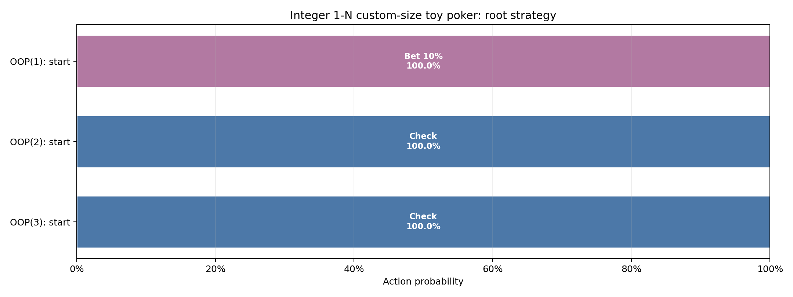

# Integer 1-N custom-size toy poker

Pinned result for study `akq_k_vs_aq_variable_size` from run `20260826T181415397319Z_1e500723`.

| Metric | Value |
|---|---:|
| Iterations | 3,000 |
| Exploitability | 2.3830116e-06 |
| IP EV | +0.75000000 |
| OOP EV | +0.25000000 |

- [Interactive strategy viewer](strategy_viewer.html)
- [Resolved configuration](resolved_config.json)
- [Source manifest](manifest.json)

The theory and poker interpretation are documented in
[`docs/studies/akq_k_vs_aq_variable_size.md`](../../../docs/studies/akq_k_vs_aq_variable_size.md).
