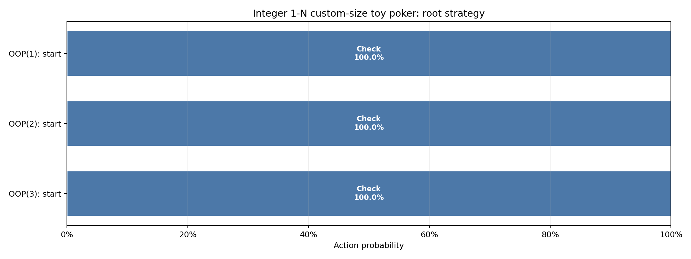

# Integer 1-N custom-size toy poker

Pinned result for study `akq_symmetric_ip_betting` from run `20260828T132447955224Z_260c983b`.

| Metric | Value |
|---|---:|
| Iterations | 6,000 |
| Exploitability | 8.133699e-06 |
| IP EV | +0.53751607 |
| OOP EV | +0.46248393 |

- [Interactive strategy viewer](strategy_viewer.html)
- [Resolved configuration](resolved_config.json)
- [Source manifest](manifest.json)

The theory and poker interpretation are documented in
[`docs/studies/study_06_akq_04_ip_bet_sizing.md`](../../../docs/studies/study_06_akq_04_ip_bet_sizing.md).
