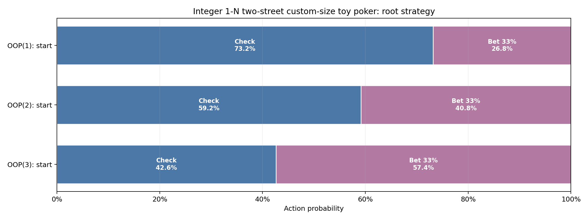

# Integer 1-N two-street custom-size toy poker

Pinned result for study `akq_symmetric_two_street` from run `20260826T182659141589Z_b94cb64e`.

| Metric | Value |
|---|---:|
| Iterations | 8,000 |
| Exploitability | 5.8007352e-06 |
| IP EV | +0.52256174 |
| OOP EV | +0.47743826 |

- [Interactive strategy viewer](strategy_viewer.html)
- [Resolved configuration](resolved_config.json)
- [Source manifest](manifest.json)

The theory and poker interpretation are documented in
[`docs/studies/study_11_akq_06_two_street_strategy.md`](../../../docs/studies/study_11_akq_06_two_street_strategy.md).
