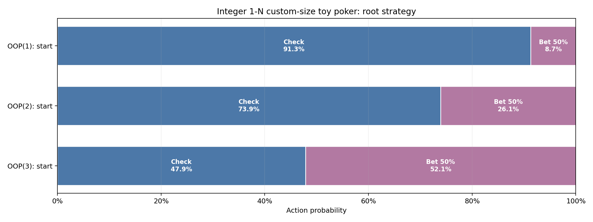

# Integer 1-N custom-size toy poker

Pinned result for study `akq_symmetric_variable_size` from run `20260826T083319796287Z_62cac0a5`.

| Metric | Value |
|---|---:|
| Iterations | 8,000 |
| Exploitability | 7.4617445e-06 |
| IP EV | +0.53019322 |
| OOP EV | +0.46980678 |

- [Interactive strategy viewer](strategy_viewer.html)
- [Resolved configuration](resolved_config.json)
- [Source manifest](manifest.json)

The theory and poker interpretation are documented in
[`docs/studies/akq_symmetric_variable_size.md`](../../../docs/studies/akq_symmetric_variable_size.md).
