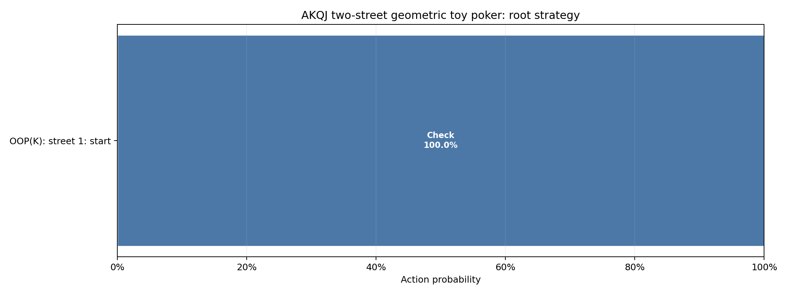

# AKQJ two-street geometric toy poker

Pinned result for study `akqj_two_street_pot` from run `20260824T171423408260Z_e4dfff20`.

| Metric | Value |
|---|---:|
| Iterations | 100,000 |
| Exploitability | 3.5914e-06 |
| IP EV | +0.75000000 |
| OOP EV | +0.25000000 |

- [Resolved configuration](resolved_config.json)
- [Source manifest](manifest.json)

The theory and poker interpretation are documented in
[`docs/studies/akqj_two_street_pot.md`](../../../docs/studies/akqj_two_street_pot.md).
