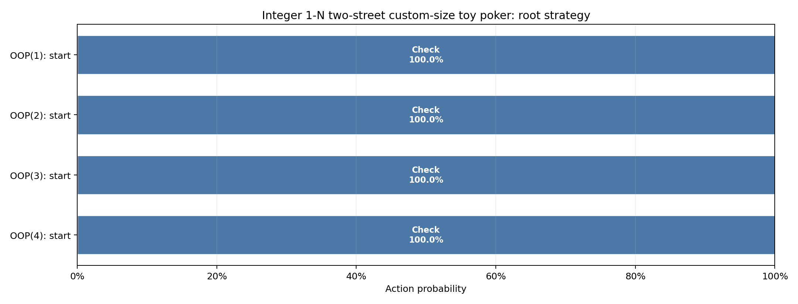

# Integer 1-N two-street custom-size toy poker

Pinned result for study `akqj_two_street_variable_size` from run `20260826T182658785517Z_4f5893e7`.

| Metric | Value |
|---|---:|
| Iterations | 4,000 |
| Exploitability | 3.692386e-06 |
| IP EV | +0.74999785 |
| OOP EV | +0.25000215 |

- [Interactive strategy viewer](strategy_viewer.html)
- [Resolved configuration](resolved_config.json)
- [Source manifest](manifest.json)

The theory and poker interpretation are documented in
[`docs/studies/akqj_two_street_variable_size.md`](../../../docs/studies/akqj_two_street_variable_size.md).
