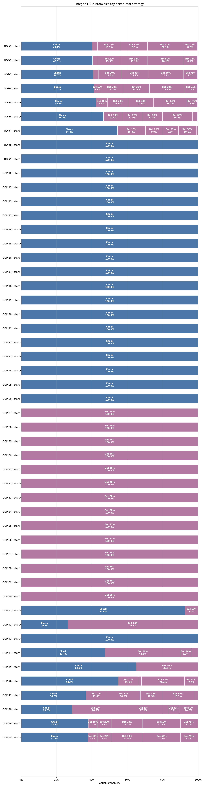

# Integer 1-N custom-size toy poker

Pinned result for study `zero_one_n50_one_street` from run `20260825T012535053821Z_9f148e42`.

| Metric | Value |
|---|---:|
| Iterations | 300,000 |
| Exploitability | 1.6662251e-08 |
| IP EV | +0.53220143 |
| OOP EV | +0.46779857 |

- [Interactive strategy viewer](strategy_viewer.html)
- [Resolved configuration](resolved_config.json)
- [Source manifest](manifest.json)

The theory and poker interpretation are documented in
[`docs/studies/study_12_01_game_01_oop_bet_strategy.md`](../../../docs/studies/study_12_01_game_01_oop_bet_strategy.md).
