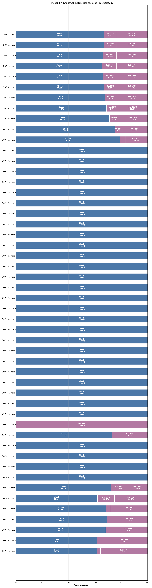

# Integer 1-N two-street custom-size toy poker

Pinned result for study `zero_one_n50_two_street` from run `20260826T183358693407Z_fa021575`.

| Metric | Value |
|---|---:|
| Iterations | 4,000 |
| Exploitability | 5.8126218e-06 |
| IP EV | +0.53510277 |
| OOP EV | +0.46489723 |

- [Interactive strategy viewer](strategy_viewer.html)
- [Resolved configuration](resolved_config.json)
- [Source manifest](manifest.json)

The theory and poker interpretation are documented in
[`docs/studies/zero_one_n50_two_street.md`](../../../docs/studies/zero_one_n50_two_street.md).
